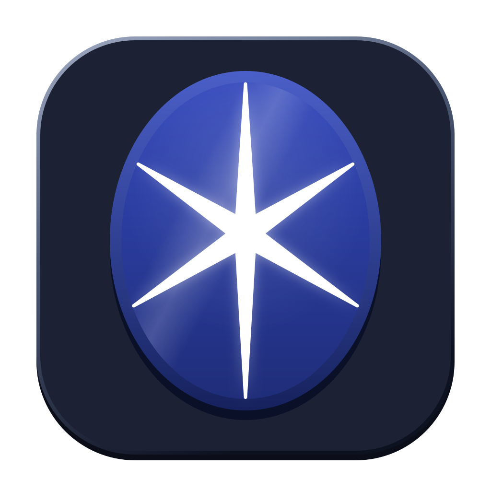

# lapis



lapis is a Mac app for running many coding agents at once. Each agent (Claude
Code, Codex, Grok, OpenCode, OMP, Kimi or Antigravity) gets its own live
terminal. You group agents into categories, watch every agent's latest lines in
a strip under the one you are working with, and jump straight to whichever needs
you. Each agent runs in its own session service, so closing lapis normally
leaves it running (macOS 27 adds [conditions](docs/install.md#updates)); if its
service is gone, it starts again in its card when lapis next opens and resumes
its conversation where its CLI can. [Install](docs/install.md#updates)
distinguishes exercised reattachment from installed-update and reboot gates.

It is built for speed first: switching agents and typing should feel instant on
an Apple silicon Mac with a high-refresh display.

## Download

Get `lapis-macos-arm64.dmg` from the
[latest release](https://github.com/RESMP-DEV/lapis/releases/latest), open it
and drag lapis to Applications. It needs an Apple silicon Mac with macOS 14 or
later, uses the agent CLIs you already have installed, and checks for released
updates. See
[install](docs/install.md) for what it keeps where and how upgrades work.

## A quick tour

- **Early access starts local.** The supported first slice is a local Codex or
  Claude Code workspace. Remote hosts, shared plans, the phone and next-prompt
  suggestions remain implemented or prototype surfaces, but are outside that
  first support slice; [status](docs/status.md) separates implemented code from
  exercised, measured and unqualified behavior.
- **Start an agent** with Command-T: pick a CLI, a folder, a model and how much it
  may do without asking, on this Mac. The machine picker also offers hosts from
  your ssh config, but remote sessions are outside the early-access support
  slice until remote account, reconnect and fan-out qualification passes.
  [Agents](docs/agents.md)
- **Categories** group agents. The strip under the stage shows each agent's
  latest lines; drag a card onto the stage to tile it beside another.
  [Workspace](docs/workspace.md)
- **Jump to what needs you** with Command-J (the next) or Command-L (the latest),
  even from another app with Command-Option-L. Chimes and notifications say when.
- **Plan usage** for every CLI you are signed in to, on this Mac and your other
  machines, with several plans shared across sessions. Local usage is part of the
  early-access workspace; shared plans and other-machine queries remain outside
  its support slice. Saved-limit resets are implemented with helper and provider
  stand-ins, but real provider spending is not qualified; automatic spending is
  on by default and can be disabled with `{"limitResets": {"auto": false}}`.
  [Usage](docs/usage.md)
- **Your phone** can show and drive the same agents as a separately installed
  prototype over its gateway. It is outside the early-access support slice.
  [Phone](docs/phone.md)
- **Suggestions** can guess your next prompt for Claude Code or Codex only after
  you enable `nextPrompt.auto`; they are optional and experimental. With a dim
  guess showing, Tab sends it and then moves to the next agent that needs you.
  With suggestions disabled, Tab keeps its usual meaning in the terminal.
  [Suggestions](docs/suggestions.md)
- Every shortcut is in [keys](docs/keys.md) and every setting in
  [config](docs/config.md).

## Build from source

```sh
uv run --no-project python scripts/lapis.py doctor
uv run --no-project python scripts/lapis.py bootstrap
uv run --no-project python scripts/lapis.py build
uv run --no-project python scripts/lapis.py run
```

[Build](docs/build.md) covers checks and development fixtures;
[CONTRIBUTING](CONTRIBUTING.md) covers setup, tests and pull requests.

## Docs

| Page | What it covers |
| --- | --- |
| [install](docs/install.md) | Download, where lapis keeps things, closing, upgrading |
| [agents](docs/agents.md) | Starting agents, CLIs and modes, requests, restarts, reboots |
| [workspace](docs/workspace.md) | Categories, the strip, tiles, finding, links, history |
| [keys](docs/keys.md) | Every keyboard shortcut |
| [config](docs/config.md) | `lapis.json`: defaults, alerts, editor, CLI flags |
| [usage](docs/usage.md) | Plan usage and plans shared across sessions |
| [phone](docs/phone.md) | The prototype iPhone app and its separately installed gateway |
| [suggestions](docs/suggestions.md) | Optional next-prompt guesses, Tab, and their acceptance log |
| [build](docs/build.md) | Building, checks, probes and fixtures |
| [status](docs/status.md) | What is qualified, what remains, and the evidence |
| [architecture](docs/architecture.md) | Design decisions and the plan |

Agents working on lapis start with [AGENTS.md](AGENTS.md) (`CLAUDE.md` is the
same file).

## License

MIT; see [LICENSE](LICENSE). The Mac app also carries Qt (LGPL-3.0), MoltenVK
(Apache-2.0) and Ghostty's VT library (MIT); their notices are in
[third_party/](third_party) and in the app under `Contents/Resources/Notices`,
and each release attaches the Qt source it was built from.
