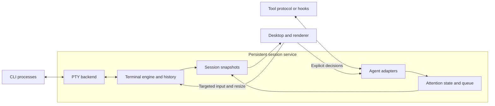

# Architecture and near-term plan

This is the single implementation plan for lapis. See the
[current status](../README.md#current-status) for what has been implemented and exercised.
The target platforms are macOS and Linux. The immediate milestone is **one
persistent terminal session on macOS**, followed by Linux terminal qualification.
The headless engine has already been exercised on Linux; the session service and
desktop have not.

## Product philosophy

**Responsiveness first, ergonomics second, visuals third.** Correct terminal
behavior and keyboard ownership remain requirements. Optimize the time from an
action to visible feedback, including slow outliers during output bursts. Visual
effects must fit within that interaction budget.

Use a minimal blend of Apple's restraint and Material's clear hierarchy. Favor
opaque surfaces, readable typography, generous spacing and subtle borders; avoid
glass, heavy shadows and decorative motion. Snappy, continuous feedback contributes
to perceived responsiveness, but never substitutes for fast input or correct state.
Animate position and color, not terminal glyphs. Begin feedback immediately, keep
transitions interruptible, and never gate keyboard input on animation completion.
The current preview uses 130–140 ms ease-out hover/color transitions and a two-pixel
lift. Future pane transitions should preserve spatial continuity without bounce;
honor reduced-motion preferences before enabling animated navigation. These are
initial design choices, not a new animation framework or measured performance claim.

Design for high-end M-series machines (Pro/Max/Ultra class), with this M4 Max,
128 GB unified memory and 120 Hz display mode as the initial reference. These
are observed reference-machine properties, not minimum specifications or measured
lapis performance. Linux will need its own named hardware/workload reference.
Aim at 120 Hz on capable displays and follow higher refresh rates where qualified.

Use RAM generously to buy immediate switching: retain every live terminal's
current screen and recent history, share glyph caches, and prewarm useful previews
and render resources. Switching away does not unload a session. Warm caches in
bounded background work after the first view becomes interactive. Give caches
generous configurable limits; account for CPU/GPU unified memory once, alongside
separate agent-process usage. Under pressure, evict cold previews/history first
and spill older history to disk while protecting the active working set.

The first interactive view must include timing markers. Warm-switch latency and
frame budgets are **provisional hypotheses**, not measured guarantees or PR/release
gates. The [measurement procedure](../CONTRIBUTING.md#measuring-responsiveness)
owns the numbers, endpoints and workloads. Revisit them after the first real
terminal/switching baseline; require a reviewed, evidence-backed decision before
promoting any number to an acceptance threshold.

## Component ownership

| Piece | Owns | Boundary |
| --- | --- | --- |
| Session service | Processes, PTYs, terminal state/history, adapter connections and session lifecycle | Runs independently of the desktop; keeps consuming output while detached |
| Terminal-engine adapter | Existing engine's parsing, reflow and mode-aware input encoding | Inside the service; upstream types stay behind a small lapis interface |
| Agent adapters | Tool-specific activity, attention requests, responses and reconciliation | Service-owned; capabilities verified per tool/version |
| Attention policy | Pending requests, queue ordering, aging, cooldowns and snoozing | Service-owned state; requests never directly change keyboard focus |
| Desktop | Layout, navigation, keyboard ownership, IME, selection and accessibility | Receives snapshots; explicitly targets input and decisions to a session |
| Renderer | Glyph/texture caches, terminal drawing and previews | Desktop render thread; consumes snapshots, never mutable parser objects |

Desktop messages cross service IPC and are validated there; the GUI never owns
PTY handles. Input encoding uses the engine's current terminal modes. Keep code
in `services/session/`, `adapters/` and `apps/desktop/`; introduce libraries or
subdirectories when implementation needs them.

## Direction and open choices

| Topic | Current position | Decision gate |
| --- | --- | --- |
| Platform | macOS first; Linux required next | Check Linux during engine selection; qualify its minimal GUI before expanding the desktop |
| Desktop | C++20 and Qt 6.11.2 Quick with public QSGTextNode terminal drawing | macOS Vulkan visual checkpoint exercised; Linux and performance qualification remain |
| Engine | Pinned Ghostty `libghostty-vt` selected for the first adapter | Eight-case macOS/Linux replay passes; isolate unstable C API and resolve dependency-notice gaps |
| Service language | C++20 around Ghostty's C API | C++20 consumer exercised on both target platforms; no Rust linkage required |
| Transport | Version 1 local framing and bounded owned snapshots for one shell | Add stable service/session identities, attachment generations and failure recovery |
| Codex mode | Ordinary PTY CLI and lapis-owned app-server are distinct routes | Qualify the chosen attention route against the installed binary |

The [research receipt](../evidence/terminal-research.json) retains pinned upstream
sources. Contour is the closest structural reference; WezTerm supplies service/GUI
separation examples. These are source observations, not local runtime results.
Ghostty's external VT C API is explicitly unstable and needs a Zig toolchain;
Contour currently defaults to C++23 and its renderer uses Qt private APIs.
Qualify engines independently of upstream GUIs. Keep C++20 until an evidenced
decision changes it.

The [engine experiment](../evidence/terminal-engine-probe.json) records pinned
builds and runtime results. The production adapter now reuses that pinned library;
distribution packaging remains unfinished.

## Portable rendering

Terminal emulation and rendering are separate choices. Ghostty VT or Contour's
engine maintains terminal state; the lapis surface draws snapshots using Qt Quick.
Keep common drawing code on public Qt scene-graph interfaces and portable shaders.
The preferred common GPU path to qualify is Vulkan:

| Platform | GPU paths to qualify | Priority |
| --- | --- | --- |
| macOS | Vulkan through MoltenVK, which translates to Metal | First implementation |
| Linux | Vulkan through the GPU driver | Required next platform |

macOS has no native Vulkan driver; [MoltenVK](https://github.com/KhronosGroup/MoltenVK)
supplies a portability implementation over Metal and converts SPIR-V shaders.
This adds a loader/runtime dependency and feature constraints, not a demonstrated
performance failure. Use the common supported feature set and query capabilities.
Qt already abstracts GPU APIs, so choosing Vulkan does not by itself remove
platform-specific input, font or process work.

The [local probe](../evidence/vulkan-probe.json) established device discovery. The
[desktop checkpoint](../evidence/desktop-preview.json) now establishes actual Qt
terminal drawing on the Apple M4 Max, using Vulkan through MoltenVK 1.4.2 and
Qt 6.11.2. The application verifies the selected API at runtime. Its maintained
surface uses public QSGTextNode/QTextLayout interfaces and Qt's glyph cache, not
upstream private rendering code. Static scenes keep their retained nodes; new
snapshots rebuild the text nodes. Dirty-row rendering remains a measured follow-up.

Qt's default macOS transaction layer produced five-second display-lock stalls in
this Vulkan window. Setting `QT_MTL_NO_TRANSACTION=1` selected the plain
CAMetalLayer path and removed the warnings in the same threaded-render-loop
capture. This workaround is isolated to macOS startup and tied to Qt 6.11.2;
revalidate it on upgrades. Linux rendering, continuous resize, presentation timing
and packaging still need qualification. Compare native Metal if later matched
measurements warrant it; no second custom renderer is needed for that comparison.

Avoid OpenGL-only `QQuickFramebufferObject` and upstream private renderer APIs.
Use [Qt's backend selection](https://doc.qt.io/qt-6/qtquick-visualcanvas-adaptations.html)
and verify the selected API at runtime; a silent fallback is not Vulkan evidence.

Portability also covers PTY/process lifecycle, local IPC, font fallback, IME,
clipboard and accessibility. macOS/Linux can share POSIX concepts with OS-specific
implementations. Qualify Linux on a named distro and test Wayland/X11 separately.
Keep native handles and platform APIs out of the engine, session contracts and
attention policy.

## Near-term work

### Starting code structure

Keep components together by ownership. Each compiled component gets its own CMake
target; public headers live under `include/lapis/<component>/`, implementation
under `src/`, and behavioral cases under `tests/`. Add these directories as code
needs them. Every first-party target uses `lapis_project_options`.

| Location | First responsibility | Status |
| --- | --- | --- |
| `services/session/src/platform/posix/` | Native descriptor ownership, then PTY launch/I/O/resize/reaping | `UniqueFd` on macOS/Linux; Qt-owned PTY launch/I/O/resize/reaping exercised on macOS |
| `tools/terminal_probe/` | Shared headless workloads and independent Ghostty/Contour consumers | Implemented; pinned builds and eight-case replay on macOS/Linux |
| `services/session/src/terminal/` | Wrap the selected engine's parsing, mode-aware input and screen extraction | Implemented as `lapis_terminal`; 14 behavioral cases on macOS/Linux ARM64 |
| `services/session/include/lapis/session/` | Owned commands, session identity and snapshots for clients | Owned terminal values implemented; internal version 1 snapshot framing under `src/transport/` |
| `services/session/src/` | Service event loop and session lifecycle, then local IPC | Separate one-shell service with bounded local transport on macOS |
| `apps/desktop/` | Minimal Qt view, input routing and terminal surface | Live enlarged shell and static carousel composition; macOS Vulkan capture |
| `adapters/codex/` | Codex protocol mapping and attention delivery | Existing investigation only; follows terminal persistence |

The first target, `lapis_session_platform`, is an internal C++20 library with no
Qt, GPU or engine dependency. Its `UniqueFd` owns one native descriptor, closes
it on destruction and transfers ownership by move. The owner thread synchronizes
access; a borrowed descriptor is never closed by its caller. Tests use actual
POSIX pipes to exercise transfer, I/O, EOF, release and replacement. This is a
resource primitive, not a terminal or persistent service. No empty service or
desktop executable is advertised as an application.

### Current visual checkpoint

The desktop starts a separate Qt Core service on a private local socket. That
service owns QProcess, a nonblocking POSIX PTY, and the Ghostty terminal. Closing
the GUI only detaches the local socket: the service continues draining output.
The enlarged pane is a live shell; the remaining cards are labeled placeholders.
One GUI may attach at a time. A new attachment replaces the previous connection.
The socket location identifies this checkout's one session; stable session IDs,
service epochs and authenticated attachment generations are still required before
multiple sessions or robust recovery. This wire format is internal and provisional.

Qt event loops own their respective objects. PTY reads yield after 64 KiB and
input dispatch after 64 frames. Writes have a 1 MiB queue; text messages are at
most 64 KiB. Snapshot frames are limited to 8 MiB, 32,768 cells and 65,536 codepoints.
The service coalesces updates on a 16 ms timer with one snapshot in flight; a slow
GUI does not block PTY parsing. That timer needs measurement against the 120 Hz
reference before any latency claim. Current history uses the adapter's bounded
memory budget; disk-backed history is not implemented.

The GUI decodes owned snapshots and routes text, navigation, Control-letter input,
paste and resize. The focused pane chooses the PTY dimensions; scaled previews do
not resize it. Basic IME commit/preedit plumbing exists, but actual composition,
font fallback, strict wide-cell alignment, selection and accessibility are not
qualified. The renderer keeps static scene nodes and lets Qt schedule frames for
updates and brief hover transitions. Input-to-presentation timing instrumentation
and a repeatable animation workload remain acceptance gaps. The visual checkpoint
does not complete milestone 1.

### Planned UI refinement

The next two changes are scoped below. **Neither has started.** They refine the
visual checkpoint without completing milestone 1. Reuse Qt Quick, the existing
terminal snapshot values and the current Vulkan surface; introduce no new runtime
dependency or general-purpose UI framework.

#### Step 1: isolated UI iteration and debugging

**Outcome:** tune the interface and inspect C++ behavior without touching the
running shell. Keep the current appearance while establishing this workflow.

- Add an explicit `--ui-preview` mode backed by synthetic snapshots. It must never
  construct a live connection, launch a service or attach to the checkout socket.
  Reject combinations that would inject shell input, including `--smoke-input`.
- Allow development QML to load from a supplied source path and reload on an
  explicit command. A valid edit replaces the view without recompiling C++; a
  syntax error reports diagnostics and retains the last working view. Normal
  launches continue to load bundled resources. Start with manual reload rather
  than a file watcher or external preview server.
- Define a small, development-only **preview scenario v1**: stable card IDs, owned
  terminal snapshots and explicit request-arrived/request-resolved events carrying
  a request ID and reason. Replay advances only when commanded. Keep this fixture
  contract separate from service IPC and the future attention policy.
- Make the existing capture path work with the isolated preview at default and
  compact sizes. Wait for an actual rendered frame, report save/load failure and
  exit within a bounded timeout. Do not use shell activity text as readiness.
- Provide one preview command and one LLDB launch command, with symbols and visible
  Qt diagnostics. Exercise a breakpoint, stack inspection and resume in the
  preview process. Check attach separately; report a platform restriction instead
  of blocking useful preview work on it. GUI and service are distinct debug targets.

**Done when:** the live GUI stays attached to the same child while preview windows
open/close; valid QML edits reload without a C++ build; invalid edits preserve the
working view; both capture sizes succeed and a bad destination fails promptly;
LLDB launch/break/inspect/resume has direct evidence. The developer workflow lives
in [CONTRIBUTING.md](../CONTRIBUTING.md#planned-ui-tuning-and-debugging).

#### Step 2: compact header and attention-cue prototype

**Dependency:** step 1 and its preview scenario contract are integrated.
**Outcome:** review the actual animation and recovered terminal space in a window.

- Reduce the tall top section to essential session context. Remove repeated
  branding/path/status chrome. Keep the live enlarged pane and current card order.
- Add a brief red halo or edge pulse around a requesting terminal/card, similar to
  a restrained game HUD cue. Draw within the existing composition: no banner,
  reserved row, pane movement, text obstruction or attention-triggered PTY resize.
  Keep the rest of the interface opaque.
- Drive the prototype only from preview scenarios. Start with one or two gentle
  pulses on a new request, followed by a quiet persistent pending marker. Duplicate
  requests and ordinary output must not restart the pulse. Explicit resolution
  clears only its matching request; focusing a card does not resolve or approve it.
- Pair color with a readable request indicator. Support a steady reduced-motion
  treatment and an explicit preview control; verify the macOS preference where
  available. Stop completed animations and pause decorative motion when hidden.
- Add frame/submission timing markers for a repeatable cue replay. Record observed
  frame intervals and idle behavior with workload/display context. Capture timing
  is not input latency or proof of physical display presentation; performance
  targets remain provisional.

**Done when:** default/compact views reclaim header space; arrival, duplicate,
resolution, two requesting cards and reduced-motion scenarios work; pulses end
without losing the pending marker; no keyboard focus or terminal geometry changes
on attention; the actual Vulkan animation has been viewed and its timing recorded.
Show the result to the maintainer before connecting it to real agent requests.

#### Ownership and checks

| Owner | Allowed implementation scope | Handoff |
| --- | --- | --- |
| Coordinator | Shared desktop contracts, `main.cpp`, `workspace.*`, CMake, `justfile`, existing docs and evidence | Preview v1 contract committed before parallel consumers; sole build/integration owner |
| Preview/tooling worker, step 1 | `apps/desktop/src/ui_preview.*`, `apps/desktop/tests/ui_preview_test.cpp`, `scripts/check_ui_preview.py` | Isolation, reload/error and capture behavior; commands and limitations |
| UI worker, step 2 | `apps/desktop/qml/` against the committed preview contract | Compact layout and deterministic cue/reduced-motion states |
| Review worker | Read-only source review and coordinator-provided artifacts under `build/` | Check focus/geometry observations, captures and timing evidence against acceptance |

Use CCR workers with disjoint files and the existing bounded-work procedure; do
not run multiple builds into the same directory. The coordinator runs `just desktop`
once per integrated C++ change and targeted ASan cases for preview/reload lifetime
changes. Apply `just verify-tools` and Python checks only when their tooling changes;
run TSan if shared threading changes. Reuse pinned dependency builds. QML-only
iterations use reload and focused visual checks, not the engine comparison. Keep
receipts in the existing evidence area and update these documents in place.

**Following these two steps:** introduce rebindable next-session, previous-session
and next-needing-attention actions with persisted settings and focus/input tests.
Tab or a Tab chord remains a candidate, not a selected default: plain Tab belongs
to shell completion/TUIs unless explicitly rebound, and platform shortcuts need
consideration. Keep preview positions stable and never split paste/IME operations.
Selecting a session never sends a response; the user explicitly composes and sends
it through the originating terminal or a verified adapter.

Real attention adapters, automatic carousel movement, multiple live sessions and
prompt/approval routing remain outside these two changes. Then finish the
persistent-terminal acceptance gaps and qualify the minimal Linux view before
expanding the live workspace.

### Terminal adapter v0

The checkpoint repair is merged in PR #1. The first production adapter lives in
`services/session/`: public values under `include/lapis/session/terminal.hpp`,
Ghostty integration under `src/terminal/`, and behavioral cases under
`tests/terminal/`. It is one C++20 library, with no PTY, threads or GUI. The
[adapter receipt](../evidence/terminal-adapter.json) records the exercised scope.

- One owner thread operates each terminal. Clients receive owned snapshots that
  survive later input, resize and terminal destruction. Ghostty types remain
  private. Snapshots use a contiguous grapheme pool and row-major cells, avoiding
  per-cell heap allocation; the adapter reuses extraction scratch storage.
- Preserve graphemes, wide tails and wrap spacers, all exposed style flags and
  underline styles, default/indexed/RGB color identity, the current palette,
  cursor visibility/shape and the initial client's input modes. Effective colors
  apply inverse once; bold alone does not brighten indexed colors.
- Input and snapshot payloads have configurable byte/cell/codepoint limits.
  Invalid geometry and oversized input fail before engine mutation; extraction
  overflow leaves parsing usable. Generated terminal replies use preallocated
  storage. A reply overflow permanently faults the instance so a service cannot
  send a partial response; recreate and resynchronize it.
- History uses Ghostty's page-granular byte budget. Exercised eviction and clearing
  preserve the current viewport; this budget is not a strict allocation or RSS
  ceiling. Snapshot payload limits also do not account for allocator overhead.
  Global service budgets and disk-backed history still belong to later work.
- The verified input subset is navigation key presses with modifiers and pure text
  paste encoding. Clipboard access, full text/key protocols, mouse, IME, selection,
  hyperlinks and image presentation are not exposed. Image storage and external
  image media are disabled. A terminal reply never writes directly to a PTY.

This is an in-process boundary, not an IPC schema. The normal CMake build always
includes the adapter and requires a successful pinned Ghostty build prefix;
missing dependencies cannot silently omit its tests. The existing archive runner
owns downloads and source verification, while `cmake/Ghostty.cmake` checks build
provenance and imports the library. Reuse the build across C++ check modes.
[Dependency notices](../third_party/ghostty/NOTICES.txt) collect the upstream texts;
remaining source-provenance/SBOM limits are explicit. No binary is packaged yet.

The coordinator owns shared headers, build files and these documents. For future
parallel work, commit the shared contract first, assign disjoint files and one
build owner, and use bounded worker runs. Integrate and test worker output before
calling it complete. Preserve partial work after timeouts and avoid repeated
optional checks once the affected behavior passes.

### Next: complete persistent-terminal acceptance

After the two UI refinement steps and the maintainer's visual review, close
these gaps in small dependent changes:

1. Qualify terminal cell positioning, fallback fonts and real IME/key behavior;
   add meaningful input-to-presentation and frame timing markers. Validate the
   existing macOS resize/exit path with interactive TUIs and foreground jobs.
2. Add stable session/service identities, attachment generations and recovery
   behavior. Exercise stale input, partial paste, slow clients, queue overflow and
   service failure. Add disk-backed history with quotas and disk-full handling.
3. Carry the existing minimal PTY/service/Qt view to Linux and qualify Vulkan and
   native input there before expanding workspace behavior.

Keep Codex attention, automatic carousel behavior, multiple live sessions and the
32-session benchmark in later milestones. The static cards let the maintainer
review composition now without implying those components are implemented.

### Engine experiment decision

Use **Ghostty VT with a C++20 service**; the first adapter now implements this decision. At pinned
revision `5de703a1b6ca0b91fcebe932b44be1df2de0a683`, the unpatched headless library
builds with Zig 0.16.0 and its public C API supports a C++20 consumer. All eight
shared cases pass on this macOS ARM64 host and native Ubuntu 24.04 ARM64. No Qt,
GPU or application UI is needed by that consumer.

Contour revision `6777ff05014f8ff163b071e8b0e942830119db80` also builds headlessly,
with C++23 isolated to its experiment. Seven cases pass; bytewise input of
`A界éZ` produces an extra U+FFFD before the wide character on both platforms.
The result reproduces through direct ingestion and upstream mock-PTY processing.
Keep this failing comparison visible; it is not a complete assessment of Contour
or a reason to alter the shared expectation.

The exercised boundary copies viewport graphemes, widths/continuations, bold and
resolved RGB colors, cursor position and tested input modes into owned values.
The color comparison applies inverse to resolved foreground/background colors,
keeps bold independent of palette brightening, and pins palette/default colors
in replay. Indexed, explicit bright, inverse, bold-inverse and reset cases now
exercise that policy on both platforms; the earlier truecolor-only case did not.
Snapshots survive parser mutation, resize and engine destruction. Key-up and paste
encoding follow terminal modes. This was evidence for the snapshot-fed surface now present in the desktop
checkpoint. The production adapter has since added styles, tagged colors, wrap
spacers and cursor data; stable service lifecycle identities remain outstanding. The experimental header is
not a serialized service contract. Dirty-row APIs exist in Ghostty but incremental
damage extraction has not been qualified; begin with bounded full snapshots.
Measure allocation churn when building the production extraction path; the
correctness probe uses per-cell scratch buffers and is not a performance baseline.

Ghostty's configured 1 MiB history setting is read back through the API; the burst
case checks viewport size, not a process memory ceiling or disk-backed history.
The consumer passes ASan/UBSan; upstream Zig uses ReleaseSafe, which is a distinct
kind of checking. No latency, shaping, IME, PTY or GUI-persistence claim follows.

Keep the unstable API pinned behind the adapter. Before redistribution, package
all dependency notices: uucode's archive omits referenced notices, and the bundled
simdutf header identifies 9.0.0 while wrapper metadata says 5.2.8. The receipt has
the observed dependency/license inventory and retrieved notice references. The
shared dependency scanner cannot recognize this C++/Zig graph; direct OSV commit
queries returned no advisories for the queried pins, which is not full coverage
or vulnerability clearance. Runtime dependency packaging remains unfinished.

### Deliver milestone 1: one persistent terminal

Build the selected engine into a service that launches one shell under a PTY.
Attach a minimal desktop terminal view. Include Unicode/font handling, input,
resize and history sufficient for the exercised shell and interactive TUI.
Acceptance requires:

- Launch, input/output, deliberate resize, exit and resource cleanup work.
- Closing/reopening the GUI preserves the child PID and restores current terminal
  state. Output continues draining during detachment, including sustained output;
  retaining an open descriptor alone is insufficient.
- Current screen/recent history and older disk-backed history have explicit
  per-session limits. Reattachment does not replay unbounded output.
- Safely transferred snapshots isolate the renderer from parsing. A stalled GUI
  does not block process control; snapshot/delta gaps cause resynchronization.
- Service failure is distinguished from GUI detachment. Live-process survival
  across service failure or reboot is a separate recovery problem.
- Relevant cases pass `just check`, `just asan` and separate `just tsan` runs;
  the minimal GUI and actual GPU backend have direct macOS evidence.
- Record input, frame and switch timing from the first interactive view on the
  reference machine. Report tails, missed deadlines and warm-cache memory use;
  do not defer responsiveness instrumentation until the 32-session milestone.

Keep process I/O and parsing off the GUI thread. Bound queues and processing
work, coalesce display updates and preserve input/lifecycle events. Pin each input
operation to one session. GUI detach and session termination are separate commands.

### Following milestones

Follow [AGENTS.md](../AGENTS.md): **2. attention state and real Codex qualification
→ 3. full desktop, guarded keyboard ownership and carousel → 4. measured 32-session
workload → 5. second CLI and platform qualification.** The minimal view in
milestone 1 proves persistence; milestone 3 assembles the supervising workspace.
Carry that minimal session to Linux before expanding the full desktop; final
platform qualification still needs actual input, rendering and lifecycle evidence.
These later phases are outside the immediate implementation scope.

## Contracts to preserve

**Session identity and backends.** Each session has a stable lapis ID. Terminal
sessions own PTYs and engines; structured Codex sessions own app-server
processes/connections and conversation state. Structured sessions do not reproduce
the Codex TUI or satisfy terminal acceptance. A separate app-server does not
observe independently launched CLIs by default. The
[Codex investigation](../adapters/codex/README.md) retains the route details.

**Attention semantics remain a draft.** Keep connection, activity and a set of
pending requests independent. Events carry a contract version, session/adapter ID,
source-connection epoch, sequence, receipt time and kind; preserve source
thread/turn/item IDs and typed request IDs. Kinds cover connection/disconnection,
activity change, attention requested/resolved and reconciled snapshots. Requests
include reason, bounded summary and source confidence. Turn completion is not
process exit or task completion; silence is unknown. Use monotonic time for
scheduling, aging and cooldowns; wall-clock time for presentation/auditing.
The wire format remains open.

**Two reconciliation boundaries.** Source transport loss makes its requests stale
and disables replies until reconciliation. GUI detachment does not invalidate a
healthy service-owned source connection. A returning GUI refreshes service state
before enabling actions. Deduplicate by source identity/epoch, detect gaps and
retire only the resolved request. Keep attachment identities separate from source
epochs so delayed actions cannot target reused requests. Control-channel overflow
reports loss of synchronization.

**Verified adapters.** Declare observation, response and reconciliation separately.
Prefer supported protocols, then verified hooks; launcher exits and heuristics
supply weaker evidence. Bells/prompt matches are advisory. Hooks use session-bound
local endpoints, stay bounded/nonblocking and cannot silently change execution or
approval policy. Probe dispatch, payload and return semantics before installation.
Structured Codex success does not establish ordinary CLI attention coverage.

**Attention versus focus.** The service orders requests by priority/arrival with
aging and cooldowns. Desktop session positions remain stable; support manual
navigation, pinning, snoozing and an opt-in carousel without starving quiet sessions.
Only desktop focus policy assigns keyboard ownership. Typing, held keys, paste,
IME, selection, dragging and modal work defer automatic changes. Automatic
advancement requires the lapis window to be active and interaction idle. Never
split a paste/composition or steal another app's OS focus. Viewing/acknowledging
a request never approves it; explicit decisions use its originating adapter or terminal.

**Bounded rendering and storage.** Service screen state is authoritative; desktop
snapshots are safely replaceable caches, retained while useful. Budget history,
queues and CPU/GPU caches generously per session and globally. Stop drawing
hidden panels while retaining their warm state and consuming output; throttle
previews and let static scenes sleep. Scaled previews do not
resize PTYs. Preserve shaping, wide cells, IME, clipboard, selection and
accessibility. Live objects do not guarantee physical RAM residency.

The later 32-session experiment records workload/output rates, display rate,
p50/p95/p99 input/switch latency and frame times, memory growth and idle CPU/GPU
use. Separate replay from real CLI agents and keep provisional targets distinct
from results. Use [CONTRIBUTING.md](../CONTRIBUTING.md) for commands and evidence rules.
