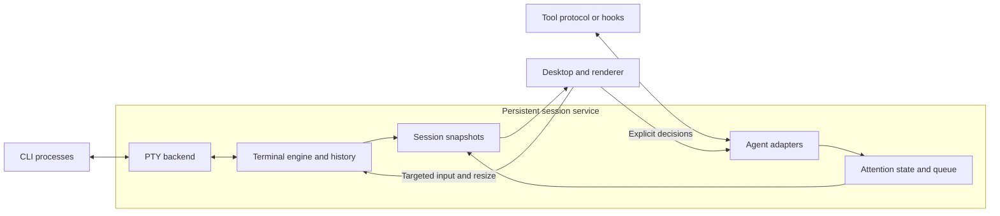

# Architecture and near-term plan

This is the single implementation plan for lapis. See the
[current status](../README.md#current-status) for what has been implemented and exercised.
macOS is the active target. Milestones 1 and 2 are qualified for the recorded
single-session scope: a persistent terminal and managed Codex attention with
explicit desktop responses. The quality baseline from PR #6 remains in force.
[Milestone 3](#milestone-3-supervising-two-live-sessions-on-macos) is planned as
three ordered checkpoints: two retained sessions and manual switching, workspace
attention, then a guarded opt-in carousel.
A Linux desktop port is deferred; the headless engine has
already been exercised on Linux, but the session service and desktop have not.

## Product philosophy

**Responsiveness first, ergonomics second, visuals third.** Correct terminal
behavior and keyboard ownership remain requirements. Optimize the time from an
action to visible feedback, including slow outliers during output bursts. Visual
effects must fit within that interaction budget.

Use a minimal blend of Apple's restraint and Material's clear hierarchy. Favor
opaque surfaces, readable typography, generous spacing and subtle borders; avoid
glass, heavy shadows and decorative motion. Snappy, continuous feedback contributes
to perceived responsiveness, but never substitutes for fast input or correct state.
Animate position and color, not terminal glyphs. Begin feedback immediately, keep
transitions interruptible, and never gate keyboard input on animation completion.
The current preview uses 130–140 ms ease-out hover/color transitions and a two-pixel
lift. Future pane transitions should preserve spatial continuity without bounce;
honor reduced-motion preferences before enabling animated navigation. These are
initial design choices, not a new animation framework or measured performance claim.

Design for high-end M-series machines (Pro/Max/Ultra class), with this M4 Max,
128 GB unified memory and 120 Hz display mode as the initial reference. These
are observed reference-machine properties, not minimum specifications or measured
lapis performance. If Linux is ported later, it will need its own named
hardware/workload reference.
Aim at 120 Hz on capable displays and follow higher refresh rates where qualified.

Use RAM generously to buy immediate switching: retain every live terminal's
current screen and recent history, share glyph caches, and prewarm useful previews
and render resources. Switching away does not unload a session. Warm caches in
bounded background work after the first view becomes interactive. Give caches
generous configurable limits; account for CPU/GPU unified memory once, alongside
separate agent-process usage. Under pressure, evict cold previews/history first
and spill older history to disk while protecting the active working set.

The first interactive view must include timing markers. Warm-switch latency and
frame budgets are **provisional hypotheses**, not measured guarantees or PR/release
gates. The [measurement procedure](../CONTRIBUTING.md#measuring-responsiveness)
owns the numbers, endpoints and workloads. Revisit them after the first real
terminal/switching baseline; require a reviewed, evidence-backed decision before
promoting any number to an acceptance threshold.

## Component ownership

| Piece | Owns | Boundary |
| --- | --- | --- |
| Session service | Processes, PTYs, terminal state/history, adapter connections and session lifecycle | Runs independently of the desktop; keeps consuming output while detached |
| Terminal-engine adapter | Existing engine's parsing, reflow and mode-aware input encoding | Inside the service; upstream types stay behind a small lapis interface |
| Agent adapters | Tool-specific activity, attention requests, responses and reconciliation | Service-owned; capabilities verified per tool/version |
| Attention policy | Service-owned pending requests; desktop aggregation, navigation aging/cooldowns and presentation snooze | Source state stays authoritative in each service; only desktop focus policy assigns keyboard ownership |
| Desktop | Layout, navigation, keyboard ownership, IME, selection and accessibility | Receives snapshots; explicitly targets input and decisions to a session |
| Renderer | Glyph/texture caches, terminal drawing and previews | Desktop render thread; consumes snapshots, never mutable parser objects |

Desktop messages cross service IPC and are validated there; the GUI never owns
PTY handles. Input encoding uses the engine's current terminal modes. Keep code
in `services/session/`, `adapters/` and `apps/desktop/`; introduce libraries or
subdirectories when implementation needs them. Use the
[contributor handoff procedure](../CONTRIBUTING.md#large-changes-and-parallel-contributors)
for ownership, shared contracts and integration checks across large changes.

## Direction and open choices

| Topic | Current position | Decision gate |
| --- | --- | --- |
| Platform | macOS active; Linux desktop deferred | Keep portable platform boundaries; qualify Linux separately if and when the port is scheduled |
| Desktop | C++20 and Qt 6.11.2 Quick with public QSGTextNode terminal drawing | macOS Vulkan visual checkpoint exercised; macOS performance qualification remains |
| Engine | Pinned Ghostty `libghostty-vt` selected for the first adapter | Eight-case macOS/Linux replay passes; isolate unstable C API and resolve dependency-notice gaps |
| Service language | C++20 around Ghostty's C API | C++20 consumer exercised on both target platforms; no Rust linkage required |
| Transport | Version 6 local framing with session/epoch/generation identity, readiness, history paging and attention messages | Milestone 3 adds a workspace registry; automatic service recovery remains deferred |
| Codex mode | Managed ordinary TUI with a dedicated service-owned backend and observer; desktop responses qualified in Milestone 2 | Milestone 3 qualifies routing across two independent sessions; other binaries and request kinds need separate evidence |

The [research receipt](../evidence/terminal-research.json) retains pinned upstream
sources. Contour is the closest structural reference; WezTerm supplies service/GUI
separation examples. These are source observations, not local runtime results.
Ghostty's external VT C API is explicitly unstable and needs a Zig toolchain;
Contour currently defaults to C++23 and its renderer uses Qt private APIs.
Qualify engines independently of upstream GUIs. Keep C++20 until an evidenced
decision changes it.

The [engine experiment](../evidence/terminal-engine-probe.json) records pinned
builds and runtime results. The production adapter now reuses that pinned library;
distribution packaging remains unfinished.

## Portable rendering

Terminal emulation and rendering are separate choices. Ghostty VT or Contour's
engine maintains terminal state; the lapis surface draws snapshots using Qt Quick.
Keep common drawing code on public Qt scene-graph interfaces and portable shaders.
The preferred common GPU path to qualify is Vulkan:

| Platform | GPU paths to qualify | Priority |
| --- | --- | --- |
| macOS | Vulkan through MoltenVK, which translates to Metal | First implementation |
| Linux | Vulkan through the GPU driver | Deferred port; not claimed or currently scheduled |

macOS has no native Vulkan driver; [MoltenVK](https://github.com/KhronosGroup/MoltenVK)
supplies a portability implementation over Metal and converts SPIR-V shaders.
This adds a loader/runtime dependency and feature constraints, not a demonstrated
performance failure. Use the common supported feature set and query capabilities.
Qt already abstracts GPU APIs, so choosing Vulkan does not by itself remove
platform-specific input, font or process work.

The [local probe](../evidence/vulkan-probe.json) established device discovery. The
[desktop checkpoint](../evidence/desktop-preview.json) now establishes actual Qt
terminal drawing on the Apple M4 Max, using Vulkan through MoltenVK 1.4.2 and
Qt 6.11.2. The application verifies the selected API at runtime. Its maintained
surface uses public QSGTextNode/QTextLayout interfaces and Qt's glyph cache, not
upstream private rendering code. Static scenes keep their retained nodes; new
snapshots replace only changed row text nodes. Each surface retains the current
owned snapshot and the previous rendered snapshot for comparison. GUI-owned
objects, preedit text and geometry are copied into an immutable render state and
handed to the render thread under a standard mutex. The render callback never
dereferences a GUI-owned session. Allocation and frame-time gains still need
measurement; preview throttling and full shaping remain follow-up work.

Qt's default macOS transaction layer produced five-second display-lock stalls in
this Vulkan window. Setting `QT_MTL_NO_TRANSACTION=1` selected the plain
CAMetalLayer path and removed the warnings in the same threaded-render-loop
capture. This workaround is isolated to macOS startup and tied to Qt 6.11.2;
revalidate it on upgrades. Continuous resize, presentation timing and packaging
still need qualification. Linux rendering, if scheduled later, needs its own evidence. Compare native Metal if later matched measurements warrant it; no
second custom renderer is needed for that comparison.

Avoid OpenGL-only `QQuickFramebufferObject` and upstream private renderer APIs.
Use [Qt's backend selection](https://doc.qt.io/qt-6/qtquick-visualcanvas-adaptations.html)
and verify the selected API at runtime; a silent fallback is not Vulkan evidence.

Portability also covers PTY/process lifecycle, local IPC, font fallback, IME,
clipboard and accessibility. macOS/Linux can share POSIX concepts with OS-specific
implementations. Qualify Linux on a named distro and test Wayland/X11 separately.
Keep native handles and platform APIs out of the engine, session contracts and
attention policy.

## Near-term work

### Starting code structure

Keep components together by ownership. Each compiled component gets its own CMake
target; public headers live under `include/lapis/<component>/`, implementation
under `src/`, and behavioral cases under `tests/`. Add these directories as code
needs them. Every first-party target uses `lapis_project_options`.

| Location | First responsibility | Status |
| --- | --- | --- |
| `services/session/src/platform/posix/` | Native descriptor ownership, then PTY launch/I/O/resize/reaping | `UniqueFd` on macOS/Linux; Qt-owned PTY launch/I/O/resize/reaping exercised on macOS |
| `tools/terminal_probe/` | Shared headless workloads and independent Ghostty/Contour consumers | Implemented; pinned builds and eight-case replay on macOS/Linux |
| `services/session/src/terminal/` | Wrap the selected engine's parsing, mode-aware input and screen extraction | Implemented as `lapis_terminal`; 14 behavioral cases on macOS/Linux ARM64 |
| `services/session/include/lapis/session/` | Owned commands, session identity and snapshots for clients | Owned terminal values implemented; internal version 6 attachment/snapshot/history and attention framing under `src/transport/` |
| `services/session/src/` | Service event loop and session lifecycle, then local IPC | Separate one-terminal service with explicit argv/cwd and bounded local transport on macOS |
| `apps/desktop/` | Minimal Qt view, input routing and terminal surface | Live enlarged shell and static carousel composition; macOS Vulkan capture |
| `adapters/codex/` | Codex protocol mapping and attention delivery | Ordinary TUI plus isolated shared-server request/response/reconnect exercised; service adapter and IPC approval/input round trips exercised |

The first target, `lapis_session_platform`, is an internal C++20 library with no
Qt, GPU or engine dependency. Its `UniqueFd` owns one native descriptor, closes
it on destruction and transfers ownership by move. The owner thread synchronizes
access; a borrowed descriptor is never closed by its caller. Tests use actual
POSIX pipes to exercise transfer, I/O, EOF, release and replacement. This is a
resource primitive, not a terminal or persistent service. No empty service or
desktop executable is advertised as an application.

### Current visual checkpoint

The desktop starts a separate Qt Core service on a private local socket. That
service owns QProcess, a nonblocking POSIX PTY, and the Ghostty terminal. Closing
the GUI only detaches the local socket: the service continues draining output.
The enlarged pane is a live terminal; the remaining cards are labeled placeholders.
One GUI may attach per endpoint. A matching attachment replaces the previous
connection; a mismatched launch is rejected first. The default socket identifies
this checkout's shell, and explicit launches choose their own endpoint. Stable session IDs, service epochs and attachment generations bind each
connection; a multi-session registry and automatic recovery remain later work. This wire format is internal and provisional.

Qt event loops own their respective objects. PTY reads yield after 64 KiB and
input dispatch after 64 frames. Writes have a 1 MiB queue; text messages are at
most 64 KiB. Snapshot frames are limited to 8 MiB, 32,768 cells and 65,536 codepoints.
The service coalesces updates on a 16 ms timer with one snapshot in flight; a slow
GUI does not block PTY parsing. The measured input-to-frame baseline exceeds one 120 Hz
interval; it is not a responsiveness-target pass. Recent history uses the adapter's
bounded memory budget. Older primary-screen
rows move to the bounded disk archive described in the completion contract below.

The GUI decodes owned snapshots and routes text, navigation, Control-letter input,
paste and resize. The focused pane chooses the PTY dimensions; scaled previews do
not resize it. Cell-grid/font fallback has native Vulkan regression coverage.
Qt and automated macOS keyboard/paste/Japanese IME ownership are tested;
selection/copy and a terminal accessibility tree remain open. The renderer retains
static scene nodes and lets Qt schedule updates and brief hover transitions.
The controlled latency probe now correlates received input, service processing,
snapshot application and frame submission. Pixel-visible presentation is not
measured. The visual checkpoint alone does not complete milestone 1.

### UI refinement checkpoint

Both scoped UI changes are implemented and exercised on macOS; maintainer visual
review remains before connecting real requests. They reuse Qt Quick, owned terminal
snapshots and the Vulkan surface, with no new runtime dependency. Milestone 1
is qualified on macOS; see the [assembled receipt](../evidence/milestone-one.json).
The [UI receipt](../evidence/ui-preview.json) records checks and
measurement limits; commands live in [Contributing](../CONTRIBUTING.md#ui-tuning-and-debugging).

#### Isolated iteration and debugging

`--ui-preview` constructs synthetic sessions without a live connection or service.
It rejects `--smoke-input`. The existing live window stayed attached to its shell
while the isolated capture suite ran. `just ui` loads source QML; manual reload
creates a candidate view and preserves the previous view on load failure. Accepted
reloads preserve geometry and defer destruction of the previous engine so a QML
caller can finish safely. Normal launches use bundled resources.

The development-only **preview scenario v1** has stable card IDs, owned terminal
snapshots and bounded requests keyed by ID. It is separate from service IPC and
the future attention policy. Arrival, duplicate, two requesting cards, matching
resolution and reset are explicit replay actions. There are at most eight pending
requests per fixture session; duplicate IDs do not change the request or cue serial.

Captures wait for actual frames, have a 15-second deadline and report load/save
failures. LLDB launch, breakpoint, stack inspection, resume and separate attach/
detach were exercised against the isolated app. The GUI and service remain
separate debugging targets.

#### Compact header and attention cue

An 18-pixel strip holds connection status and preview tools; it omits repeated
session names and paths. Carousel cards have no title or repeated preview badge:
terminal content, working directory and attention state identify them. No user
naming is required. Cards keep their positions and dimensions. A new synthetic
request produces two red edge pulses over 1.4 seconds, then a steady rim and
readable pending label. The cue occupies the card's existing background and never
changes the terminal geometry or keyboard owner.
Duplicate requests and ordinary output do not restart it; resolving one request
leaves others pending. Focusing a card never approves or resolves a request.

Reduced motion uses a steady marker. The app reads the macOS accessibility
preference at startup and activation; a preview override can also enable it.
Linux preference integration is still unqualified. Cue motion pauses while the
window is hidden or inactive and stops after the finite sequence. Captured default,
compact, arrival, two-card and reduced-motion states passed focus/geometry checks.

The trace records bounded, GUI-thread observations of `frameSwapped`. Those times
include signal delivery and scheduling; they are not physical presentation or input
latency. The receipt includes interval distributions and a short idle observation,
not a latency guarantee or sustained CPU/GPU benchmark. Targets remain provisional.

#### Next steps and ownership

After visual review, introduce rebindable next-session, previous-session and
next-needing-attention actions with persisted settings and focus/input tests.
Tab or a Tab chord remains a candidate, not a selected default: plain Tab belongs
to shell completion/TUIs unless explicitly rebound. Keep positions stable and never
split paste/IME operations. Selecting a session never sends a response.

Keep real attention adapters, automatic carousel movement, multiple live sessions
and prompt/approval routing out of this fixture. Complete persistent-terminal
acceptance before expanding the live macOS workspace.

For parallel changes, commit the shared contract first and assign disjoint files
with one coordinator/build owner. Preview hosting lives in `ui_preview.*`, layout
in `qml/`, and capture/check tooling in `ui_capture.*`, desktop tests and
`scripts/check_ui_preview.py`. Review partial worker output before integration.
Use `just desktop` for integrated C++ changes, targeted ASan for reload lifetimes,
and `just ui-check` for capture behavior. QML-only iteration uses reload and focused
visual checks; reuse pinned dependencies and update these documents in place.

### Terminal adapter v0

The checkpoint repair is merged in PR #1. The first production adapter lives in
`services/session/`: public values under `include/lapis/session/terminal.hpp`,
Ghostty integration under `src/terminal/`, and behavioral cases under
`tests/terminal/`. It is one C++20 library, with no PTY, threads or GUI. The
[adapter receipt](../evidence/terminal-adapter.json) records the exercised scope.

- One owner thread operates each terminal. Clients receive owned snapshots that
  survive later input, resize and terminal destruction. Ghostty types remain
  private. Snapshots use a contiguous grapheme pool and row-major cells, avoiding
  per-cell heap allocation; the adapter reuses extraction scratch storage.
- Preserve graphemes, wide tails and wrap spacers, all exposed style flags and
  underline styles, default/indexed/RGB color identity, the current palette,
  cursor visibility/shape and the initial client's input modes. Effective colors
  apply inverse once; bold alone does not brighten indexed colors.
- Input and snapshot payloads have configurable byte/cell/codepoint limits.
  Invalid geometry and oversized input fail before engine mutation; extraction
  overflow leaves parsing usable. Generated terminal replies use preallocated
  storage. A reply overflow permanently faults the instance so a service cannot
  send a partial response; recreate and resynchronize it.
- History uses Ghostty's page-granular byte budget. Exercised eviction and clearing
  preserve the current viewport; this budget is not a strict allocation or RSS
  ceiling. Snapshot payload limits also do not account for allocator overhead.
  The service adds per-session/shared-root disk quotas and a bounded I/O queue;
  these remain separate from allocator and process RSS accounting.
- The verified input subset is navigation key presses with modifiers and pure text
  paste encoding. Clipboard access, full text/key protocols, mouse, IME, selection,
  hyperlinks and image presentation are not exposed. Image storage and external
  image media are disabled. A terminal reply never writes directly to a PTY.

This is an in-process boundary, not an IPC schema. The normal CMake build always
includes the adapter and requires a successful pinned Ghostty build prefix;
missing dependencies cannot silently omit its tests. The existing archive runner
owns downloads and source verification, while `cmake/Ghostty.cmake` checks build
provenance and imports the library. Reuse the build across C++ check modes.
[Dependency notices](../third_party/ghostty/NOTICES.txt) collect the upstream texts;
remaining source-provenance/SBOM limits are explicit. No binary is packaged yet.

The coordinator owns shared headers, build files and these documents. For future
parallel work, commit the shared contract first, assign disjoint files and one
build owner, and use bounded worker runs. Integrate and test worker output before
calling it complete. Preserve partial work after timeouts and avoid repeated
optional checks once the affected behavior passes.

### Persistent terminal acceptance

The explicit launch slice is implemented. Current exercise status is in the
[README](../README.md#current-status), with a
[sanitized receipt](../evidence/cli-launch.json). The macOS acceptance below is
complete; the [assembled receipt](../evidence/milestone-one.json) records its scope.
Visual review of the earlier UI refinements remains pending.

#### First wiring slice: explicit CLI launch

Internal **launch contract v1**, in `services/session/src/launch_spec.hpp`, carries
an executable, literal argument vector, working directory and initial terminal
size. `validate_launch` resolves PATH/relative executable names, preserves
executable symlinks and argv[0] semantics, canonicalizes the working directory,
and rejects invalid geometry, missing executables/directories, embedded NULs,
more than 256 arguments or more than 64 KiB of supplied launch text. The default
shell still receives `-i`; other programs receive only their requested arguments.
Both entry points preserve argv before initializing Qt and let only lapis parse
it: Qt otherwise consumes child options such as `-platform` even after `--`.

`WorkspaceOptions` supplies the launch and endpoint to the desktop. Explicit
programs or cwd overrides require `--socket`; all child arguments follow `--`.
Fixture mode rejects launch/endpoint options and does not inspect the user's
shell. Shell smoke injection rejects explicit launch/cwd overrides.

Service IPC is **version 6**. The launch fingerprint remains SHA-256 of a
Qt_6_0 big-endian stream of executable path, arguments and canonical cwd; terminal
size is excluded. Managed Codex mode prefixes this byte stream with
`lapis-codex-v1` plus a NUL byte, keeping it distinct from plain terminal launch.
It checks launch matching, while the session ID, service epoch
and attachment generation establish continuity. Neither is a secret token;
owner-only socket directory permissions provide the local access boundary.
Mismatched candidates never replace the active client. At most eight initial
handshakes wait three seconds, and each accepted client must acknowledge its
first full snapshot within three seconds of attachment, including a blocked hello
(15 seconds for dedicated Codex backend startup). The desktop bounds synchronization to
five seconds. Only an explicit new-session action starts a service.

Socket parents must be private and owned by the current user. Ordinary files,
symlinks and live foreign listeners are rejected; existing directories are not
chmodded. The default `runtime/desktop-v6.sock` leaves old v1/v2/v3/v4/v5 sessions alone.
No state migration, multi-session manager or automatic service recovery is implied.
Launch profiles, hooks and approval policies remain owned by the selected CLI.

Ownership stays separated: the PTY owns the child; the service owns parsing and
attachment; the desktop routes input after applying and acknowledging the initial screen. `scripts/check_cli_launch.py`
exercises literal argv/cwd, resize, paste, exit, detached output, mismatches and
malformed handshakes against real service processes. Its optional GUI and Codex
modes add GPU captures and no-prompt TUI interaction; that fixture does not exercise
Codex attention or model-turn continuation. Those are qualified separately by the
[Milestone 2 checks](#milestone-2-attention-and-codex-plan). Commands live in
[Contributing](../CONTRIBUTING.md#cli-integration-qualification).

The PR #2 repair adds explicit render-state synchronization, retained row nodes,
control/Meta text-key handling, bounded final PTY output drain, and signal-exit
reporting. A detached process-group guard retains group membership until the
service closes a private pipe on leader exit or teardown, then kills its own group.
This also removes quiet same-group descendants that ignore hangup, without
signaling a saved PID after Qt reaps the leader. The guard closes inherited file
descriptors and is detached before CLI exec, so the CLI does not inherit a hidden
child. Processes that deliberately regroup or detach need separate platform
qualification. A final output tail is bounded to 16 MiB after child exit.
Snapshot-size limits detach the display with an explicit status while keeping the
child alive; reattachment succeeds once its screen fits again. Socket ancestors
must be trusted and not shared writable unless sticky, with an owner-only 0700
immediate parent. Oversized paste remains an atomic rejection at 64 KiB.
Cursor rendering honors block, bar, underline and hollow-block shapes and optional
cursor color; a filled block redraws its covered grapheme for readability.
See the [review repair receipt](../evidence/pr2-review.json) and
[merge preparation receipt](../evidence/pr2-merge.json) for exercised cases.

### Milestone 1 implementation and acceptance

Planning baseline: merged `99567cb` (September 18, 2026), followed by the verified
session checkpoint `31cabfe`. Slice A is implemented with qualification recorded
in [its receipt](../evidence/session-reconnect.json). B1 now has a verified macOS
cell-grid checkpoint for fallback fonts, wide characters, decorations and resize.
Disk history, Qt input-context lifecycle and automated native input acceptance
are implemented and exercised. Milestone 1 software acceptance is complete on macOS,
with the scope and measurement limits in the [receipt](../evidence/milestone-one.json).

| Order | Reviewable slice | Acceptance result |
| --- | --- | --- |
| A: implemented | Session identity and safe attachment | GUI reconnect preserves session identity and child; a replaced attachment cannot send input; input stays disabled until the initial authoritative screen is applied; service replacement is reported distinctly |
| B1: exercised checkpoint | Cell layout and font fidelity | Native Vulkan pixel regressions align wide/combining and fallback glyphs, backgrounds, decorations and cursor through resize; shell/Codex captures pass; cross-cell contextual shaping remains open |
| B2: exercised | Native input and first responsiveness measurements | OS-generated keyboard events, paste and the real Apple Japanese IME work without losing input ownership; selection/clipboard/accessibility gaps are explicitly exercised or remain open; correlated input/service/frame measurements report p50/p95/p99 and their endpoint limits |
| C: exercised | Bounded older history | Recent screen stays warm while older history is stored under per-session/global quotas; scrollback retrieval, eviction, disk-full and interrupted-write recovery remain bounded and preserve the live screen |
| D: deferred Linux port | Integrate A through C and native input fixes when scheduling the port | Named Linux host, display stack and driver exercise PTY lifecycle, real Vulkan rendering, input, resize and detach/reattach; a headless or software-only result does not qualify the GPU desktop |

The renderer places runs at engine cell coordinates. Printable ASCII batches
only when styled advances match the grid, with kerning and optional ligatures
disabled. Other graphemes shape locally at a common baseline. Backgrounds precede
glyphs, decorations follow, and unchanged rows retain their nodes. Native Vulkan
regressions cover wide/combining characters, emoji, Hebrew/Arabic fallback,
styles, resize and cursor movement. Cross-cell contextual shaping and curly
underlines remain gaps; see the [fidelity receipt](../evidence/terminal-fidelity.json).

Native input acceptance uses OS-generated keys through AppKit, an actual macOS
input method editor (IME), Qt and a controlled PTY. The built-in Japanese IME is
one reproducible composition fixture: a Roman key produces provisional text
(such as `a` → `あ`) that can be committed or cancelled. This exercises behavior
that ordinary direct English typing does not. It does not set the application's
language or qualify every IME. Control/Option keys and paste are tested with the
US layout. No physical typing gate is required. The
[contribution guide](../CONTRIBUTING.md#history-and-input-qualification) owns the
commands, prerequisites and restoration procedure.

The assembled macOS qualification covers service identity, native Vulkan
rendering, Qt and native input, history quotas/backpressure/corruption/real ENOSPC,
preview captures and live CLI fixtures. ASan/UBSan and TSan run separately;
GUI runs stay serial even when independent builds run concurrently. Timing
receipts distinguish frame submission from pixel visibility and keep latency
targets provisional. The Linux desktop port has no current host requirement or
acceptance date; qualify an actual graphical host when that port is scheduled.
Real Codex attention integration is qualified by Milestone 2. Multiple live
sessions, automatic carousel behavior and the 32-session benchmark remain in
the following milestones.

#### Milestone 1 completion contract

The completed macOS slice is consolidated on a feature branch for PR review.
Wire v4 adds attachment-bound, request-correlated history paging independently of
live snapshot sequence. Snapshot envelopes carry monotonic nanosecond timestamps
for the most recent PTY read, parse completion and publication; zero means no PTY
output has been observed. Desktop measurement reports native/Qt input receipt,
snapshot application and the correlated frameSwapped proxy separately. Older v3 endpoints remain running and are rejected by new
clients rather than adopted silently. Historical pages are read-only and retain
their original cell geometry; returning to Live restores the latest warm screen.
History browsing must not resize the child or receive terminal input.

The service extracts primary-screen scrollback into owned pages before clearing
that engine history. A dedicated I/O worker stores pages atomically under private
runtime storage with per-session and shared-root global quotas. Queues and record
sizes are bounded; archive errors are surfaced while the live process and screen
remain usable. Disk format/version and checksums are independent of the wire.
Resize reflows current engine history; archived pages preserve their recorded
geometry. Live-process recovery after service failure/reboot remains outside this
milestone. Automated native-input evidence and frame-submission proxies are labeled
separately from Qt-injected tests and actual on-screen presentation.

#### Session identity and input readiness

Wire v4 retains the identity and readiness contract introduced in v3; there is
no session registry or additional live card. The v2 launch fingerprint alone
could not distinguish the original child from a replacement at the same endpoint.

Implemented contract:

- A session ID remains stable for the running session across GUI
  detach/reattach. A fresh service incarnation has a fresh epoch; the PID is
  diagnostic data, never the authority for identity. Reopening an ended session
  must not silently present a newly launched child as the old session.
- Every successful attachment receives a new generation. Input, paste and resize
  identify the session, service epoch and attachment generation; the service
  rejects stale tuples. A new attachment retires the previous client's authority.
- The client distinguishes connecting, synchronizing, ready, disconnected and
  ended/replaced states. It enables terminal input only after applying a full
  snapshot for the accepted identity. An explicit reconnect action makes bounded
  attempts to that same identity; it must not respawn an agent or replay buffered
  input implicitly. Automatic reconnect policy follows separately.
- Distinguish first launch from reconnect. Retain the last accepted session/epoch
  and launch fingerprint in a bounded owner-only local descriptor so a GUI restart
  can detect endpoint reuse. Treat that descriptor as a hint to verify against
  the live service, not proof of liveness or authorization. Missing/corrupt state
  requires explicit discovery/new-session handling, not presumed continuity.
- GUI loss preserves the service-owned child and parser. Service loss/reboot
  invalidates the attachment and reports loss of the running session. Durable
  launch profiles and recovery of old processes are separate later contracts.
- Keep bounded full snapshots for this slice. Order them within a service epoch;
  intentional display coalescing may skip terminal revisions. Do not confuse
  those skipped display revisions with loss of input or control events. Reconnect
  starts with an authoritative screen, not replay of an unbounded byte backlog.
- Version incompatible envelopes. Wire v4 added history paging and
  timing to the v3 identity contract. Leave older endpoints untouched and use
  `runtime/desktop-v6.sock` by default. Shared serialization and client/server
  behavior must change together; test rejection of mismatched versions.

The wire uses big-endian integers and nonzero raw 16-byte UUIDs. Attach contains
u32 version, fingerprint[32], u8 mode (discover/reconnect/create), expected
session[16] and epoch[16]. Missing expected fields are zeros on the wire. Discover
requires both missing; reconnect requires both; create requires only session.
An attachment tuple is session[16], epoch[16], u64 nonzero generation. Hello is
u32 version, tuple, u64 child PID. Snapshot is tuple, u64 publication sequence,
then three u64 monotonic timestamps (PTY read, parse end, publish), followed by
the terminal snapshot encoding. Its fixed envelope is 72 bytes. Text, paste, key and resize carry
the tuple before their existing payload (maximum 64 KiB). Ready acknowledges the
tuple and first applied sequence. Typed status distinguishes rejection, ended,
replaced and overload. Full frames remain bounded to 8 MiB. Publication sequences
can skip coalesced terminal revisions; the client rejects duplicate/regressing
sequences and mismatched tuples.

`--new-session` generates a creation ID and passes it to the detached service;
that service creates a fresh epoch. A racing creator cannot adopt or displace a
service with another ID. Default launch reads `<socket>.session`: a 73-byte hint
(`LAPIS-S1\n`, session[16], epoch[16], fingerprint[32]), owned by the current user,
regular, singly linked and mode 0600. Writes sync a temporary file and atomically
rename it. The desktop performs the synced write on a bounded Qt worker pool;
its completion is checked against the current attachment before enabling input.
Retired sockets can drain a final status for up to one second, with at most eight
retired sockets retained. A non-reading peer may see EOF before the final status.
This is an identity hint, not durable process recovery. Explicit
discovery may replace corrupt contents only in a safe file. A GUI reconnect
makes at most 30 connection attempts, 100 ms apart, with no automatic retry after
an established connection is lost. Unsynchronized input is rejected, not buffered.

The service harness exercises successive attachments, stale-generation text and
resize, fragmented handshakes, pre-ready input, missing acknowledgements,
non-reading clients, bounded PTY input overflow, atomic oversized paste rejection
and replacement at the same endpoint. A separate real Qt socket fixture exercises
desktop synchronization, loss before the first screen, explicit discovery,
descriptor reuse, stale snapshots and old-server rejection. GUI capture fixtures
close and reopen against the same child. Neither these nor fake-server tests
qualify physical keyboard or IME behavior.

Acceptance commands are `python3 scripts/check_cpp.py dev`,
`python3 scripts/check_cpp.py desktop` and
`python3 scripts/check_cli_launch.py --desktop`, plus the documented
[desktop-enabled ASan/TSan suites and service harness](../CONTRIBUTING.md#desktop-sanitizers).
Repeat the installed no-prompt Codex fixture when checking the updated launch and
attachment path. Retain the source hash, identities observed and failure outcomes
in sanitized evidence; update README status only after the behavior passes.

#### Shared implementation ownership

Contributors work together on the same feature and share ownership of the project.
Coordinate overlapping edits and build runs per task; temporary worker file
assignments prevent collisions, not permanent responsibility boundaries. Agree on
shared contracts before dependent edits, preserve each other's changes, and review
the combined behavior together. Use separate worktrees when useful and one owner
for each active build directory. GUI checks remain serial across worktrees.

#### Following product checkpoints

The macOS A through C qualification led to the now-qualified attention state
machine and managed Codex route. The
[Milestone 2 plan](#milestone-2-attention-and-codex-plan) records its acceptance
and evidence. Preserve the ordinary CLI view and qualify any additional route
with live observation, explicit response and reconnect evidence. A notification-only
hook must leave the answer in the originating terminal; a separately owned
app-server remains a distinct session type. Use disposable fixtures, a declared
provider/model, bounded turns and explicit approval settings for new qualification.

Next replace fixture cards with **two actual retained sessions**, deliver manual
navigation and keyboard ownership guards, and add pin/snooze and the opt-in
attention carousel. Only after that behavior works should the 32-session workload
and second independent adapter qualify scale and tool independence. The
[following milestones](#following-milestones) retain their acceptance gates;
packaging/notices/SBOM work can proceed independently and must finish before
binary distribution.

The history store defaults to 64 MiB of committed pages per session, 256 MiB
across its configured root, and 4,096 pages globally. Limits count page files;
there is at most one 8 MiB temporary write plus one replacement page while the
root lock is held. The scan recovers the store's known `.pending` artifact before
another write. Unknown files are not deleted or charged as lapis pages; directory
and scan-count bounds stop accumulation from turning into unbounded work. Session
counters and directories are metadata, capped by the 1,024-directory scan limit.
Eviction preserves monotonic page IDs; the oldest committed pages go first.
The service queue is capped at 128 operations / 16 MiB of page data (plus one
active operation). It pauses PTY reads while a harvest waits for queue capacity;
resize waits until that harvest releases the engine viewport. Filesystem work
runs on one dedicated worker thread. Root-lock contention waits up to 500 ms on
that worker; concurrent-writer tests enforce the shared quota. A failed archive write leaves older committed
pages intact, records a visible gap message when browsing, and keeps live I/O
usable. Browsing retries storage after repair. Normal child exit and direct service
error shutdown allow up to three seconds for queued pages to drain; forced service termination may lose the queued tail. Archive storage
does not restore a live process after service death or reboot.

Qt input tests exercise committed Unicode, cancellation (including empty native
preedit cancellation), unsupported replacement rejection, atomic clipboard paste,
focus/document/history/disconnect transitions, and recovery with a fresh
composition. The native context resets when the window becomes inactive.
Replacement of already-sent text is intentionally unsupported: lapis cannot erase
bytes already consumed by a CLI. Selection/copy from terminal cells and a terminal
accessibility tree are open gaps. The separate native-input probe qualifies actual
Apple Japanese IME commit/cancel, focus ownership, resize and recovery through
AppKit/Qt and the PTY. It checks the native candidate anchor rectangle, not candidate
window pixels. It restores the clipboard and selected/enabled input sources.
Physical keyboard hardware is outside this milestone's software acceptance.
The latency probe correlates service sequence/revision to `afterSynchronizing`
and `frameSwapped`; the latter is a submission proxy, not measured pixel visibility.
Cross-session switching remains a later milestone because this slice owns one
live terminal; history-to-live restoration is a retained-screen operation.

### Engine experiment decision

Use **Ghostty VT with a C++20 service**; the first adapter now implements this decision. At pinned
revision `5de703a1b6ca0b91fcebe932b44be1df2de0a683`, the unpatched headless library
builds with Zig 0.16.0 and its public C API supports a C++20 consumer. All eight
shared cases pass on this macOS ARM64 host and native Ubuntu 24.04 ARM64. No Qt,
GPU or application UI is needed by that consumer.

Contour revision `6777ff05014f8ff163b071e8b0e942830119db80` also builds headlessly,
with C++23 isolated to its experiment. Seven cases pass; bytewise input of
`A界éZ` produces an extra U+FFFD before the wide character on both platforms.
The result reproduces through direct ingestion and upstream mock-PTY processing.
Keep this failing comparison visible; it is not a complete assessment of Contour
or a reason to alter the shared expectation.

The exercised boundary copies viewport graphemes, widths/continuations, bold and
resolved RGB colors, cursor position and tested input modes into owned values.
The color comparison applies inverse to resolved foreground/background colors,
keeps bold independent of palette brightening, and pins palette/default colors
in replay. Indexed, explicit bright, inverse, bold-inverse and reset cases now
exercise that policy on both platforms; the earlier truecolor-only case did not.
Snapshots survive parser mutation, resize and engine destruction. Key-up and paste
encoding follow terminal modes. This was evidence for the snapshot-fed surface now present in the desktop
checkpoint. The production adapter has since added styles, tagged colors, wrap
spacers and cursor data. The experimental header is
not a serialized service contract. Dirty-row APIs exist in Ghostty but incremental
damage extraction has not been qualified; begin with bounded full snapshots.
Measure allocation churn when building the production extraction path; the
correctness probe uses per-cell scratch buffers and is not a performance baseline.

Ghostty's configured 1 MiB history setting is read back through the API; the burst
case checks viewport size, not a process memory ceiling or disk-backed history.
A September 18 exploratory C API probe on the selected Ghostty static library
from build run `aea255c0f528427e8e263ace819e3ea3` (SHA-256
`ee4e3e23bbd9e9213db66afd80c764ca65f7f505fd9a175fa661cfb602934477`)
encoded and decoded a 2,186-byte snapshot with unfinished CSI input, restoring
an 81-row scrollable area containing 79 history rows; absolute viewport requests
clamped beyond the end back to offset 79. It did not exercise multipage history,
text/style equality, disk persistence or failure recovery. The service diagnostic
`.log` is not PTY replay.
The consumer passes ASan/UBSan; upstream Zig uses ReleaseSafe, which is a distinct
kind of checking. No latency, shaping, IME, PTY or GUI-persistence claim follows.

Keep the unstable API pinned behind the adapter. Before redistribution, package
all dependency notices: uucode's archive omits referenced notices, and the bundled
simdutf header identifies 9.0.0 while wrapper metadata says 5.2.8. The receipt has
the observed dependency/license inventory and retrieved notice references. The
shared dependency scanner cannot recognize this C++/Zig graph; direct OSV commit
queries returned no advisories for the queried pins, which is not full coverage
or vulnerability clearance. Runtime dependency packaging remains unfinished.

### Deliver milestone 1: one persistent terminal

Build the selected engine into a service that launches one shell under a PTY.
Attach a minimal desktop terminal view. Include Unicode/font handling, input,
resize and history sufficient for the exercised shell and interactive TUI.
Acceptance requires:

- Launch, input/output, deliberate resize, exit and resource cleanup work.
- Closing/reopening the GUI preserves the child PID and restores current terminal
  state. Output continues draining during detachment, including sustained output;
  retaining an open descriptor alone is insufficient.
- Current screen/recent history and older disk-backed history have explicit
  per-session limits. Reattachment does not replay unbounded output.
- Safely transferred snapshots isolate the renderer from parsing. A stalled GUI
  does not block process control; snapshot/delta gaps cause resynchronization.
- Service failure is distinguished from GUI detachment. Live-process survival
  across service failure or reboot is a separate recovery problem.
- Relevant cases pass `just check`, `just asan` and separate `just tsan` runs;
  the minimal GUI and actual GPU backend have direct macOS evidence.
- Record input, frame and switch timing from the first interactive view on the
  reference machine. Report tails, missed deadlines and warm-cache memory use;
  do not defer responsiveness instrumentation until the 32-session milestone.

Keep process I/O and parsing off the GUI thread. Bound queues and processing
work, coalesce display updates and preserve input/lifecycle events. Pin each input
operation to one session. GUI detach and session termination are separate commands.

### Milestone 2: attention and Codex plan

**Completed on macOS:** following PR #6, 2C, 2D and assembled 2E qualification
are recorded in `evidence/milestone-two.json`. Keep one
dedicated Codex app-server per live terminal, with the ordinary TUI and a
service-owned observer connected to that server. Reuse the
[shared contribution standards](../CONTRIBUTING.md#code-standards).

Planning baseline: merged `e53c4fe` (September 18, 2026). The first implementation
checkpoint adds a standalone attention reducer and isolated live Codex probes.
The original desktop attention map and replay controls remain isolated development
fixtures. Checkpoints 2C and 2D now connect the reducer to a production Codex
adapter, service IPC and the live pane's explicit response dialog.
The September 19 reconciliation preserves main's one-command launcher, configurable
navigation, four layouts and appearance settings. These operate over the existing
single live service session and fixture cards; they do not complete Milestone 3.
The retained UI is exercised through all appearance controls, shortcut reload,
modal focus and four rendered layouts. Blocks wraps into responsive rows and
Stack fills the viewport while keeping manual selection visible. Appearance
writes are atomic and preserve unrelated JSON values. The attention reducer
remains independent of those UI changes.
The original `probe_codex.py` still establishes schema, initialization and listing
only; a separate opt-in runner exercises actual model turns.

The core owns one session/adapter source, preserves numeric versus string IDs,
tracks response-in-flight independently of resolution, and requires authoritative
reconciliation before enabling actions. Local sequence gaps establish a recovery
watermark: snapshots older than any observed event cannot re-enable responses.
Retired IDs remain bounded within an epoch; exhaustion requires a new source epoch
rather than silently forgetting duplicate history. Queue ordering, aging, snooze
and acknowledgement cooldown are exercised within that source. Cross-session
aggregation remains later work. The library has single-thread ownership, no I/O,
and no focus or GUI-attachment policy; those checks belong in service integration.
An unchanged request in a same-epoch snapshot preserves its decision token only
while the source remains synchronized. Recovery, changed payloads and new epochs
rotate tokens; a submitted response remains non-retriable within its source epoch.
Snooze and acknowledgement accept only synchronized pending requests. Empty
choice lists represent observation-only notices that the originating adapter
must resolve from source state.

Real GLM turns against a dedicated Codex server deliver user-input and command
approval requests. An observer receives pending requests on resume, receives the
same typed IDs after reconnect, responds, and observes matching resolution and
successful turn completion. An ordinary Codex TUI attached to that server displays
both request kinds. This qualifies the exercised shared-server path, not a lapis
service-to-desktop adapter. The Unix endpoint uses WebSocket framing; the installed
`app-server proxy` forwards raw bytes rather than converting newline JSON.

The selected route is a dedicated shared server with the ordinary TUI and a
service-owned observer. Reconciliation for the two exercised blocking request
kinds uses `thread/resume` followed by `thread/read` for the same thread. The
inspected implementation serializes those methods on an exclusive thread key;
resume waits until pending-request replay is queued before releasing it. The read
reply therefore marks a replay boundary. The live probe checks pending requests
at that boundary and requests answered while another observer is disconnected,
including the subsequent idle state and completed turn. Resolution wins over a
late replay of the same typed ID.

This is an implementation-specific contract, not a schema guarantee or a quiet
interval. Requalify changed Codex binaries before enabling responses. Other request
kinds remain unqualified. Cancellation and simultaneous requests were not covered
by this standalone checkpoint; the assembled acceptance below exercises them.
Unknown source versions and failed reconciliation keep responses disabled. Native
hooks remain an unqualified alternative; they are not needed for the selected
shared-server route. Production service/IPC and desktop wiring are described below in 2C/2D.

The 2C implementation uses opt-in managed Codex launch, distinct from plain
terminal launch in the launch fingerprint. The service owns a dedicated Unix
app-server endpoint and an ordinary TUI attached to it, plus a separate observer.
Startup asynchronously probes for a listening backend before starting either
client; socket-path existence alone is insufficient. This startup-only retry is
bounded to ten seconds. GUI attachment cannot reconnect an observer that has not
yet been started.
Both child groups use the existing POSIX ownership guard, including cleanup on
abrupt service loss. Production inherits the caller's Codex home and policy;
private homes and explicit model/approval settings belong only to qualification
fixtures. The observer binds one persistent TUI thread. Live source metadata also identifies
ephemeral backend threads; discovery classifies these explicitly and does not route
their requests through the TUI controls. A second persistent thread disables
structured responses pending a future thread-switch contract.

Wire v6 retains terminal and history envelopes and adds attachment-bound attention
snapshots and decisions. The adapter caps retained pending details at 512 KiB,
with bounded identity fields and at most 128 requests. Aggregate overflow disables
the source while retaining the previous bounded request evidence. The IPC encoder
also rejects oversized snapshots incrementally at 1 MiB.
Snapshots include typed source IDs, source epoch, revision,
readiness and pending/response-in-flight/stale state. Decisions require the active
GUI attachment and exact source token. Sending consumes the token but does not
resolve the request; only source resolution does. A transport failure after token
consumption leaves delivery uncertain and disables responses until explicit
reconciliation; it never triggers an automatic resend. Source reconnect must reconcile
before enabling decisions, and unqualified Codex binary hashes keep structured
responses disabled. Wire v6 adds `attention_retry` (kind 14): an attachment-bound echo of the decision
identity/choice with empty answers. The service sends it only when rejection
occurred before submission and the exact request is still pending. This releases
the UI's provisional duplicate guard for a corrected explicit response; ordinary
queued snapshots cannot do so. Older v4/v5 services are neither migrated nor stopped.
The service qualification in `evidence/codex-service.json` exercises approval and
user-input responses, same-child reattachment, stale/duplicate decisions and
cleanup after abrupt service death. Desktop controls are not included in that receipt.

The desktop exposes request count/reason and stale diagnostics without automatic
focus changes. A changed source epoch or request revision produces a fresh
attention cue even when the source reuses an ID; duplicate snapshots and a changed
GUI attachment alone do not. Its modal response dialog binds a frozen draft to an opaque native
attachment/epoch/revision token; request IDs and revisions never round-trip through
JavaScript numbers. Incoming updates invalidate actions without replacing typed
answers or composition. Modal ownership blocks workspace shortcuts and terminal
focus restoration. The production QML controls are exercised against a disposable
real Codex session by `check_service_attention.py --live-glm --desktop`.
Thread close/archive events disable the source even while the backend remains
alive. Restoring that thread and explicitly reattaching reconciles under a fresh
epoch; no response is retransmitted.

**Outcome:** a real Codex session can request attention, receive an explicit
decision through a verified route, and continue. lapis retains the exact request
identity, distinguishes disconnection from completion, and prevents stale replies.
Start with one live terminal and a minimal attention view. Two retained live
panes, workspace navigation and the automatic carousel remain Milestone 3.

#### Ordered implementation slices

| Slice | Work and dependency | Acceptance before moving on |
| --- | --- | --- |
| 2A: route qualification | Extend the disposable Codex investigation; in parallel, draft the normalized contract below. Probe an ordinary TUI and observer connected to the same dedicated server first; evaluate isolated native hooks independently. | A hashed binary and declared provider/model produce actual approval and user-input events. Record which client receives each event, which can answer, how resolution is observed, and what survives reconnect. Select the route from those results. |
| 2B: attention core | Add a small C++20 library under `services/session/`, independent of Qt rendering and Codex payload types. Implement the versioned event/request contract, reducer and deterministic queue policy. It can begin alongside 2A using explicitly synthetic fixtures. | Replay proves typed identity, independent activity/connection/request state, deduplication, cancellation, aging, cooldown/snooze and recovery. An injected clock makes ordering reproducible; limits and overflow have tested outcomes. |
| 2C: Codex adapter and service | After the route gate and common contract settle, implement mapping, explicit replies and reconciliation under `adapters/codex/`; connect it to the persistent service. Add versioned IPC for authoritative attention snapshots and targeted decisions. | A real request reaches the service, a validated decision reaches its source once, and resolution/continuation are observed. GUI detach preserves source ownership; source loss disables replies. Compatibility tests reject mismatched clients safely. |
| 2D: minimal desktop integration | Bind the existing live pane to service attention state; display pending reason/count, stale state and supported response controls. Keep preview replay isolated. Depends on 2C. | A live request appears without moving focus; an explicit decision resolves only its request. Reattachment restores pending state before enabling actions. Unsupported response capabilities direct the user to the originating terminal. |
| 2E: assembled qualification | Exercise the combined head with replay, live Codex, service recovery and macOS input regression. Update status and operational procedures from the result. | Every exit condition below passes with sanitized receipts, or the remaining capability is explicitly incomplete. Separate adapter/replay success from end-to-end success. |

The first implementation checkpoint is **2A plus the 2B contract/replay scaffold**.
Do not make UI or transport implementation depend on an unverified Codex route.
Use reviewable checkpoints on feature branches; the slices are work packages for
shared contributors, not permanent ownership assignments.

#### Codex route decision

Preserving the ordinary CLI interface is the product preference. A shared-server
route is eligible only if live evidence establishes event delivery, response
ownership and reconciliation for that same TUI session. A method in an exported
schema or an empty list from another server cannot establish those capabilities.
The [Codex investigation](../adapters/codex/README.md#next-qualification) owns the
probe details and capability matrix.

Hooks that only notify are useful partial integration. Keep answers in the
originating terminal and report response/reconciliation capabilities as unavailable
until exercised. Do not call notification-only support full Milestone 2 acceptance.
If neither route qualifies, preserve the completed core work and record the
specific gap before choosing a different product route. A standalone lapis-owned
app-server is a distinct session mode, not a transparent substitute for the TUI.

Use bounded, disposable turns and explicit fixture approval settings. Record the
effective inference provider/model from runtime evidence, binary hash, backend
ownership, prompts/fixtures safe to reproduce, deadlines and cleanup results.
Keep private transcripts and credentials out of receipts. Do not modify global
hooks, ordinary launch policy or the user's running daemon. Provider failure or an
event that cannot be elicited is an unqualified case, not a simulated live pass.

#### Attention contract v1 and integration boundary

The logical contract below guides the implemented core and remaining integration.
`attention.hpp` supplies the single-source C++ types; `Position` keeps the source
epoch and local sequence together. Decisions use per-request revision tokens so
unrelated activity cannot invalidate an otherwise current response.
It is separate from terminal IPC v6. Any incompatible IPC extension gets a new
wire version and private endpoint, with explicit rejection of older clients;
existing service processes and sockets are left intact.

| Contract element | Required semantics |
| --- | --- |
| Identity | Stable lapis session and adapter IDs; source connection epoch; original typed request ID and available thread/turn/item IDs. Numeric `1` and string `"1"` are distinct. Preserve IDs losslessly or reject unsupported representations. |
| Event envelope | Contract version, kind, local sequence and monotonic receipt time; retain source sequence only when supplied. Local ordering cannot prove no upstream event loss. Declare gap-detection/reconciliation limits per adapter. |
| Session state | Connection health, activity, pending requests and reconciliation readiness are independent. Silence is unknown; a completed turn is not task completion or process exit. |
| Request state | Preserve pending, response-in-flight, uncertain/stale and terminal outcomes. Conflicting payloads for the same identity require reconciliation, not silent replacement. Matching source resolution or authoritative reconciliation retires a request; sending, viewing, acknowledging or focusing does not. |
| Decisions | Bind an explicit choice to session, source epoch, request identity and current service revision/GUI attachment. Validate supported choices and payloads in the service; reject duplicates and stale or mismatched decisions. |
| Recovery | GUI detach refreshes from the healthy service; source disconnect invalidates response eligibility. Never replay an ambiguously delivered response automatically. Reconcile first, or expose the unresolved state and require action in the source terminal. |
| Capabilities | Advertise observation, response and reconciliation separately, including supported request kinds and evidence level. Bells and prompt heuristics remain advisory. |
| Bounds and queue | Set explicit limits for frames, request count/payloads, event queues and retired-ID bookkeeping. Preserve identities; do not silently truncate or drop control events. Overflow marks loss of synchronization and disables replies until recovery. Order eligible attention deterministically with aging and cooldowns; snooze/acknowledgement never resolve it. |

Service policy produces an attention ordering, never a keyboard-focus command.
Use multiple synthetic session IDs to prove ordering and non-starvation now;
workspace-wide aggregation across live service processes belongs to Milestone 3.

#### Verification and exit conditions

Register the new reducer/replay cases in normal CTest so they run through existing
`just check`, `just asan` and `just tsan` workflows as applicable. Cover duplicate
requests/resolutions, typed-ID collisions, unknown or late resolutions, ID reuse
across epochs, cancellation, simultaneous requests, deterministic aging/snooze,
malformed or oversized payloads, queue overflow and unsupported methods.
Exercise resolution racing with a decision, duplicate GUI submissions, disconnect
during reply, failed reconciliation, and a stale GUI attaching to a replaced source.

The separate opt-in live qualification runner is `scripts/check_codex_attention.py`;
its commands and isolation procedure are documented in CONTRIBUTING.md.
Keep `scripts/probe_codex.py`'s default no-turn inspection behavior. The live runner
must have deadlines, bounded attempts, isolated resources and a nonzero exit for
failed acceptance. A fixture transport proves failure handling; it cannot replace
real model-turn evidence. Required live cases are an approval and a user-input
request, explicit responses, matching resolution and continuation, plus source
reconnect reconciliation. Add denial/cancellation and simultaneous requests to
the adapter replay corpus; exercise them live where the selected route permits.

Integration uses `just desktop`, `just cli-check`, `just ui-check`,
`just native-input`, and desktop-enabled ASan/TSan according to the existing
[required-check matrix](../CONTRIBUTING.md#checks). New Python tooling also needs
the documented lint/format checks and success/failure cases. Run GUI checks
serially; no physical typing gate is introduced. Re-run unrelated suites only when
the change or a failure warrants it. Audit any new dependency before adoption.

Completion requires the qualified route and the service-to-desktop request/decision
flow on the same assembled source revision, not just a passing standalone probe.
Keep sanitized receipts under `evidence/` with commands, source/binary hashes,
capability results and limitations; raw logs stay under ignored `build/`.
The first checkpoint receipt is `evidence/codex-attention-route.json`.
`evidence/milestone-two.json` records assembled acceptance: real desktop approval
and answer controls, exact rejection/retry, pending reattachment, archive/restore
reconciliation, a new request cancelled after recovery, and two simultaneous real
approvals resolved independently. Normal, ASan/UBSan and TSan suites, CLI checks,
preview captures and native macOS input pass. This qualifies the one-session
Milestone 2 scope on the recorded binary; Milestone 3 remains unimplemented.
Update README's status table only as those capabilities land. Linux desktop,
32-session load, second adapters, selection/accessibility/contextual shaping and
fresh presentation-latency targets are outside this phase. Packaging/notices/SBOM
remain an independent prerequisite for binary distribution.

### Milestone 3: supervising two live sessions on macOS

**Planned, not implemented.** The outcome is one desktop workspace that retains
and supervises two real sessions: both continue running and consuming output,
manual navigation sends input only to the selected session, and attention from
either session can be reviewed and answered explicitly. A guarded, opt-in
carousel completes this milestone after manual navigation is qualified.

Implementation starts from `main` after the single-session Milestone 2 work in
PR #7 is merged through the normal repository gates. Keep multi-session changes
in subsequent PRs. Use the three sequential checkpoints below; passing the first
checkpoint does not mean the entire milestone is complete.

#### Scope and design decisions

- Qualify **two live sessions in one macOS window**. Use two controlled shells
  for deterministic input/lifecycle tests and two managed Codex sessions for
  real cross-session attention. Two sessions is the acceptance workload, not
  evidence of 32-session capacity.
- Keep one existing service process, PTY, terminal engine, history store and
  optional Codex observer per session. A workspace registry discovers and
  remembers these services; it does not take ownership of their child processes.
  No service multiplexing rewrite or always-running workspace daemon is needed.
  Preserve the explicit `--socket` launch/reconnect path and require explicit
  adoption of older single-session endpoints; never silently migrate their state.
- Add a bounded, versioned, owner-only workspace manifest under `runtime/`, with
  atomic writes and a single writer. Record stable lapis session IDs, endpoints,
  expected service identities, launch fingerprints, display metadata and card
  order. Do not store prompts, environment secrets or arbitrary command lines.
  Reuse the service session ID as the stable lapis ID when creating or adopting
  an entry; do not identify a session by its PID. Separate fresh-launch arguments
  from the metadata needed to reconnect. The manifest and existing `.session`
  hints are not proof that a service is alive.
  Persist a verified identity only after accepting its initial attachment/screen.
  Reject duplicate endpoints, conflicting identities and corrupt manifests without
  creating replacement processes or discarding the usable neighboring session.
- Reuse v6 per-session IPC unless a demonstrated missing field requires a
  separately reviewed version change. Keep lapis identity, service epoch,
  attachment generation and adapter source epoch distinct. Route through stable
  session identities, never a mutable card index or title.
- Keep a connection and retained screen/history model for each live session.
  Selecting another card must not detach its predecessor or recreate its process.
  Make the session collection observable and handle an empty workspace, failed
  launch and removal of the selected entry without dangling focus or dialog targets.
- Preserve current layouts, themes, density controls, keybindings and the isolated
  QML preview workflow. Live mode shows real session entries; fixture cards remain
  in preview mode. This milestone does not redesign the interface.
- The service remains authoritative for each source's pending requests and
  response validity. Desktop workspace policy combines those requests for display
  and navigation; viewing, pinning, snoozing or changing focus cannot resolve or
  approve one. Queue identity includes the session and typed source request ID,
  with epoch/revision checks on actions.

#### Checkpoint 3A: retained sessions and manual switching

Build this first as the smallest complete multi-session slice:

1. Create, explicitly adopt and reconnect individual entries. Start new shell or
   managed Codex sessions using the existing launch validation and approval-policy
   inheritance. Reopening the workspace reconnects recorded identities; it never
   automatically replaces a dead service, launches a new child or resends input.
2. Replace the hard-coded live-plus-fixture list with actual session entries and
   wire existing card clicks and navigation bindings to the selected identity.
   Closing the workspace detaches all connections and leaves services running.
   Removing an entry detaches it; it does not terminate its CLI. Process exit or
   service loss remains visible with an explicit reconnect/new-session choice.
3. Centralize keyboard ownership before enabling switching. A key sequence,
   paste or composition stays with its originating session. Defer a switch during
   an in-flight paste or held-key sequence; handle manual composition changes with
   an explicit finish/cancel boundary so late IME events cannot reach the new
   session. Preserve each session's history position and retained live screen.
   History views stay read only until the user explicitly returns to Live.
4. Resize only the selected interactive terminal to the active pane. Background
   sessions retain their last geometry; scaled previews never resize their PTYs.
   Continue consuming background output with bounded updates, throttle visible
   previews and stop drawing hidden surfaces. Preserve per-session bounds and
   account for the combined workspace snapshots, queues and render caches.

**Exit evidence:** two distinct service identities and child PIDs; output from
both while switching; targeted key/paste/resize traffic; retained history positions;
GUI close/reopen restores both same children; failure of either session leaves
the other usable. Exercise simultaneous archive writes and eviction under the
shared history-root quota, including contention/failure without losing either
retained live screen. Keep automatic switching disabled for this checkpoint.

#### Checkpoint 3B: workspace attention and explicit decisions

Aggregate requests without moving cards or keyboard focus. Show per-session
counts and an inspectable workspace queue; select a request explicitly to open
its session-bound dialog. Keep drafts and provisional-send state attached to the
originating request. A modal dialog blocks navigation that would invalidate its
input owner; source loss disables submission and a session removal safely closes
or invalidates the target.

Use a bounded deterministic queue, a monotonic clock and explicit tie-breaking.
Do not compare undocumented clock epochs from different service processes.
Reconnect must reconcile a session before enabling replies, and cannot erase a
healthy neighbor's queue entries. Keep the service's exact token checks for every
response; matching numeric or string request IDs in different sessions are distinct.

**Exit evidence:** simultaneous real requests from two Codex sessions, including
approval and structured user input; each explicit response reaches only its
originating source and receives matching resolution/continuation. Deterministic
cases cover colliding IDs, duplicate delivery, cancellation, stale decisions,
reconnect and removal while a dialog or draft exists. Pending background attention
never changes the current typing destination.

#### Checkpoint 3C: guarded, opt-in carousel

Enable automatic navigation only after 3A and 3B pass. Keep it off by default and
off after reopening the workspace. Add pin-current-session, request snooze and
explicit pause/resume controls. Pinning blocks automatic departure without
reordering cards or preventing manual navigation; snoozing suppresses automatic
surfacing until its deadline without dismissing or approving the source request.

One focus policy arbitrates manual and automatic navigation. Automatic changes
require an active lapis window and an idle interaction state: no recent typing,
held keys, paste, composition, modal work, drag or selection gesture. Manual
navigation takes precedence and starts a cooldown. Recheck destination identity,
readiness and interaction state when executing a queued switch; discard obsolete
switches instead of replaying them after reconnect. Use aging and cooldowns to
avoid repeated requests from one session starving the other, including a quiet
eligible session with no pending request. Respect reduced
motion, and never wait for an animation before accepting input.

**Exit evidence:** deterministic clock-driven ordering, aging, snooze, pin and
cooldown cases plus actual macOS GUI tests while typing, holding keys, pasting,
composing, opening a response dialog and leaving lapis inactive. Neither output
nor an incoming request can steal another application's OS focus or split input
between sessions. Disabled and paused carousel modes leave manual operation intact.

#### Integration, verification and completion

The existing seams are `Workspace`/`SessionPreview`, `LiveConnection`,
`TerminalSurface`, the attention view/dialog and the per-session descriptor API.
Define the manifest v1 and session/focus routing contracts before parallel edits.
Contributors share the milestone; assign temporary file scopes per task, one
integration coordinator and one build owner per build directory. Independent
registry, UI investigation and verification work can proceed concurrently; focus,
attention and registry integration share one reviewed contract.

Apply the [required-check matrix](../CONTRIBUTING.md#checks): normal desktop CTest
and static analysis, relevant ASan/UBSan and TSan suites, quality checks for Python,
and affected CLI/UI/native-input probes. Add cross-session cases to existing
harnesses where they fit; introduce a workspace integration runner only for the
new assembled behavior. Document its actual command when it lands. Keep GUI runs
serial. Automate macOS key, Option, paste and native IME checks; physical typing
is not a completion gate. Replay tests supplement the two live Codex sources and
do not replace them.

Record two-session warm-switch and input/frame timing distributions, retained
memory and idle/background activity with the existing profiling procedure. These
establish a baseline; provisional latency targets are not new pass/fail gates.
State workload, output rates, source revision, display rate, binary/provider
identity and instrumentation endpoints. Store sanitized assembled evidence under
`evidence/`, raw logs under `build/`, and update README only as each behavior lands.

The milestone completes only when all three checkpoints pass together on the
same assembled source. Explicit exclusions: Linux UI, a second CLI adapter,
32-session qualification, multi-window/multi-client attachment, automatic recovery
after service death or reboot, new terminal selection/accessibility/shaping
features, renderer replacement, packaging and binary distribution. Preserve
portable boundaries and existing terminal behavior while these remain deferred.

### Following milestones

Follow [AGENTS.md](../AGENTS.md): **2. attention state and real Codex qualification
→ 3. full desktop, guarded keyboard ownership and carousel → 4. measured 32-session
workload → 5. second CLI and platform qualification.** The minimal view in
milestone 1 proves persistence; milestone 3 assembles the supervising workspace.
A later Linux port still needs actual input, rendering and lifecycle evidence.
The following sequence is planned, not implemented by the launch slice:

| Milestone | Dependency and owner | Exit evidence |
| --- | --- | --- |
| 2: attention and Codex | Stable session/source/attachment identities; service policy and adapter owners | Deterministic replay of duplicates, gaps, cancellation and simultaneous requests; real input/approval, explicit response, continuation and reconnect reconciliation against a hashed Codex binary |
| 3: supervising desktop | Qualified macOS terminal and merged Milestone 2; shared implementation with task-scoped coordination | [3A: two retained sessions and manual switching; 3B: workspace attention; 3C: pin/snooze and guarded opt-in carousel](#milestone-3-supervising-two-live-sessions-on-macos), all qualified together with actual macOS input/focus evidence |
| 4: scale and responsiveness | Working multi-session desktop; verification owner | Controlled 32-session output/TUI workload, p50/p95/p99 input/switch/frame results, memory growth and idle CPU/GPU; distinguish synthetic replay from real agents |
| 5: independent adapter and platform completion | Stable adapter capability contract; separate adapter/platform owners | Second CLI independently exercises observation/response/reconciliation; macOS and named Linux backends have actual lifecycle, native input and rendering evidence |

Dependency notices, a complete bundled inventory/SBOM and redistribution obligations
must be closed before publishing binaries. This release requirement is independent
of a local milestone passing. Keep current implementation status in the README;
the tables here define work order and acceptance only.

## Contracts to preserve

**Session identity and backends.** Each session has a stable lapis ID. Terminal
sessions own PTYs and engines; structured Codex sessions own app-server
processes/connections and conversation state. Structured sessions do not reproduce
the Codex TUI or satisfy terminal acceptance. A separate app-server does not
observe independently launched CLIs by default. The
[Codex investigation](../adapters/codex/README.md) retains the route details.

**Attention core and draft integration semantics.** Keep connection, activity and a set of
pending requests independent. Events carry a contract version, session/adapter ID,
source-connection epoch, sequence, receipt time and kind; preserve source
thread/turn/item IDs and typed request IDs. Kinds cover connection/disconnection,
activity change, attention requested/resolved and reconciled snapshots. Requests
include reason, bounded summary and source confidence. Turn completion is not
process exit or task completion; silence is unknown. Use monotonic time for
scheduling, aging and cooldowns; wall-clock time for presentation/auditing.
The current per-session desktop wire format is v6; extend it only through a
reviewed contract change.

**Two reconciliation boundaries.** Source transport loss makes its requests stale
and disables replies until reconciliation. GUI detachment does not invalidate a
healthy service-owned source connection. A returning GUI refreshes service state
before enabling actions. Deduplicate by source identity/epoch, detect gaps and
retire only the resolved request. Keep attachment identities separate from source
epochs so delayed actions cannot target reused requests. Control-channel overflow
reports loss of synchronization.

**Verified adapters.** Declare observation, response and reconciliation separately.
Prefer supported protocols, then verified hooks; launcher exits and heuristics
supply weaker evidence. Bells/prompt matches are advisory. Hooks use session-bound
local endpoints, stay bounded/nonblocking and cannot silently change execution or
approval policy. Probe dispatch, payload and return semantics before installation.
Structured Codex success does not establish ordinary CLI attention coverage.

**Attention versus focus.** Each service maintains its source request state and
ordering. Desktop policy combines sources for navigation, aging, cooldowns and
presentation snooze without changing their response authority. Desktop session
positions remain stable; support manual
navigation, pinning, snoozing and an opt-in carousel without starving quiet sessions.
Only desktop focus policy assigns keyboard ownership. Typing, held keys, paste,
IME, selection, dragging and modal work defer automatic changes. Automatic
advancement requires the lapis window to be active and interaction idle. Never
split a paste/composition or steal another app's OS focus. Viewing/acknowledging
a request never approves it; explicit decisions use its originating adapter or terminal.

**Bounded rendering and storage.** Service screen state is authoritative; desktop
snapshots are safely replaceable caches, retained while useful. Budget history,
queues and CPU/GPU caches generously per session and globally. Stop drawing
hidden panels while retaining their warm state and consuming output; throttle
previews and let static scenes sleep. Scaled previews do not
resize PTYs. Preserve shaping, wide cells, IME, clipboard, selection and
accessibility. Live objects do not guarantee physical RAM residency.

The later 32-session experiment records workload/output rates, display rate,
p50/p95/p99 input/switch latency and frame times, memory growth and idle CPU/GPU
use. Separate replay from real CLI agents and keep provisional targets distinct
from results. Use [CONTRIBUTING.md](../CONTRIBUTING.md) for commands and evidence rules.
