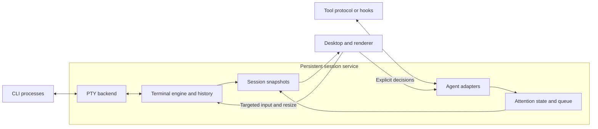

# Architecture and near-term plan

This is the single implementation plan for lapis. See the
[current status](../README.md#current-status) for what has been implemented and exercised.
The target platforms are macOS and Linux. The immediate milestone is **one
persistent terminal session on macOS**, followed by Linux terminal qualification.
The headless engine has already been exercised on Linux; the session service and
desktop have not.

## Product philosophy

**Responsiveness first, ergonomics second, visuals third.** Correct terminal
behavior and keyboard ownership remain requirements. Optimize the time from an
action to visible feedback, including slow outliers during output bursts. Visual
effects must fit within that interaction budget.

Design for high-end M-series machines (Pro/Max/Ultra class), with this M4 Max,
128 GB unified memory and 120 Hz display mode as the initial reference. These
are observed reference-machine properties, not minimum specifications or measured
lapis performance. Linux will need its own named hardware/workload reference.
Aim at 120 Hz on capable displays and follow higher refresh rates where qualified.

Use RAM generously to buy immediate switching: retain every live terminal's
current screen and recent history, share glyph caches, and prewarm useful previews
and render resources. Switching away does not unload a session. Warm caches in
bounded background work after the first view becomes interactive. Give caches
generous configurable limits; account for CPU/GPU unified memory once, alongside
separate agent-process usage. Under pressure, evict cold previews/history first
and spill older history to disk while protecting the active working set.

The first interactive view must include timing markers. Warm-switch latency and
frame budgets are **provisional hypotheses**, not measured guarantees or PR/release
gates. The [measurement procedure](../CONTRIBUTING.md#measuring-responsiveness)
owns the numbers, endpoints and workloads. Revisit them after the first real
terminal/switching baseline; require a reviewed, evidence-backed decision before
promoting any number to an acceptance threshold.

## Component ownership

| Piece | Owns | Boundary |
| --- | --- | --- |
| Session service | Processes, PTYs, terminal state/history, adapter connections and session lifecycle | Runs independently of the desktop; keeps consuming output while detached |
| Terminal-engine adapter | Existing engine's parsing, reflow and mode-aware input encoding | Inside the service; upstream types stay behind a small lapis interface |
| Agent adapters | Tool-specific activity, attention requests, responses and reconciliation | Service-owned; capabilities verified per tool/version |
| Attention policy | Pending requests, queue ordering, aging, cooldowns and snoozing | Service-owned state; requests never directly change keyboard focus |
| Desktop | Layout, navigation, keyboard ownership, IME, selection and accessibility | Receives snapshots; explicitly targets input and decisions to a session |
| Renderer | Glyph/texture caches, terminal drawing and previews | Desktop render thread; consumes snapshots, never mutable parser objects |

Desktop messages cross service IPC and are validated there; the GUI never owns
PTY handles. Input encoding uses the engine's current terminal modes. Keep code
in `services/session/`, `adapters/` and `apps/desktop/`; introduce libraries or
subdirectories when implementation needs them.

## Direction and open choices

| Topic | Current position | Decision gate |
| --- | --- | --- |
| Platform | macOS first; Linux required next | Check Linux during engine selection; qualify its minimal GUI before expanding the desktop |
| Desktop | C++20 baseline; Qt 6 Quick candidate and a portable terminal surface | Qualify Vulkan on Linux and Vulkan through MoltenVK on macOS |
| Engine | Pinned Ghostty `libghostty-vt` selected for the first adapter | Eight-case macOS/Linux replay passes; isolate unstable C API and resolve dependency-notice gaps |
| Service language | C++20 around Ghostty's C API | C++20 consumer exercised on both target platforms; no Rust linkage required |
| Transport | Versioned local IPC, owned snapshots and explicit session IDs | Define framing, limits, attachment identity, resync and failure behavior |
| Codex mode | Ordinary PTY CLI and lapis-owned app-server are distinct routes | Qualify the chosen attention route against the installed binary |

The [research receipt](../evidence/terminal-research.json) retains pinned upstream
sources. Contour is the closest structural reference; WezTerm supplies service/GUI
separation examples. These are source observations, not local runtime results.
Ghostty's external VT C API is explicitly unstable and needs a Zig toolchain;
Contour currently defaults to C++23 and its renderer uses Qt private APIs.
Qualify engines independently of upstream GUIs. Keep C++20 until an evidenced
decision changes it.

The [engine experiment](../evidence/terminal-engine-probe.json) records pinned
builds and runtime results. Dependencies remain in the opt-in experiment; production
integration and distribution packaging are the next work, not completed adoption.

## Portable rendering

Terminal emulation and rendering are separate choices. Ghostty VT or Contour's
engine maintains terminal state; the lapis surface draws snapshots using Qt Quick.
Keep common drawing code on public Qt scene-graph interfaces and portable shaders.
The preferred common GPU path to qualify is Vulkan:

| Platform | GPU paths to qualify | Priority |
| --- | --- | --- |
| macOS | Vulkan through MoltenVK, which translates to Metal | First implementation |
| Linux | Vulkan through the GPU driver | Required next platform |

macOS has no native Vulkan driver; [MoltenVK](https://github.com/KhronosGroup/MoltenVK)
supplies a portability implementation over Metal and converts SPIR-V shaders.
This adds a loader/runtime dependency and feature constraints, not a demonstrated
performance failure. Use the common supported feature set and query capabilities.
Qt already abstracts GPU APIs, so choosing Vulkan does not by itself remove
platform-specific input, font or process work.

The [local probe](../evidence/vulkan-probe.json) using `vulkaninfo --summary`
enumerated the Apple M4 Max through
MoltenVK 1.4.2; [Qt 6.11.2 source](https://github.com/qt/qtbase/blob/ef55f427f2c8b410d34f8a7681020a3000cf6866/src/plugins/platforms/cocoa/qcocoavulkaninstance.mm)
also contains Cocoa Vulkan surface integration. This establishes device discovery
and source support, not lapis drawing or performance. Before committing the GPU
choice, render the actual Qt terminal surface with Vulkan on both targets; check
presentation, text/shaders, resize, idle behavior and packaging. Compare the Mac's
native Metal backend if needed to quantify translation costs. No second custom
renderer is required merely to make that comparison.

Avoid OpenGL-only `QQuickFramebufferObject` and upstream private renderer APIs.
Use [Qt's backend selection](https://doc.qt.io/qt-6/qtquick-visualcanvas-adaptations.html)
and verify the selected API at runtime; a silent fallback is not Vulkan evidence.

Portability also covers PTY/process lifecycle, local IPC, font fallback, IME,
clipboard and accessibility. macOS/Linux can share POSIX concepts with OS-specific
implementations. Qualify Linux on a named distro and test Wayland/X11 separately.
Keep native handles and platform APIs out of the engine, session contracts and
attention policy.

## Near-term work

### Starting code structure

Keep components together by ownership. Each compiled component gets its own CMake
target; public headers live under `include/lapis/<component>/`, implementation
under `src/`, and behavioral cases under `tests/`. Add these directories as code
needs them. Every first-party target uses `lapis_project_options`.

| Location | First responsibility | Status |
| --- | --- | --- |
| `services/session/src/platform/posix/` | Native descriptor ownership, then PTY launch/I/O/resize/reaping | `UniqueFd` and real pipe ownership tests implemented; PTY work pending |
| `tools/terminal_probe/` | Shared headless workloads and independent Ghostty/Contour consumers | Implemented; pinned builds and eight-case replay on macOS/Linux |
| `services/session/src/terminal/` | Wrap the selected engine's parsing, mode-aware input and screen extraction | Ghostty selected; production adapter next |
| `services/session/include/lapis/session/` | Owned commands, session identity and snapshots for clients | Draft contract below; no public headers or wire format yet |
| `services/session/src/` | Service event loop and session lifecycle, then local IPC | Not implemented |
| `apps/desktop/` | Minimal Qt view, input routing and terminal surface | Pending production adapter and snapshot contract |
| `adapters/codex/` | Codex protocol mapping and attention delivery | Existing investigation only; follows terminal persistence |

The first target, `lapis_session_platform`, is an internal C++20 library with no
Qt, GPU or engine dependency. Its `UniqueFd` owns one native descriptor, closes
it on destruction and transfers ownership by move. The owner thread synchronizes
access; a borrowed descriptor is never closed by its caller. Tests use actual
POSIX pipes to exercise transfer, I/O, EOF, release and replacement. This is a
resource primitive, not a terminal or persistent service. No empty service or
desktop executable is advertised as an application.

**Provisional contract sketch (v0, not an API commitment).** Keep service/client
messages as owned values. Start with session identity, terminal dimensions,
launch/attach/detach, input, resize, explicit termination, exit status and a full
screen snapshot. Session IDs survive GUI reconnects; service-instance identity
must distinguish a service restart. Detach never means terminate. Bound message
sizes and validate session, attachment and generation before accepting input.
The GUI alone chooses keyboard ownership.

Keep native handles, engine types, Qt objects and GPU resources out of these
messages. Extend the experiment's tested cell/grapheme and ownership subset to
the required attributes, cursor/mode data and snapshot limits before production
headers or serialization are committed. Start with bounded full snapshots and a
resync path; add deltas only when measured copying costs justify them. Freezing
an IPC schema or building a generic plugin system now would precede that evidence.

The next implementation order is the Ghostty adapter, PTY-backed service with
headless lifecycle tests, then the minimal desktop with timing markers. The
descriptor primitive and headless consumers provide the starting code.
Keep control events reliable and display updates replaceable; the GUI must never
be the owner of the shell process or block the service's output draining.

### Engine experiment decision

Use **Ghostty VT with a C++20 service** for the next implementation. At pinned
revision `5de703a1b6ca0b91fcebe932b44be1df2de0a683`, the unpatched headless library
builds with Zig 0.16.0 and its public C API supports a C++20 consumer. All eight
shared cases pass on this macOS ARM64 host and native Ubuntu 24.04 ARM64. No Qt,
GPU or application UI is needed by that consumer.

Contour revision `6777ff05014f8ff163b071e8b0e942830119db80` also builds headlessly,
with C++23 isolated to its experiment. Seven cases pass; bytewise input of
`A界éZ` produces an extra U+FFFD before the wide character on both platforms.
The result reproduces through direct ingestion and upstream mock-PTY processing.
Keep this failing comparison visible; it is not a complete assessment of Contour
or a reason to alter the shared expectation.

The exercised boundary copies viewport graphemes, widths/continuations, bold and
resolved RGB colors, cursor position and tested input modes into owned values.
Snapshots survive parser mutation, resize and engine destruction. Key-up and paste
encoding follow terminal modes. This supports the direction of a snapshot-fed Qt
surface; actual rendering remains unproven. Production snapshots still need the
full style set, default/indexed color identity, wide-wrap spacer distinctions,
cursor visibility and lifecycle/revision metadata. The experimental header is
not a serialized service contract. Dirty-row APIs exist in Ghostty but incremental
damage extraction has not been qualified; begin with bounded full snapshots.
Measure allocation churn when building the production extraction path; the
correctness probe uses per-cell scratch buffers and is not a performance baseline.

Ghostty's configured 1 MiB history setting is read back through the API; the burst
case checks viewport size, not a process memory ceiling or disk-backed history.
The consumer passes ASan/UBSan; upstream Zig uses ReleaseSafe, which is a distinct
kind of checking. No latency, shaping, IME, PTY or GUI-persistence claim follows.

Keep the unstable API pinned behind the adapter. Before redistribution, package
all dependency notices: uucode's archive omits referenced notices, and the bundled
simdutf header identifies 9.0.0 while wrapper metadata says 5.2.8. The receipt has
the observed dependency/license inventory and retrieved notice references. The
shared dependency scanner cannot recognize this C++/Zig graph; direct OSV commit
queries returned no advisories for the queried pins, which is not full coverage
or vulnerability clearance. Runtime dependency packaging remains unfinished.

### Deliver milestone 1: one persistent terminal

Build the selected engine into a service that launches one shell under a PTY.
Attach a minimal desktop terminal view. Include Unicode/font handling, input,
resize and history sufficient for the exercised shell and interactive TUI.
Acceptance requires:

- Launch, input/output, deliberate resize, exit and resource cleanup work.
- Closing/reopening the GUI preserves the child PID and restores current terminal
  state. Output continues draining during detachment, including sustained output;
  retaining an open descriptor alone is insufficient.
- Current screen/recent history and older disk-backed history have explicit
  per-session limits. Reattachment does not replay unbounded output.
- Safely transferred snapshots isolate the renderer from parsing. A stalled GUI
  does not block process control; snapshot/delta gaps cause resynchronization.
- Service failure is distinguished from GUI detachment. Live-process survival
  across service failure or reboot is a separate recovery problem.
- Relevant cases pass `just check`, `just asan` and separate `just tsan` runs;
  the minimal GUI and actual GPU backend have direct macOS evidence.
- Record input, frame and switch timing from the first interactive view on the
  reference machine. Report tails, missed deadlines and warm-cache memory use;
  do not defer responsiveness instrumentation until the 32-session milestone.

Keep process I/O and parsing off the GUI thread. Bound queues and processing
work, coalesce display updates and preserve input/lifecycle events. Pin each input
operation to one session. GUI detach and session termination are separate commands.

### Following milestones

Follow [AGENTS.md](../AGENTS.md): **2. attention state and real Codex qualification
→ 3. full desktop, guarded keyboard ownership and carousel → 4. measured 32-session
workload → 5. second CLI and platform qualification.** The minimal view in
milestone 1 proves persistence; milestone 3 assembles the supervising workspace.
Carry that minimal session to Linux before expanding the full desktop; final
platform qualification still needs actual input, rendering and lifecycle evidence.
These later phases are outside the immediate implementation scope.

## Contracts to preserve

**Session identity and backends.** Each session has a stable lapis ID. Terminal
sessions own PTYs and engines; structured Codex sessions own app-server
processes/connections and conversation state. Structured sessions do not reproduce
the Codex TUI or satisfy terminal acceptance. A separate app-server does not
observe independently launched CLIs by default. The
[Codex investigation](../adapters/codex/README.md) retains the route details.

**Attention semantics remain a draft.** Keep connection, activity and a set of
pending requests independent. Events carry a contract version, session/adapter ID,
source-connection epoch, sequence, receipt time and kind; preserve source
thread/turn/item IDs and typed request IDs. Kinds cover connection/disconnection,
activity change, attention requested/resolved and reconciled snapshots. Requests
include reason, bounded summary and source confidence. Turn completion is not
process exit or task completion; silence is unknown. Use monotonic time for
scheduling, aging and cooldowns; wall-clock time for presentation/auditing.
The wire format remains open.

**Two reconciliation boundaries.** Source transport loss makes its requests stale
and disables replies until reconciliation. GUI detachment does not invalidate a
healthy service-owned source connection. A returning GUI refreshes service state
before enabling actions. Deduplicate by source identity/epoch, detect gaps and
retire only the resolved request. Keep attachment identities separate from source
epochs so delayed actions cannot target reused requests. Control-channel overflow
reports loss of synchronization.

**Verified adapters.** Declare observation, response and reconciliation separately.
Prefer supported protocols, then verified hooks; launcher exits and heuristics
supply weaker evidence. Bells/prompt matches are advisory. Hooks use session-bound
local endpoints, stay bounded/nonblocking and cannot silently change execution or
approval policy. Probe dispatch, payload and return semantics before installation.
Structured Codex success does not establish ordinary CLI attention coverage.

**Attention versus focus.** The service orders requests by priority/arrival with
aging and cooldowns. Desktop session positions remain stable; support manual
navigation, pinning, snoozing and an opt-in carousel without starving quiet sessions.
Only desktop focus policy assigns keyboard ownership. Typing, held keys, paste,
IME, selection, dragging and modal work defer automatic changes. Automatic
advancement requires the lapis window to be active and interaction idle. Never
split a paste/composition or steal another app's OS focus. Viewing/acknowledging
a request never approves it; explicit decisions use its originating adapter or terminal.

**Bounded rendering and storage.** Service screen state is authoritative; desktop
snapshots are safely replaceable caches, retained while useful. Budget history,
queues and CPU/GPU caches generously per session and globally. Stop drawing
hidden panels while retaining their warm state and consuming output; throttle
previews and let static scenes sleep. Scaled previews do not
resize PTYs. Preserve shaping, wide cells, IME, clipboard, selection and
accessibility. Live objects do not guarantee physical RAM residency.

The later 32-session experiment records workload/output rates, display rate,
p50/p95/p99 input/switch latency and frame times, memory growth and idle CPU/GPU
use. Separate replay from real CLI agents and keep provisional targets distinct
from results. Use [CONTRIBUTING.md](../CONTRIBUTING.md) for commands and evidence rules.
