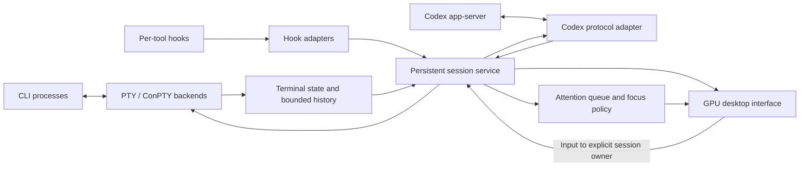

# Architecture proposal

## Product behavior

Keep agent sessions alive and their current screens ready for immediate display.
Offer stable session positions, adjacent previews, an overview, and a separate
queue of agents needing a decision. Automatic carousel advancement is opt-in.
Each card shows connection state, activity, and pending attention separately.

These are proposed boundaries, not implemented components. A Codex protocol
session exposes structured conversation items; it is not a byte-for-byte Codex
TUI. A normal Codex CLI terminal uses the PTY path and needs its own observable
hook or supported attachment mechanism. Do not assume a new app-server observes
all independently launched Codex processes.

## Session service

Own processes, I/O, terminal parsing, protocol clients, recent history, and
pending attention independently of the GUI. Restarting the GUI must not kill
service-owned agents. Service crashes and machine restarts are separate recovery
cases and do not imply live-process survival.

Use asynchronous I/O with per-session work budgets. A large output stream must
not block input handling or another session's attention events. Coalesce screen
updates; do not silently drop approvals, input requests, or lifecycle events.
On control-channel overload, report loss of synchronization and reconcile state.

Keep current terminal grids and recent history in memory, with older history
backed by disk. Budget memory per session and globally. The OS can still compress
or swap memory; keeping C++ objects alive is not a residency guarantee. Agent
processes and any local model runtime have separate resource budgets.

## Desktop and rendering

Candidate: C++20 plus Qt 6 Quick for layout, input, accessibility integration,
and animation. Prototype a custom terminal text surface in the scene graph.
Use platform GPU backends (Metal on macOS, appropriate backends elsewhere) and
verify the actual selected backend on each target.

Retain CPU screen state and a shared glyph cache. Keep visible/adjacent previews
warm within a GPU memory budget; do not allocate unlimited full-resolution
textures. Draw dirty regions, throttle previews, and stop drawing hidden panels.
Render animations at display refresh rate and let static scenes sleep.

Preserve terminal dimensions while showing scaled previews. Commit actual resize
events deliberately; animated cards must not continuously resize CLI programs.
Handle Unicode, font shaping, wide cells, IME composition, selection, clipboard,
screen readers, and terminal protocols as correctness requirements.

## Performance experiment

Begin with 32 sessions: idle, interactive TUIs, and several sustained output
streams. Use deterministic replay alongside real CLIs. Measure focus-to-first-frame
p50/p95/p99, input latency, frame times, CPU/GPU utilization, resident memory,
and history growth. Report display rate, machine, tool versions, workload rates,
warm/cold state, and run duration.

Targets: first useful frame within one display interval for a warm switch,
refresh-rate animation under the agreed workload, and low CPU/GPU use when idle.
These targets have not been measured. A synthetic 32-session replay does not
prove 32 real model agents fit within the machine's compute or memory budget.
