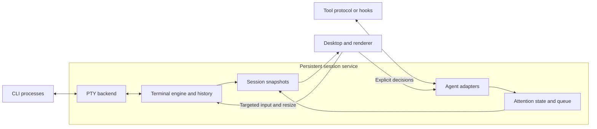

# Architecture and near-term plan

This is the single implementation plan for lapis. See the
[current status](../README.md#current-status) for what has been implemented and exercised.
The target platforms are macOS and Linux. The immediate milestone is **one
persistent terminal session on macOS**, followed by Linux terminal qualification.
The headless engine has already been exercised on Linux; the session service and
desktop have not.

## Product philosophy

**Responsiveness first, ergonomics second, visuals third.** Correct terminal
behavior and keyboard ownership remain requirements. Optimize the time from an
action to visible feedback, including slow outliers during output bursts. Visual
effects must fit within that interaction budget.

Use a minimal blend of Apple's restraint and Material's clear hierarchy. Favor
opaque surfaces, readable typography, generous spacing and subtle borders; avoid
glass, heavy shadows and decorative motion. Snappy, continuous feedback contributes
to perceived responsiveness, but never substitutes for fast input or correct state.
Animate position and color, not terminal glyphs. Begin feedback immediately, keep
transitions interruptible, and never gate keyboard input on animation completion.
The current preview uses 130–140 ms ease-out hover/color transitions and a two-pixel
lift. Future pane transitions should preserve spatial continuity without bounce;
honor reduced-motion preferences before enabling animated navigation. These are
initial design choices, not a new animation framework or measured performance claim.

Design for high-end M-series machines (Pro/Max/Ultra class), with this M4 Max,
128 GB unified memory and 120 Hz display mode as the initial reference. These
are observed reference-machine properties, not minimum specifications or measured
lapis performance. Linux will need its own named hardware/workload reference.
Aim at 120 Hz on capable displays and follow higher refresh rates where qualified.

Use RAM generously to buy immediate switching: retain every live terminal's
current screen and recent history, share glyph caches, and prewarm useful previews
and render resources. Switching away does not unload a session. Warm caches in
bounded background work after the first view becomes interactive. Give caches
generous configurable limits; account for CPU/GPU unified memory once, alongside
separate agent-process usage. Under pressure, evict cold previews/history first
and spill older history to disk while protecting the active working set.

The first interactive view must include timing markers. Warm-switch latency and
frame budgets are **provisional hypotheses**, not measured guarantees or PR/release
gates. The [measurement procedure](../CONTRIBUTING.md#measuring-responsiveness)
owns the numbers, endpoints and workloads. Revisit them after the first real
terminal/switching baseline; require a reviewed, evidence-backed decision before
promoting any number to an acceptance threshold.

## Component ownership

| Piece | Owns | Boundary |
| --- | --- | --- |
| Session service | Processes, PTYs, terminal state/history, adapter connections and session lifecycle | Runs independently of the desktop; keeps consuming output while detached |
| Terminal-engine adapter | Existing engine's parsing, reflow and mode-aware input encoding | Inside the service; upstream types stay behind a small lapis interface |
| Agent adapters | Tool-specific activity, attention requests, responses and reconciliation | Service-owned; capabilities verified per tool/version |
| Attention policy | Pending requests, queue ordering, aging, cooldowns and snoozing | Service-owned state; requests never directly change keyboard focus |
| Desktop | Layout, navigation, keyboard ownership, IME, selection and accessibility | Receives snapshots; explicitly targets input and decisions to a session |
| Renderer | Glyph/texture caches, terminal drawing and previews | Desktop render thread; consumes snapshots, never mutable parser objects |

Desktop messages cross service IPC and are validated there; the GUI never owns
PTY handles. Input encoding uses the engine's current terminal modes. Keep code
in `services/session/`, `adapters/` and `apps/desktop/`; introduce libraries or
subdirectories when implementation needs them.

## Direction and open choices

| Topic | Current position | Decision gate |
| --- | --- | --- |
| Platform | macOS first; Linux required next | Check Linux during engine selection; qualify its minimal GUI before expanding the desktop |
| Desktop | C++20 and Qt 6.11.2 Quick with public QSGTextNode terminal drawing | macOS Vulkan visual checkpoint exercised; Linux and performance qualification remain |
| Engine | Pinned Ghostty `libghostty-vt` selected for the first adapter | Eight-case macOS/Linux replay passes; isolate unstable C API and resolve dependency-notice gaps |
| Service language | C++20 around Ghostty's C API | C++20 consumer exercised on both target platforms; no Rust linkage required |
| Transport | Version 2 local framing, launch matching and bounded owned snapshots for one terminal | Add stable service/session identities, attachment generations and failure recovery |
| Codex mode | Keep the ordinary TUI under a PTY first; evaluate hooks or attachment to its actual server for attention | Installed CLI advertises remote/daemon options; qualify delivery and response ownership before choosing a route |

The [research receipt](../evidence/terminal-research.json) retains pinned upstream
sources. Contour is the closest structural reference; WezTerm supplies service/GUI
separation examples. These are source observations, not local runtime results.
Ghostty's external VT C API is explicitly unstable and needs a Zig toolchain;
Contour currently defaults to C++23 and its renderer uses Qt private APIs.
Qualify engines independently of upstream GUIs. Keep C++20 until an evidenced
decision changes it.

The [engine experiment](../evidence/terminal-engine-probe.json) records pinned
builds and runtime results. The production adapter now reuses that pinned library;
distribution packaging remains unfinished.

## Portable rendering

Terminal emulation and rendering are separate choices. Ghostty VT or Contour's
engine maintains terminal state; the lapis surface draws snapshots using Qt Quick.
Keep common drawing code on public Qt scene-graph interfaces and portable shaders.
The preferred common GPU path to qualify is Vulkan:

| Platform | GPU paths to qualify | Priority |
| --- | --- | --- |
| macOS | Vulkan through MoltenVK, which translates to Metal | First implementation |
| Linux | Vulkan through the GPU driver | Required next platform |

macOS has no native Vulkan driver; [MoltenVK](https://github.com/KhronosGroup/MoltenVK)
supplies a portability implementation over Metal and converts SPIR-V shaders.
This adds a loader/runtime dependency and feature constraints, not a demonstrated
performance failure. Use the common supported feature set and query capabilities.
Qt already abstracts GPU APIs, so choosing Vulkan does not by itself remove
platform-specific input, font or process work.

The [local probe](../evidence/vulkan-probe.json) established device discovery. The
[desktop checkpoint](../evidence/desktop-preview.json) now establishes actual Qt
terminal drawing on the Apple M4 Max, using Vulkan through MoltenVK 1.4.2 and
Qt 6.11.2. The application verifies the selected API at runtime. Its maintained
surface uses public QSGTextNode/QTextLayout interfaces and Qt's glyph cache, not
upstream private rendering code. Static scenes keep their retained nodes; new
snapshots rebuild the text nodes. Dirty-row rendering remains a measured follow-up.

Qt's default macOS transaction layer produced five-second display-lock stalls in
this Vulkan window. Setting `QT_MTL_NO_TRANSACTION=1` selected the plain
CAMetalLayer path and removed the warnings in the same threaded-render-loop
capture. This workaround is isolated to macOS startup and tied to Qt 6.11.2;
revalidate it on upgrades. Linux rendering, continuous resize, presentation timing
and packaging still need qualification. Compare native Metal if later matched
measurements warrant it; no second custom renderer is needed for that comparison.

Avoid OpenGL-only `QQuickFramebufferObject` and upstream private renderer APIs.
Use [Qt's backend selection](https://doc.qt.io/qt-6/qtquick-visualcanvas-adaptations.html)
and verify the selected API at runtime; a silent fallback is not Vulkan evidence.

Portability also covers PTY/process lifecycle, local IPC, font fallback, IME,
clipboard and accessibility. macOS/Linux can share POSIX concepts with OS-specific
implementations. Qualify Linux on a named distro and test Wayland/X11 separately.
Keep native handles and platform APIs out of the engine, session contracts and
attention policy.

## Near-term work

### Starting code structure

Keep components together by ownership. Each compiled component gets its own CMake
target; public headers live under `include/lapis/<component>/`, implementation
under `src/`, and behavioral cases under `tests/`. Add these directories as code
needs them. Every first-party target uses `lapis_project_options`.

| Location | First responsibility | Status |
| --- | --- | --- |
| `services/session/src/platform/posix/` | Native descriptor ownership, then PTY launch/I/O/resize/reaping | `UniqueFd` on macOS/Linux; Qt-owned PTY launch/I/O/resize/reaping exercised on macOS |
| `tools/terminal_probe/` | Shared headless workloads and independent Ghostty/Contour consumers | Implemented; pinned builds and eight-case replay on macOS/Linux |
| `services/session/src/terminal/` | Wrap the selected engine's parsing, mode-aware input and screen extraction | Implemented as `lapis_terminal`; 14 behavioral cases on macOS/Linux ARM64 |
| `services/session/include/lapis/session/` | Owned commands, session identity and snapshots for clients | Owned terminal values implemented; internal version 2 snapshot framing under `src/transport/` |
| `services/session/src/` | Service event loop and session lifecycle, then local IPC | Separate one-terminal service with explicit argv/cwd and bounded local transport on macOS |
| `apps/desktop/` | Minimal Qt view, input routing and terminal surface | Live enlarged shell and static carousel composition; macOS Vulkan capture |
| `adapters/codex/` | Codex protocol mapping and attention delivery | Ordinary Codex TUI launch exercised; structured attention remains investigation |

The first target, `lapis_session_platform`, is an internal C++20 library with no
Qt, GPU or engine dependency. Its `UniqueFd` owns one native descriptor, closes
it on destruction and transfers ownership by move. The owner thread synchronizes
access; a borrowed descriptor is never closed by its caller. Tests use actual
POSIX pipes to exercise transfer, I/O, EOF, release and replacement. This is a
resource primitive, not a terminal or persistent service. No empty service or
desktop executable is advertised as an application.

### Current visual checkpoint

The desktop starts a separate Qt Core service on a private local socket. That
service owns QProcess, a nonblocking POSIX PTY, and the Ghostty terminal. Closing
the GUI only detaches the local socket: the service continues draining output.
The enlarged pane is a live terminal; the remaining cards are labeled placeholders.
One GUI may attach per endpoint. A matching attachment replaces the previous
connection; a mismatched launch is rejected first. The default socket identifies
this checkout's shell, and explicit launches choose their own endpoint. Stable session IDs,
service epochs and authenticated attachment generations are still required before
multiple sessions or robust recovery. This wire format is internal and provisional.

Qt event loops own their respective objects. PTY reads yield after 64 KiB and
input dispatch after 64 frames. Writes have a 1 MiB queue; text messages are at
most 64 KiB. Snapshot frames are limited to 8 MiB, 32,768 cells and 65,536 codepoints.
The service coalesces updates on a 16 ms timer with one snapshot in flight; a slow
GUI does not block PTY parsing. That timer needs measurement against the 120 Hz
reference before any latency claim. Current history uses the adapter's bounded
memory budget; disk-backed history is not implemented.

The GUI decodes owned snapshots and routes text, navigation, Control-letter input,
paste and resize. The focused pane chooses the PTY dimensions; scaled previews do
not resize it. Basic IME commit/preedit plumbing exists, but actual composition,
font fallback, strict wide-cell alignment, selection and accessibility are not
qualified. The renderer keeps static scene nodes and lets Qt schedule frames for
updates and brief hover transitions. A repeatable synthetic cue workload now records GUI frame observations. Actual
input-to-presentation timing remains an acceptance gap. The visual checkpoint
does not complete milestone 1.

### UI refinement checkpoint

Both scoped UI changes are implemented and exercised on macOS; maintainer visual
review remains before connecting real requests. They reuse Qt Quick, owned terminal
snapshots and the Vulkan surface, with no new runtime dependency. Milestone 1
remains incomplete. The [UI receipt](../evidence/ui-preview.json) records checks and
measurement limits; commands live in [Contributing](../CONTRIBUTING.md#ui-tuning-and-debugging).

#### Isolated iteration and debugging

`--ui-preview` constructs synthetic sessions without a live connection or service.
It rejects `--smoke-input`. The existing live window stayed attached to its shell
while the isolated capture suite ran. `just ui` loads source QML; manual reload
creates a candidate view and preserves the previous view on load failure. Accepted
reloads preserve geometry and defer destruction of the previous engine so a QML
caller can finish safely. Normal launches use bundled resources.

The development-only **preview scenario v1** has stable card IDs, owned terminal
snapshots and bounded requests keyed by ID. It is separate from service IPC and
the future attention policy. Arrival, duplicate, two requesting cards, matching
resolution and reset are explicit replay actions. There are at most eight pending
requests per fixture session; duplicate IDs do not change the request or cue serial.

Captures wait for actual frames, have a 15-second deadline and report load/save
failures. LLDB launch, breakpoint, stack inspection, resume and separate attach/
detach were exercised against the isolated app. The GUI and service remain
separate debugging targets.

#### Compact header and attention cue

An 18-pixel strip holds connection status and preview tools; it omits repeated
session names and paths. Carousel cards have no title or repeated preview badge:
terminal content, working directory and attention state identify them. No user
naming is required. Cards keep their positions and dimensions. A new synthetic
request produces two red edge pulses over 1.4 seconds, then a steady rim and
readable pending label. The cue occupies the card's existing background and never
changes the terminal geometry or keyboard owner.
Duplicate requests and ordinary output do not restart it; resolving one request
leaves others pending. Focusing a card never approves or resolves a request.

Reduced motion uses a steady marker. The app reads the macOS accessibility
preference at startup and activation; a preview override can also enable it.
Linux preference integration is still unqualified. Cue motion pauses while the
window is hidden or inactive and stops after the finite sequence. Captured default,
compact, arrival, two-card and reduced-motion states passed focus/geometry checks.

The trace records bounded, GUI-thread observations of `frameSwapped`. Those times
include signal delivery and scheduling; they are not physical presentation or input
latency. The receipt includes interval distributions and a short idle observation,
not a latency guarantee or sustained CPU/GPU benchmark. Targets remain provisional.

#### Next steps and ownership

After visual review, introduce rebindable next-session, previous-session and
next-needing-attention actions with persisted settings and focus/input tests.
Tab or a Tab chord remains a candidate, not a selected default: plain Tab belongs
to shell completion/TUIs unless explicitly rebound. Keep positions stable and never
split paste/IME operations. Selecting a session never sends a response.

Keep real attention adapters, automatic carousel movement, multiple live sessions
and prompt/approval routing out of this fixture. Complete persistent-terminal
acceptance and qualify the minimal Linux view before expanding the live workspace.

For parallel changes, commit the shared contract first and assign disjoint files
with one coordinator/build owner. Preview hosting lives in `ui_preview.*`, layout
in `qml/`, and capture/check tooling in `ui_capture.*`, desktop tests and
`scripts/check_ui_preview.py`. Review partial worker output before integration.
Use `just desktop` for integrated C++ changes, targeted ASan for reload lifetimes,
and `just ui-check` for capture behavior. QML-only iteration uses reload and focused
visual checks; reuse pinned dependencies and update these documents in place.

### Terminal adapter v0

The checkpoint repair is merged in PR #1. The first production adapter lives in
`services/session/`: public values under `include/lapis/session/terminal.hpp`,
Ghostty integration under `src/terminal/`, and behavioral cases under
`tests/terminal/`. It is one C++20 library, with no PTY, threads or GUI. The
[adapter receipt](../evidence/terminal-adapter.json) records the exercised scope.

- One owner thread operates each terminal. Clients receive owned snapshots that
  survive later input, resize and terminal destruction. Ghostty types remain
  private. Snapshots use a contiguous grapheme pool and row-major cells, avoiding
  per-cell heap allocation; the adapter reuses extraction scratch storage.
- Preserve graphemes, wide tails and wrap spacers, all exposed style flags and
  underline styles, default/indexed/RGB color identity, the current palette,
  cursor visibility/shape and the initial client's input modes. Effective colors
  apply inverse once; bold alone does not brighten indexed colors.
- Input and snapshot payloads have configurable byte/cell/codepoint limits.
  Invalid geometry and oversized input fail before engine mutation; extraction
  overflow leaves parsing usable. Generated terminal replies use preallocated
  storage. A reply overflow permanently faults the instance so a service cannot
  send a partial response; recreate and resynchronize it.
- History uses Ghostty's page-granular byte budget. Exercised eviction and clearing
  preserve the current viewport; this budget is not a strict allocation or RSS
  ceiling. Snapshot payload limits also do not account for allocator overhead.
  Global service budgets and disk-backed history still belong to later work.
- The verified input subset is navigation key presses with modifiers and pure text
  paste encoding. Clipboard access, full text/key protocols, mouse, IME, selection,
  hyperlinks and image presentation are not exposed. Image storage and external
  image media are disabled. A terminal reply never writes directly to a PTY.

This is an in-process boundary, not an IPC schema. The normal CMake build always
includes the adapter and requires a successful pinned Ghostty build prefix;
missing dependencies cannot silently omit its tests. The existing archive runner
owns downloads and source verification, while `cmake/Ghostty.cmake` checks build
provenance and imports the library. Reuse the build across C++ check modes.
[Dependency notices](../third_party/ghostty/NOTICES.txt) collect the upstream texts;
remaining source-provenance/SBOM limits are explicit. No binary is packaged yet.

The coordinator owns shared headers, build files and these documents. For future
parallel work, commit the shared contract first, assign disjoint files and one
build owner, and use bounded worker runs. Integrate and test worker output before
calling it complete. Preserve partial work after timeouts and avoid repeated
optional checks once the affected behavior passes.

### Next: complete persistent-terminal acceptance

The explicit launch slice is implemented. Current exercise status is in the
[README](../README.md#current-status), with a
[sanitized receipt](../evidence/cli-launch.json). Continue with the remaining
terminal acceptance below before adding live workspace sessions or attention.
Visual review of the earlier UI refinements remains pending.

#### First wiring slice: explicit CLI launch

Internal **launch contract v1**, in `services/session/src/launch_spec.hpp`, carries
an executable, literal argument vector, working directory and initial terminal
size. `validate_launch` resolves PATH/relative executable names, preserves
executable symlinks and argv[0] semantics, canonicalizes the working directory,
and rejects invalid geometry, missing executables/directories, embedded NULs,
more than 256 arguments or more than 64 KiB of supplied launch text. The default
shell still receives `-i`; other programs receive only their requested arguments.
Both entry points preserve argv before initializing Qt and let only lapis parse
it: Qt otherwise consumes child options such as `-platform` even after `--`.

`WorkspaceOptions` supplies the launch and endpoint to the desktop. Explicit
programs or cwd overrides require `--socket`; all child arguments follow `--`.
Fixture mode rejects launch/endpoint options and does not inspect the user's
shell. Shell smoke injection rejects explicit launch/cwd overrides.

Service IPC is now **version 2**. Before hello or input, a client sends an attach
frame containing the protocol version and SHA-256 of a Qt_6_0 big-endian stream
of executable path, argument list and canonical cwd. Initial/current terminal size
is excluded so resize does not invalidate reattachment. This is launch matching,
not a secret authentication token or a stable session identity; owner-only socket
directory permissions provide the local access boundary. A mismatch never
replaces the active client. At most eight handshakes wait for up to three seconds,
with bounded input. The desktop also bounds its handshake wait and only starts a
service for a missing/refused endpoint, not a permission error or rejected match.

Socket parents must be private and owned by the current user. Ordinary files,
symlinks and live foreign listeners are rejected; existing directories are not
chmodded. The default `runtime/desktop-v2.sock` leaves old v1 sessions alone.
No state migration, multi-session manager or automatic service recovery is implied.
Launch profiles, hooks and approval policies remain owned by the selected CLI.

Ownership stays separated: the PTY owns the child; the service owns parsing and
attachment; the desktop routes input after hello. `scripts/check_cli_launch.py`
exercises literal argv/cwd, resize, paste, exit, detached output, mismatches and
malformed handshakes against real service processes. Its optional GUI and Codex
modes add GPU captures and no-prompt TUI interaction. Actual Codex attention and
model-turn continuation remain unqualified. Commands live in
[Contributing](../CONTRIBUTING.md#cli-integration-qualification).

#### Remaining terminal acceptance

Close these dependent gaps before expanding the live
workspace. Parallelize independent investigation, with one integration/build owner.

1. **Identity and recovery — session service and transport.** Introduce stable
   session IDs, service epochs and attachment generations before adding sessions
   or routable attention. Reject stale input; exercise partial paste, slow clients,
   queue overflow and service failure. GUI reconnection refreshes state before
   input is enabled. Service failure/reboot must be reported distinctly; do not
   promise survival of the old child.
2. **Terminal fidelity and timing — desktop and verification.** Qualify cell
   positioning, fallback fonts, real IME/key/paste behavior, interactive TUIs and
   foreground jobs. Add correlated input/service/frame markers and measure the
   first-view baseline; label presentation proxies. Rebindable navigation can
   then be tested in the isolated fixture after visual review.
3. **History — session service.** Add bounded disk-backed older history, quotas,
   pressure handling and disk-full recovery while preserving the current screen.
   A passing viewport-eviction test is not disk-history acceptance.
4. **Minimal Linux qualification — platform and verification.** Carry the same
   PTY/service/Qt view to a named Linux host and exercise Vulkan, native input,
   resize and detach/reattach before expanding workspace behavior.

Keep real attention integration, automatic carousel behavior, multiple live
sessions and the 32-session benchmark in the following milestones. Protocol and
hook research may run independently; advertised methods are not integration
acceptance. The static cards remain review fixtures.

### Engine experiment decision

Use **Ghostty VT with a C++20 service**; the first adapter now implements this decision. At pinned
revision `5de703a1b6ca0b91fcebe932b44be1df2de0a683`, the unpatched headless library
builds with Zig 0.16.0 and its public C API supports a C++20 consumer. All eight
shared cases pass on this macOS ARM64 host and native Ubuntu 24.04 ARM64. No Qt,
GPU or application UI is needed by that consumer.

Contour revision `6777ff05014f8ff163b071e8b0e942830119db80` also builds headlessly,
with C++23 isolated to its experiment. Seven cases pass; bytewise input of
`A界éZ` produces an extra U+FFFD before the wide character on both platforms.
The result reproduces through direct ingestion and upstream mock-PTY processing.
Keep this failing comparison visible; it is not a complete assessment of Contour
or a reason to alter the shared expectation.

The exercised boundary copies viewport graphemes, widths/continuations, bold and
resolved RGB colors, cursor position and tested input modes into owned values.
The color comparison applies inverse to resolved foreground/background colors,
keeps bold independent of palette brightening, and pins palette/default colors
in replay. Indexed, explicit bright, inverse, bold-inverse and reset cases now
exercise that policy on both platforms; the earlier truecolor-only case did not.
Snapshots survive parser mutation, resize and engine destruction. Key-up and paste
encoding follow terminal modes. This was evidence for the snapshot-fed surface now present in the desktop
checkpoint. The production adapter has since added styles, tagged colors, wrap
spacers and cursor data; stable service lifecycle identities remain outstanding. The experimental header is
not a serialized service contract. Dirty-row APIs exist in Ghostty but incremental
damage extraction has not been qualified; begin with bounded full snapshots.
Measure allocation churn when building the production extraction path; the
correctness probe uses per-cell scratch buffers and is not a performance baseline.

Ghostty's configured 1 MiB history setting is read back through the API; the burst
case checks viewport size, not a process memory ceiling or disk-backed history.
The consumer passes ASan/UBSan; upstream Zig uses ReleaseSafe, which is a distinct
kind of checking. No latency, shaping, IME, PTY or GUI-persistence claim follows.

Keep the unstable API pinned behind the adapter. Before redistribution, package
all dependency notices: uucode's archive omits referenced notices, and the bundled
simdutf header identifies 9.0.0 while wrapper metadata says 5.2.8. The receipt has
the observed dependency/license inventory and retrieved notice references. The
shared dependency scanner cannot recognize this C++/Zig graph; direct OSV commit
queries returned no advisories for the queried pins, which is not full coverage
or vulnerability clearance. Runtime dependency packaging remains unfinished.

### Deliver milestone 1: one persistent terminal

Build the selected engine into a service that launches one shell under a PTY.
Attach a minimal desktop terminal view. Include Unicode/font handling, input,
resize and history sufficient for the exercised shell and interactive TUI.
Acceptance requires:

- Launch, input/output, deliberate resize, exit and resource cleanup work.
- Closing/reopening the GUI preserves the child PID and restores current terminal
  state. Output continues draining during detachment, including sustained output;
  retaining an open descriptor alone is insufficient.
- Current screen/recent history and older disk-backed history have explicit
  per-session limits. Reattachment does not replay unbounded output.
- Safely transferred snapshots isolate the renderer from parsing. A stalled GUI
  does not block process control; snapshot/delta gaps cause resynchronization.
- Service failure is distinguished from GUI detachment. Live-process survival
  across service failure or reboot is a separate recovery problem.
- Relevant cases pass `just check`, `just asan` and separate `just tsan` runs;
  the minimal GUI and actual GPU backend have direct macOS evidence.
- Record input, frame and switch timing from the first interactive view on the
  reference machine. Report tails, missed deadlines and warm-cache memory use;
  do not defer responsiveness instrumentation until the 32-session milestone.

Keep process I/O and parsing off the GUI thread. Bound queues and processing
work, coalesce display updates and preserve input/lifecycle events. Pin each input
operation to one session. GUI detach and session termination are separate commands.

### Following milestones

Follow [AGENTS.md](../AGENTS.md): **2. attention state and real Codex qualification
→ 3. full desktop, guarded keyboard ownership and carousel → 4. measured 32-session
workload → 5. second CLI and platform qualification.** The minimal view in
milestone 1 proves persistence; milestone 3 assembles the supervising workspace.
Carry that minimal session to Linux before expanding the full desktop; final
platform qualification still needs actual input, rendering and lifecycle evidence.
The following sequence is planned, not implemented by the launch slice:

| Milestone | Dependency and owner | Exit evidence |
| --- | --- | --- |
| 2: attention and Codex | Stable session/source/attachment identities; service policy and adapter owners | Deterministic replay of duplicates, gaps, cancellation and simultaneous requests; real input/approval, explicit response, continuation and reconnect reconciliation against a hashed Codex binary |
| 3: supervising desktop | Qualified minimal Linux terminal and milestone 2; desktop owner | Two real retained sessions first, rebindable manual navigation, pin/snooze, guarded opt-in carousel, and actual typing/held-key/paste/IME/modal/inactive-window focus cases |
| 4: scale and responsiveness | Working multi-session desktop; verification owner | Controlled 32-session output/TUI workload, p50/p95/p99 input/switch/frame results, memory growth and idle CPU/GPU; distinguish synthetic replay from real agents |
| 5: independent adapter and platform completion | Stable adapter capability contract; separate adapter/platform owners | Second CLI independently exercises observation/response/reconciliation; macOS and named Linux backends have actual lifecycle, native input and rendering evidence |

Dependency notices, a complete bundled inventory/SBOM and redistribution obligations
must be closed before publishing binaries. This release requirement is independent
of a local milestone passing. Keep current implementation status in the README;
the tables here define work order and acceptance only.

## Contracts to preserve

**Session identity and backends.** Each session has a stable lapis ID. Terminal
sessions own PTYs and engines; structured Codex sessions own app-server
processes/connections and conversation state. Structured sessions do not reproduce
the Codex TUI or satisfy terminal acceptance. A separate app-server does not
observe independently launched CLIs by default. The
[Codex investigation](../adapters/codex/README.md) retains the route details.

**Attention semantics remain a draft.** Keep connection, activity and a set of
pending requests independent. Events carry a contract version, session/adapter ID,
source-connection epoch, sequence, receipt time and kind; preserve source
thread/turn/item IDs and typed request IDs. Kinds cover connection/disconnection,
activity change, attention requested/resolved and reconciled snapshots. Requests
include reason, bounded summary and source confidence. Turn completion is not
process exit or task completion; silence is unknown. Use monotonic time for
scheduling, aging and cooldowns; wall-clock time for presentation/auditing.
The wire format remains open.

**Two reconciliation boundaries.** Source transport loss makes its requests stale
and disables replies until reconciliation. GUI detachment does not invalidate a
healthy service-owned source connection. A returning GUI refreshes service state
before enabling actions. Deduplicate by source identity/epoch, detect gaps and
retire only the resolved request. Keep attachment identities separate from source
epochs so delayed actions cannot target reused requests. Control-channel overflow
reports loss of synchronization.

**Verified adapters.** Declare observation, response and reconciliation separately.
Prefer supported protocols, then verified hooks; launcher exits and heuristics
supply weaker evidence. Bells/prompt matches are advisory. Hooks use session-bound
local endpoints, stay bounded/nonblocking and cannot silently change execution or
approval policy. Probe dispatch, payload and return semantics before installation.
Structured Codex success does not establish ordinary CLI attention coverage.

**Attention versus focus.** The service orders requests by priority/arrival with
aging and cooldowns. Desktop session positions remain stable; support manual
navigation, pinning, snoozing and an opt-in carousel without starving quiet sessions.
Only desktop focus policy assigns keyboard ownership. Typing, held keys, paste,
IME, selection, dragging and modal work defer automatic changes. Automatic
advancement requires the lapis window to be active and interaction idle. Never
split a paste/composition or steal another app's OS focus. Viewing/acknowledging
a request never approves it; explicit decisions use its originating adapter or terminal.

**Bounded rendering and storage.** Service screen state is authoritative; desktop
snapshots are safely replaceable caches, retained while useful. Budget history,
queues and CPU/GPU caches generously per session and globally. Stop drawing
hidden panels while retaining their warm state and consuming output; throttle
previews and let static scenes sleep. Scaled previews do not
resize PTYs. Preserve shaping, wide cells, IME, clipboard, selection and
accessibility. Live objects do not guarantee physical RAM residency.

The later 32-session experiment records workload/output rates, display rate,
p50/p95/p99 input/switch latency and frame times, memory growth and idle CPU/GPU
use. Separate replay from real CLI agents and keep provisional targets distinct
from results. Use [CONTRIBUTING.md](../CONTRIBUTING.md) for commands and evidence rules.
