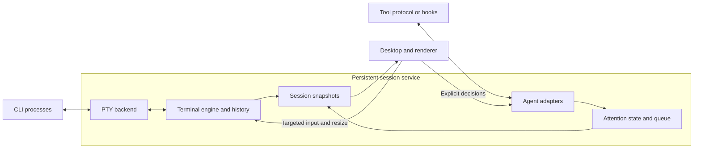

# Architecture and near-term plan

This is the single implementation plan for lapis. See the
[current status](status.md) for what has been implemented and exercised.
macOS is the active target, and the signed Mac app is now the working daily
environment. The [production delivery order](#production-delivery-order-september-30)
owns the next work and release exits; the dated feature surveys below are backlog
and decision history, not competing priority lists.
Milestones 1 and 2 are qualified for the recorded
single-session scope: a persistent terminal and managed Codex attention with
explicit desktop responses. The quality baseline from PR #6 remains in force.
[Milestone 3](#milestone-3-supervising-two-live-sessions-on-macos) has
retained entries, workspace attention and guarded opt-in navigation assembled on
macOS. Its two-session acceptance and measurement limits are recorded in the
[workspace receipt](../evidence/milestone-three-workspace.json).
A Linux desktop port is deferred; the headless engine has
already been exercised on Linux, but the session service and desktop have not.

## Product philosophy

**Responsiveness first, ergonomics second, visuals third.** Correct terminal
behavior and keyboard ownership remain requirements. Optimize the time from an
action to visible feedback, including slow outliers during output bursts. Visual
effects must fit within that interaction budget.

Use a minimal blend of Apple's restraint and Material's clear hierarchy. Favor
opaque surfaces, readable typography, generous spacing and subtle borders; avoid
glass, heavy shadows and decorative motion. Snappy, continuous feedback contributes
to perceived responsiveness, but never substitutes for fast input or correct state.
Animate position and color, not terminal glyphs. Begin feedback immediately, keep
transitions interruptible, and never gate keyboard input on animation completion.
The current preview uses 130–140 ms ease-out hover/color transitions and a two-pixel
lift. Future pane transitions should preserve spatial continuity without bounce;
honor reduced-motion preferences before enabling animated navigation. These are
initial design choices, not a new animation framework or measured performance claim.

Design for high-end M-series machines (Pro/Max/Ultra class), with this M4 Max,
128 GB unified memory and 120 Hz display mode as the initial reference. These
are observed reference-machine properties, not minimum specifications or measured
lapis performance. If Linux is ported later, it will need its own named
hardware/workload reference.
Aim at 120 Hz on capable displays and follow higher refresh rates where qualified.

Use RAM generously to buy immediate switching: retain every live terminal's
current screen and recent history, share glyph caches, and prewarm useful previews
and render resources. Switching away does not unload a session. Warm caches in
bounded background work after the first view becomes interactive. Give caches
generous configurable limits; account for CPU/GPU unified memory once, alongside
separate agent-process usage. Under pressure, evict cold previews/history first
and spill older history to disk while protecting the active working set.

The first interactive view must include timing markers. Warm-switch latency and
frame budgets are **provisional hypotheses**, not measured guarantees or PR/release
gates. The [measurement procedure](../CONTRIBUTING.md#measuring-responsiveness)
owns the numbers, endpoints and workloads. Revisit them after the first real
terminal/switching baseline; require a reviewed, evidence-backed decision before
promoting any number to an acceptance threshold.

## Component ownership

| Piece | Owns | Boundary |
| --- | --- | --- |
| Session service | Processes, PTYs, terminal state/history, adapter connections and session lifecycle | Runs independently of the desktop; keeps consuming output while detached |
| Terminal-engine adapter | Existing engine's parsing, reflow and mode-aware input encoding | Inside the service; upstream types stay behind a small lapis interface |
| Agent adapters | Tool-specific activity, attention requests, responses and reconciliation | Service-owned; capabilities verified per tool/version |
| Attention policy | Service-owned pending requests; desktop aggregation, navigation aging/cooldowns and presentation snooze | Source state stays authoritative in each service; only desktop focus policy assigns keyboard ownership |
| Desktop | Layout, navigation, keyboard ownership, IME, selection and accessibility | Receives snapshots; explicitly targets input and decisions to a session |
| Tool status | Installed/version observations for canonical agent CLIs in the Tools pane | Reads `harness_catalog`; never configures tools or changes launch, restore, resume or update behavior |
| Renderer | Glyph/texture caches, terminal drawing and previews | Desktop render thread; consumes snapshots, never mutable parser objects |


```mermaid
flowchart LR
    CLI[CLI processes] <--> PTY[PTY backend]
    subgraph Service[Persistent session service]
        PTY <--> Engine[Terminal engine and history]
        Agent[Agent adapters] --> Attention[Attention state and queue]
        Engine --> State[Session snapshots]
        Attention --> State
    end
    Tool[Tool protocol or hooks] <--> Agent
    State --> Desktop[Desktop and renderer]
    Desktop -->|Targeted input and resize| Engine
    Desktop -->|Explicit decisions| Agent
```

Desktop messages cross service IPC and are validated there; the GUI never owns
PTY handles. Input encoding uses the engine's current terminal modes. Keep code
in `services/session/`, `adapters/` and `apps/desktop/`; introduce libraries or
subdirectories when implementation needs them. Use the
[contributor handoff procedure](../CONTRIBUTING.md#large-changes-and-parallel-contributors)
for ownership, shared contracts and integration checks across large changes.

## Direction and open choices

| Topic | Current position | Decision gate |
| --- | --- | --- |
| Platform | macOS active; Linux desktop deferred | Keep portable platform boundaries; qualify Linux separately if and when the port is scheduled |
| Desktop | C++20 and Qt 6.11.2 Quick with public QSGTextNode terminal drawing | macOS Vulkan visual checkpoint exercised; macOS performance qualification remains |
| Engine | Pinned Ghostty `libghostty-vt` selected for the first adapter | Eight-case macOS/Linux replay passes; isolate unstable C API and resolve dependency-notice gaps |
| Service language | C++20 around Ghostty's C API | C++20 consumer exercised on both target platforms; no Rust linkage required |
| Transport | Version 6 local framing with session/epoch/generation identity, readiness, history paging, attention messages and retained workspace entries | Automatic service recovery remains deferred |
| Adapter observation status | The desktop still infers pre-prompt state from exact Codex diagnostic strings; the recorded decision is to add a typed observation field and move the shared wire VERSION in the same lockstep change, after which diagnostics become display-only | Q03 extraction needs the typed field, observers, service publisher, desktop consumer and in-repo Python/Swift wire peers together, with replay-equivalent adapter states |
| Codex mode | Managed ordinary TUI with a dedicated service-owned backend and observer; desktop responses qualified in Milestone 2 | Milestone 3 qualifies routing across two independent sessions; other binaries and request kinds need separate evidence |
| Codex multi-thread sessions | Upstream worktree tools (#50148) make attached tasks routine in one TUI; lapis binds a single persistent TUI thread and disables structured responses on a second | A disposable two-thread live session (worktree-created attached task) proving per-thread event delivery, response ownership and `thread/resume`+`thread/read` reconciliation, recorded in the Codex capability matrix; see the [October 2 review](#codex-upstream-integration-review-october-2) |
| Codex external-agent import | Session-only protocol importer and isolated qualification probe are implemented; no service/desktop onboarding task yet | Finish the separate explicit flow on a requalified Codex build: exact scope consent, dedicated server ownership, imported-thread launch/resume, duplicate reconciliation and failure recovery; never a per-session observer capability |
| Session-service analyzer complexity | Narrow documented suppressions hold `codex_permission`, `codex_arguments`, and `parse_options` while their CLI grammar remains one reviewable narrative | Refactor only after behavior-preserving tests cover each option path and `just desktop` remains green |
| Web surfaces | CEF 8037 (Chromium 154) provisional candidate for service-owned, CLI-drivable web views; September 29 design only, runtime pin awaits W0 | [Web surfaces section](#web-surfaces-september-29) owns the engine gate, wire contract, injection determinism and import consent |

The [research receipt](../evidence/terminal-research.json) retains pinned upstream
sources. Contour is the closest structural reference; WezTerm supplies service/GUI
separation examples. These are source observations, not local runtime results.
Ghostty's external VT C API is explicitly unstable and needs a Zig toolchain;
Contour currently defaults to C++23 and its renderer uses Qt private APIs.
Qualify engines independently of upstream GUIs. Keep C++20 until an evidenced
decision changes it.

The [engine experiment](../evidence/terminal-engine-probe.json) records pinned
builds and runtime results. The production adapter now reuses that pinned library,
and the [downloadable Mac app](#the-downloadable-mac-app-september-25) links it.

## Portable rendering

Terminal emulation and rendering are separate choices. Ghostty VT or Contour's
engine maintains terminal state; the lapis surface draws snapshots using Qt Quick.
Keep common drawing code on public Qt scene-graph interfaces and portable shaders.
The preferred common GPU path to qualify is Vulkan:

| Platform | GPU paths to qualify | Priority |
| --- | --- | --- |
| macOS | Vulkan through MoltenVK, which translates to Metal | First implementation |
| Linux | Vulkan through the GPU driver | Deferred port; not claimed or currently scheduled |

macOS has no native Vulkan driver; [MoltenVK](https://github.com/KhronosGroup/MoltenVK)
supplies a portability implementation over Metal and converts SPIR-V shaders.
This adds a loader/runtime dependency and feature constraints, not a demonstrated
performance failure. Use the common supported feature set and query capabilities.
Qt already abstracts GPU APIs, so choosing Vulkan does not by itself remove
platform-specific input, font or process work.

The [local probe](../evidence/vulkan-probe.json) established device discovery. The
[desktop checkpoint](../evidence/desktop-preview.json) now establishes actual Qt
terminal drawing on the Apple M4 Max, using Vulkan through MoltenVK 1.4.2 and
Qt 6.11.2. The application verifies the selected API at runtime. Its maintained
surface uses public QSGTextNode/QTextLayout interfaces and Qt's glyph cache, not
upstream private rendering code. Static scenes keep their retained nodes; new
snapshots replace only changed row text nodes. Each surface retains the current
owned snapshot and the previous rendered snapshot for comparison. GUI-owned
objects, preedit text and geometry are copied into an immutable render state and
handed to the render thread under a standard mutex. The render callback never
dereferences a GUI-owned session. Allocation and frame-time gains still need
measurement; preview throttling and full shaping remain follow-up work.

Qt's default macOS transaction layer produced five-second display-lock stalls in
this Vulkan window. Setting `QT_MTL_NO_TRANSACTION=1` selected the plain
CAMetalLayer path and removed the warnings in the same threaded-render-loop
capture. This workaround is isolated to macOS startup and tied to Qt 6.11.2;
revalidate it on upgrades. Continuous resize and presentation timing still need
qualification. Linux rendering, if scheduled later, needs its own evidence. Compare native Metal if later matched measurements warrant it; no
second custom renderer is needed for that comparison.

Avoid OpenGL-only `QQuickFramebufferObject` and upstream private renderer APIs.
Use [Qt's backend selection](https://doc.qt.io/qt-6/qtquick-visualcanvas-adaptations.html)
and verify the selected API at runtime; a silent fallback is not Vulkan evidence.

Portability also covers PTY/process lifecycle, local IPC, font fallback, IME,
clipboard and accessibility. macOS/Linux can share POSIX concepts with OS-specific
implementations. Qualify Linux on a named distro and test Wayland/X11 separately.
Keep native handles and platform APIs out of the engine, session contracts and
attention policy.

## Near-term work

### Starting code structure

Keep components together by ownership. Each compiled component gets its own CMake
target; public headers live under `include/lapis/<component>/`, implementation
under `src/`, and behavioral cases under `tests/`. Add these directories as code
needs them. Every first-party target uses `lapis_project_options`.

| Location | First responsibility | Status |
| --- | --- | --- |
| `services/session/src/platform/posix/` | Native descriptor ownership, then PTY launch/I/O/resize/reaping | `UniqueFd` on macOS/Linux; Qt-owned PTY launch/I/O/resize/reaping exercised on macOS |
| `tools/terminal_probe/` | Shared headless workloads and independent Ghostty/Contour consumers | Implemented; pinned builds and eight-case replay on macOS/Linux |
| `services/session/src/terminal/` | Wrap the selected engine's parsing, mode-aware input and screen extraction | Implemented as `lapis_terminal`; 14 behavioral cases on macOS/Linux ARM64 |
| `services/session/include/lapis/session/` | Owned commands, session identity and snapshots for clients | Owned terminal values implemented; internal version 6 attachment/snapshot/history and attention framing under `src/transport/` |
| `services/session/src/` | Service event loop and session lifecycle, then local IPC | Separate one-terminal service with explicit argv/cwd and bounded local transport on macOS |
| `apps/desktop/` | Minimal Qt view, input routing and terminal surface | Live enlarged shell and static carousel composition; macOS Vulkan capture |
| `adapters/codex/` | Codex protocol mapping and attention delivery | Ordinary TUI plus isolated shared-server request/response/reconnect exercised; service adapter and IPC approval/input round trips exercised |

The first target, `lapis_session_platform`, is an internal C++20 library with no
Qt, GPU or engine dependency. Its `UniqueFd` owns one native descriptor, closes
it on destruction and transfers ownership by move. The owner thread synchronizes
access; a borrowed descriptor is never closed by its caller. Tests use actual
POSIX pipes to exercise transfer, I/O, EOF, release and replacement. This is a
resource primitive, not a terminal or persistent service. No empty service or
desktop executable is advertised as an application.

### Current visual checkpoint

The desktop starts a separate Qt Core service on a private local socket. That
service owns QProcess, a nonblocking POSIX PTY, and the Ghostty terminal. Closing
the GUI only detaches the local socket: the service continues draining output.
The enlarged pane and previews represent live workspace entries; the isolated
preview retains labeled fixtures. One GUI may attach per endpoint. A matching
attachment replaces the previous connection; a mismatched launch is rejected
first. The default workspace registry is `runtime/workspace-v1.json`, and an
explicit `--workspace` path selects another registry. Registry paths are validated
as private trusted filesystem paths, without importing Unix socket length or
file-type constraints. Actual service endpoints still obey platform socket limits.
Exported endpoints are canonical (including macOS `/tmp` aliases), and manifest
identity fields use canonical lowercase hex. Explicit `--socket` or
program flags retain the legacy single-session path. Stable session IDs, service
epochs and attachment generations bind each connection; automatic recovery
remains later work. This wire format is internal and provisional.

Qt event loops own their respective objects. PTY reads yield after 64 KiB and
input dispatch after 64 frames. Writes have a 1 MiB queue; text messages are at
most 64 KiB. Snapshot frames are limited to 8 MiB, 32,768 cells and 65,536 codepoints.
The service coalesces updates on a 16 ms timer with one snapshot in flight; a slow
GUI does not block PTY parsing. The measured input-to-frame baseline exceeds one 120 Hz
interval; it is not a responsiveness-target pass. Recent history uses the adapter's
bounded memory budget. Older primary-screen
rows move to the bounded disk archive described in the completion contract below.

The GUI decodes owned snapshots and routes text, navigation, Control-letter input,
paste and resize. The focused pane chooses the PTY dimensions; scaled previews do
not resize it. Cell-grid/font fallback has native Vulkan regression coverage.
Block elements (U+2580-259F) and box drawing, rounded corners included, are
drawn as shapes filling their cells (`cell_shapes`, the iPhone's geometry),
not from the font: rows add 3 px of line spacing, and font glyphs for them left
lines through logos such as Claude Code's, which paints its eyes on a black cell
background (fixed September 24).
Qt and automated macOS keyboard/paste/Japanese IME ownership are tested;
selection/copy and a terminal accessibility tree remain open. The renderer retains
static scene nodes and lets Qt schedule updates and brief hover transitions.
The controlled latency probe now correlates received input, service processing,
snapshot application and frame submission. Pixel-visible presentation is not
measured. The visual checkpoint alone does not complete milestone 1.

### UI refinement checkpoint

Both scoped UI changes are implemented and exercised on macOS; maintainer visual
review remains before connecting real requests. They reuse Qt Quick, owned terminal
snapshots and the Vulkan surface, with no new runtime dependency. Milestone 1
is qualified on macOS; see the [assembled receipt](../evidence/milestone-one.json).
The [UI receipt](../evidence/ui-preview.json) records checks and
measurement limits; commands live in [Contributing](../CONTRIBUTING.md#ui-tuning-and-debugging).

#### Isolated iteration and debugging

`--ui-preview` constructs synthetic sessions without a live connection or service.
It rejects `--smoke-input`. The existing live window stayed attached to its shell
while the isolated capture suite ran. `just ui` loads source QML; manual reload
creates a candidate view and preserves the previous view on load failure. Accepted
reloads preserve geometry and defer destruction of the previous engine so a QML
caller can finish safely. Normal launches use bundled resources.

The development-only **preview scenario v1** has stable card IDs, owned terminal
snapshots and bounded requests keyed by ID. It is separate from service IPC and
the future attention policy. Arrival, duplicate, two requesting cards, matching
resolution and reset are explicit replay actions. There are at most eight pending
requests per fixture session; duplicate IDs do not change the request or cue serial.

Captures wait for actual frames, have a 15-second deadline and report load/save
failures. LLDB launch, breakpoint, stack inspection, resume and separate attach/
detach were exercised against the isolated app. The GUI and service remain
separate debugging targets.

#### Compact header and attention cue

An 18-pixel strip holds connection status and preview tools; it omits repeated
session names and paths. Carousel cards have no title or repeated preview badge:
terminal content, working directory and attention state identify them. No user
naming is required. Cards keep their positions and dimensions. A new synthetic
request produces two red edge pulses over 1.4 seconds, then a steady rim and
readable pending label. The cue occupies the card's existing background and never
changes the terminal geometry or keyboard owner.
Duplicate requests and ordinary output do not restart it; resolving one request
leaves others pending. Focusing a card never approves or resolves a request.

Reduced motion uses a steady marker. The app reads the macOS accessibility
preference at startup and activation; a preview override can also enable it.
Linux preference integration is still unqualified. Cue motion pauses while the
window is hidden or inactive and stops after the finite sequence. Captured default,
compact, arrival, two-card and reduced-motion states passed focus/geometry checks.

The trace records bounded, GUI-thread observations of `frameSwapped`. Those times
include signal delivery and scheduling; they are not physical presentation or input
latency. The receipt includes interval distributions and a short idle observation,
not a latency guarantee or sustained CPU/GPU benchmark. Targets remain provisional.

#### Next steps and ownership

After visual review, introduce rebindable next-session, previous-session and
next-needing-attention actions with persisted settings and focus/input tests.
Tab or a Tab chord remains a candidate, not a selected default: plain Tab belongs
to shell completion/TUIs unless explicitly rebound. Keep positions stable and never
split paste/IME operations. Selecting a session never sends a response.

Keep real attention adapters, automatic carousel movement and workspace-wide
prompt/approval routing out of this fixture. Multiple live sessions and guarded
manual navigation are qualified for checkpoint 3A in the
[workspace receipt](../evidence/milestone-three-workspace.json).

For parallel changes, commit the shared contract first and assign disjoint files
with one coordinator/build owner. Preview hosting lives in `ui_preview.*`, layout
in `qml/`, and capture/check tooling in `ui_capture.*`, desktop tests and
`scripts/check_ui_preview.py`. Review partial worker output before integration.
Use `just ui-review` for routine background UI review: the workspace, shortcut
and terminal-input fixtures run with explicit Qt offscreen/software backends.
They preserve OS focus and the pointer; this is logical UI and software-render
coverage. Use `just desktop` for integrated C++ changes, targeted ASan for reload
lifetimes, and native `just ui-check` for display/GPU capture behavior. Native
macOS input and IME retain their own qualification. QML-only iteration uses these
focused checks; reuse pinned dependencies and update these documents in place.

### Terminal adapter v0

The checkpoint repair is merged in PR #1. The first production adapter lives in
`services/session/`: public values under `include/lapis/session/terminal.hpp`,
Ghostty integration under `src/terminal/`, and behavioral cases under
`tests/terminal/`. It is one C++20 library, with no PTY, threads or GUI. The
[adapter receipt](../evidence/terminal-adapter.json) records the exercised scope.

- One owner thread operates each terminal. Clients receive owned snapshots that
  survive later input, resize and terminal destruction. Ghostty types remain
  private. Snapshots use a contiguous grapheme pool and row-major cells, avoiding
  per-cell heap allocation; the adapter reuses extraction scratch storage.
- Preserve graphemes, wide tails and wrap spacers, all exposed style flags and
  underline styles, default/indexed/RGB color identity, the current palette,
  cursor visibility/shape and the initial client's input modes. Effective colors
  apply inverse once; bold alone does not brighten indexed colors.
- Input and snapshot payloads have configurable byte/cell/codepoint limits.
  Invalid geometry and oversized input fail before engine mutation; extraction
  overflow leaves parsing usable. Generated terminal replies use preallocated
  storage. A reply overflow permanently faults the instance so a service cannot
  send a partial response; recreate and resynchronize it.
- History uses Ghostty's page-granular byte budget. Exercised eviction and clearing
  preserve the current viewport; this budget is not a strict allocation or RSS
  ceiling. Snapshot payload limits also do not account for allocator overhead.
  The service adds per-session/shared-root disk quotas and a bounded I/O queue;
  these remain separate from allocator and process RSS accounting.
- The verified input subset is navigation key presses with modifiers and pure text
  paste encoding. Clipboard access, full text/key protocols, mouse, IME, selection
  and image presentation are not exposed by this engine boundary. OSC 8 hyperlink
  spans are exposed as bounded snapshot metadata. Image storage and external
  image media are disabled. A terminal reply never writes directly to a PTY.

This is an in-process boundary, not an IPC schema. The normal CMake build always
includes the adapter and requires a successful pinned Ghostty build prefix;
missing dependencies cannot silently omit its tests. The existing archive runner
owns downloads and source verification, while `cmake/Ghostty.cmake` checks build
provenance and imports the library. Reuse the build across C++ check modes.
[Dependency notices](../third_party/ghostty/NOTICES.txt) collect the upstream texts;
remaining source-provenance/SBOM limits are explicit. The Mac app ships them.

The coordinator owns shared headers, build files and these documents. For future
parallel work, commit the shared contract first, assign disjoint files and one
build owner, and use bounded worker runs. Integrate and test worker output before
calling it complete. Preserve partial work after timeouts and avoid repeated
optional checks once the affected behavior passes.

### Persistent terminal acceptance

The explicit launch slice is implemented. Current exercise status is in the
[status](status.md), with a
[sanitized receipt](../evidence/cli-launch.json). The macOS acceptance below is
complete; the [assembled receipt](../evidence/milestone-one.json) records its scope.
Visual review of the earlier UI refinements remains pending.

#### First wiring slice: explicit CLI launch

Internal **launch contract v1**, in `services/session/src/launch_spec.hpp`, carries
an executable, literal argument vector, working directory and initial terminal
size. `validate_launch` resolves PATH/relative executable names, preserves
executable symlinks and argv[0] semantics, canonicalizes the working directory,
and rejects invalid geometry, missing executables/directories, embedded NULs,
more than 256 arguments or more than 64 KiB of supplied launch text. The default
shell still receives `-i`; other programs receive only their requested arguments.
Both entry points preserve argv before initializing Qt and let only lapis parse
it: Qt otherwise consumes child options such as `-platform` even after `--`.

`WorkspaceOptions` supplies the launch and endpoint to the desktop. Explicit
programs or cwd overrides require `--socket`; all child arguments follow `--`.
Fixture mode rejects launch/endpoint options and does not inspect the user's
shell. Shell smoke injection rejects explicit launch/cwd overrides.

Service IPC is **version 6**. The launch fingerprint remains SHA-256 of a
Qt_6_0 big-endian stream of executable path, arguments and canonical cwd; terminal
size is excluded. Managed Codex mode prefixes this byte stream with
`lapis-codex-v1` plus a NUL byte, keeping it distinct from plain terminal launch.
It checks launch matching, while the session ID, service epoch
and attachment generation establish continuity. Neither is a secret token;
owner-only socket directory permissions provide the local access boundary.
Mismatched candidates never replace the active client. At most eight initial
handshakes wait three seconds, and each accepted client must acknowledge its
first full snapshot within three seconds of attachment, including a blocked hello
(15 seconds for dedicated Codex backend startup). The desktop bounds synchronization to
five seconds. Only an explicit new-session action starts a service.

Socket parents must be private and owned by the current user. Ordinary files,
symlinks and live foreign listeners are rejected; existing directories are not
chmodded. The default `runtime/desktop-v6.sock` leaves old v1/v2/v3/v4/v5 sessions alone.
No state migration, multi-session manager or automatic service recovery is implied.
Launch profiles, hooks and approval policies remain owned by the selected CLI.

Ownership stays separated: the PTY owns the child; the service owns parsing and
attachment; the desktop routes input after applying and acknowledging the initial screen. `scripts/check_cli_launch.py`
exercises literal argv/cwd, resize, paste, exit, detached output, mismatches and
malformed handshakes against real service processes. Its optional GUI and Codex
modes add GPU captures and no-prompt TUI interaction; that fixture does not exercise
Codex attention or model-turn continuation. Those are qualified separately by the
[Milestone 2 checks](#milestone-2-attention-and-codex-plan). Commands live in
[Contributing](../CONTRIBUTING.md#cli-integration-qualification).

The PR #2 repair adds explicit render-state synchronization, retained row nodes,
control/Meta text-key handling, bounded final PTY output drain, and signal-exit
reporting. A detached process-group guard retains group membership until the
service closes a private pipe on leader exit or teardown, then kills its own group.
This also removes quiet same-group descendants that ignore hangup, without
signaling a saved PID after Qt reaps the leader. The guard closes inherited file
descriptors and is detached before CLI exec, so the CLI does not inherit a hidden
child. Processes that deliberately regroup or detach need separate platform
qualification. A final output tail is bounded to 16 MiB after child exit.
Snapshot-size limits detach the display with an explicit status while keeping the
child alive; reattachment succeeds once its screen fits again. Socket ancestors
must be trusted and not shared writable unless sticky, with an owner-only 0700
immediate parent. Legacy paste/control messages remain bounded at 64 KiB.
The negotiated paste-transaction capability (attach bit 0x20, optional Hello
capability word) enables one complete raw paste request up to 960 KiB. The service
encodes it in its current terminal mode and admits the entire byte array to its
PTY queue at once, including an optional trailing Enter. A correlated receipt
confirms queue admission or rejection; it does not prove that the application
processed the input. Partial frames never reach the PTY. A lost receipt or a
child failure is reported as uncertain and never causes automatic replay.

Request IDs increase within an attachment; stale identities and repeated IDs are
rejected. The desktop bounds outstanding requests and reports timeout/disconnect
without transferring the input to another session. Primary and joined views use
the same admission path. Old v6 services reject the new attach bit; the desktop
retries capability negotiation without starting a replacement service. It retains
legacy small pastes and visibly refuses larger ones until that service is upgraded.
The main terminal and side shell both show refusal/uncertainty notices. This
replaces the earlier client-side chunking proposal, whose socket budget could not
reserve capacity in the service's separate PTY queue.
The service queues at most 1 MiB of PTY input for a slow reader, which bounds the
total. A longer paste is still an atomic rejection, now stated over the terminal
instead of only in the agent menu.
Cursor rendering honors block, bar, underline and hollow-block shapes and optional
cursor color; a filled block redraws its covered grapheme for readability.
See the [review repair receipt](../evidence/pr2-review.json) and
[merge preparation receipt](../evidence/pr2-merge.json) for exercised cases.

### Milestone 1 implementation and acceptance

Planning baseline: merged `99567cb` (September 18, 2026), followed by the verified
session checkpoint `31cabfe`. Slice A is implemented with qualification recorded
in [its receipt](../evidence/session-reconnect.json). B1 now has a verified macOS
cell-grid checkpoint for fallback fonts, wide characters, decorations and resize.
Disk history, Qt input-context lifecycle and automated native input acceptance
are implemented and exercised. Milestone 1 software acceptance is complete on macOS,
with the scope and measurement limits in the [receipt](../evidence/milestone-one.json).

| Order | Reviewable slice | Acceptance result |
| --- | --- | --- |
| A: implemented | Session identity and safe attachment | GUI reconnect preserves session identity and child; a replaced attachment cannot send input; input stays disabled until the initial authoritative screen is applied; service replacement is reported distinctly |
| B1: exercised checkpoint | Cell layout and font fidelity | Native Vulkan pixel regressions align wide/combining and fallback glyphs, backgrounds, decorations and cursor through resize; shell/Codex captures pass; cross-cell contextual shaping remains open |
| B2: exercised | Native input and first responsiveness measurements | OS-generated keyboard events, paste and the real Apple Japanese IME work without losing input ownership; selection/clipboard/accessibility gaps are explicitly exercised or remain open; correlated input/service/frame measurements report p50/p95/p99 and their endpoint limits |
| C: exercised | Bounded older history | Recent screen stays warm while older history is stored under per-session/global quotas; scrollback retrieval, eviction, disk-full and interrupted-write recovery remain bounded and preserve the live screen |
| D: deferred Linux port | Integrate A through C and native input fixes when scheduling the port | Named Linux host, display stack and driver exercise PTY lifecycle, real Vulkan rendering, input, resize and detach/reattach; a headless or software-only result does not qualify the GPU desktop |

The renderer places runs at engine cell coordinates. Printable ASCII batches
only when styled advances match the grid, with kerning and optional ligatures
disabled; each surface measures those advances once per character and style
for its font, not once per cell drawn. Other graphemes shape locally at a common baseline. Backgrounds precede
glyphs, decorations follow, and unchanged rows retain their nodes. Native Vulkan
regressions cover wide/combining characters, emoji, Hebrew/Arabic fallback,
styles, resize and cursor movement. Cross-cell contextual shaping and curly
underlines remain gaps; see the [fidelity receipt](../evidence/terminal-fidelity.json).

Native input acceptance uses OS-generated keys through AppKit, an actual macOS
input method editor (IME), Qt and a controlled PTY. The built-in Japanese IME is
one reproducible composition fixture: a Roman key produces provisional text
(such as `a` → `あ`) that can be committed or cancelled. This exercises behavior
that ordinary direct English typing does not. It does not set the application's
language or qualify every IME. Control/Option keys and paste are tested with the
US layout. No physical typing gate is required. The
[contribution guide](../CONTRIBUTING.md#history-and-input-qualification) owns the
commands, prerequisites and restoration procedure.

The assembled macOS qualification covers service identity, native Vulkan
rendering, Qt and native input, history quotas/backpressure/corruption/real ENOSPC,
preview captures and live CLI fixtures. ASan/UBSan and TSan run separately;
GUI runs stay serial even when independent builds run concurrently. Timing
receipts distinguish frame submission from pixel visibility and keep latency
targets provisional. The Linux desktop port has no current host requirement or
acceptance date; qualify an actual graphical host when that port is scheduled.
Real Codex attention integration is qualified by Milestone 2. Multiple live
sessions, automatic carousel behavior and the 32-session benchmark remain in
the following milestones.

#### Milestone 1 completion contract

The completed macOS slice is consolidated on a feature branch for PR review.
Wire v4 adds attachment-bound, request-correlated history paging independently of
live snapshot sequence. Snapshot envelopes carry monotonic nanosecond timestamps
for the most recent PTY read, parse completion and publication; zero means no PTY
output has been observed. Desktop measurement reports native/Qt input receipt,
snapshot application and the correlated frameSwapped proxy separately. Older v3 endpoints remain running and are rejected by new
clients rather than adopted silently. Historical pages are read-only and retain
their original cell geometry; returning to Live restores the latest warm screen.
History browsing must not resize the child or receive terminal input.

The service extracts primary-screen scrollback into owned pages before clearing
that engine history. A dedicated I/O worker stores pages atomically under private
runtime storage with per-session and shared-root global quotas. Queues and record
sizes are bounded; archive errors are surfaced while the live process and screen
remain usable. Disk format/version and checksums are independent of the wire.
Resize reflows current engine history; archived pages preserve their recorded
geometry. Live-process recovery after service failure/reboot remains outside this
milestone. Automated native-input evidence and frame-submission proxies are labeled
separately from Qt-injected tests and actual on-screen presentation.

#### Session identity and input readiness

Wire v4 retains the identity and readiness contract introduced in v3; there is
no session registry or additional live card. The v2 launch fingerprint alone
could not distinguish the original child from a replacement at the same endpoint.

Implemented contract:

- A session ID remains stable for the running session across GUI
  detach/reattach. A fresh service incarnation has a fresh epoch; the PID is
  diagnostic data, never the authority for identity. Reopening an ended session
  must not silently present a newly launched child as the old session.
- Every successful attachment receives a new generation. Input, paste and resize
  identify the session, service epoch and attachment generation; the service
  rejects stale tuples. A new attachment retires the previous client's authority,
  except a join (added within v6, September 24), which adds a view beside it.
- The client distinguishes connecting, synchronizing, ready, disconnected and
  ended/replaced states. It enables terminal input only after applying a full
  snapshot for the accepted identity. An explicit reconnect action makes bounded
  attempts to that same identity; it must not respawn an agent or replay buffered
  input implicitly. Automatic reconnect policy follows separately.
- Distinguish first launch from reconnect. Retain the last accepted session/epoch
  and launch fingerprint in a bounded owner-only local descriptor so a GUI restart
  can detect endpoint reuse. Treat that descriptor as a hint to verify against
  the live service, not proof of liveness or authorization. Missing/corrupt state
  requires explicit discovery/new-session handling, not presumed continuity.
- GUI loss preserves the service-owned child and parser. Service loss/reboot
  invalidates the attachment and reports loss of the running session. Durable
  launch profiles and recovery of old processes are separate later contracts.
- Keep bounded full snapshots for this slice. Order them within a service epoch;
  intentional display coalescing may skip terminal revisions. Do not confuse
  those skipped display revisions with loss of input or control events. Reconnect
  starts with an authoritative screen, not replay of an unbounded byte backlog.
- Version incompatible envelopes. Wire v4 added history paging and
  timing to the v3 identity contract. Leave older endpoints untouched and use
  `runtime/desktop-v6.sock` by default. Shared serialization and client/server
  behavior must change together; test rejection of mismatched versions.

The wire uses big-endian integers and nonzero raw 16-byte UUIDs. Attach contains
u32 version, fingerprint[32], u8 mode (discover/reconnect/create), expected
session[16] and epoch[16]. Missing expected fields are zeros on the wire. Discover
requires both missing; reconnect requires both; create requires only session.
An attachment tuple is session[16], epoch[16], u64 nonzero generation. Hello is
u32 version, tuple, u64 child PID. Snapshot is tuple, u64 publication sequence,
then three u64 monotonic timestamps (PTY read, parse end, publish), followed by
the terminal snapshot encoding. Its fixed envelope is 72 bytes. Text, paste, key and resize carry
the tuple before their existing payload (maximum 64 KiB). Ready acknowledges the
tuple and first applied sequence. Typed status distinguishes rejection, ended,
replaced and overload. Full frames remain bounded to 8 MiB. Publication sequences
can skip coalesced terminal revisions; the client rejects duplicate/regressing
sequences and mismatched tuples.

`--new-session` generates a creation ID and passes it to the detached service;
that service creates a fresh epoch. A racing creator cannot adopt or displace a
service with another ID. Default launch reads `<socket>.session`: a 73-byte hint
(`LAPIS-S1\n`, session[16], epoch[16], fingerprint[32]), owned by the current user,
regular, singly linked and mode 0600. Writes sync a temporary file and atomically
rename it. The desktop performs the synced write on a bounded Qt worker pool;
its completion is checked against the current attachment before enabling input.
Retired sockets can drain a final status for up to one second, with at most eight
retired sockets retained. A non-reading peer may see EOF before the final status.
This is an identity hint, not durable process recovery. Explicit
discovery may replace corrupt contents only in a safe file. A GUI reconnect
makes at most 30 connection attempts, 100 ms apart, with no automatic retry after
an established connection is lost. Unsynchronized input is rejected, not buffered.

The service harness exercises successive attachments, stale-generation text and
resize, fragmented handshakes, pre-ready input, missing acknowledgements,
non-reading clients, bounded PTY input overflow, atomic oversized paste rejection
and replacement at the same endpoint. A separate real Qt socket fixture exercises
desktop synchronization, loss before the first screen, explicit discovery,
descriptor reuse, stale snapshots and old-server rejection. GUI capture fixtures
close and reopen against the same child. Neither these nor fake-server tests
qualify physical keyboard or IME behavior.

Acceptance commands are `python3 scripts/check_cpp.py dev`,
`python3 scripts/check_cpp.py desktop` and
`python3 scripts/check_cli_launch.py --desktop`, plus the documented
[desktop-enabled ASan/TSan suites and service harness](../CONTRIBUTING.md#desktop-sanitizers).
Repeat the installed no-prompt Codex fixture when checking the updated launch and
attachment path. Retain the source hash, identities observed and failure outcomes
in sanitized evidence; update README status only after the behavior passes.

#### Shared implementation ownership

Contributors work together on the same feature and share ownership of the project.
Coordinate overlapping edits and build runs per task; temporary worker file
assignments prevent collisions, not permanent responsibility boundaries. Agree on
shared contracts before dependent edits, preserve each other's changes, and review
the combined behavior together. Use separate worktrees when useful and one owner
for each active build directory. GUI checks remain serial across worktrees.

#### Following product checkpoints

The macOS A through C qualification led to the now-qualified attention state
machine and managed Codex route. The
[Milestone 2 plan](#milestone-2-attention-and-codex-plan) records its acceptance
and evidence. Preserve the ordinary CLI view and qualify any additional route
with live observation, explicit response and reconnect evidence. A notification-only
hook must leave the answer in the originating terminal; a separately owned
app-server remains a distinct session type. Use disposable fixtures, a declared
provider/model, bounded turns and explicit approval settings for new qualification.

Next replace fixture cards with **two actual retained sessions**, deliver manual
navigation and keyboard ownership guards, and add pin/snooze and the opt-in
attention carousel. Only after that behavior works should the 32-session workload
and second independent adapter qualify scale and tool independence. The
[following milestones](#following-milestones) retain their acceptance gates;
packaging/notices/SBOM work can proceed independently and must finish before
binary distribution.

The history store defaults to 64 MiB of committed pages per session, 256 MiB
across its configured root, and 4,096 pages globally. Limits count page files;
there is at most one 8 MiB temporary write plus one replacement page while the
root lock is held. The scan recovers the store's known `.pending` artifact before
another write. Unknown files are not deleted or charged as lapis pages; directory
and scan-count bounds stop accumulation from turning into unbounded work. Session
counters and directories are metadata, capped by the 1,024-directory scan limit.
Eviction preserves monotonic page IDs; the oldest committed pages go first.
The service queue is capped at 128 operations / 16 MiB of page data (plus one
active operation). It pauses PTY reads while a harvest waits for queue capacity;
resize waits until that harvest releases the engine viewport. Filesystem work
runs on one dedicated worker thread. Root-lock contention waits up to 500 ms on
that worker; concurrent-writer tests enforce the shared quota. A failed archive write leaves older committed
pages intact, records a visible gap message when browsing, and keeps live I/O
usable. Browsing retries storage after repair. Normal child exit and direct service
error shutdown allow up to three seconds for queued pages to drain; forced service termination may lose the queued tail. Archive storage
does not restore a live process after service death or reboot.

Qt input tests exercise committed Unicode, cancellation (including empty native
preedit cancellation), unsupported replacement rejection, atomic clipboard paste,
focus/document/history/disconnect transitions, and recovery with a fresh
composition. The native context resets when the window becomes inactive.
Replacement of already-sent text is intentionally unsupported: lapis cannot erase
bytes already consumed by a CLI. Selection/copy from terminal cells and a terminal
accessibility tree are open gaps. The separate native-input probe qualifies actual
Apple Japanese IME commit/cancel, focus ownership, resize and recovery through
AppKit/Qt and the PTY. It checks the native candidate anchor rectangle, not candidate
window pixels. It restores the clipboard and selected/enabled input sources.
Physical keyboard hardware is outside this milestone's software acceptance.
The latency probe correlates service sequence/revision to `afterSynchronizing`
and `frameSwapped`; the latter is a submission proxy, not measured pixel visibility.
Cross-session switching remains a later milestone because this slice owns one
live terminal; history-to-live restoration is a retained-screen operation.

### Engine experiment decision

Use **Ghostty VT with a C++20 service**; the first adapter now implements this decision. At pinned
revision `5de703a1b6ca0b91fcebe932b44be1df2de0a683`, the unpatched headless library
builds with Zig 0.16.0 and its public C API supports a C++20 consumer. All eight
shared cases pass on this macOS ARM64 host and native Ubuntu 24.04 ARM64. No Qt,
GPU or application UI is needed by that consumer.

Contour revision `6777ff05014f8ff163b071e8b0e942830119db80` also builds headlessly,
with C++23 isolated to its experiment. Seven cases pass; bytewise input of
`A界éZ` produces an extra U+FFFD before the wide character on both platforms.
The result reproduces through direct ingestion and upstream mock-PTY processing.
Keep this failing comparison visible; it is not a complete assessment of Contour
or a reason to alter the shared expectation.

The exercised boundary copies viewport graphemes, widths/continuations, bold and
resolved RGB colors, cursor position and tested input modes into owned values.
The color comparison applies inverse to resolved foreground/background colors,
keeps bold independent of palette brightening, and pins palette/default colors
in replay. Indexed, explicit bright, inverse, bold-inverse and reset cases now
exercise that policy on both platforms; the earlier truecolor-only case did not.
Snapshots survive parser mutation, resize and engine destruction. Key-up and paste
encoding follow terminal modes. This was evidence for the snapshot-fed surface now present in the desktop
checkpoint. The production adapter has since added styles, tagged colors, wrap
spacers and cursor data. The experimental header is
not a serialized service contract. Dirty-row APIs exist in Ghostty but incremental
damage extraction has not been qualified; begin with bounded full snapshots.

The September 22 composer-background repair also reads Ghostty's raw-cell
background-only content tags. Erased cells can keep their RGB or palette-index
background there rather than in the style; ignoring these tags removed the empty
parts of TUI input panels. The regression covers colored erase-line and
erase-character operations, subsequent palette changes, and resetting to the
default background. The fix is in the session-service snapshot adapter, so an
already running service does not acquire it when only its GUI reconnects.
Measure allocation churn when building the production extraction path; the
correctness probe uses per-cell scratch buffers and is not a performance baseline.

Ghostty's configured 1 MiB history setting is read back through the API; the burst
case checks viewport size, not a process memory ceiling or disk-backed history.
A September 18 exploratory C API probe on the selected Ghostty static library
from build run `aea255c0f528427e8e263ace819e3ea3` (SHA-256
`ee4e3e23bbd9e9213db66afd80c764ca65f7f505fd9a175fa661cfb602934477`)
encoded and decoded a 2,186-byte snapshot with unfinished CSI input, restoring
an 81-row scrollable area containing 79 history rows; absolute viewport requests
clamped beyond the end back to offset 79. It did not exercise multipage history,
text/style equality, disk persistence or failure recovery. The service diagnostic
`.log` is not PTY replay.
The consumer passes ASan/UBSan; upstream Zig uses ReleaseSafe, which is a distinct
kind of checking. No latency, shaping, IME, PTY or GUI-persistence claim follows.

Keep the unstable API pinned behind the adapter. Before redistribution, package
all dependency notices: uucode's archive omits referenced notices, and the bundled
simdutf header identifies 9.0.0 while wrapper metadata says 5.2.8. The receipt has
the observed dependency/license inventory and retrieved notice references. The
shared dependency scanner cannot recognize this C++/Zig graph; direct OSV commit
queries returned no advisories for the queried pins, which is not full coverage
or vulnerability clearance. The notices now include uucode's referenced Unicode and
Hoehrmann texts and simdutf's 9.0.0 texts, and the Mac app carries them.

### Deliver milestone 1: one persistent terminal

Build the selected engine into a service that launches one shell under a PTY.
Attach a minimal desktop terminal view. Include Unicode/font handling, input,
resize and history sufficient for the exercised shell and interactive TUI.
Acceptance requires:

- Launch, input/output, deliberate resize, exit and resource cleanup work.
- Closing/reopening the GUI preserves the child PID and restores current terminal
  state. Output continues draining during detachment, including sustained output;
  retaining an open descriptor alone is insufficient.
- Current screen/recent history and older disk-backed history have explicit
  per-session limits. Reattachment does not replay unbounded output.
- Safely transferred snapshots isolate the renderer from parsing. A stalled GUI
  does not block process control; snapshot/delta gaps cause resynchronization.
- Service failure is distinguished from GUI detachment. Live-process survival
  across service failure or reboot is a separate recovery problem.
- Relevant cases pass `just check`, `just asan` and separate `just tsan` runs;
  the minimal GUI and actual GPU backend have direct macOS evidence.
- Record input, frame and switch timing from the first interactive view on the
  reference machine. Report tails, missed deadlines and warm-cache memory use;
  do not defer responsiveness instrumentation until the 32-session milestone.

Keep process I/O and parsing off the GUI thread. Bound queues and processing
work, coalesce display updates and preserve input/lifecycle events. Pin each input
operation to one session. GUI detach and session termination are separate commands.

### Milestone 2: attention and Codex plan

**Completed on macOS:** following PR #6, 2C, 2D and assembled 2E qualification
are recorded in `evidence/milestone-two.json`. Keep one
dedicated Codex app-server per live terminal, with the ordinary TUI and a
service-owned observer connected to that server. Reuse the
[shared contribution standards](../CONTRIBUTING.md#code-standards).

Planning baseline: merged `e53c4fe` (September 18, 2026). The first implementation
checkpoint adds a standalone attention reducer and isolated live Codex probes.
The original desktop attention map and replay controls remain isolated development
fixtures. Checkpoints 2C and 2D now connect the reducer to a production Codex
adapter, service IPC and the live pane's explicit response dialog.
The September 19 reconciliation preserves main's one-command launcher, configurable
navigation, four layouts and appearance settings. These operate over the existing
single live service session and fixture cards; they do not complete Milestone 3.
Session navigation is a flat list. The historical category-named shortcut actions
are compatibility aliases for that list; category definitions in old configuration
files are not consumed. Grouping sessions remains part of the supervising desktop
milestone, rather than a settings-only feature.
The retained UI is exercised through all appearance controls, shortcut reload,
modal focus and four rendered layouts. Blocks wraps into responsive rows and
Stack fills the viewport while keeping manual selection visible. Appearance
writes are atomic and preserve unrelated JSON values. The attention reducer
remains independent of those UI changes.
The original `probe_codex.py` still establishes schema, initialization and listing
only; a separate opt-in runner exercises actual model turns.

The core owns one session/adapter source, preserves numeric versus string IDs,
tracks response-in-flight independently of resolution, and requires authoritative
reconciliation before enabling actions. Local sequence gaps establish a recovery
watermark: snapshots older than any observed event cannot re-enable responses.
Retired IDs remain bounded within an epoch; exhaustion requires a new source epoch
rather than silently forgetting duplicate history. Queue ordering, aging, snooze
and acknowledgement cooldown are exercised within that source. Cross-session
aggregation remains later work. The library has single-thread ownership, no I/O,
and no focus or GUI-attachment policy; those checks belong in service integration.
An unchanged request in a same-epoch snapshot preserves its decision token only
while the source remains synchronized. Recovery, changed payloads and new epochs
rotate tokens; a submitted response remains non-retriable within its source epoch.
Snooze and acknowledgement accept only synchronized pending requests. Empty
choice lists represent observation-only notices that the originating adapter
must resolve from source state.

Real GLM turns against a dedicated Codex server deliver user-input and command
approval requests. An observer receives pending requests on resume, receives the
same typed IDs after reconnect, responds, and observes matching resolution and
successful turn completion. An ordinary Codex TUI attached to that server displays
both request kinds. This qualifies the exercised shared-server path, not a lapis
service-to-desktop adapter. The Unix endpoint uses WebSocket framing; the installed
`app-server proxy` forwards raw bytes rather than converting newline JSON.

The selected route is a dedicated shared server with the ordinary TUI and a
service-owned observer. Reconciliation for the two exercised blocking request
kinds uses `thread/resume` followed by `thread/read` for the same thread. The
inspected implementation serializes those methods on an exclusive thread key;
resume waits until pending-request replay is queued before releasing it. The read
reply therefore marks a replay boundary. The live probe checks pending requests
at that boundary and requests answered while another observer is disconnected,
including the subsequent idle state and completed turn. Resolution wins over a
late replay of the same typed ID.

This is an implementation-specific contract, not a schema guarantee or a quiet
interval. Requalify changed Codex binaries before enabling responses. Other request
kinds remain unqualified. Cancellation and simultaneous requests were not covered
by this standalone checkpoint; the assembled acceptance below exercises them.
Unknown source versions and failed reconciliation keep responses disabled. Native
hooks remain an unqualified alternative; they are not needed for the selected
shared-server route. Production service/IPC and desktop wiring are described below in 2C/2D.

The 2C implementation uses opt-in managed Codex launch, distinct from plain
terminal launch in the launch fingerprint. The service owns a dedicated Unix
app-server endpoint and an ordinary TUI attached to it, plus a separate observer.
Startup asynchronously probes for a listening backend before starting either
client; socket-path existence alone is insufficient. This startup-only retry is
bounded to ten seconds. GUI attachment cannot reconnect an observer that has not
yet been started. Before launching the backend, the service hashes the entire
executable against the qualified binary identity. File metadata or a prefix digest
is not sufficient to enable responses. This synchronous check runs in the separate
service process; it adds startup latency, not GUI-thread work. Backend exit
diagnostics include normal exit codes or crash status, without publishing raw
backend stderr.
Both child groups use the existing POSIX ownership guard, including cleanup on
abrupt service loss. Production inherits the caller's Codex home and policy;
private homes and explicit model/approval settings belong only to qualification
fixtures. The observer binds one persistent TUI thread. Live source metadata also identifies
ephemeral backend threads; discovery classifies these explicitly and does not route
their requests through the TUI controls. Events from unknown senders after binding
stay non-actionable, including during reconnect replay. Classification releases
their bounded traffic accounting; overflow fails closed. A second persistent
thread disables structured responses pending a future thread-switch contract.

Wire v6 retains terminal and history envelopes and adds attachment-bound attention
snapshots and decisions. The adapter caps retained pending details at 512 KiB,
with bounded identity fields and at most 128 requests. Aggregate overflow disables
the source while retaining the previous bounded request evidence. The IPC encoder
also rejects oversized snapshots incrementally at 1 MiB.
Snapshots include typed source IDs, source epoch, revision,
readiness and pending/response-in-flight/stale state. Decisions require the active
GUI attachment and exact source token. Sending consumes the token but does not
resolve the request; only source resolution does. A transport failure after token
consumption leaves delivery uncertain and disables responses until explicit
reconciliation; it never triggers an automatic resend. The private WebSocket
transport bounds queued writes at 2 MiB. An exhausted write queue, including a
pong or close echo that cannot be queued, fails closed rather than adding a
second retry queue. A rejected send must be handled by its caller. Source reconnect must reconcile
before enabling decisions, and unqualified Codex binary hashes keep structured
responses disabled. Wire v6 adds `attention_retry` (kind 14): an attachment-bound echo of the decision
identity/choice with empty answers. The service sends it only when rejection
occurred before submission and the exact request is still pending. This releases
the UI's provisional duplicate guard for a corrected explicit response; ordinary
queued snapshots cannot do so. Older v4/v5 services are neither migrated nor stopped.
The service qualification in `evidence/codex-service.json` exercises approval and
user-input responses, same-child reattachment, stale/duplicate decisions and
cleanup after abrupt service death. Desktop controls are not included in that receipt.

The desktop exposes request count/reason and stale diagnostics without automatic
focus changes. A changed source epoch or request revision produces a fresh
attention cue even when the source reuses an ID; duplicate snapshots and a changed
GUI attachment alone do not. Its modal response dialog binds a frozen draft to an opaque native
attachment/epoch/revision token; request IDs and revisions never round-trip through
JavaScript numbers. Incoming updates invalidate actions without replacing typed
answers or composition. Modal ownership blocks workspace shortcuts and terminal
focus restoration. The production QML controls are exercised against a disposable
real Codex session by `check_service_attention.py --live-glm --desktop`.
Thread close/archive events disable the source even while the backend remains
alive. Restoring that thread and explicitly reattaching reconciles under a fresh
epoch; no response is retransmitted.

**Outcome:** a real Codex session can request attention, receive an explicit
decision through a verified route, and continue. lapis retains the exact request
identity, distinguishes disconnection from completion, and prevents stale replies.
Start with one live terminal and a minimal attention view. Workspace-wide
attention aggregation and the guarded automatic carousel remain Milestone 3.

#### Ordered implementation slices

| Slice | Work and dependency | Acceptance before moving on |
| --- | --- | --- |
| 2A: route qualification | Extend the disposable Codex investigation; in parallel, draft the normalized contract below. Probe an ordinary TUI and observer connected to the same dedicated server first; evaluate isolated native hooks independently. | A hashed binary and declared provider/model produce actual approval and user-input events. Record which client receives each event, which can answer, how resolution is observed, and what survives reconnect. Select the route from those results. |
| 2B: attention core | Add a small C++20 library under `services/session/`, independent of Qt rendering and Codex payload types. Implement the versioned event/request contract, reducer and deterministic queue policy. It can begin alongside 2A using explicitly synthetic fixtures. | Replay proves typed identity, independent activity/connection/request state, deduplication, cancellation, aging, cooldown/snooze and recovery. An injected clock makes ordering reproducible; limits and overflow have tested outcomes. |
| 2C: Codex adapter and service | After the route gate and common contract settle, implement mapping, explicit replies and reconciliation under `adapters/codex/`; connect it to the persistent service. Add versioned IPC for authoritative attention snapshots and targeted decisions. | A real request reaches the service, a validated decision reaches its source once, and resolution/continuation are observed. GUI detach preserves source ownership; source loss disables replies. Compatibility tests reject mismatched clients safely. |
| 2D: minimal desktop integration | Bind the existing live pane to service attention state; display pending reason/count, stale state and supported response controls. Keep preview replay isolated. Depends on 2C. | A live request appears without moving focus; an explicit decision resolves only its request. Reattachment restores pending state before enabling actions. Unsupported response capabilities direct the user to the originating terminal. |
| 2E: assembled qualification | Exercise the combined head with replay, live Codex, service recovery and macOS input regression. Update status and operational procedures from the result. | Every exit condition below passes with sanitized receipts, or the remaining capability is explicitly incomplete. Separate adapter/replay success from end-to-end success. |

The first implementation checkpoint is **2A plus the 2B contract/replay scaffold**.
Do not make UI or transport implementation depend on an unverified Codex route.
Use reviewable checkpoints on feature branches; the slices are work packages for
shared contributors, not permanent ownership assignments.

#### Codex route decision

Preserving the ordinary CLI interface is the product preference. A shared-server
route is eligible only if live evidence establishes event delivery, response
ownership and reconciliation for that same TUI session. A method in an exported
schema or an empty list from another server cannot establish those capabilities.
The [Codex investigation](../adapters/codex/README.md#requalifying-a-codex-binary) owns the
probe details and capability matrix.

Hooks that only notify are useful partial integration. Keep answers in the
originating terminal and report response/reconciliation capabilities as unavailable
until exercised. Do not call notification-only support full Milestone 2 acceptance.
If neither route qualifies, preserve the completed core work and record the
specific gap before choosing a different product route. A standalone lapis-owned
app-server is a distinct session mode, not a transparent substitute for the TUI.

Use bounded, disposable turns and explicit fixture approval settings. Record the
effective inference provider/model from runtime evidence, binary hash, backend
ownership, prompts/fixtures safe to reproduce, deadlines and cleanup results.
Keep private transcripts and credentials out of receipts. Do not modify global
hooks, ordinary launch policy or the user's running daemon. Provider failure or an
event that cannot be elicited is an unqualified case, not a simulated live pass.

#### Attention contract v1 and integration boundary

The logical contract below guides the implemented core and remaining integration.
`attention.hpp` supplies the single-source C++ types; `Position` keeps the source
epoch and local sequence together. Decisions use per-request revision tokens so
unrelated activity cannot invalidate an otherwise current response.
It is separate from terminal IPC v6. Any incompatible IPC extension gets a new
wire version and private endpoint, with explicit rejection of older clients;
existing service processes and sockets are left intact.

| Contract element | Required semantics |
| --- | --- |
| Identity | Stable lapis session and adapter IDs; source connection epoch; original typed request ID and available thread/turn/item IDs. Numeric `1` and string `"1"` are distinct. Preserve IDs losslessly or reject unsupported representations. |
| Event envelope | Contract version, kind, local sequence and monotonic receipt time; retain source sequence only when supplied. Local ordering cannot prove no upstream event loss. Declare gap-detection/reconciliation limits per adapter. |
| Session state | Connection health, activity, pending requests and reconciliation readiness are independent. Silence is unknown; a completed turn is not task completion or process exit. |
| Request state | Preserve pending, response-in-flight, uncertain/stale and terminal outcomes. Conflicting payloads for the same identity require reconciliation, not silent replacement. Matching source resolution or authoritative reconciliation retires a request; sending, viewing, acknowledging or focusing does not. |
| Decisions | Bind an explicit choice to session, source epoch, request identity and current service revision/GUI attachment. Validate supported choices and payloads in the service; reject duplicates and stale or mismatched decisions. |
| Recovery | GUI detach refreshes from the healthy service; source disconnect invalidates response eligibility. Never replay an ambiguously delivered response automatically. Reconcile first, or expose the unresolved state and require action in the source terminal. |
| Capabilities | Advertise observation, response and reconciliation separately, including supported request kinds and evidence level. Bells and prompt heuristics remain advisory. |
| Bounds and queue | Set explicit limits for frames, request count/payloads, event queues and retired-ID bookkeeping. Preserve identities; do not silently truncate or drop control events. Overflow marks loss of synchronization and disables replies until recovery. Order eligible attention deterministically with aging and cooldowns; snooze/acknowledgement never resolve it. |

Service policy produces an attention ordering, never a keyboard-focus command.
Use multiple synthetic session IDs to prove ordering and non-starvation now;
workspace-wide aggregation across live service processes belongs to Milestone 3.

#### Verification and exit conditions

Register the new reducer/replay cases in normal CTest so they run through existing
`just check`, `just asan` and `just tsan` workflows as applicable. Cover duplicate
requests/resolutions, typed-ID collisions, unknown or late resolutions, ID reuse
across epochs, cancellation, simultaneous requests, deterministic aging/snooze,
malformed or oversized payloads, queue overflow and unsupported methods.
Exercise resolution racing with a decision, duplicate GUI submissions, disconnect
during reply, failed reconciliation, and a stale GUI attaching to a replaced source.

The separate opt-in live qualification runner is `scripts/check_codex_attention.py`;
its commands and isolation procedure are documented in CONTRIBUTING.md.
Keep `scripts/probe_codex.py`'s default no-turn inspection behavior. The live runner
must have deadlines, bounded attempts, isolated resources and a nonzero exit for
failed acceptance. A fixture transport proves failure handling; it cannot replace
real model-turn evidence. Required live cases are an approval and a user-input
request, explicit responses, matching resolution and continuation, plus source
reconnect reconciliation. Add denial/cancellation and simultaneous requests to
the adapter replay corpus; exercise them live where the selected route permits.

Integration uses `just desktop`, `just cli-check`, `just ui-check`,
`just native-input`, and desktop-enabled ASan/TSan according to the existing
[required-check matrix](../CONTRIBUTING.md#checks). New Python tooling also needs
the documented lint/format checks and success/failure cases. Run GUI checks
serially; no physical typing gate is introduced. Re-run unrelated suites only when
the change or a failure warrants it. Audit any new dependency before adoption.

Completion requires the qualified route and the service-to-desktop request/decision
flow on the same assembled source revision, not just a passing standalone probe.
Keep sanitized receipts under `evidence/` with commands, source/binary hashes,
capability results and limitations; raw logs stay under ignored `build/`.
The first checkpoint receipt is `evidence/codex-attention-route.json`.
`evidence/milestone-two.json` records assembled acceptance: real desktop approval
and answer controls, exact rejection/retry, pending reattachment, archive/restore
reconciliation, a new request cancelled after recovery, and two simultaneous real
approvals resolved independently. Normal, ASan/UBSan and TSan suites, CLI checks,
preview captures and native macOS input pass. This qualifies the one-session
Milestone 2 scope on its recorded binary. The Milestone 3 section below records
the completed multi-session qualification and consolidated evidence.
Update README's status table only as those capabilities land. Linux desktop,
32-session load, second adapters, selection/accessibility/contextual shaping and
fresh presentation-latency targets are outside this phase. Packaging/notices/SBOM
remain an independent prerequisite for binary distribution.

The [2026-09-22 Codex qualification](../evidence/codex-binary-update.json)
updates the single production binary pin to `81f1d50b…`. The dedicated backend,
ordinary TUI and observer boundaries are unchanged. The newer binary retains the
resume/read reconciliation contract; live service and two-session desktop checks
exercise its response path. Unknown hashes remain disabled and keep their explicit
failure reason across reconnect attempts. Qualification trusts each disposable
fixture in its private Codex home; it does not change the user's trust settings.

### Milestone 3: supervising two live sessions on macOS

**Superseded in the desktop by the category workspace below.** Its flat
manifest (`--workspace`), aggregate supervisor queue and carousel UI were removed
when the agent strip landed; the service, transport, Codex pin and Claude Code
adapter it qualified are retained. This section remains the record of that
qualification.

**All three checkpoints qualified together on macOS; evidence is recorded in
the [workspace receipt](../evidence/milestone-three-workspace.json).**
Its consolidation record refreshes the retained-workspace, two-source Codex and
native-input checks after the Claude hook extension; the original checkpoint
receipts remain dated evidence with their tested source hashes.
The outcome is one desktop workspace that retains and supervises two real
sessions: both continue running and consuming output, manual navigation sends
input only to the selected session, and attention from either session can be
reviewed and answered explicitly. The guarded, opt-in carousel uses the same keyboard ownership policy.

The branch retains the Milestone 2 corrections and UI repairs merged in PRs
#7, #8 and #9. Use the three sequential checkpoints below; passing the first
checkpoint does not mean the entire milestone is complete.

#### Scope and design decisions

- Qualify **two live sessions in one macOS window**. Use two controlled shells
  for deterministic input/lifecycle tests and two managed Codex sessions for
  real cross-session attention. Two sessions is the acceptance workload, not
  evidence of 32-session capacity.
- Keep one existing service process, PTY, terminal engine, history store and
  optional Codex observer per session. A workspace registry discovers and
  remembers these services; it does not take ownership of their child processes.
  No service multiplexing rewrite or always-running workspace daemon is needed.
  Preserve the explicit `--socket` launch/reconnect path and require explicit
  adoption of older single-session endpoints; never silently migrate their state.
- Add a bounded, versioned, owner-only workspace manifest under `runtime/`, with
  atomic writes and a single writer. Record stable lapis session IDs, endpoints,
  expected service identities, launch fingerprints, display metadata and card
  order. Do not store prompts, environment secrets or arbitrary command lines.
  Reuse the service session ID as the stable lapis ID when creating or adopting
  an entry; do not identify a session by its PID. Separate fresh-launch arguments
  from the metadata needed to reconnect. The manifest and existing `.session`
  hints are not proof that a service is alive.
  Persist a verified identity only after accepting its initial attachment/screen.
  Reject duplicate endpoints, conflicting identities and corrupt manifests without
  creating replacement processes or discarding the usable neighboring session.
- Reuse v6 per-session IPC unless a demonstrated missing field requires a
  separately reviewed version change. Keep lapis identity, service epoch,
  attachment generation and adapter source epoch distinct. Route through stable
  session identities, never a mutable card index or title.
- Keep a connection and retained screen/history model for each live session.
  Selecting another card must not detach its predecessor or recreate its process.
  Make the session collection observable and handle an empty workspace, failed
  launch and removal of the selected entry without dangling focus or dialog targets.
- Preserve current layouts, themes, density controls, keybindings and the isolated
  QML preview workflow. Live mode shows real session entries; fixture cards remain
  in preview mode. This milestone does not redesign the interface.
- The service remains authoritative for each source's pending requests and
  response validity. Desktop workspace policy combines those requests for display
  and navigation; viewing, pinning, snoozing or changing focus cannot resolve or
  approve one. Queue identity includes the session and typed source request ID,
  with epoch/revision checks on actions.

#### Checkpoint 3A: retained sessions and manual switching

Checkpoint 3A passed the two-session functional checks recorded in the
[workspace receipt](../evidence/milestone-three-workspace.json). The implemented slice is:

1. Create, explicitly adopt and reconnect individual entries. Start new shell or
   managed Codex sessions using the existing launch validation and approval-policy
   inheritance. Reopening the workspace reconnects recorded identities; it never
   automatically replaces a dead service, launches a new child or resends input.
2. Replace the hard-coded live-plus-fixture list with actual session entries and
   wire existing card clicks and navigation bindings to the selected identity.
   Closing the workspace detaches all connections and leaves services running.
   Removing an entry detaches it; it does not terminate its CLI. Process exit or
   service loss remains visible with an explicit reconnect/new-session choice.
3. Centralize keyboard ownership before enabling switching. A key sequence,
   paste or composition stays with its originating session. Defer a switch during
   an in-flight paste or held-key sequence; handle manual composition changes with
   an explicit finish/cancel boundary so late IME events cannot reach the new
   session. Preserve each session's history position and retained live screen.
   History views stay read only until the user explicitly returns to Live.
4. Resize only the selected interactive terminal to the active pane. Background
   sessions retain their last geometry; scaled previews never resize their PTYs.
   Continue consuming background output with bounded updates, throttle visible
   previews and stop drawing hidden surfaces. Preserve per-session bounds and
   account for the combined workspace snapshots, queues and render caches.

**Exit evidence:** two distinct service identities and child PIDs; output from
both while switching; targeted key/paste/resize traffic; retained history positions;
GUI close/reopen restores both same children; failure of either session leaves
the other usable. Exercise simultaneous archive writes and eviction under the
shared history-root quota, including contention/failure without losing either
retained live screen. Keep automatic switching disabled for this checkpoint.
The receipt records two real shells, production QML creation and all four layouts,
separate service/child identities across GUI reopen, shared-quota archive writes
and failure isolation, and native IME commit followed by a guarded switch.
Entries are persisted only after the first verified handshake; closing during
initial connection is outside this retention guarantee. The eight-entry storage
bound is not an eight-session qualification. Cross-session Codex requests and
workspace latency/memory baselines are qualified by checkpoints 3B and 3C below.

#### Checkpoint 3B: workspace attention and explicit decisions

Aggregate requests without moving cards or keyboard focus. Show per-session
counts and an inspectable workspace queue; select a request explicitly to open
its session-bound dialog. Keep drafts and provisional-send state attached to the
originating request. A modal dialog blocks navigation that would invalidate its
input owner; source loss disables submission and a session removal safely closes
or invalidates the target.

Use a bounded deterministic queue, a monotonic clock and explicit tie-breaking.
Do not compare undocumented clock epochs from different service processes.
`WorkspaceSupervisor` owns this GUI-thread aggregate, with at most eight sources
and 128 requests per source. It observes the existing session models and routes
review/snooze by stable session ID plus the complete opaque request token. Service
IPC remains v6. The supervisor supplies queue display and navigation policy; the
originating session still validates and sends every explicit decision. Dialog
drafts are retained only for their exact source/request token, never a card index.
Reconnect must reconcile a session before enabling replies, and cannot erase a
healthy neighbor's queue entries. Keep the service's exact token checks for every
response; matching numeric or string request IDs in different sessions are distinct.

**Exit evidence:** simultaneous real requests from two Codex sessions, including
approval and structured user input; each explicit response reaches only its
originating source and receives matching resolution/continuation. Deterministic
cases cover colliding IDs, duplicate delivery, cancellation, stale decisions,
reconnect and removal while a dialog or draft exists. Pending background attention
never changes the current typing destination.

#### Checkpoint 3C: guarded, opt-in carousel

Enable automatic navigation only after 3A and 3B pass. Keep it off by default and
off after reopening the workspace. Add pin-current-session, request snooze and
explicit pause/resume controls. Pinning blocks automatic departure without
reordering cards or preventing manual navigation; snoozing suppresses automatic
surfacing until its deadline without dismissing or approving the source request.

One focus policy arbitrates manual and automatic navigation. Automatic changes
require an active lapis window and an idle interaction state: no recent typing,
held keys, paste, composition, modal work, drag or selection gesture. Manual
navigation takes precedence and starts a cooldown. Recheck destination identity,
readiness and interaction state at execution; automatic switches are never queued
or replayed after reconnect. Use aging and cooldowns to
avoid repeated requests from one session starving the other, including a quiet
eligible session with no pending request. Respect reduced
motion, and never wait for an animation before accepting input.

The supervisor uses the local steady clock, with an injected clock for
deterministic qualification. Initial policy intervals are 1.5 seconds of input
quiet, a 3-second manual-navigation cooldown, a 5-second minimum dwell, and a
15-second fairness interval for eligible quiet sessions. These are navigation
defaults, not performance gates. The window host reports activation and user
interaction; the existing workspace focus owner applies automatic requests
synchronously after checking readiness and interaction blocks. Only manual
requests can enter the deferred focus queue. Carousel state and snoozes are
ephemeral, so reopening never enables automatic navigation.

**Exit evidence:** deterministic clock-driven ordering, aging, snooze, pin and
cooldown cases plus actual macOS GUI tests while typing, holding keys, pasting,
composing, opening a response dialog and leaving lapis inactive. Neither output
nor an incoming request can steal another application's OS focus or split input
between sessions. Disabled and paused carousel modes leave manual operation intact.

#### Integration, verification and completion

The existing seams are `Workspace`/`SessionPreview`, `LiveConnection`,
`TerminalSurface`, the attention view/dialog and the per-session descriptor API.
Define the manifest v1 and session/focus routing contracts before parallel edits.
Contributors share the milestone; assign temporary file scopes per task, one
integration coordinator and one build owner per build directory. Independent
registry, UI investigation and verification work can proceed concurrently; focus,
attention and registry integration share one reviewed contract.

Apply the [required-check matrix](../CONTRIBUTING.md#checks), including
the `workspace`, `workspace-registry` and `workspace-supervisor` CTest suites in the normal desktop run.
On macOS, run the opt-in workspace UI probe serially with other GUI checks:

```sh
build/desktop/apps/desktop/lapis_workspace_ui_probe \
  --json-file build/workspace-ui.json --output-dir build/workspace-ui
```

The [workspace test procedure](../CONTRIBUTING.md#checks) also specifies the
two-source live Codex probe and measurement limits. Native input includes the
workspace composition and paste guards in
`just native-input`. Also run relevant ASan/UBSan and TSan suites, quality
checks for Python, and affected CLI/UI probes. Keep GUI runs serial. Automated
macOS key, Option, paste and native IME checks are required; physical typing is
not a completion gate. Replay tests supplement, and do not replace, the two live
session sources required for the milestone.

Record two-session warm-switch and input/frame timing distributions, retained
memory and idle/background activity with the existing profiling procedure. These
establish a baseline; provisional latency targets are not new pass/fail gates.
State workload, output rates, source revision, display rate, binary/provider
identity and instrumentation endpoints. Store sanitized assembled evidence under
`evidence/`, raw logs under `build/`, and update README only as each behavior lands.

The milestone completes only when all three checkpoints pass together on the
same assembled source. The original three-checkpoint qualification excludes
Linux UI, a second CLI adapter,
32-session qualification, multi-window/multi-client attachment, automatic recovery
after service death or reboot, new terminal selection/accessibility/shaping
features, renderer replacement, packaging and binary distribution. Preserve
portable boundaries and existing terminal behavior while these remain deferred.

A failed registry load or save pauses registry mutations and reports the failure;
live sessions remain attached after save failures. **Session → Retry workspace**
performs one explicit attempt after the cause is corrected: it reloads a manifest
that has not loaded successfully, or retries saving the retained session entries.
Retry revalidates ownership, permissions, file type and existing contents through
the normal read or atomic-write path. Persistent corruption remains untouched, and
controls stay disabled until the operation succeeds. There is no timed retry loop.
The workspace tests exercise lock contention, repeated failure, corruption refusal,
repair and successful persistence without restarting live services.

#### Claude Code hooks: an observation-only extension

Claude Code sessions use the same retained terminal, workspace queue and guarded
carousel. Choose **Claude** when adding a session, or launch an explicit session:

```sh
python3 scripts/lapis.py run --claude --socket runtime/claude.sock \
  --cwd /absolute/project -- claude
```

The internal agent-mode enum adds `claude`; workspace manifest v1 stores that
name and launch fingerprints use a separate
`lapis-claude-v1` domain. Service IPC remains v6.

The session service owns a private local hook listener and temporary settings
file for the life of its Claude PTY. It passes those hooks using `--settings`,
preserving normal user/project settings and permission policy. Explicit
`--settings`, `--bare` and `--safe-mode` arguments are rejected for managed
launches because they conflict with this contract. Globally disabled hooks or
managed policy may prevent delivery; no observed session boundary means attention
is unavailable, while the terminal remains usable. Existing independently
launched Claude processes are not automatically observed.

Command hooks send only bounded event and identity metadata through the private
socket. They never return decisions, permission changes, prompt context or stdout;
transport failure returns successfully to Claude. No raw prompt, tool input,
output or transcript enters the attention ledger. Hook commands use a fixed
quoted executable/socket/token; event contents never become shell commands.
The listener and ledger survive desktop detach. Reopening the GUI restores that
service's ledger, not a reconstructed Claude event history.

A `Stop` ends a turn, not the agent's work. Since 2.1.285 Claude Code's `Stop`
input lists `background_tasks` (in-flight background shells and agents) and
`session_crons` (wakeups and loops), documented as telling "session is done"
from "paused waiting for background work to wake it". The relay forwards only
the count of running/pending tasks plus scheduled wakeups, as its own
`in_flight` event field (a claimed value from the hook is dropped). The source
copy allowlist and derived fields are separate; the private socket nonce is the
writer trust boundary. This retains the existing relay frame shape. A `Stop`
with work in flight leaves the agent working, so no finished-turn chime or
notification fires; the task's notification arrives as a new prompt (a
`UserPromptSubmit` with a fresh `prompt_id`, observed live) and that turn's
`Stop` with nothing in flight finishes it. Pausing retires that turn's notices.
A paused turn with no new prompt within ten minutes (a server left running,
say) finishes then; duplicate Stop hooks never extend this deadline. Malformed
background lists or unknown task statuses report schema unavailability and use
the bounded pause fallback. When one optional list is present, the absent
sibling counts as empty; a nonempty crons-only payload still pauses the turn.
With both fields absent, the relay reports the legacy contract. This matches the
qualified optional-field schema; a future field rename needs a new adapter probe
and cannot be inferred from the absence of an optional field alone.

The hook command runs whatever relay binary is installed at the service's path
when Claude stops, so after an update a long-running service hears a newer
relay. A service built before `in_flight` existed rejects that field as a
malformed hook and stops observing for good: from September 30 to October 6 a
set of agents restored on September 29 sent every `Stop` through such a relay
and produced no finished-turn ping at all (51 of 311 final turn endings, 23 of
the 61 the person answered more than 30 minutes late with no notification).
The hook command therefore names its relay contract as a trailing argument
(`2`); a command without one, written by an older service, gets identity
fields only, the legacy shape that service reads. A relay never sends a field
its listening service's contract lacks. Services that already lost observation
this way stay lost until their agent is reloaded.

Diagnostics compose the current lifecycle/transport status with a transient
background-schema message. A known background count clears only that transient
message, preserving transport-loss or connection-overflow evidence. The base
status is the current health message, not a promise to keep the initial
terminal-only instruction visible through every failure. The event dispatcher
publishes after handling each accepted hook, including an unknown-schema Stop.
An unobservable deadline reports lost
synchronization rather than silently discarding the turn. On September 29, the
author's analysis of one day of transcripts found that 2,003 of 4,097 turn
endings with a subsequent event were followed by a background-task notification
rather than a user prompt. This dated observation explains why finished-turn
pings arrived while agents were still iterating; it is not a new runtime
measurement of this adapter change. Older Claude Code, without these fields,
behaves as before.

`SessionEnd` retires the conversation's notices without closing the service-owned
listener. A subsequent `SessionStart` with a fresh source identity begins a new
observation epoch, so `/clear` can continue in the same Claude process. Delayed
hooks from retired sources cannot rebind them. The observer remembers up to 1024
retired sources and stops observation on overflow. Reopening an already retired
conversation is not qualified; start a new managed session for that case. Process
exit or explicit observer shutdown still closes the listener. State changes are
immediate; observer notifications are coalesced onto the service event loop after
transport callbacks return. A notification receiver may stop or destroy the
observer safely, and repeated stop calls are inert. The
[PR #10 repair receipt](../evidence/pr10-review.json) records the reproduced
failure, live `/clear` recovery and retired-source regression cases.

The adapter declares observation only: response and authoritative reconciliation
are unsupported. A well-formed unsupported decision from a wire client
is rejected with a terminal-only diagnostic while preserving its attachment.
Only an exact pending source/epoch/request/revision receives a retry token; no
decision is forwarded to Claude. Malformed and stale-attachment frames retain
the normal protocol rejection behavior. A verified initial `SessionStart` or `UserPromptSubmit` boundary
starts an empty observation ledger; the shared reducer cannot use that operation
to replace stale pending requests. Local delivery order is not an upstream
sequence or proof that no hook was missed. Service restart and delivery loss
cannot recover unobserved requests automatically.

Claude 2.1.280's actual `PermissionRequest` payload has `session_id`, `prompt_id`
and `tool_name`, but no `tool_use_id`. An `AskUserQuestion` input notice already
covers its accompanying permission hook, so that hook adds no duplicate row.
Other imprecise notices are session/turn scoped and remain advisory until a new prompt or completion boundary. A neighboring tool's
completion cannot resolve them. `PreToolUse` for `AskUserQuestion` and any
requests with an exact tool ID can be retired by the matching `PostToolUse` or
`PostToolUseFailure`. Permission/idle notifications are advisory; silence and
absence of post-tool events do not establish approval, denial or task completion.

Ordinary tool completions use a separate adapter-local set capped at 16,384 distinct
IDs per valid prompt epoch. Only exact pending attention requests consume the
shared reducer's retired-request budget. Delayed input or permission hooks for a
completed tool cannot resurrect it; duplicate boundaries retain those IDs. A new
verified prompt resets them, and exhaustion reports loss of observation rather
than silently evicting identities. The eight-connection listener reports refused
connections without treating unauthenticated traffic as a source-state reset.

The installed 2.1.280 binary emitted `PostToolUseFailure` for a controlled failed
Read against a temporary missing file. This check used synthetic model replies
from a loopback API, separately from the real-provider permission/input probe.
A controlled HTTP 400 in print mode did not emit `StopFailure`; that event is not
registered until its delivery is qualified. This does not establish its absence
in every CLI mode. The nine registered events retain the existing terminal-only
response policy. See the [review follow-up receipt](../evidence/pr10-review-followup.json).

All Claude notices have empty response choices and instruct the user to answer
in the originating terminal. The supervisor separately tracks attention
eligibility and response availability, so a current terminal-only notice can
receive carousel priority without enabling GUI approval. Arrival, review,
snoozing and focus never send an answer. The existing typing, paste, IME, modal
and inactive-window guards still apply.

This extension does not claim Milestone 5's independent response/reconciliation
qualification or Linux UI support. Runtime qualification uses a disposable Claude
configuration and an explicitly selected test provider; normal launches inherit
the user's configuration. The
[Claude hook receipt](../evidence/claude-code-hooks.json) records separate runtime
and GUI evidence; reproducible procedures are in CONTRIBUTING.

### Daily-use agent workspace direction (September 21 review)

#### Penthouse comparison (September 22, read-only Opus 5.5 review)

The Mac has three separate app implementations, not interchangeable clones:
`dev/tools/penthouse` at `8baeb32` is the early Tauri room/timeline shell;
`dev/penthouse` at `81b0601` is the archived Rust/GPUI chat-first app;
`dev/tools/ghostty` at `64a549f1e` is the later terminal-first fork, whose launcher
selects `macos/build/ReleaseLocal/Penthouse.app`. The separate marketing site is
at `dev/sites/penthouse.sh`, revision `db47ca1`. No running Penthouse app was
observed; a current production deployment was not established. Both later app
repositories call themselves paused as of August 21.

A second Linux host's `dev/penthouse-spike` is an unversioned remote-driver copy
with no desktop app. Its older single-file driver exactly matches the Mac's SSH
spike. Of 19 shared driver/schema/replay files, 8 match and 11 differ; none
exists only on that host. The Mac has later native-resume, agent-option,
model-discovery, OMP and tool-update work. The Linux test host has hook/resume
helpers but no app checkout found in the
home-directory search through depth four. No Penthouse files were changed or
merged. Local receipts: `build/penthouse-review/reconciliation.json` and
`build/penthouse-review/opus-review.txt`.

The review's adaptations are now implemented in the desktop presentation layer,
with no service, protocol or dependency change:

- [x] Quiet hierarchy. Categories are unfilled group labels: the active one has a
  2-pixel leading focus edge and full-weight text, and the first four show a
  fixed-width recall number for their shortcut. Agent tabs remain the filled
  session cells. The narrow selector uses the same edge and an outlined `+N`
  count for requests in hidden categories.
- [x] Semantic colors. Each theme adds `activity` and `fault` tokens.
  `focusedBorder` marks selection and terminal keyboard ownership; the stage edge drops to the
  neutral border whenever a dialog owns input. `attention` means pending
  requests only. A lost connection and form/workspace errors use `fault`; an
  ended process is neutral. Every status class also has its own tab mark: dot
  working, diamond pending request, ring ready or turn finished, square lost
  connection, dash ended, hollow box opening or unknown. The selected tab keeps
  its text label.
- [x] One configurable fixed-width family. `terminalFont` in `lapis.json`
  (`family`, `size` 10–32 pixels, default 14) is edited only in Appearance and
  applies live. The GUI resolves it; a missing or proportional family falls
  back to the platform fixed-width font and Appearance says so. The terminal,
  paths, shortcut keycaps, status labels and counts share the resolved family;
  names and prose keep the UI face. Explicit ANSI colors are untouched.
- [x] Tactile controls. Commands separates keyboard selection (filled row with a
  focus edge) from pointer hover (lighter wash), and shows shortcuts as
  fixed-width keycaps. Appearance uses one hover/press/selection treatment, a
  font family picker previewed in each face, direct numeric size entry, and a size stepper. Feedback is
  color only, within the theme's motion duration; reduced motion and
  zero-duration themes change instantly. Dialogs open without an enter
  transition, so typing is never gated. The sidebar remains one discrete resize.
- [x] Stable tab geometry is preserved through selection, status changes and
  long names.
- [x] Preserve opaque terminal rendering. The Ghostty fork's ink shader classifies
  pixels by brightness (`smoothstep(0.16, 0.34, brightest)`), so it can replace
  intentional dark terminal colors, not just the background. This is a concrete
  fidelity concern from source inspection, not a measured rendering result.

Terminal hyperlinks retain OSC 8 destinations as ordered, nonoverlapping cell
spans, separate from glyphs and styles. Ghostty supplies live and history links;
archive slicing and desktop history composition clip and rebase their spans.
Snapshots bound destinations to 4 KiB each, 1,024 spans and 64 KiB total URI bytes;
excess or invalid UTF-8 metadata is omitted without dropping terminal text.
Command-hover shows the destination and Command-click opens HTTP(S) or a local
file URI. Visible HTTP(S), `www.` and existing file paths remain discoverable
without OSC 8. Unsupported explicit URI schemes do not fall back to opening the
label. Remote session paths and nonlocal file authorities cannot identify a
local file. Opening a file at a reported line still needs an editor integration.

The v6 attach mode byte reserves bit `0x80` for hyperlink metadata. Legacy
attachments retain their exact snapshot format; requesting clients receive an
optional `LNK1` extension after the cells. Each attached or joined view negotiates
independently. A new desktop retries once without that bit if an old service
rejects the initial attachment as an invalid message before sending hello. The
retry preserves the launch fingerprint and expected identity and never replaces
or restarts the agent. Other failures remain failures. Labeled links require a
service built with this support. Disk history keeps the extension inside existing
checksummed records: new services read old archives, but downgrading the service
cannot read newly archived pages containing links. Existing legacy clients of a
new service receive those pages with metadata removed.

History browsing waits for any in-flight resize snapshot before freezing its
live-screen boundary; typing cancels that deferred request. Resize overlap can
span several archived pages, so the history strip fetches missing rows for a
plausible overlap and preserves the requested distance from the live screen.
The desktop's focused-folder actions call the QML-exposed workspace lookup.
These cases are covered by connection, history-strip and background UI checks.

A font change rebuilds the retained terminal rows once and requests the new cell
grid as one resize; a failed configuration save rolls back without applying the
tentative font. Linux software-rendered tests cover font persistence and
rollback, live grid change, fallback, semantic state distinction, the stage
focus edge and five viewports in both default and minimal-density/24-pixel
variants. The synthetic fixture scales its fixed-size snapshot to the stage, so
larger terminal text is verified through the requested grid rather than those
captures. Linux ThreadSanitizer stopped on reports in Qt startup paths; it does
not provide race-clearance evidence for this change. The coordinator rebuilt
and opened the Mac app with the existing agent, verified Menlo in Appearance
and the shared readouts, and exercised a live text-size change from 16 to 17
pixels and back. The full Mac native IME/paste suite was not rerun. The
[integration receipt](../evidence/penthouse-ui.json) records source hashes,
reused checks and final coordinator checks. Four activity/fault colors were
raised so those text tokens exceed 4.5:1 contrast against both normal and
selected tab fills in all six themes.

The proposed game direction is RTS-style group recall for categories and tabs,
with restrained cockpit typography and game-menu feedback inside Commands and
Appearance. These are design analogies, not evidence that Penthouse copied a
particular game. Do not import the chat/timeline hierarchy or draw scenery over
agent output. The reviewer inferred that all mascots were rejected from removal
of one joke shortcut; that broader preference is unproven and is not adopted.
The review's continuous-resize concern is also source-based, not profiled.

#### Implemented workspace

On macOS the native title bar uses the current window theme color, with its
default gray material, separator and duplicate visible caption removed. Native
traffic-light controls, the titled-window type and title-bar drag region remain
unchanged; the window title is retained for accessibility and window management.
The AppKit helper runs on visibility and theme-color changes and does not create
hidden windows. Linux retains its window-manager-owned decorations. This styling
does not resize the client area or replace native window controls with QML.

The workspace has no sidebar wordmark or separate project breadcrumb row.
Category labels and agent tabs share a top edge and row height. Commands lives
at the right of the tab row; a collapsed sidebar still exposes the category
selector above it. Project paths remain in default tab titles and useful tab
tooltips, including custom-named sessions.

The new-agent form first selects an installed harness, then asks for a project
folder starting at the platform home directory. It supports keyboard folder completion and an optional native
folder picker; no name, model or execution-policy settings are inserted before
launch. Folder discovery uses Qt's asynchronous `Qt.labs.folderlistmodel` module
from the pinned Qt 6.11.2 SDK. Suggestions clear immediately when input changes,
show at most 100 entries and inspect at most 4096 model rows per update.
The allowlisted CLI launchers are Claude, Codex, OpenCode, Grok, OMP,
Antigravity and Kimi, offered in that order (September 24); Gemini is no
longer offered but stays known so saved Gemini agents restore. Discovery resolves executables from PATH and their
standard per-user install locations; launch revalidates availability. Codex
retains its managed observer and Claude runs under the service's Claude Code
hook adapter. The others use the existing direct PTY transport and have no
activity or approval observation capability yet; a connected TUI does not imply
working, finished or approved. No global hooks, model flags or approval flags
are installed. Native Codex and Claude startup and same-process
reconnection have been exercised without model turns. OMP currently exits even
outside lapis because its configured credential broker is unreachable.
Default new tabs and window titles show the home-relative project path; existing explicit names are retained.
Marks identify the harness, not dynamically detected model-provider metadata.
`qml/AgentMark.qml` reuses Penthouse's Codex, Claude, OMP, Grok, Kimi and OpenCode
`assets/logos` paths; the Antigravity arch is the path in CodexBar's
`ProviderIcon-antigravity.svg`, matching Antigravity.app's icon; other
harnesses use initials. The phone's `Mark-*` PDFs are the same paths. The Codex asset cites
OpenAI's brand page and the Wikimedia 2025 symbol. These remain brand assets,
not new software dependencies or endorsements. Redundant theme-name hover tooltips are removed; truncated tab paths
can still reveal their full location.

#### Agent strip, attention pulse and closing agents (September 22)

The user first asked for IDE-style Command-W and iTerm2-style tiling; split
panes were built and then removed the same evening at the user's request
("we don't want window tiling at all"). A preview strip removed that morning
was reinstated and now replaces the tab row, superseding the "no preview
windows" direction below.

The strip under the stage lists the category's agents in tab order as live
previews and is the category's navigation. Each card is a `TerminalSurface`
with `interactive` off, so it never takes input or resizes a PTY;
`frameInterval: 250` coalesces output redraws to four per second, and
`minimumScale: 0.5` draws the rows ending three lines below the cursor instead
of an unreadable whole screen. The list instantiates only visible cards and
drops its model while hidden. Selection scrolls like Neovim's `sidescrolloff`:
the selected card may approach either edge but 40% of the neighboring card (or
the trailing new-agent card) stays in view. Short windows shrink the cards
rather than hiding the strip; `previewsVisible` hides it. Requests and Commands
sit at the foot of the category rail, or beside the category selector when the
rail is collapsed. Categories take Command-Option-left/right (as originally
approved), Command-Shift-up/down, and Command-Shift-J/K: with eight categories
the user found Command-8 a stretch, and J and K go down and up from the home
row as in vi, with the same modifiers as Command-Shift-[ and ] for agents.

An agent that goes from working to finished or idle, or gains a request,
while another agent is selected is marked `unseen`; selecting it
clears the mark. Its card edge pulses slowly (1.8 s period; ink for a finished
turn, the attention color for a request) and its category shows a pulsing dot;
reduced motion keeps both steady. Activity comes from three declared sources:

- Codex: the managed app-server observer (working, idle, turn completed, requests).
- Claude: new Claude agents launch in `AgentMode::claude`; the session service
  passes its hook relay to that one process and reports turns, permission
  prompts and input requests through the same attention snapshot as Codex (see
  [Claude Code hooks](#claude-code-hooks-an-observation-only-extension)).
  Requests must still be answered in Claude's own TUI. The registry records
  `"mode": "claude"`; Claude agents saved before the adapter keep terminal mode,
  because their running service was created with that launch fingerprint.
  An earlier desktop-side hook file (`--settings <endpoint>.hooks.json`, polled
  every 400 ms) was replaced by the adapter before merge.
- Other harnesses: an output estimate labelled "Output active"/"Quiet": three
  frames within 1.5 s mark activity and 4 s of silence after it a pause,
  ignoring the first 3 s after attaching (screen replay). It is advisory and
  never reads as a finished turn.

Command-W closes the focused agent. On September 25 it briefly closed the
window instead (on the Mac a close hides the window, Quit is told apart by the
application's Quit event that precedes it, and reactivation from the Dock shows
the window again); the next day the user asked for it to close the window only
when no agent is left, as a browser closes its last tab. It now closes the side
terminal's panel, else the focused agent, else (on the Mac) the window, and
Command-Shift-W always closes the window.
An ended or fixture agent closes at once. A
reachable running agent is confirmed and then ended through a client frame,
`terminate` (kind 15, an additive v6 client kind): the service sends SIGHUP to
the agent's verified process group, SIGTERM after 1.5 s and SIGKILL after 3 s,
and the ordinary exit path reports `ended`, after which the card closes and its
right neighbor (or left, at the end) takes the stage. A service built before
this change rejects the frame and drops the attachment while its agent keeps
running; the desktop reports that, reattaches and keeps the card. An
unreachable agent can only be abandoned after a confirmation stating it may
still be running. The window's close button and Command-Q still only detach.
The [receipt](../evidence/agent-strip.json) records the checks.

The session service clears parent-session markers from its environment before
starting any agent or Codex backend. A desktop opened from a Claude Code
terminal otherwise passed `CLAUDE_CODE_CHILD_SESSION`, the parent's session ID
and messaging socket down, and the resulting Claude agent ran as that session's
child with transcript saving off. The list covers Claude Code's session
variables and `AI_AGENT`, Grok's `GROK_AGENT`/`GROK_SESSION_ID`, OpenCode's
`OPENCODE`/`OPENCODE_PID`, OMP's `PI_SESSION_FILE`/`PI_TOOL_BRIDGE_*` and Codex's
sandbox flags. Claude, Grok and `AI_AGENT` names were observed on this Mac; the
others come from the harness binaries. User configuration such as
`CLAUDE_CODE_EFFORT_LEVEL` is preserved. `workspace` exercises the real service.

The OLED black theme (`oled`) makes the background, surfaces and resting cards
`#000000`; borders, text and selection carry the structure, and only hover and
the selected tab light a faint fill. No terminal override is needed: the pinned
Ghostty engine's default background is already `#000000`, so a live agent is
black unless it sets its own background (OSC 11). The navy seen behind an
unreachable agent was lapis's sample palette, which every session's placeholder
screen used to receive; only preview fixtures get it now, so a live agent's
placeholder matches its first real frame in every theme. OLED text and status
colors measure at least 5.6:1 against black, hover and selected fills.

Registry version 2 stores harness identity and an optional validated Codex
`resumeThread` UUID. Version 1 records remain readable and default to Codex.
Older readers reject version 2 rather than relaunching another harness as Codex.
The resume identity maps to native `codex resume UUID`, not an arbitrary command.

The September 22 implementation request supersedes the preview/layout discussion
below: workspace -> category -> ordered agent tabs, with exactly one terminal
stage and no product preview windows. Each category retains its selected agent;
moving an agent preserves its process, history and identity. The Command theme
uses a tactical command-room structure and restrained spacecraft styling.
Categories are user organization, not working/waiting/finished state buckets.

The workspace chrome now exposes category navigation, agent tabs, a small new-agent
button and Commands. Commands is searchable and scrollable, shows configured
shortcuts and explains unavailable actions. Category editing, agent management,
recovery and Appearance remain discoverable there without permanent toolbar buttons.
Command-Shift-P opens it; Command-B retracts the sidebar and persists the preference.
Command-V remains paste, and Command-Shift-brackets stays within the current category.
Default agent tabs show the home-relative project path and carry status.
Truncated paths and custom-named sessions reveal the full path on hover.
Pending requests remain visible.
The [Commands follow-up receipt](../evidence/command-palette.json) records 20 Linux
CTest suites, the full 51-check gate, affected sanitizer suites, and the rebuilt
Mac window with its existing agent restored. Earlier live protocol and native
IME qualification remains attached to the earlier workspace receipt below.

The current implementation adds a private, atomically written workspace registry,
independent per-category selection, agent creation/rename/move/reorder, real status
projection, a responsive rail/selector, coordinated themes, and machine-local
window geometry. The old six-session content remains an explicit automated
fixture only. All 20 Linux CTest suites have passed; current Mac Codex 0.155.1 passed
live headless approval/input/reconnect/cancellation qualification, and two real
Codex processes survived workspace destruction/restoration with unchanged PIDs.
The full analyzer gate, all 20 ASan/UBSan suites with leak detection, 15 service/GUI
integration cases and 10 capture checks pass. The scheduled final Mac pass also passed all 20 native keyboard/IME cases and
12 live desktop-response cases, restoring clipboard and input-source state.
The final normal workspace was opened and visually inspected on the Mac.
[Current evidence](../evidence/agent-workspace.json) records the delivered build
and its platform limits.


The user's daily-use product is an agent workspace, not a general terminal
emulator. Normal launch must show only actual agent sessions. PTYs and terminal
rendering remain infrastructure for agent TUIs; standalone shell launch and sample
cards belong to explicit development/qualification paths. Demo mode must use the
same presentation components and state contracts with clearly synthetic data,
without adding fixture cards to a live workspace. These are implementation
requirements for the next milestone, not claims about the current build.

Independent source reviews by Fable 5.1 and Grok 4.7 Fast examined `79be97a`.
Their common finding is a product-contract gap: `workspace.cpp` creates a shell
and five fixtures in live mode, while `AttentionSnapshot.activity` reaches the
desktop but is not used by the visible activity text. `LiveConnection::report`
instead fills that text with transport diagnostics. The 980-by-700 minimum and
forced built-in-screen placement also conflict with ordinary tiled-window use.
The review receipt is [product-workspace-review.json](../evidence/product-workspace-review.json).
No GUI replay or new runtime qualification was performed for this review.

The settled direction is one workspace with real retained sessions, a readable
project/agent identity, and a concise state treatment shared by the selected
session and its navigation entry. Keep connection, agent activity, process
lifetime, pending requests and the last turn outcome independent in the model.
Present the action the user needs most prominently, without displaying every
internal state as a competing badge. A stale source must visibly disable responses;
a pending request must remain discoverable even after a turn ends. Working,
ready for another prompt, turn finished, interrupted/failed, reconnecting and
observation unavailable are distinct conditions. Never call a task done based
on a completed turn or output silence. Failed/interrupted turn preservation
requires extending the current lossy mapping, not merely changing a label.
Detailed transport errors remain available through session details and contextual
recovery actions; they are not the permanent top-left headline.

First launch should offer a clear project and supported-agent start action.
Managed Codex is the first qualified adapter, not a promise that every installed
CLI can provide reliable status. Restore saved identities on subsequent launch
without implicitly creating a replacement when an old endpoint is unreachable.
A second agent in the same directory must receive a distinct session identity;
launch arguments or directory hashes alone are not session IDs. Keep unsupported
binary observation/response limitations explicit and preserve qualification gates.
Do not silently fall back to a shell. Closing the window detaches the view;
stopping an agent is a separate explicit action. Dock activation/relaunch must
recover a usable window without accumulating hidden GUI processes. (Superseded
September 22: Command-W now closes the focused agent, as in an IDE; the close
button and Command-Q detach. See "Agent strip, attention pulse and closing agents" above.)

Window placement belongs to the user and OS. Normal launch should restore valid
geometry or let the OS place a new window. Explicit screen overrides remain for
qualification. Restore against currently available displays and recover an
accessible frame after a display is removed. Window geometry is machine-local
runtime state, not a reason to rewrite tracked project configuration. Saving geometry
may tighten a current-user-owned real runtime directory to mode 0700 when a project
tool created it with the default umask. The repair uses an open directory descriptor
and rechecks its identity; symlinked or foreign-owned directories and permissive
existing geometry files remain rejected. Restoring geometry does not change permissions.
Native window-manager positioning should work without a dedicated Raycast integration
or changes to global shortcuts.

The original review suggested retaining layout choices. The later category-first
request instead selects one terminal stage and removes the product layout picker.
Adapt navigation to the actual viewport and real session count. Narrow or short windows collapse the preview rail/strip
before sacrificing the active agent. Dialogs must clamp and scroll, controls must
remain reachable at larger font sizes, and thumbnails must not resize a PTY.
An intentionally active tiled terminal needs an explicit readable-size policy;
otherwise fall back to a focused pane instead of shrinking the agent to a tiny
interactive preview. Exact breakpoints and minimum dimensions remain test targets,
not conclusions from estimated font metrics. Avoid treating a wallpaper of tiny
terminal previews as the primary session-navigation mechanism.

On macOS, use familiar Command-based workspace navigation, preserve terminal
Control chords and Command-left/right line editing, and keep all bindings
reconfigurable. Linux gets appropriate platform defaults in the same contract;
its qualification is already underway and is not deferred by this review.
Verify actual Qt shortcut precedence rather than assuming keyPressEvent proves
which handler wins. Navigation must respect held keys, paste, IME and modals.
Opening a request may select its details, but must not pre-arm an approval or
make an incidental Return approve a command. Keep explicit responses, preserved
drafts and no attention-driven focus stealing.

Implementation order and acceptance:

1. Establish the live/demo boundary, a truthful status presentation and an
   actionable empty state, sharing presentation with the explicit demo. Cover
   unknown/stale sources, simultaneous requests and failed/interrupted turns.
2. Integrate with the other developer's current multi-session work before
   assigning overlapping files. Deliver two real retained agent sessions with
   separate identities, creation, manual switching and restoration. Qualify one
   noisy session beside an interactive session; closing the GUI must preserve
   both, and reopening must not start duplicate agents.
3. Qualify keyboard routing and adaptive/native window behavior together. Proposed
   viewport cases are 640x480, 700x900, 980x700, 1400x960 and 2560x1080 logical
   pixels, including larger fonts, long names, multiple requests, reduced motion,
   screen removal and each supported layout. Verify bounds, input ownership and
   readability, not just that a screenshot can be written. These cases have not
   yet been exercised. Routine coverage stays on the Linux test host; native Mac window-manager
   and input acceptance is separately scheduled.

Automatic carousel, 32-session scale, additional adapters and packaging remain
later milestones. Do not add an unmeasured threading rewrite to solve a styling
problem. Conversely, C++ alone proves no memory advantage: measure GUI, service
and agent memory separately, warm-switch/input tails and idle work on the same
workload before making comparative claims. The main product risk is truthful
looking but stale agent status; source epochs and reconciliation gates must remain
visible in behavior even when diagnostics are visually quieter.

#### Break-it QA, selection and follow-up fixes (September 23)

`tools/qa/breakit.py` drives the real GUI on the Linux test host's isolated display with
synthetic X11 input. Its agents are `tools/qa/fake_agent.py` installed under
harness names on a private PATH; scenarios cover creation, typing while
switching, finish pulses, floods, categories, closing running and signal-ignoring
agents, crashes, GUI SIGKILL and quit/restore, service SIGKILL, rapid shortcuts and
five window sizes, checking the registry, processes and GUI warnings. `--soak`
runs 32 bursting agents across four categories and samples GUI/service memory and
CPU. `scripts/fake_models.py` serves scripted OpenAI Responses and Anthropic
Messages replies so the installed Codex and Claude Code binaries can be exercised
without model usage; Codex's question tool needs Plan mode. Two Codex Computer Use
sessions drove an isolated macOS copy; a copy started by macOS without its fake
environment reached real models once, so such copies need an environment that
survives any launch path and a guard that stops services without it.

Decisions from these runs:

- The committed `lapis.json` carries no keybinding overrides. It had kept the
  pre-strip bindings, which replaced platform defaults on fresh checkouts
  (Control-W detached the window and Control-Q quit, both terminal chords).
- Claude Code's `idle_prompt` notice is advisory in the desktop: snapshots drop
  `idle` requests, so a finished Claude turn reads **Turn finished** and pulses
  once instead of showing a request with no response. The adapter still reports
  it; other clients may rank it.
- A new Codex 0.155.1 agent has a thread but no rollout until its first turn;
  `thread/resume` answers "no rollout found" and the observer retries each
  second. The observer keeps "Waiting for Codex thread history" through those
  retries, and the card reads **No prompt yet** (held across an older
  service's retry messages). Other reconciliation still reads **Status pending**.
  Verified with a fresh agent against the fake model, not only from source.
- Ended or unreachable agents get a stage bar with the service's reason and the
  close key. Agents sharing a default title are numbered. Narrow cards drop the
  status text; the new-agent card drops its hint rather than overflow. A card's
  accessibility press action selects it.
- Selection is in screen cells. The selected text is captured when chosen, so a
  redrawing agent cannot change what is copied; the highlight clears when that
  text moves or changes, or on typing. Command-C (Control-Shift-C elsewhere)
  copies and never reaches the agent. The wheel pages archived history on the
  normal screen and sends arrow keys on the alternate screen.
- Endpoint permission errors name the directory and the `chmod 700` fix; existing
  directories are still never chmodded.
- The Dock badge (`QGuiApplication::setBadgeNumber`) counts unseen agents across
  categories. Since September 28 a request is presented as a finished turn: its
  arrival emits `turnFinished` (one finish chime, the same background
  notification) and marks the agent unseen, and nothing else shows it: no
  Requests button, request counts, attention color, repeating needs-you chime or
  Dock bounce. Hook-reported requests that were answered in the terminal were not
  always retired, and a request badge that outlived its request was worse than
  none. Adapters still observe and retire requests, and Commands' Review requests
  still answers a Codex request through its adapter. The needs-you chime
  settings (`alertSound`, `alertRepeat`) and `Alerts::needsYou` are unused and
  due for removal with the phone's matching settings.
- Pings reach a person who is away (October 6). The rule: a finished turn or
  request posts a notification when lapis is in the background, as before, or
  when nobody is at the Mac: no keyboard, mouse or trackpad input anywhere for
  `alerts.awayAfter` seconds (default 120), read from the HID event source
  (`CGEventSourceSecondsSinceLastEventType`; where it cannot be read, the
  person counts as present). Being in front, or showing that very agent, counts
  as seeing it only with someone present, and `SeenScreens` samples only then.
  The chime still plays. An agent left waiting (no new turn, request still
  open, not looked at while present; a look `SeenScreens` already recorded
  answers a finished wait even after the person moves on, while an open
  request keeps reminding) posts one reminder after `alerts.remindAfter`
  minutes (default 30, 0 turns it off); one falling due while the person is
  away waits until input resumes. Reminders log as event `still waiting`,
  decision `posted: reminder`; away posts as `posted: you are away`.
  Evidence (dated; the author's attention log, interaction log and Claude
  transcripts, September 30 to October 6): of 311 final turn endings under
  lapis, the person answered 77 more than 30 minutes later, 61 of them with no
  notification posted: 26 had no ping decision because of the relay/service
  skew above (23 confirmed from live service start times, 3 probable), 10 were remote terminal agents with no turn signal yet, 21 were
  logged "lapis is in front" or "you are looking at it" with only a chime, and
  4 were the paused-turn fallback followed by a chime only. Replaying the rule
  over that week (presence from the interaction log after October 5, from typed
  prompts before) notifies for 54 of the 61, assuming the turn signals above
  are restored, 13 at the turn's end and 41 by the reminder; the 7 left were
  cases the prompt-based presence cannot place before the reply. It adds 16
  away notifications for turns answered within 30 minutes and 47 reminders,
  35 of them for conversations never answered again; in the interaction-logged
  day, 2 reminders would have fired while the person was present. A second and
  third reminder caught nothing more in the replay, so there is one.
- Custom sound files preserve that shared finished cue. `ChimeSounds` owns
  asynchronous file loading separately from `Alerts` attention policy: at most
  two configured paths and two in-flight checks, with coalesced latest-path
  selection. GUI calls use completed cache data or the synthesized fallback;
  filesystem stat/open/read never run in the alert callback. Runtime diagnostics
  have their own KeyMap signal so a file-status update does not reload settings.
  The loader opens nonblocking, validates the open descriptor as a regular file,
  and compares device/inode, size and nanosecond modification/change times before
  and after reading. Missing, unreadable or changing files retry on a later check;
  special files cannot occupy a worker waiting for a pipe writer.
  The macOS playback cache has explicit eight-entry and 16 MiB encoded-data
  budgets; this is not a claim about opaque decoded-buffer memory. A new cue
  stops the previous one. Decoder failure preserves the built-in cue's gain;
  failure of that fallback also produces a visible diagnostic. Native NSSound
  decoding of both generated WAVs is tested without playing audio; audible output,
  other formats and decoded-memory usage remain separate qualification work.
- `nextAttention` (Command-J) is the manual half of the attention queue: it walks
  categories and strips from the selected agent to the next unseen one.
  `latestAttention` (Command-L) takes the unseen agent whose mark is newest
  (`SessionPreview::neededAtMs`, set when it becomes unseen); on the Mac a
  Carbon hot key makes Command-Option-L do it from any app, raising the window.
  A global Command-L was rejected because it would take the key from every other
  app (a browser's address bar). Pinning, snoozing, aging and the opt-in
  carousel remain unported from the flat supervisor.
- `harnessArguments` in `lapis.json` is explicit user configuration for new
  agents (shell aliases do not reach lapis launches). The registry saves each
  agent's full argument list, since arguments are part of the launch
  fingerprint; adapters still reject conflicting flags such as Claude's
  `--settings`.

Each agent and each Codex backend runs under a group guard process that kills its
group when the service's pipe closes; SIGKILL of the service alone removed the
backend on the Linux test host. Guards share the service's command line, so cleanup that kills
every matching process also kills the guards and leaves backends running.
Session restore (September 23, requested to match an iTerm2 restore plugin). A
card still in the workspace whose service is gone when lapis opens is restarted
in place, with `AttachMode::create` at its endpoint, instead of staying
unreachable; this deliberately replaces the earlier rule against implicitly
replacing an unreachable endpoint, and Command-W remains the way to remove an
agent. Each service keeps `<endpoint>.resume` as owner-only JSON with the agent,
conversation and provenance. Version 2 distinguishes an independent observer
from advisory OSC 1337 `SetUserVar=agent_checkpoint=<base64 JSON>` printed in
terminal output. Printed fields cannot claim observer provenance, replace a
managed Codex/Claude observer, or downgrade an already observed record. Version 1
records read as legacy (their source was not recorded). Unknown versions and
malformed sources fail closed. Legacy is read-only provenance: new version 2
records must name terminal or observer as their source.
For older Claude/Codex services without an observer, terminal output preserves
the loaded legacy record until an independent observer can replace it. Otherwise
one restart could downgrade the record and prevent the next automatic resume.

Every agent resumes its conversation (the user's requirement, September 25:
starting fresh is not acceptable). Codex and Claude resume only from their
observer (or a legacy record); a checkpoint printed in their terminal never
resumes them. The other CLIs have no lapis observer, so the checkpoint their
session hook prints is how they name the conversation and it resumes them; the
service still never lets printed output replace an observed identity. Remote
hosts, unknown agents and identities that could be options are refused. When
lapis adds a resume pair, the registry records its index and identity as
`managedResume`; later observations (for CLIs without an observer, their
printed checkpoints) update only that pair. A record that may not resume (a printed one for Codex or Claude) retires a
still-matching lapis-owned pair. Stale provenance loses automatic
updating instead of making the whole workspace unloadable. Explicit user
arguments, including `--option=value`, remain authoritative. A managed append
cannot exceed the same 64-argument limit enforced by the registry loader.
Claude and Codex also require a saved transcript or rollout. The known native
flags for other harnesses remain available to explicit configuration and future
verified adapters; an OSC payload alone does not qualify such an adapter.
A service is gone only when its socket refuses or is missing. Real Claude Code
2.1.280 and Codex 0.155.1 were checked headless against the fake model: the
record appeared, and the resumed agent showed the earlier exchange.

Continuity across builds (September 23). Quitting one lapis build and opening
another must leave running agents untouched, so these are compatibility
contracts rather than implementation details: the launch fingerprint (pinned by
known SHA-256 values in the `launch-spec` suite for terminal, Codex and Claude
modes), service IPC version 6 with only additive frames, registry versions 1
and 2 on read, the `LAPIS-S1` descriptor, and the
Claude hook relay's command line. Resume records now write version 2 and read
version 1 as legacy, which still resumes. Changing these contracts needs a migration that
still reattaches services started by the previous build. For Codex services
started before resume records existed, the desktop recovers the thread every
60 seconds: it finds the app-server by its exact `app-server --listen
unix://<endpoint>.codex` command line and reads the rollouts it holds open
(the rule is under Restore at login below); this was checked against real
Codex 0.155.1 with the fake model after deleting the record. Restart agent (Commands) applies
the restore path to one ended or unreachable card and refuses while its service
answers. Antigravity resumes use `agy --conversation`; its terminal checkpoint
supplies that identity under the same policy as other CLIs without an observer.
This resume route does not qualify an independent attention/response adapter.
For these observerless CLIs, the terminal checkpoint is the identity source, not
independent authentication: any producer of that same PTY output can name a
conversation. The record remains terminal provenance, is tied to the launched
harness, and never changes the CLI account, execution policy or approval settings.

Restore at login and after power loss (September 24, requested because losing
agents to a reboot is the user's main pain point). `lapis_desktop
--restore-agents` runs the restore path without a window (offscreen Qt
platform): it restarts only cards whose services are gone, waits up to 90
seconds for each to accept input, and exits, leaving services it did not start
for a window to reattach (with `--serve`, it then hosts the workspace for the
phone until a window takes it; see phone access below). `scripts/restore_at_login.py` installs it as the
`dev.lapis.restore` LaunchAgent with the installing shell's PATH, since agents
inherit the helper's environment. It also preserves `CODEX_HOME`,
`CLAUDE_CONFIG_DIR` and `LAPIS_HISTORY_ROOT`; reinstall the development helper
when these locations change. Top-level restore/serve flags are parsed before
Qt starts, so an agent argument after `--` cannot select headless mode.
The helper and a window share the registry
lock. The helper writes its process ID to `<registry>.restoring` (owner-only)
while it holds the lock, because QLockFile records the process name rather
than the application name. A window allows up to two seconds for a missing
or stale marker to be published, taking the lock immediately if it becomes
free meanwhile. Once the marker identifies the holder as a helper, the
window waits up to two minutes and requests handover from a windowless host.
A second ordinary window fails after the marker grace; a duplicate headless
helper, or a helper finding a window, fails immediately.

Gaps found by simulated power loss are closed in the service. A Codex build
the observer has not qualified reports no thread, so the service also reads
the rollouts its app-server holds open (`lsof` on macOS, `/proc/<pid>/fd` on
Linux) every 5 seconds until it finds one, then every minute, and records
the conversation in use. Codex keeps every loaded thread's rollout open,
including the previous conversation after `/new` or `/resume` (observed with
Codex 0.156.1), so the rule is the main thread written last: subagent threads,
whose rollout's first line has a `{"subagent": ...}` source and a parent
thread, are left out. Unreadable, malformed, oversized or non-`session_meta`
headers cannot qualify a main thread and are skipped. The desktop's minute
check applies the same rule to services that predate the scan, replacing a
saved thread only when it is still open and another main thread was written
after it. Codex 0.156 listens through a symlink it removes only on a clean
exit; a dead link at the service's own `.codex` path is removed, while one
that still answers is refused.

`scripts/check_restore.py` qualifies this end to end on macOS: real Codex and
Claude Code against the fake model and fake stand-ins for Grok, Kimi, OpenCode
and OMP, started by the helper. Codex and Claude each hold a conversation and
then start another with `/new` and `/clear`. Two rounds of SIGKILL on every
process, with stale sockets left behind, are each followed by the helper; the
second runs as a launchd job with the LaunchAgent's minimal environment
(launchd kills a job's process group when it exits; services leave it through
`startDetached`'s new session). Codex and Claude must return to their observed
conversation, show that exchange, accept a follow-up, and keep the identity
with exactly one resume argument; the model must receive the growing context.
The four stand-ins provide terminal-only checkpoints and must return to the
same conversation, announce that resume and accept a follow-up. Every saved
launch must contain exactly one native resume pair with matching managed
provenance; terminal records keep their terminal source.
The fixture waits for observer provenance where required and binds its fake
model to an ephemeral loopback port. A final helper run with everything alive
must restart nothing.
The [PR 17 review check](../evidence/pr17-review.json) records both power-loss
cycles and the normal, ASan/UBSan and TSan workspace/checkpoint suites on macOS.
It also covers a legacy Claude identity surviving printed output and managed
Codex/Claude resume pairs being retired when only a terminal record is available.

The [PR 17 integration check](../evidence/pr17-integration.json) exercises both
power-loss cycles, including the launchd path, with the quality repair batch
assembled. The workspace regression also covers a pre-adapter Claude launch:
its legacy record supplies a managed resume pair, survives printed output, and
resumes again. The receipt distinguishes these local changes from the pushed
PR head and retains the earlier native-input and Qt sanitizer limitations.

CLI updates (September 24, requested so agents never open on an update
prompt). Before a new agent starts, the desktop runs that CLI's own
non-interactive update command (Claude `update`, OMP `update`, Grok `update`,
Kimi `upgrade`, OpenCode `upgrade`, Antigravity `update`) with no input and a
two-minute limit, at most every 30 minutes per CLI; the card shows Updating
<CLI> and starts the agent when the update ends, whatever its outcome, and
the output is logged beside the registry. Running agents keep their binary.
Codex is not updated: the observer accepts only qualified binary digests, and
an unqualified build loses turn status and requests, so lapis keeps the
qualified build and launches Codex with `check_for_update_on_startup=false`.
Automating Codex requalification (the probes against the fake model rather
than a live one) is the step that would let Codex update too. Restored and
reattached agents are not updated.

Explicit supported-CLI creation shares this queue, and `--no-harness-updates`
disables it. `harnessUpdates` in lapis.json (`{"omp": false}`) pins listed CLIs:
they skip the launch update and the explicit update-and-reload refuses them;
an updater already running still holds its queued agents. Headless
restore/serve keeps its existing no-update policy. Each updater has an isolated
process group and a retained guard; timeout, leader exit and desktop teardown
stop installer descendants too. A queued agent starts only after the leader
exits and the guard acknowledges cleanup. Restart cannot bypass the queue.
Output is drained while the updater runs into an 8 KiB tail. Restored Codex
launches receive the qualified-binary update setting only after the old service
is gone, preserving explicit configuration and resume-argument provenance.

Phone access (September 23, requested for use on the go without signing in).
A prototype, deliberately simpler than the SSH design first proposed:

- `apps/remote/lapis_remote.py` is a standard-library gateway on the Mac. It
  reads `runtime/workspace.json` and attaches to an agent's service only while
  the phone shows that agent, with the registry's launch fingerprint (checked
  against the pinned `launch-spec` values). It joins (attach mode 3): the
  service keeps the desktop attached and adds the phone as a view with its own
  attachment tuple, first-screen acknowledgement and input; at most four views,
  which may type, paste, press keys, resize and page history (replies are
  routed to the attachment that asked) but not answer requests or end the
  agent. The phone loads older pages as it scrolls within a screen of the top,
  gathering more than a screen of rows per load since pages can be small, and
  appends newer pages while history is shown so it stays contiguous with the
  live screen. The desktop reattaching never retires a view. Each
  client's last requested size is kept; a resize or typing from a client
  applies it, like tmux's `window-size latest`, so both devices always show the
  same screen at the size of the one in use. When the view whose size applies
  leaves (the phone closes the agent or goes to the background), the service
  applies the desktop's size again. The desktop also claims its size when
  someone comes back to it without typing: the window activating, the agent
  shown on the stage, or the pointer moving over it. It resends its size once
  per size shown, and ignores hover events repeated at a resting pointer, which
  Qt Quick sends as the scene changes, so a busy agent under an idle cursor
  cannot take the size from the phone. A separate explicit layout request or
  return from history may retry an unconfirmed size once after each received
  snapshot; repeated requests without new progress remain coalesced. Snapshot
  progress alone never acknowledges a resize or releases deferred history: a
  matching size is still required. A history request that fails or is canceled
  without displaying a page releases the size requested while it was pending.
  Returning to live coalesces a size already queued by that recovery path.
  A service started before joining existed
  rejects the mode; the gateway then takes the agent over in discover mode (the
  desktop card reads replaced until Reconnect agent) and tells the phone.
  Screens go out as server-sent events of styled runs (text,
  colours, style, starting column and width in cells, so the phone fills whole
  rows without seams), at most one per 50 ms; input comes back as POSTed text, paste, named keys (encoded by the
  service for the terminal's modes) and resize. The phone's grid is applied to
  the PTY; the software keyboard covering the screen does not resize it.
  Width changes, including rotation while composing, also update the row count.
  A size changed during connection is sent once after the first frame. Cancelled
  streams cannot mutate or close a replacement connection. Deferred history
  belongs to the requesting attachment and survives another attachment leaving.
- Admission replaces keys or pairing: the gateway serves a request only when
  `tailscale whois` gives the Mac owner's login on an iOS or Android device,
  the peer lies inside a managed route of one of the Mac's joined private
  ZeroTier networks (membership is the trust; the list is cached for 30
  seconds, so admission runs no subprocess per peer), or the peer is the Mac
  itself. It binds the Mac's Tailscale address, or all interfaces when
  ZeroTier serves the Mac, because per-peer admission and the Host check, not
  the bind address, are the boundary. The Mac's tailnet is
  shared with other people and tagged servers; of its 64 peers on
  September 23 none was admitted, only the Mac itself. Requests with an Origin header,
  without `X-Lapis-Client`, or with an unknown Host are refused, so a web page
  on the phone cannot drive an agent. Plain HTTP relies on WireGuard or
  ZeroTier's own encrypted links; the app's
  transport exception is limited to `ts.net` names and local addresses.
  This assumes an active overlay on both devices and a trusted configured gateway;
  ATS exceptions do not authenticate an arbitrary LAN endpoint. Explicit HTTPS
  URLs retain TLS, and schemes other than HTTP/HTTPS are rejected.
- `apps/ios` is a SwiftUI app (iOS 17+) with categories and agents, an agent
  screen drawing the cell grid, a key bar and a message field that pastes and
  presses Enter. Block elements and box drawing are drawn as cell shapes, as
  terminals draw them, so logos and borders join across rows; rows wider than
  the phone (history archived at a desktop size) wrap instead of scrolling
  sideways. `scripts/check_ios_remote.py` compiles it and its UI tests
  directly and runs them in a headless simulator against disposable services,
  with a Mac-side client attached the way the desktop is, which must see the
  phone's typing, answer it and never be replaced;
  The agent menu's Send screen to Mac posts a screenshot and the frame it drew
  to `runtime/phone-captures/` (owner-only files); missing-window and encoding
  failures use the existing notice alert. `scripts/install_ios_app.py`
  signs a device build with the development
  profile and installs it with `devicectl`. Both bypass Xcode's build service,
  which deadlocked on this Mac: the kernel's pipe memory was exhausted by
  long-running agent processes, leaving new pipes 512 bytes deep.
- Starting agents from the phone (September 24, requested so a walk away from
  the Mac is not a reason to wait). The registry has one writer, the lapis
  process holding its lock, so the gateway asks that process instead of
  editing the file: `<registry folder>/workspace-control.sock` (owner-only, in
  the private runtime folder) takes one JSON line per connection and answers
  with one. Version 1 requests are `harnesses` (the catalog with `installed`
  as that process's PATH finds it), `createAgent` (category, harness, folder
  with `~` expanded, optional title defaulting to the folder's name) and
  `handover`. `createAgent` runs the desktop's own new-agent path, including
  the CLI update first, in the named category without touching its
  selection, so an agent shown on the Mac keeps the stage and keyboard; only
  a category with nothing selected shows the new agent. The gateway exposes
  `GET /api/harnesses` and `POST /api/agents` behind the same admission and
  answers 503 when no lapis process owns the workspace. The phone's sheet
  offers the Mac's installed CLIs, the folders of agents already there and the
  categories, then waits (up to 150 seconds) until the agent's service answers
  before opening it.
- Folders, machines and prefetch (September 24, requested so the phone never
  makes you type or wait). The gateway builds a folder index per machine in
  the background: folders under home to depth four (generated and package
  folders listed but not opened, hidden folders listed and opened only at
  home), capped at 30,000, and the twelve most used folders, counted from
  Codex rollouts (interactive main threads), Claude Code sessions per project
  and the workspace's agents. Another machine's index comes from the same
  code run over `ssh -o BatchMode=yes` in an interactive login shell, which
  also reports where each CLI is; the absolute path goes into that agent's
  launch. `GET /api/folders[?machine=][&have=version]` answers `unchanged`
  when the phone holds the current version, and gzips otherwise. Machines
  (`GET /api/machines`) are the ssh config's named hosts plus hosts reached
  at least three times in zsh or bash history, ordered reachable first, then
  by use; reachability is a TCP connection to the host or its first jump
  host, never a login, so a hardware key is never asked for a touch. The
  desktop starts a remote agent as `ssh -o ControlPath=none -o
  ServerAliveInterval=15 -o ServerAliveCountMax=4 -t <host> 'cd <folder> &&
  exec "${SHELL:-/bin/sh}" -lic <cli>'` with each word quoted, in terminal mode, and never updates a
  remote CLI first. Saved SSH launches acquire all missing connection options together.
  If they cannot fit under the 64-argument registry limit, restore preserves
  the saved command and tab and reports that the remote tab must be recreated;
  it never starts a partially migrated command. Live reattachment preserves
  the original fingerprint. `lapis_workspace_tests --case remote-options`
  exercises the boundary and the existing reconnect stand-in. A remote Claude Code agent's command also carries its
  conversation id (`s=<uuid>`); see Reconnect after a dropped connection. The phone keeps the list, CLIs,
  machines and indexes on disk per Mac, refreshes them in the background,
  and searches an index in memory, narrowing each keystroke from the last
  query's matches. `GET /api/agents/<id>/screen` joins briefly without
  resizing and never takes an agent over, so the phone can show each running
  agent's screen the moment it is opened; the first history page is fetched
  when the live screen arrives. The gateway keeps HTTP/1.1 connections alive
  and closes any connection it refuses a request on.
- The windowless host. With no window open nothing would own the workspace,
  so `lapis_desktop --serve` keeps it without a window (offscreen Qt
  platform), serving the same socket and leaving running services for a
  window to reattach; the login LaunchAgent runs `--restore-agents --serve`.
  It writes the helper marker beside the lock. A window finding that marker
  sends `handover` every half second while it waits (at most two minutes) for
  the lock; the host answers, then exits, and the window takes the workspace.
  A window refuses `handover`. Qualified by `phoneStartsAnAgentInItsCategory`
  and `windowTakesTheWorkspaceFromTheHost` (workspace suite, the second
  against the real binary), the gateway suite against a stand-in socket and
  the real host, and `testStartAnAgentFromThePhone` in the simulator against
  the real host.
- Alerts, live configuration, model and mode, search and usage (September 24,
  requested after a Cursor settings review; each CLI's other settings stay in
  its own config). `lapis.json` is watched (the file and its folder, settled
  for 150 ms, the app's own writes recognized by content) and applies without
  a restart, so an agent can edit it. It holds `alerts` (`sound`, `finished`,
  `repeat`), `keepAwake`, `usage` (`show`, `meter`, `machines`) and `newAgent` (`harness`, `folder`,
  `machines.<host>.folder`, `models.<cli>`); a model that looks like an option
  is dropped. Chimes are synthesized WAVs, no audio files: two glassy taps
  (sine with an octave shimmer and a short inharmonic strike), rising E6 to A6
  at -12 dBFS when an agent needs you, falling and at -18 dBFS when a Codex or
  Claude turn ends out of view. A request chimes at once and every four
  seconds while it waits unseen, up to `repeat` times (default three), with
  at most one chime per 1.5 s; looking at the agent, answering or closing it
  stops it. macOS plays them through NSSound; Linux is silent. Keep awake
  runs `caffeinate -s -w <gateway pid>` from the gateway while the setting is
  on, so it sleeps normally on battery and ends with the gateway. The new-agent
  form, desktop and phone, offers a model (CLIs with a model flag) and an
  approval mode (Ask, Accept edits, Plan, Auto, Full access, only those the
  CLI has), mapped per CLI to flags checked against each `--help`; Default
  passes nothing. Command-K searches agents with a purpose-built index,
  rebuilt when it opens: letters in order over name, folder, category, CLI and
  machine, substrings on screen lines; 128 agents with 60 lines each index in
  0.71 ms, and queries take p50 0.07, p95 0.65, p99 0.68 ms on the M4 Max.
  Usage shows whatever plans are signed in, since plans change often: each
  CLI is asked in its own interface every five minutes while shown, at most
  three at a time. Codex app-server `account/rateLimits/read`; Claude Code's
  `get_usage` control request over stream-json with `--setting-sources ""` and
  `--no-session-persistence`; Grok's ACP `_x.ai/billing` from `grok agent
  --no-leader stdio`; Kimi's `/api/v1/oauth/usage` from a `kimi web --no-open`
  on a free loopback port, authorized by the token it prints (Kimi's access
  token lasts 15 minutes, and refreshing it outside the CLI would rotate its
  refresh token); OMP's ACP `_omp/usage` after `session/new`, with
  `--session-dir` in a folder deleted afterwards, since ACP sessions are saved
  even with `--no-session`. No prompt is sent, none of the person's hooks run
  and nothing is saved; each answers in 0.5 to 2.2 s. An error answer means
  not signed in, and that plan is left out. OMP's accounts are matched to a
  CLI's sign-in by account ID or by a window of the same length ending at the
  same time at the same use, and shown once. Another machine in
  `usage.machines` is asked the same way over `ssh -T -o BatchMode=yes` in an
  interactive login shell (Kimi's port forwarded, and its server stopped when
  the connection closes); OMP is asked here only, since its broker is usually
  shared. Gauges read what is left rather than what is used (asked on
  September 24: a full week should be a full green bar): green with plenty,
  the theme's attention colour under 30%, red under 10%, from `plenty` and
  `scarce` colours every theme defines; a window used faster than it lasts
  says when it runs out. That machine's tokens are counted by `count_tokens.py`, compiled in
  and sent to its python3 over ssh every 30 minutes at `nice 19`, returning
  UTC hours that this Mac turns into local days; it follows the same rules as
  the desktop's counter and has its own tests. Live on September 24, three
  machines settled in 7.1 s, and counting the last 30 days of a Linux host's transcripts
  over ssh took 1.4 s. Token totals come
  from the transcripts, read on a background thread and then only as they
  grow: Codex's running totals as differences, with a file's first report
  and any decrease counted as that call alone (forks can start from the
  parent's total, and Codex repeats reports unchanged); Claude messages once
  across lines and resumed sessions at the largest usage any line reported
  (earlier lines can carry partial output counts). September's totals match
  ccusage exactly for Codex and to the live session's growth for Claude.
  Reading this Mac's 6.9 GB of the last 30 days took 5.6 s once and 0.31 s per
  later check. No prices are shown: lapis has no published price list for
  current models to read.
- New-agent choices (September 24, from using the phone form). Changing one
  choice keeps the others: another machine keeps the CLI while it has it (the
  phone had reset it to the first CLI), and the mode stays across CLIs and
  agents. There are three modes and no "Default": Accept edits, Auto and Full
  access. Codex: `-a on-request -s workspace-write`, `-a never -s
  workspace-write`, `--dangerously-bypass-approvals-and-sandbox`. Claude and
  Grok: `--permission-mode acceptEdits`, `auto`, `bypassPermissions`. OMP:
  `--approval-mode=write` and `yolo`. Kimi: `--yolo` for Auto, `--auto` for
  Full. OpenCode: `--auto` for Full. Antigravity: `--mode accept-edits` and
  `--dangerously-skip-permissions`. A CLI without the chosen mode uses its
  nearest, less access first, and shows the others unavailable. Models come
  from each CLI (`HarnessModels`, hourly and in the background): Codex
  app-server `model/list`; Claude's `initialize` control request, whose
  default is the model its "default" entry names; `grok models`; `agy models`;
  Kimi's config aliases; OpenCode's favourite and recent models; OMP's
  configured roles, then the models its 40 newest sessions switched to (OMP
  lists 940 and OpenCode 593, so what was used ranks them); at most eight,
  the default first and started without the flag. `newAgent.models` still
  replaces a CLI's list, and `newAgent.mode` sets the first mode, Full access
  when unset (asked the same day). `newAgent.folder` is the preset folder on
  every machine unless `machines` names one, preselected when the machine's
  index has it. The phone's list has one **+** (a new agent or a new
  category; `createCategory` on the control socket adds it without moving
  the window) and closes an agent with a swipe (`closeAgent`, as Command-W).
  `LAPIS_CONFIG` points a check's lapis at its own config. The phone
  shows the CLIs as large cards two and a half across, the models wrapped,
  the modes as three buttons, and the folder on its own screen (search, the
  ten most used without counts, browsing).
- Not yet: structured requests and approvals on the phone (agents' own prompts
  are answered through the key bar), push notifications, serving the phone
  after the window quits (only the login helper hosts without a window), and
  a machine choice in the desktop's own new-agent form; these remain
  proposed.

Observed but not changed: Linux TSan reports frees and mutexes on Qt's uninstrumented
threads in five GUI suites, identically on the pre-merge base, so TSan remains a
macOS qualification. Native Mac selection, wheel and window-manager behavior are
not yet exercised.

### The downloadable Mac app (September 25)

A release is `lapis.app` in a signed DMG, built by `scripts/package_macos.py`
(procedure in [Contributing](../CONTRIBUTING.md#build-the-mac-app)).

- **One icon source.** [assets/lapis.svg](../assets/lapis.svg) is the selected
  silk Cabochon: an ultramarine dome with raised rim and narrow edge relief, a
  white six-ray star and a diagonal silk sheen. The `icon` packaging command
  derives the Mac ICNS, iPhone asset, in-app mark and website icons from it.
  The Mac keeps the approved framing; the iPhone uses the same stone relative
  to an opaque tile, with corners supplied by iOS, and its toolbar mark is the
  stone alone on transparency. The unpicked study variant is Contour: the same
  artwork with the `shade` rim vignette painted on. Its signature is exactly
  that painted `shade` reference, so the canonical silk SVG keeps the gradient
  defined but unreferenced; the def is the template's variant switch, not dead
  weight.
- **Qt built for lapis.** The official Qt 6.11.2 macOS binaries are built without
  Vulkan (`QT_FEATURE_vulkan` is off), and Homebrew's Qt requires macOS 26 and
  brings glib, ICU, OpenSSL and a dozen other libraries. The release builds
  qtbase, qtshadertools and qtdeclarative 6.11.2 from their pinned source archives
  with Vulkan, bundled FreeType, HarfBuzz, PCRE2, libpng and libjpeg, no D-Bus,
  glib, ICU, OpenSSL, widgets or SQL, only the Basic Controls style, arm64 and
  macOS 14. Its install prefix is a neutral path and build paths are remapped, so
  nothing in the app names the build machine.
- **MoltenVK without a loader.** The app bundles Homebrew's MoltenVK 1.4.2 (system
  frameworks only, macOS 12 and later) and points `QT_VULKAN_LIB` at it; Qt
  resolves `vkGetInstanceProcAddr` from it directly. The Vulkan loader is not
  shipped. A developer build still uses the loader it was configured with.
- **Data in `~/.lapis`.** `LAPIS_PACKAGE` removes the checkout path, session
  service path and Vulkan path from the build. The app keeps `lapis.json` and
  `runtime/` in `~/.lapis` (overridable with `LAPIS_HOME`). Agent sockets live in
  `runtime/`, and `~/Library/Application Support/lapis/runtime/<uuid>.sock` would
  pass the roughly 104-byte socket path limit for longer user names.
- **The login shell's environment.** Opened from Finder, the Dock or a LaunchAgent,
  the process is launchd's child with a PATH of system folders, so agents could not
  find node, git or the person's API keys. On macOS, when its parent is launchd,
  lapis runs the login shell once (`-i -l -c`, 8-second limit, stdin closed) and
  takes its environment, as VS Code does; any other start keeps its environment.
- **Signing and notarization.** Every framework, plugin and executable is signed
  inside out with the hardened runtime and a timestamp; the app has only the JIT
  entitlement for the QML engine. Notarization staples the app, then the DMG.
- **Licenses.** Qt is used under LGPL-3.0 as separate frameworks the user can
  replace; its notices come from the build's SBOM, and each release attaches the
  exact Qt source archives. MoltenVK's notices cover SPIRV-Cross, SPIRV-Tools,
  SPIRV-Headers, Vulkan-Headers and cereal at MoltenVK's pinned revisions.
- **Release checks.** `verify` checks every Mach-O for arm64, macOS 14 and links,
  sweeps the bundle for the build machine's user name, host name and Homebrew
  path, creates a Vulkan instance with a Metal surface on the bundled MoltenVK,
  queries the windowless host, and starts the app under launchd to confirm the
  login shell's PATH. Highway's assertion text inside Ghostty's library names its
  Zig cache path; packaging shortens that string to the header name in place.

The published 0.2.0 arm64 package was independently checked on September 25:
strict deep code-signature verification, stapled app and DMG notarization tickets,
and the appcast's Ed25519 signature and asset length pass. This read-only check
did not launch the app and applies to the published `ed177847` artifact, before
the subsequent integration fixes. It does not establish presentation, an actual
update, or launch on a second Mac. macOS 14 and 15 remain unqualified; Intel Macs
are not built. The package now includes the login item and Sparkle update support
described below; the Python phone gateway remains a separate developer tool.

### Tiles, dragging and desktop integration (September 25)

The user asked for tiles again, having split terminals everywhere else ("a
native feature that I would want coming in"), this time by dragging strip
cards onto the stage; this supersedes the September 22 removal above. Tiles
are per category and the strip stays the navigation.

- **Layout.** `TileLayout` is a plain binary tree (a leaf per agent, a split
  side by side or stacked with a ratio), so it rolls back with the rest of the
  registry and is saved per category as `tiles`. Unknown or repeated agents and
  malformed splits are dropped on load; at most eight tiles. Workspace exposes
  the active category's tiles and dividers in unit coordinates.
- **Selection.** The selected agent is always one of the tiles. Clicking a strip
  agent that is not tiled puts it in the selected tile, as selecting a card
  always showed it on the stage; its previous agent stays in the strip.
- **Keyboard navigation (October 6).** Command-Control-arrows move focus
  spatially: `TileLayout::neighbor` takes the nearest tile on that side among
  those overlapping the selected tile's span across the move, the most in line
  first, with no wraparound. In a binary split of the stage some tile always
  overlaps when any lies on that side, so there is no non-overlapping fallback.
  The next and previous agent keys used to walk strip order, which ignored the
  stage and, with a tile showing each strip agent in turn, could alternate
  between two agents forever. They now walk `TileLayout::cycleOrder`: tiles in
  reading order (top edge, then left edge), then untiled agents in strip order.
  `TileLayout::step` is the pure rule: an untiled agent is shown in the tile the
  walk left (as a strip click would), and stepping back onto a tile restores the
  layout the walk started from. Workspace keeps that starting layout while the
  stage, selection and strip are as its last step left them; any other change
  starts a new walk. Shortcuts stay disarmed during dialogs, composition and
  paste, so these keys never move focus while the terminal owns input.
- **Rendering.** The selected tile's terminal is the existing stage surface,
  moved to that tile, so focus, IME and every earlier stage behavior are
  unchanged. Other tiles are interactive surfaces with input disabled: they
  size their agents and draw live, and a click selects them. Tile delegates
  are kept by place in the tile list and divider delegates by split path; they
  only move when a divider does, so a drag never rebuilds a terminal, and an
  agent picked into a tile changes only that tile's document instead of
  rebuilding every tile's terminal. `holdResize` keeps every agent's
  size during a divider drag and sends one resize when it ends; a resize per
  cell would make each agent redraw many times a second.
- **Dragging.** One mouse area per card or tile name bar turns a press into a
  click or, after eight pixels, a drag; a TapHandler and DragHandler pair inside
  the strip's list lost clicks. A ghost with `Drag` keys carries agents or a
  category to drop areas on the stage (edge to split, middle to swap), the strip
  (an insertion marker), the rail's categories and its **+**. A drop is applied
  after the drag ends, because it can replace the very card being dragged.
  `Drag.Internal` was not used: it starts a platform drag that takes the mouse.
  Qt drops synthetic pointer moves that repeat a timestamp, which the UI tests
  must set.
- **Find** searches the page shown, row by row and case-insensitively, using the
  terminal's selection for the match, and pages into older history when the
  page has no more.
- **Notifications** use UNUserNotificationCenter for the chime's moments while
  lapis is not the active app, one per agent (a newer one replaces it); the
  first asks permission. The body names the CLI ("Claude finished a turn"):
  the title is the conversation's, and a Claude agent titled "Codex resume"
  read as a Codex agent finishing. **Reopen** keeps the last ten closed agents' resume
  launches for the session. The downloaded app's **login item** is an
  SMAppService agent in `Contents/Library/LaunchAgents` running
  `--restore-agents --serve`.
- **Updates.** Sparkle 2.10.0 reads `appcast.xml` from the latest release's
  assets. The EdDSA private key exists only in the release Mac's login keychain;
  the release step exports it through `generate_keys` (which created it and so
  needs no prompt) for one `sign_update` call. Losing that key means installed
  copies can no longer verify updates, so it must be backed up.

Multiple windows (a category in its own window) were deferred: tiles cover a
split on one display, and a second stage with its own focus and layout would
touch every part of the workspace.

### Keyboard home, resume, side terminal and folder order (September 25)

The user's list after using 0.2.1: Command-M did nothing, Command-W should
close the window with lapis still there, the Dock icon read small, closing every
agent left nothing to go back to, resuming a Claude session had no form, folder
lists put `_folders` first, and a separate terminal for a quick command should
open from the side (on the iPhone too, picking the machine), all by keyboard.

- **Window.** On the Mac a close hides the window (`hideOnClose`): a filter on
  the application sees Quit, which every way of quitting sends before the
  window closes, so only a close without it is refused and turned into a hide.
  Qt reports a Dock click as the application becoming active, which shows a
  hidden window. Command-W closes the window only when the category has no
  agent left; Command-Shift-W always does. Command-M minimizes.
  The current Mac icon comes from the canonical Cabochon SVG described in the downloadable-app section.
- **Conversation index.** Claude Code and Codex keep every conversation in
  files; only those someone opened count (Claude's first recorded `entrypoint` "cli"; Codex
  rollouts that are not `exec` or subagents), about 560 of 27,700 Claude files
  on the user's Mac. The index reads them in the background and caches each by
  size and time (`runtime/conversations.json`), so a later scan stats files and
  rereads only the changed ones. Titles are the CLI's own (Claude's `ai-title`,
  newest usable title in the scanned head and last 128 KiB wins; a title
  wholly in the omitted middle can fall back to the first typed message. Codex's
  `session_index.jsonl` thread names are preferred over the first typed message.
  The desktop joins its scan pool before destroying the index; queued results
  belong to the index object and cannot outlive it. The gateway reads small
  Claude sessions once and caches Codex names by file size and modification time.
- **Resume.** Command-O lists them newest first; every typed word must appear
  in the title, folder or CLI. Return starts a new agent in the active category
  with the CLI's resume option (the same table restarts use) and records the
  pair as lapis's, so a later restart follows the conversation. The phone's
  create request takes `resume`, and the gateway serves `/api/conversations`
  from its own history scan. This is the form chosen for "resuming Claude
  sessions": a searchable list of real conversations, not a flag in the form.
- **Home.** With no agent on the stage, the stage lists new agent, resume,
  terminal, reopen, the five latest conversations and the other categories with
  agents. The page names its keyboard target (`focusTarget`: the side terminal,
  the stage terminal or the home list) and the host focuses that item, so the
  list takes the keys whenever nothing else can.
- **Folder order.** Each conversation adds 0.5^(age / 14 days) to its folder and
  each running agent adds 1; a child's activity includes the folders under it.
  A folder's children list the ten most active first, then the rest by name,
  `_folders` then hidden ones last. The gateway sends the same activity to the
  phone, which orders its catalog the same way.
- **Side terminal.** A plain shell per machine (the login shell here, `ssh -t`
  for a host from the ssh config) under its own session service, never in a
  category and never an attention source. `runtime/terminals.json` records them
  so the next lapis reattaches a running one and the gateway can reach them like
  agents (`terminal-` ids, only that folder's endpoints). ``Command-` `` toggles the
  panel over the stage's right half and Command-~ picks the machine; a Mac key
  monitor takes ``Command-` `` before AppKit's window cycling can, and ``Control-` ``
  works everywhere. `exit` ends the shell and closes the panel. The control
  socket adds `openTerminal` and `closeTerminal`; the phone's + offers
  **Terminal**, lists open terminals above the agents and swipes them away.
- **Shortcuts.** Appearance lists every action that has a key; `keybindings` in
  `lapis.json` changes them.
- **Names.** Agents started in one folder all read as that folder. An agent
  that still has the name it started with takes its current conversation's
  title (the CLI's resume record, else lapis's resume pair, looked up in the
  conversation index, which the app updates each minute); a chosen name is
  recorded as `named` in the registry and stays. The phone renames through
  `renameAgent`, so both devices share one name. Names are limited to 80 UTF-16
  units and printable Unicode scalars across the desktop, gateway and phone.
  Elision preserves surrogate pairs; phone name entry clips whole graphemes.
- **Phone paging.** Swiping over an agent's screen moves between the agents of
  its category (or the terminals); only the screen reads the swipe, since the
  key bar scrolls sideways. The pager keeps unsent drafts by agent ID while
  each visible agent owns its connection; paging back reattaches without
  resurrecting the outgoing agent's input. Refreshed names and connection
  metadata follow the selected identity.
- **Machine in the Mac's form.** Only the phone could start an agent on another
  machine. The Mac's new-agent form now has a Machine row (this Mac and the ssh
  config's hosts, left and right arrows) and starts through the same ssh launch;
  another machine's folder is typed (its `newAgent` folder, else `~`), since
  this Mac cannot list it, and every CLI is offered because only that machine
  knows which it has.
- **Reconnect after a dropped connection.** Unplugging the Mac's Ethernet
  ended every remote agent whose ssh connection used it: the ssh config chose
  the LAN route when the connection started, a TCP connection cannot move to
  Wi-Fi, and ssh exited 255. lapis showed "Process exited (255)" and restarting
  began a new conversation, while the old CLI kept running on the other
  machine, its sshd unaware, until the connection timed out (about 15 minutes
  with unsent output, two hours idle). Now a remote Claude Code agent keeps one
  conversation id for its life: the first launch passes `--session-id`, and
  every later launch stops any process there still holding that id (hangup,
  then TERM after 5 s) and passes `--resume` once the transcript exists. The id
  is written as `$s`, so no command line but the CLI's holds it beside the
  option and the stop never matches its own shell. When the ssh process exits
  255 after the connection held 20 s, lapis restarts the agent after 2, 5, 10, 20,
  then every 30 s, for up to 15 minutes. Status 255 is ambiguous: ssh also
  forwards a remote command's exit status, so a remote shell or CLI exiting
  255 follows this same bounded reconnect path. This is an advisory signal of
  a dropped connection, not proof. Other exit statuses and a connection that
  never held (a mistyped host, a refused login) stay ended. Keepalives end a
  connection whose network went away within about a minute instead of leaving
  a frozen tab. Every agent's ssh, and the side terminal's, also runs with
  `-o ControlPath=none`: with the user's ControlMaster, sessions to one machine
  shared the connection the first ssh opened, and ending that ssh (closing its
  tab, or a restart) ended every other session to the machine, lapis's and the
  user's own. Reproduced with two ssh sessions on their own pseudo-terminals:
  closing the first as the session service does ended the second within 4 s.
  A saved launch gains any of these options it lacks when it starts again. A
  split copies the launch with a new
  id. Agents started before this, and other CLIs, whose conversation lapis
  cannot name over ssh, are not reconnected: a fresh start would clear the
  screen for nothing. `/clear` or `/resume` inside the agent moves to a
  conversation the saved id does not follow; a reconnect returns to the
  launch's own. A failed close preserves the pending reconnect when registry
  persistence rolls back. Restore can relocate a missing native CLI through its
  catalog entry; a missing SSH transport is rejected with its saved program and
  arguments intact. Verified with a stand-in `claude` in zsh on a Linux
  machine (first launch, resume after a drop with the old copy stopped, TERM
  for one ignoring the hangup) and in the workspace test with a stand-in ssh.
- **Phone tests on one fake agent.** Several phone UI tests take turns on one
  fake agent and each waited for its first line, "new conversation", to prove
  the screen was live. Whether that line is still on screen depends on whether
  the Mac side took the size back between tests: the phone taking the agent at
  another size moves the screen into history, and the fake agent, unlike real
  CLIs, never redraws. Small shifts in the windowless host's start-up timing
  flipped that on every run, so the tests now prove the screen is live with a
  marker typed through the gateway and echoed back.

### The workspace and the Mac's settings from the phone (September 26)

Asked after 0.3.0: the phone should arrange categories and agents, and change
settings, as the Mac does. Everything the Mac's commands do to the workspace
and that makes sense without its stage now goes through the control socket
under the same `Workspace` rules; the stage itself (tiles, splits, the sidebar)
stays the Mac's.

- **Categories.** `renameCategory`, `removeCategory` (only an empty one, and
  one always stays) and `placeCategory`. Each category heading on the phone
  ends in a menu (new agent here, rename, arrange, remove, which says why it
  is unavailable); Settings → Categories and "Arrange categories" open a list
  to drag, tap to rename, swipe an empty one away and add one.
- **Agents.** `placeAgent` puts one at a position in a category (the Mac's
  `placeSessions`), so an agent's long-press menu offers Move to, Move earlier
  and Move later beside Rename and Close; paging follows that order.
  `restartAgent` restarts a stopped agent from the same menu, or from its
  screen, which offers Restart agent beside Open here again.
- **Refusals.** A refused request answers with the workspace's reason and then
  clears it, so a phone's mistake is shown on the phone and never left on the
  Mac's window. The phone keeps it in an alert until dismissed, since the list
  refresh would otherwise replace it within seconds.
- **Settings.** `settings` and `changeSettings` read and change, through
  `KeyMap`'s validated batch operation, the settings that matter away from the Mac:
  keep awake, the two chimes and how often the first repeats, background
  notifications and plan usage. A change naming anything else, or a wrong
  type, changes nothing. Repeat counts must be whole numbers from 1 through
  10; placement offsets must be nonnegative whole integers. A settings batch
  saves once and rolls back in memory on failure, retaining the diagnostic.
  The phone serializes writes and rejects older full-settings replies; failed
  reads hide stale controls. The Mac window's look (theme, density, layout,
  fonts, shortcuts) is not offered: from the phone it would only restyle a
  window no one is looking at. The phone's own text size moved into its
  Settings too.
- Qualified by `phoneArrangesTheWorkspace` and `phoneChangesTheMacsSettings`
  in the workspace suite, the gateway's arrangement and settings tests, and
  four simulator tests; after them the phone check reads the check's own
  `lapis.json` for the changed settings.

### The wheel in full-screen programs (September 26)

Scrolling stopped working on both the Mac and the phone. Claude Code's
full-screen mode (`"tui": "fullscreen"` in its settings) draws on the
alternate screen and turns on mouse reporting (modes 1000, 1002, 1003 and SGR
1006), then scrolls its own transcript on mouse wheel events. Nothing scrolls
off into the archive, so the phone's history pages were empty, and the Mac's
wheel became arrow keys, which Claude reads as prompt history.

- **Encoding.** `Terminal::encode_wheel` sends a notch as the program asked:
  wheel events in its mouse format through Ghostty's mouse encoder when it
  reports the mouse, three arrow keys on the alternate screen when it does
  not. The encoder can also encode mouse tracking on the primary screen, but
  v6 clients deliberately expose wheel delivery only on the alternate screen;
  the primary screen keeps local history navigation.
- **Wire.** A `wheel` frame (BE i16 notches, u16 column, u16 row) joins v6.
  Services before it drop the connection on an unknown frame, so a client
  sends it only when the service says it takes it: new services write the
  snapshot's alternate-screen byte as 3 instead of 1. Readers before it take
  any nonzero byte as true, and the flag is only needed on the alternate
  screen. Valid byte values are 0, 1 and 3; byte 2 is rejected rather than
  extending the format incompatibly for older nonzero-is-alternate readers.
  Joined views may send it, and it does not claim the terminal size.
- **Mac.** Over a full-screen program the wheel goes to the service with the
  cell under the pointer; a service from before keeps the arrow keys.
- **Phone.** The gateway reports `wheel` in each frame and forwards
  `{"wheel": [notches, column, row]}` only while the latest screen takes it.
  Over such a program the phone shows only its screen and turns a vertical
  drag into notches, one per two rows, down scrolling back.
- Agents keep the service they started with, so a running agent scrolls this
  way once it restarts (its conversation resumes).
- Qualified by `wheel_input` in the terminal tests, `wheel_messages` in the
  protocol tests, `wheelReachesAFullScreenProgram` in the workspace suite, the
  gateway's `WheelTests` against a real service, and
  `testDraggingScrollsAFullScreenProgram` in the simulator, each with a
  stand-in that asks for SGR mouse reporting.

### All of history, and a bar to move through it (September 26)

Asked the same day: scroll back to the very start, with something on the side
to drag, kept on disk as text. The archive already took every row that scrolled
off, but kept each page as its own uncompressed file of styled cells (about 27
bytes a cell), rescanned every file of every session on each write, and so
stopped at 64 MiB a session and 4,096 pages in all: a few thousand rows.

- **Store.** A session appends compressed pages (the wire snapshot, zlib) to
  segment files of at most 16 MiB, with an in-memory index of each page's ID,
  offset and rows. A 24-row page of agent output is about 4.5 KB, some 190 bytes
  a row, so the 1 GiB session default holds millions of rows. Writes stat the
  root's files for the quotas instead of reading them; eviction removes whole
  segments, oldest first, and never another session's open one. An interrupted
  write is cut off when the session's store next opens.
- **Place and jumps.** A page read back carries where it sits in its history
  fields (every kept row, its first row among them, its rows), which older
  clients never read. `at`, a third history direction, asks for the page
  holding a row. Services before it leave a page's fields as the page alone and
  reject `at`, so a client jumps only after a page has said where it sits.
- **Mac.** While history shows, a bar on the terminal's right edge: its thumb
  covers the view's share, a drag moves the view there, and releasing at the
  bottom returns to live (see "History scrolls as one strip" below).
- **Phone.** The same bar down the screen's right edge, placed at the oldest
  loaded page. Dropping it loads that page alone and scrolls to it; older pages
  load above as before, and "Newer output skipped · Load" fetches the pages
  between it and the live screen, eight at a time, rather than all at once.
- **Where.** The service kept history under a folder fixed at build time,
  inside the build checkout, so the downloaded app could not write it on any
  other Mac, and its binary carried the build machine's user name as UTF-16,
  which the release sweep (UTF-8 only) missed. History now goes beside the
  endpoint, and the sweep checks UTF-16 spellings too.
- A full-screen program keeps no rows in this history (it redraws one screen);
  Claude Code's full-screen mode scrolls its own transcript with the wheel.
- Qualified by `check_long_history` (1,000 pages, jumps by row, reopening) and
  the reworked `check_store` in the store tests, the `at` request in the
  protocol tests, `historyJumpsToTheStart` in the workspace suite,
  `HistoryJumpTests` against a real service, and `testScrubbingJumpsToTheStart`
  in the simulator.

### Lag, nine categories and a lighter conversation scan (September 26)

Reported: lapis felt laggy, and only four categories had a key.

- **Where the time went.** At 12:58 pm the Mac had 33 of 36 GB in use, 5.9 GB
  compressed and 7.7 of 9.2 GB of swap, with 73 Claude Code processes holding
  10.1 GB (16 lapis agents, 6.2 GB; 6 in iTerm2, 2.8 GB) and Chrome, WindowServer
  and iTerm2 the busiest processes. lapis used 5.8% of a core and 291 MB; over a
  10-second sample its main and render threads waited throughout, and its
  session services stayed near 0 to 2%. A new Claude Code session in
  full-screen mode, under an installed service, echoed a keystroke in 23 ms
  median, as `cat` did. The lag was not lapis's work.
- **The conversation index** was lapis's one steady cost: each minute it
  checked all 29,397 Claude and 7,448 Codex conversation files (330 had changed
  in a day) and rewrote a 5.6 MB cache, some 8 GB of writes a day. A pass now
  remembers the previous one, lists only folders whose time changed, looks
  again only at conversations written in the last two days, and sweeps
  everything every half hour, when an old conversation resumed in place is
  seen. The cache file is written at most every quarter hour. Folder times
  come from a coarse clock (about 4 ms on Linux), so a file added within the
  same tick as the folder's last change leaves its time as it was; a folder
  changed within two seconds of a pass is listed again at the next one. The
  test caught this when it wrote a new conversation that quickly.
- **Categories.** Command-1 through Command-9 (Control-Shift on Linux) select
  the first nine categories; Command-Option-arrows, Command-Shift-up/down and
  Command-Shift-J/K still move through all of them.
- Qualified by the conversation index test (an old conversation kept from
  memory, a new one in a known folder, one rewritten), the keymap test, and
  `check_nine_categories` in the window tests.

### Typing latency (September 26)

Typing in the side terminal felt slow. The native latency probe
(`lapis_terminal_latency_probe --native --samples 100`, 120 Hz display) put a
key's echo on screen 56.4 ms after the key (p50; p95 61.8 ms, every sample
over one refresh), as milestone one had recorded (60.4 ms). The shell, Claude
Code and decoding were not it: through an installed service, a login zsh
echoed in 28 ms and Claude Code in 32 to 37 ms, a 51 MB conversation included.

- **Publication wait, 17.0 ms.** The service published a changed screen only
  when a 16 ms timer ran out, even for the first change after a quiet spell.
  It now publishes as soon as its event loop is free when the last screen went
  out at least a frame ago, and batches changes within a frame into the next.
- **Transport, 25.1 ms.** macOS gives local sockets 8 KB buffers, so a screen
  (about 130 KB) crossed in some sixteen write and read turns of both event
  loops. The service, lapis and the gateway now ask for 1 MiB buffers.
- **After:** 15.3 ms p50 and 21.6 ms p95 from key to frame; publication wait
  0.0 ms, transport 1.9 ms, screen to frame 10.7 ms (unchanged, about a
  refresh). Sessions keep the service they started with, so a running agent or
  side terminal has the service half of this once it restarts.

The probe stops at lapis's frame, and typing still felt choppy. A Metal System
Trace of the installed app while the user typed (74 keys, a listen-only tap
recording only when keys went down) measured key to display at 70.7 ms p50,
83.6 ms p90 and 180 ms at worst. About 36 ms came before lapis requested its
frame, from sessions still on the old service. The rest came after it:
a frame requested within 20 ms of the previous one reached the display in
5.8 ms (p50), but one requested after 20 to 500 ms of quiet took 32 to 36 ms.
The display idles down when nothing draws, and every echo follows a quiet
spell. After a key press, `TerminalSurface` now asks for another frame each
time one is swapped, for 600 ms, so the display is still at its full rate
when the echo arrives; it stops after the pause (`terminal_input_test`).

### History scrolls as one strip (September 26)

The first screenshot of history browsing showed 13 rows on a tinted band over
an otherwise empty terminal. The Mac showed one archived page at a time, and
pages are cut as rows leave the screen: up to a screen each, the newest often
short. A wheel notch jumped a whole page, the bar above the terminal took its
height, and a page kept its own colors.

- **Strip.** Browsing begins at the screen as it is then, below every row kept
  so far (`HistoryStrip`). The view is always a whole screen of that strip, in
  the screen's size and colors, from any row: kept rows above, the rest of the
  screen below. Pages come as the view needs them (`at` by row) and those
  within four screens stay; a page of another width is cut or padded, and a
  wide character cut at the edge is dropped. Rows archived while browsing
  stay below the kept screen until live again.
- **Scrolling.** A trackpad scrolls a row per row height of travel, a wheel
  notch three rows; scrolling forward past the newest row, typing, the bar's
  bottom or **Live** returns to live. Older and newer (the menu, Find) move a
  screen. The bar's thumb is the view's share of the strip.
- **Seam.** The screen is taken when browsing is asked for, so the archive
  that answers is at least as new: it can repeat rows the screen shows (output
  landing in between, or a terminal that grew bringing kept rows back, as the
  first window test showed with two rows twice) but never miss one. The newest
  kept rows that the screen's top repeats cell for cell belong to the screen;
  a run of blank rows alone is not taken for a repeat.
- **Chrome.** **Live** floats over the terminal's corner, with a note while
  history loads; the terminal keeps its size. The bar is a translucent track
  down the right edge in a 36-point strip that all answers the pointer: it
  widens and brightens under it, a press on the thumb keeps its hold, one
  elsewhere jumps there, and the wheel over it still scrolls the terminal.
- **Older services.** A service that does not place its pages says each is all
  there is; scrolling past its top puts the next older page above.
- Qualified by `history_strip_test` (views across a short page, widths,
  colors, older pages on top, the seam, forgetting), the history cases in the
  connection test, `historyJumpsToTheStart` in the workspace suite, and
  `run_history_ui_tests` in the window tests (a real agent: each row once
  across the seam, the bar's hover, hold, wheel and release to live).

### Command-hover links and files (September 26)

Asked for as iTerm2 has it: holding Command shows what is clickable, and
Command-click opens it. `terminal_link_at` finds what a cell is part of,
across rows that wrap: an http(s) link as before, else the word around it,
cut at spaces, quotes, brackets and list punctuation (Claude Code prints
`Update(docs/a.md)`), without sentence punctuation after it, and with a
`:line` or `:line:column` taken off. `resolve_terminal_path` turns that word
into an existing file or folder: absolute, under `~`, or relative to the
agent's folder. An agent over ssh has no folder here, so only its web links
open. While Command is held over a target, the terminal draws a faint wash and
an underline over its cells and shows a pointing hand; releasing Command,
leaving, losing focus or the screen changing under the pointer updates it.
Command-click opens a link in the browser and a path as the Finder would (an
image in Preview, a folder in the Finder), except that an app or an
executable file is shown in its folder rather than run. The line of
`file.cpp:12` is parsed but a file still opens in its default app; opening it
at that line in the configured editor is not done yet. Qualified in
`terminal_input_test` (finding, resolving, hover with and without Command,
release, clicks that open a file and a link and one that opens nothing).

### Predictive text in the terminal (September 26)

Extra words ("as a copy,") appeared after text the user typed into a Claude
Code prompt, and were sent unless deleted. The paste and IME paths each
deliver once, the text Wispr Flow pasted arrived intact, and no submitted
prompt held a repeat. macOS 14 and later offer inline predictions, grey
completions a space or Tab accepts, to any view taking text input unless it
declines, and Qt 6.11's view never passes `Qt::ImhNoPredictiveText` on to
AppKit. The terminal now reports that hint, and on macOS every lapis window's
view answers AppKit's `NSTextInputTraits` with no inline prediction,
completion, autocorrection, spelling or grammar checking, text replacement,
smart quotes, dashes or insert-delete, math completion or Writing Tools, as
other terminals do. AppKit may keep a view's answers while it has focus, so
lapis's search and name fields decline them too. The hint is tested
(`terminal_input_test`); the AppKit answers are exercised only by typing in
the app.

### Quality repair goals (September 25 audit)

These maintenance goals precede further milestone work. Preserve the assembled
workspace, tiles, service-owned processes and keyboard ownership. The audit
separated reproduced defects from architectural change hazards; file size alone
does not justify an extraction. Each row is a reviewable batch with its own
finish line, coordinated against one shared baseline.

| Goal | Scope and ownership | Acceptance and dependency |
| --- | --- | --- |
| 1. Repair lifecycle and ownership defects | iOS owner: cancel history work and reject stale completions after reopen (Q01). Workspace owner: persist the complete reopen plan before launch and retain retry state on save failure (Q02). Input owner: share composition/paste ownership between file drops and keyboard paste (Q08). Service owner: retire deferred history work before attachment takeover (Q09). Tooling owner: reuse bounded process-group cleanup (Q14). | Controlled old-response/replacement fixtures, injected registry save failure, focused paste/IME ownership and service takeover cases, and a TERM-resistant child cleanup regression. No milestone expansion. |
| 2. Make standards and evidence gates reliable | Core owner: reconcile reducer/wire attention limits with an explicit compatibility decision (Q06). Desktop owner: remove the four sources' signed-bitwise violations (Q07). Tooling owner: cover all first-party Python, prevent stale check receipts and keep the documented CTest inventory accurate (Q12). | Boundary cases prove the chosen limits; affected native static checks pass; quality discovers apps/tools as well as scripts; failed tool/version probes cannot leave a passing receipt. Can proceed alongside independent goal 1 repairs. |
| 3. Strengthen module boundaries | Coordinator agrees contracts before parallel edits: typed adapter status instead of vendor diagnostic strings (Q03), shared harness identity/configuration types (Q04), launcher/descriptor-store/snapshot-sink seams in LiveConnection (Q05), explicit CMake dependencies (Q11), and remaining registry transaction ownership (Q02). | Preserve or explicitly version wire compatibility; replay equivalent adapter states; verify restore rollback and live-connection lifecycle. Begin each extraction after its affected correctness fixes pass. Keep adapters independent and introduce only interfaces with concrete consumers. |
| 4. Consolidate fixtures and measure copy cost | Verification owner: share the duplicated wire peer while retaining separate transport and input assertions (Q13). Rendering owner: measure snapshot allocations by size and surface count before choosing an optimization (Q10). | Both suites retain distinct diagnostics and detect malformed handshakes. Publish measured allocation/latency evidence before changing immutable snapshot ownership; no claimed performance improvement from source inspection alone. |

The first implementation batch covers Q01, the reopen correctness portion of Q02,
Q07, Q12's tooling/documentation work and Q14. Three workers own disjoint files;
the coordinator owns shared documentation, native builds and integration checks.
This batch is implemented and locally exercised; the
[repair receipt](../evidence/quality-repairs.json) records source hashes, checks
and the corrected regression fixtures. The
[two follow-up passes](../evidence/quality-followup.json) add shared paste ownership
for keyboard input and file drops (Q08), retire the old attachment's deferred
history request on takeover (Q09), and name direct CMake dependencies (part of
Q11). They also guard iPhone workspace responses across gateway changes, bound
remote discovery/identity work, and restore focused CLI case selection. Broad
header exports and the other module extractions remain goal 3 work.

Q03 now carries a typed adapter observation phase from the Codex observer through
service IPC into the desktop. Diagnostic wording no longer controls "No prompt
yet" behavior. The phase is independent of activity, connection, readiness and
pending requests; it adds no approval capability. Existing v6 clients retain
exact legacy attention bytes. Attach capability `0x40` requests a trailing phase
byte; the existing `0x80` link capability remains independent. The desktop first
retries without phase support, retaining links where supported, then without
links for older services. These at-most-two pre-hello retries preserve mode,
fingerprint and expected identity, reconnect only the socket and never launch a
new child. Legacy phase is unknown, so old services retain generic status instead
of a diagnostic-derived first-prompt label. Unknown phase values are rejected.
Joined views remain terminal-only; this change does not add phone attention.

Q04's shared harness descriptor catalog owns picker order, known/retired identity,
executable discovery, startup/model arguments, resume options, update commands and
adapter selection. Workspace launch, restore and picker consumers use that one
catalog. Persisted string IDs and CLI argv remain unchanged; vendor model-list
parsing and provider-account logic remain separate. The terminal surface header
uses a forward declaration of the workspace document with an explicit Qt moc
include, retaining its concrete consumer without exporting the whole model.

The Q02 restore plan now captures every missing service's updated launch metadata
and saves the registry before constructing create-mode connections. Existing
services retain their reconnect path. This makes the persistence order explicit;
the prior queued-start behavior was not demonstrated to orphan a process. An
unwritable-registry fixture verifies the original bytes remain and no replacement
service is started after save failure.

Q05 separates detached launch execution and descriptor persistence from
LiveConnection. Descriptor tickets stage private files off the GUI thread; a
short endpoint guard rejects canceled or superseded writers before rename.
Ordering is per canonical endpoint within this process, independent of launch
fingerprint; it is not a cross-process writer lock. Retired tickets release their
registry entries and temporary files. A controlled blocked-writer fixture destroys
the old connection, commits the replacement identity, then releases the old writer
and verifies the replacement survives. The LAPIS-S1 descriptor format is unchanged.
A snapshot-sink interface remains deferred because no distinct consumer requires
it. Broader header-export changes also remain separate work.

The [adapter-boundary receipt](../evidence/adapter-boundaries.json) records the
combined desktop build, 28 selected CTest suites, three background UI fixtures,
focused real-PTY capability/identity checks, static analysis and affected ASan,
UBSan and TSan checks. The window-state fixture needs synthetic frame margins
disabled on Qt's offscreen display; that is background geometry evidence only.
These changes do not renew native input or GPU qualification. The uninstrumented
Qt handoff limitation in the asynchronous harness-model TSan case remains scoped
out; no whole-desktop race-clearance claim is made.

Q09's state transition has source review and ordinary takeover/reconnect coverage;
its deferred-queue regression is still unqualified. The attempted pressure probe
was timing-sensitive and contained an unreachable assertion, so it was removed
from the supported tools and its receipts are not acceptance evidence. Do not
replace that gap with repeated output floods. Q08 has background Qt/software,
ASan and TSan evidence; this pass does not renew native macOS IME or Finder-drop
qualification.

For Q06, retain the interactive attention v1 bounds (256-byte metadata and at
most 16 choices) and the broader existing wire envelope (1024 bytes/32 choices).
Transport decoding is not semantic admission. Current Codex and Claude producers
preflight the narrower limits; the review found no producer reaching the mismatch.
Future adapters must validate that core contract or report degraded observation.
Widening the core or tightening the wire requires an explicit compatibility and
UI/resource decision, rather than silently equating the two limits.

Remote folder discovery admits four concurrent SSH builds and retains up to 32
reports and 32 failures; failures wait 60 seconds before retry and successful
reports refresh after ten minutes. Tailnet identity admits four concurrent whois
lookups, coalesces duplicates, and keeps up to 256 verdicts (allowed for five
minutes, rejected/failed for one). Cache reads update recency. Saturation refuses
new work and keeps stale reports usable. The HTTP server's total connection/thread
count is a separate remaining bound; these limits do not claim a gateway load test.

iPhone workspace work captures a host generation across each await, including
follow-up mutations and cache writes. Saving an unchanged host keeps current
state. Disk-cache keys use a digest of the complete host spelling; ambiguous
legacy names are ignored and repopulated from the gateway. Production preferences
and cache defaults stay unchanged; Foundation probes inject disposable stores
and compile into per-run directories so concurrent diagnostics cannot overwrite
each other's executable or compiler cache.
Keep detailed execution logs under ignored `build/`; record verified outcomes here
and sanitized handoff evidence under `evidence/`. An individual worker's passing
check is not acceptance of the assembled change.

Goal 2 also includes qualifying queued-result handoffs with a TSan-instrumented
Qt Core build. The current uninstrumented Qt 6.11.2 produces matching reports in
the model/usage suites and a minimal valid queued-handoff control. The workspace
and cell-shapes TSan suites pass; the other two are not race-cleared. Keep these
results visible while preserving the current ownership semantics.

The September 27 [consolidation receipt](../evidence/local-consolidation.json)
binds these repairs to the current workspace and phone controls from PRs 18–19.
It records separate A-to-B-to-A host-change cases for workspace and terminal
listings, along with rejection of stale older-history, newer-history and input
responses. The earlier receipts remain dated evidence for their original source,
not qualification of the assembled revision.

### Broader macOS rollout readiness (September 29)

The next objective is a dependable daily workspace that another person can
install, update and recover. The existing separation of terminal state, process
ownership, adapters, focus policy and presentation remains the architecture.
Close the failure paths and qualify that assembled system before adding more
supervision features; a redesign of the terminal or adapter stack is not the
starting point.

The September 30 order below supersedes the older feature sequencing. Milestone 4
still owns the controlled 32-session experiment. Passing an old milestone or
merging a feature does not qualify a new binary for distribution.

#### Production delivery order (September 30)

Optimize the next delivery for another person's first week with lapis: install,
start the intended agent/account, retain work, update, recover and diagnose a
failure. The source baseline checked for this reprioritization is main `c0f2037`.
The live release inventory still lists v0.5.0 at `0ec13cb`; neither the published
binary nor unmerged work can stand in for qualification of the next candidate.

| Priority | Deliverable and dependency | Observable exit |
| --- | --- | --- |
| 0: one candidate | Consolidate the fixes needed for the declared local macOS slice into a reviewable, buildable head. Record which local branches are included, preserved separately or deferred. | One source revision and feature/default set, all integration findings dispositioned and a list of still-open R1–R5 gates. A merged PR is source progress, not a release qualification receipt. |
| 1: durable launch and update | Implement R1 and R4 as one vertical slice: a launchd-owned supervisor starts one existing session service, GUI/CLI clients attach, and an upgrade replaces the GUI without replacing session ownership. Package provenance can be built in parallel with service birth. | A packaged local agent survives GUI close/crash/replacement with the same child and bytes; supervisor restart reconnects without duplicate children. Service death and login/reboot recover the correct conversation with a new epoch. The candidate's manifest binds its source, version, dependency inventory and artifact hashes; installation, update failure and migration recovery are exercised. |
| 2: trustworthy operations | Close R3's remaining selected-account gap and validate the merged R2 paste contract on the candidate. Run these repairs alongside priority 1 using agreed identity/protocol contracts. | A missing selected credential refuses before changing a healthy session or acting as another account. Large paste, bracketed mode, cancellation, reconnect and optional submission preserve exact PTY bytes and destination ownership. Existing repaired reset/approval paths never replay an uncertain operation. Unsupported or unqualified paths are visibly unavailable or explicitly experimental in the artifact. |
| 3: qualify and support the actual workload | R5 supplies resource bounds, runtime diagnostics and a redacted support export while the candidate is assembled. Start qualification with eight local sessions, one active stage plus seven previews, including bursty output, history paging and reconnects. Eight is a proposed test workload, not a measured capacity claim. | Record the workload, duration, output rates and warm/idle transitions before a sustained soak; record input/switch/frame tails, memory, descriptors, disk and idle use afterward. Include real Codex and Claude continuity checks separately from controlled replay load. No lost/misdirected input, duplicate recovery or unexplained resource growth; configured bounds and degraded states work. A fresh user environment can diagnose missing CLIs, registration/permission failures and service disconnects without developer tools. |
| 4: controlled rollout, then scale | Release only the qualified local slice with its recovery instructions and limits. Run Milestone 4's controlled 32-session qualification on the durable architecture before widening the workload claim or resuming feature expansion. | The downloaded artifact matches the candidate receipt; an installed Sparkle update and recovery path are verified. Early-access reports identify the exact version/source and can be reproduced from sanitized diagnostics. The 32-session receipt remains separate from the smaller cohort's evidence and from daily-use anecdotes. |

These are acceptance dependencies, not a requirement to serialize independent
work. Keep one writer per shared contract and one build owner per preset. The
first implementation batch is the one-session supervisor/package path and package-manifest enforcement,
with local account validation and remote account refusal reviewed alongside it. Do not turn that into a new
terminal engine, provider router or general plugin framework.

Finish and preserve ongoing direct-context, Android and background-test work in
their existing branches. Admit only the pieces needed by the candidate's stated
surface. The attention journal can support durable operation evidence but does
not replace process ownership or reconnect reconciliation. Background test tools
can shorten iteration but do not replace native package qualification. A pending
optional reviewer, changelog helper or companion feature is not a local-release
dependency.

Defer new web surfaces, additional adapters, Keychain-fill/Touch ID features,
triggers, widgets, automatic carousel, multiple windows and Linux UI until this
sequence is satisfied. Existing credential selection and native input/accessibility
requirements are still part of the shipped surface; a missing capability must be
stated honestly. Preserve implemented features and their separate qualification
rows rather than deleting them to make the release checklist smaller.

#### Release triage of new survey directions (September 30)

The t3code and oh-my-pi findings are retained below with their original source
receipts. They refine the release order rather than starting a second roadmap.
Difficulty and release relevance are separate: use the
[task-sizing procedure](../CONTRIBUTING.md#task-sizing-and-independent-prs) to
dispatch independent work, and use R1–R5 to decide what enters the candidate.

| Placement | Work from the surveys and current defects | Scope and finish line |
| --- | --- | --- |
| Release path, parallel repairs | R1/R4 independent process birth and artifact provenance; R3 selected-account refusal; desktop preview/attention pacing; preserving output through pressure and final drain | Keep the existing service owners and v6 compatibility. Prove byte order, child lifetime, bounded teardown and immediate eligible updates with focused real-PTY/background checks. Raise transient headroom with measured output and memory evidence rather than copying a comparator's small queue defaults. These patches can be separate PRs; the candidate still needs assembled/native acceptance. |
| Independent polish PRs | Documentation consistency, diagnosable errors, runtime/version provenance, and companion-only scheduling fixes | A bounded D1/D2 task may be implemented, checked and opened as its own ready PR by a worker under the contributor procedure. It can wait for review independently. Include it in the release only if its scope and checks fit the candidate; an unrelated open PR is not a release blocker. |
| Next adapter checkpoint | Claude's native control lane informed by the Agent SDK study, followed by the qualified per-session runtime modes and stage-inline decisions | Preserve authentication while owning the permission-rule layer, stable conversation identity and once-scoped decisions. The user-configurable full-access default is a recorded product direction, not a change applied to current hook-only sessions. Link the reported SDK probe to a durable version-pinned receipt before claiming the route is qualified. |
| After reliability and scale | Ordered status presentation, project roll-ups, checkpoint diffs, computed git actions, advisory emission guards and adaptive rendering additions | Implement as separable features with their own acceptance. Advisory suppression cannot hide decision-capable requests; UI actions do not silently approve agent work. Measure the existing renderer before adding adaptive scheduling. |
| Evidence bank, no current wiring | ACP candidate, service-owned web views, new provider-routing abstractions and comparator runtime/framework ports | ACP still needs explicit adoption and lifecycle/permission/replay qualification. Web remains behind service birth, package and engine gates. Provider fallback belongs to its owning router, not a duplicate lapis implementation. |

The first release-polish batch therefore consists of account refusal, package
provenance, update pacing and output retention, with a parallel supervisor
contract investigation. The supervisor implementation depends on agreeing the
single-writer and update-location contract; independent repairs do not wait for
that investigation to finish. [Status](status.md) and the task/PR receipts record
what actually lands. This table assigns work; it does not claim those patches
or the surveys are implemented or qualified.

#### October 1 repair disposition

At the merged PR 70 source
`d7db964b76c77e056573d19761c9e528f9413010`, selected remote account
preflight, Claude 2.1.286 fixture preparation, focused quality tooling and the
supervisor state core are implemented. Output retention is also implemented:
ordinary partial batches parse immediately; sustained pressure begins when at
least 16 KiB arrives within one frame, holds successive PTY batches until the
service queue reaches 64 KiB, and uses the one-frame deadline only as the
quiet-output bound in pressure mode. Recovery is FIFO on the same child, and
ordinary pressure remains separate from bounded final teardown. Focused PTY and
real-service backpressure test surfaces cover pause/recovery, ordered sentinels
and post-overflow input, but the only tracked PR 70 release receipt is a
documentation reconciliation that explicitly did not rerun behavior suites; no
tracked receipt establishes their execution at this source. This is not a
sustained-output soak, memory measurement, MiB-budget promotion or native
package qualification; those remain R5/Milestone 4 gates.

#### Runtime diagnostics disposition (October 3)

At baseline `efb17db`, the preserved R5 slice is ported to the current
dispatcher. Read-only `diagnose` and the separate explicit `diagnose --export`
command inspect bounded package shape/version metadata and private runtime
registry shape/counts, and emit a bounded redacted summary without changing
runtime state. Local focused tests and focused quality exercise fixture
parsing, redaction and dispatcher wiring. This is not installed-package/runtime
acceptance, a health determination, protocol-compatibility evidence, or package
release qualification; live Unix-socket reachability and R5 workload gates
remain separate.

#### R4 candidate gate enforcement (October 4)

The unmerged R4 source slice adds version 1 of `candidate_gates` to the package
manifest. Release now requires an external candidate gate map binding six
receipts: independently downloaded-asset verification, notarized staged
verification, fresh-user Finder launch, an installed Sparkle update with live
sessions, update-failure recovery, and registry/history migration rollback.
Each gate records the source revision, version, app and DMG artifact hashes,
the `appcast_digest` where applicable, the receipt digest, a UTC timestamp, the
command, and zero exit status. The bound map also records its own digest. The
timestamp requires the full date/time shape with `T` and an explicit UTC
designator. The appcast field is named `appcast_digest` because it carries the
manifest `digest()` of the appcast file, which binds its size, mode, and bytes;
receipts bind raw bytes separately through `content_sha256` under
`receipt_sha256`.

`release --candidate-gate-map` binds this map after the appcast exists and
before final preflight. The appcast and gate bindings are staged into one
temporary copy of the manifest and swapped in with a single atomic replace, so
a rejected gate map never leaves a manifest carrying an appcast binding with no
candidate approval. Replacing app or DMG bytes, weakening notarization, or
rebinding the appcast revokes approval while retaining the old receipts as
evidence. `bind_candidate_gates` refuses to overwrite an existing binding;
failed and revoked bindings are replaceable, an identical approved binding is
accepted, and a different approved binding requires the explicit replacement
flag while retaining superseded evidence. Final preflight refuses missing,
malformed, failed, stale, or unbound gates before the remote-branch check and
`gh release create`.

This is enforcement, not acceptance. No external candidate receipt exists in
this slice, and no app, DMG, independent download, Finder launch, Sparkle
transition, recovery, migration rollback, publication, or release
qualification was exercised. Receipts used for a future candidate must be
sanitized and immutable, and their commands must not embed machine identities.
The [focused source receipt](../evidence/r4-candidate-gate-map.json) records
the validated review-repair working tree, the check results, and the remaining candidate gates. It
is an enforcement receipt rather than a gate map instance, so it carries no
gates and must never be passed to `release --candidate-gate-map`.

#### R4 candidate-gate review repairs (October 5)

The second PR #88 repair pass supersedes the October 4 timestamp and
replacement statements above. A schema-1 gate receipt timestamp must match the
full `YYYY-MM-DDTHH:MM:SS[.fraction]` form with an explicit `Z`, `z`,
`+00:00`, or `-00:00` offset; arbitrary ISO separators remain invalid. Schema
1 also accepts its former `appcast_sha256` spelling when `appcast_digest` is
absent, emits a deprecation warning naming the rename, and rejects conflicting
values. The manifest binding stores only the canonical `appcast_digest`.
`digest()` binds a file's size, mode, and bytes; file names are part of tree
digests only.

The explicit `package_macos.py appcast --tag vX.Y.Z` command renders the stable
feed after the DMG is stapled and before gate receipts are collected. Release
compares the feed's Sparkle EdDSA signature and byte length with the staged DMG,
consumes that already qualified appcast, and never mints or rewrites it.
Opening preflight leaves appcast-specific gate checks to final preflight when
no appcast is supplied. A failed or revoked gate binding can be replaced
without a flag; an approved binding is immutable unless its identical map is
rebound or the new `release --replace-candidate-gates` flag is explicit. Every
accepted, different replacement is retained in
`superseded_candidate_gates` before the new binding is written. Binding a
first appcast revokes existing gates unless every appcast-requiring gate
already records that exact digest. The publication rename flushes its
directory, and staging I/O failures are reported as package failures rather
than raw tracebacks. Final preflight does not re-read receipt files; gate-map
binding owns receipt-digest verification.

The enforcement receipt no longer embeds a SHA-256 in the file that it hashes.
It binds the other changed files directly, names its companion binding receipt,
and the companion binds this receipt and the same changed files while relying
on the follow-up commit to preserve its own bytes. Neither receipt contains its
own digest.

#### Minimum supported slice

Start with an explicitly labelled macOS Apple Silicon early-access release:
local Codex and Claude Code, the existing terminal workspace, explicit account
selection, and version-pinned observation capabilities. A signed arm64 binary
with a macOS 14 deployment target is not evidence that macOS 14 through 27 all
work. Publish the OS and CLI versions actually exercised with each release.
Other CLIs retain their declared observation limits. Linux UI qualification,
additional response-capable adapters, multiple windows, automatic focus changes,
and new integrations remain outside this exit.

Remote sessions, shared plans and phone companions keep their separate
qualification rows. Do not advertise them as equivalent to the local desktop
until account identity, reconnect and bounded fan-out are exercised. Preserve
these implementations while restricting readiness claims to measured behavior.
Next-prompt inference and automatic spending of saved resets are optional
features, not dependencies of the minimum rollout. Their provider calls, account
identity, logs and input behavior need their own reviewed contracts.

#### Release blockers and accountable batches

The original audit used main `61a87e5`. The September 30 refresh checked main
`c0f2037`, the merged state of PRs #40/#43/#44 and the live release inventory.
R1–R5 identify contracts and acceptance, while the delivery table above owns
execution order. Distinguish remaining source defects from repaired behavior
that still needs qualification on a package. Module names are temporary write
scopes; contributors continue to share feature ownership.

| Order | Finding and current evidence | Required outcome | Acceptance before claiming readiness |
| --- | --- | --- | --- |
| R1, process lifetime | **Contract gap, reproduced platform failure.** `LiveConnection` starts services from the GUI. The [macOS 27 investigation](#macos-27-ends-a-quitting-apps-background-processes-september-28) shows that `setsid` and detached spawning do not escape its coalition; replacing the bundle or lacking BTM permission can kill every agent. | The platform launcher must make an independent launchd-owned service/broker responsible for process birth and supervision, with an explicit registration/disabled state. The GUI attaches to it. Keep service failure and reboot recovery distinct from GUI detach. Do not use an installer delay as the durability contract. | On a disposable qualified Mac installation: preserve child PID and terminal bytes through window close, GUI quit/crash and application replacement; exercise allowed/denied/unknown background permission, login item on/off, service crash and a real reboot. Reboot may resume a conversation; it must not be reported as same-process survival. Reuse the existing restore fixtures, then qualify the actual package. |
| R2, input integrity | **Implemented repair; candidate acceptance remains.** PR #43 and its integrated follow-ups provide negotiated service-owned paste admission and correlated results. Next-prompt submission uses that contract and presented-frame ownership. Existing source, real-PTY and background/sanitizer receipts remain revision-scoped. | Preserve the current implementation through consolidation; do not rebuild the old chunked, socket-only path. Keep mode-dependent encoding in the service, attachment/epoch checks, explicit refusal and interrupted-delivery reporting. | Reuse unaffected focused evidence, then exercise the assembled candidate with a full PTY queue, slow reader, disconnect, bracketed-mode change and focus/IME transitions, including the side shell. Compare actual PTY bytes and matching bracket markers. Native macOS presentation and package acceptance remain separate from background Qt results. |
| R3, account identity | **Remote source repair implemented; provider qualification remains.** `Workspace::applyAccount` and a live remote reload refuse a selected visiting plan whose managed credential is missing, unreadable, or malformed before replacing the session; the remote preamble exits instead of using the machine sign-in. Registry-seam tests cover remote apply and reload preflight, while refusal from a healthy real transport before termination remains parent-owned integration. PR #40 and follow-ups repaired reset identity/admission/reconciliation paths; those reset tests do not qualify real provider consumption. | Preserve chosen account identity through launch, usage and optional reset operations. Refuse the remote mismatch before replacing a healthy session, or keep that unqualified path outside the candidate. Retain stable durable operation identity and no replay after uncertain delivery. | Reuse existing credential/provider stand-ins for missing/unreadable credentials, malformed responses, exhausted model windows, timeout after acceptance and restart before reply persistence. Verify the actual selected account with a read-only operation on each advertised route. Real reset consumption is not a routine-test requirement or a prerequisite for the local-only slice. |
| R4, release and upgrade provenance | **Candidate-gate enforcement implemented; acceptance remains.** PR #65 binds the staged app/DMG to HEAD, version and notarized qualification, and the unmerged October 4 source adds a versioned candidate gate map that blocks release until six sanitized digest-bound acceptance receipts pass. No such candidate receipt exists. The latest published v0.5.0 targets `0ec13cb`, a separate release tree from this audit's main. | Produce one immutable package manifest linking source tree/dirty status, app version, toolchain/dependency pins, bundled notices/SBOM, app and DMG hashes, appcast signature and validation, plus scoped candidate receipts. Refuse publishing stale/mismatched artifacts. Exercise installation and the Sparkle transition, including recoverable registry/history migration and a documented recovery/rollback path. Keep signing-key recovery outside the repository. | Run the existing `package_macos.py verify --notarized` on the exact staged artifact, then verify the downloaded asset and appcast. Qualify Finder launch in a fresh user environment without developer tools or pre-existing BTM state; install an update with live sessions; recover after a failed update/migration. Record source and artifact digests together. Do not relabel source tests or the old 0.2.0 signature receipt as v0.5.0 acceptance. |
| R5, operational bounds and support | **Coverage gaps and source-level pressure risks.** The configured gateway path waits up to eight seconds, then probes services serially at up to 0.3 seconds each, against the iOS list client's 15-second request timeout. These are source-configured bounds, not a measured latency distribution. `ThreadingHTTPServer` has no total client/listing budget. Desktop decode and attention pacing plus companion history catch-up remain tracked only in the [pacing audit](#update-pacing-audit-september-28). Older native UI/Metal and sanitizer receipts retain platform and scope limits. | Bound active clients, queued work, history/log retention and cancellation, protecting local input under output or optional remote pressure. Add package/runtime diagnostics and a user-controlled redacted support export to the existing CLI; developer `doctor` currently checks dependency/build readiness only. | Use the candidate workload and sustained soak defined above, then Milestone 4. Include dead endpoints/disconnected clients for any advertised gateway surface. Record limits, degradation and resource/input tails. Qualify native rendering on the candidate and assess existing sanitizer evidence against changed source; a background Qt pass alone is not GPU acceptance. |

R2's source repair does not close R1, R3 or native GPU/package acceptance.
Use the production delivery order above to combine these gates. A companion
feature may remain experimental rather than delaying a local-only release, but
an unqualified behavior must not remain an unconditional promise in the entry
documentation or silently use a different account. Uninstall/explicit stop must
have a documented disposition for owned sessions and must not trigger an
unwanted supervisor restart.

#### Persistent supervisor direction (September 29)

Use one persistent per-user lapis supervisor, owned by launchd and started at
login, with restart supervision. Boot-time startup before user login is a
separate deployment mode, not the default: this workspace depends on the user's
home, login keychain and graphical-session integration. A reboot can restore
saved conversations after login; no daemon preserves a running process across
machine reboot.

The existing login item is a starting point, not that supervisor contract.
The [repository template](../apps/desktop/macos/dev.lapis.desktop.restore.plist)
and the `install()` generator in [restore_at_login.py](../scripts/restore_at_login.py)
both use `RunAtLoad`, invoke the desktop binary with `--restore-agents --serve`,
and omit `KeepAlive`. The generator writes
`~/Library/LaunchAgents/dev.lapis.desktop.restore.plist`; inspect that generated
job as well as the template when qualifying an installation. The headless
workspace currently hands control to the GUI and exits when the GUI opens.
Making that job restart forever without changing the handoff would create a
restart/ownership loop. Move the ownership boundary before enabling persistence.

Recommended responsibilities and boundaries:

- The supervisor owns session inventory, launch/stop/restart admission and durable
  workspace mutations. GUI and CLI clients attach through authenticated per-user
  local IPC; opening a window never transfers authoritative ownership. Preserve
  single-writer registry and attachment generation checks during migration.
- Keep each existing session service responsible for its PTY, terminal state,
  history and adapter connection. Launch those services outside the GUI's
  coalition, and explicitly define how a supervisor restart reconnects to live
  services without duplicating or terminating them. The supervisor is not a
  replacement for the terminal engine or a new provider gateway.
- Codex's shared daemon remains an upstream subsystem. lapis supervises its own
  session/client identities and processes through supported interfaces; it must
  not assume ownership of every Codex session on the machine or globally stop
  that daemon when a lapis agent closes. Claude and other CLIs keep independent
  verified adapters.
- Extract a headless lifecycle target using the existing C++/Qt Core services and
  contracts, without requiring QML, a GPU or a visible window. Extend the owning
  CLI with daemon status/start/stop and machine-readable health. Explicit stop,
  disabled startup and crash restart must have distinct behavior; bound restart
  storms and diagnostics. Do not hide a failed registration by spawning services
  from the GUI again.
- An update must coordinate compatible GUI, supervisor and session-service
  versions. Existing children keep running where the protocol supports it;
  incompatible migrations require an explicit staged recovery path. Do not let
  removal of a bundle containing the running supervisor become the next lifetime
  dependency. Package location, launchd registration and supported replacement
  behavior are part of R1/R4 qualification, not incidental installer details.

This is analogous to a shared Codex daemon in connection lifetime, while lapis
owns a multi-CLI workspace rather than Codex's conversation implementation. Build
it as the R1/R4 vertical slice: first one supervised local session and two
reconnecting clients, then the existing workspace, login registration and upgrade
path. Qualification must include supervisor crash/restart, simultaneous clients,
GUI replacement, disabled background permission, graceful shutdown and real
login/reboot. Persistence is a desired architecture; it is not implemented by
this documentation change. One state-only primitive is now implemented behind
`LAPIS_BUILD_SUPERVISOR_STATE`: schema-v1 desired state, strict bounded control
parsing, token checks, singleton locking and owner-only atomic persistence. It
is not the supervisor itself and adds no daemon, launchd registration, control
socket, process launcher, restart/reconciliation or production GUI/CLI route.

An experimental one-session lifecycle seam is implemented behind
`LAPIS_BUILD_SUPERVISOR_RUNTIME`. It reuses the single-writer state registry and
adds a headless AF_UNIX control surface that accepts only the supervisor's
effective UID, reads one four-byte length-prefixed control frame bounded by the
state-core limit, and returns a bounded status reply. The runtime has an
injected child-launcher boundary. Its experimental ownership launcher writes a
private spawn-token/PID record before exec and can therefore adopt that exact
record after supervisor restart instead of starting a duplicate. Crash
restarts are admitted at most three times per 60-second window; each admitted
restart rotates the spawn token and service epoch. Exhaustion persists
desired-stopped state with an explicit blocked reason; explicit stop remains
enabled while explicit disable remains disabled. Focused tests exercise direct peer-UID rejection,
token-authenticated start/stop/disable, stale/malformed/oversized requests,
simulated restart adoption, the admission boundary, and a harmless child
fixture's launch/adopt/terminate path.

#### Supervised session-service slice (October 4)

The same opt-in runtime now has a real `lapis_session_service` launcher: it
builds the existing service command, passes the supervisor-selected 32-hex
session ID and epoch, starts the requested terminal child, writes the same
private ownership record, and performs a non-authoritative v6 join handshake
before treating the process as adoptable. Adoption checks the endpoint, owner
record, live PID, service executable identity and protocol identity; launch
fingerprint mismatch and stale identity are rejected. `SupervisorRegistry`
has an explicit restart transition that preserves session ID but rotates epoch
and spawn token together. The session service accepts `--session-epoch HEX32`.

The focused integration test constructs the real service and `/bin/cat` PTY,
an authoritative reconnect client, a join client, detach/rejoin, supervisor
destruction/reconstruction, false-peer rejection cases and explicit
token-authenticated supervisor stop. The 2026-10-04 receipt identifies revision
`3276b5ecc92ac5262c09b2f0e52627e321133632` with a dirty source tree. It records
that the parent-host focused CTest run passed 3/3 cases, including the
real-service integration. A separate worker-sandbox CLI probe failed before the
service listened; that probe is not the focused CTest result. The receipt does
not establish results at this head. This is still not GUI birth replacement: no
desktop route calls the launcher, there is no persistent daemon CLI, and no
launchd, package, or environment-ownership admission is implemented.

A parent-host rerun exposed one real handshake defect: the service accepts an
attachment before its PTY emits `started`, so the launcher could receive the
transient overloaded "starting" status and treat it as final rejection. The
launcher now retries only that overloaded startup status, while identity,
fingerprint and terminal rejection remain terminal. It also canonicalizes the
child payload through the same service validation used to derive the launch
fingerprint. The post-repair parent-host focused run is the 3/3 result recorded
at the revision above; the repairs in this batch require their own receipt.

The October 5 current-head repair batch closes the remaining review lifecycle
defects: an adopted zombie is waitpid-visible and reaped, startup overload is
distinguished from permanent view/pending overload, matching or rotated stale
ownership cannot wedge the next launch, group termination requires an endpoint
identity/PID recheck, checker receipts distinguish observed success, bind skip
and failed test output, and malformed `--session-epoch` diagnostics name that
option. A persisted desired-start token counts as an already consumed initial
admission, so reconstruction after an unattended crash rotates identity. A live
retained peer is replaced only after both its ownership token and endpoint
protocol verify; otherwise its ownership record remains untouched and no signal
is sent. A nonresponsive endpoint is likewise left in place unless a connect
probe proves it refused or absent, so a briefly busy listener cannot be
unlinked. A live peer that declines verification preserves its identity and
records an explicit retryable blocked reason instead of rotating into a token it
can never match. Handshake polling
reaps an exited fork so an exec failure fails immediately with child status,
and malformed endpoint replies degrade termination to a single-PID signal
rather than escaping control. Adopted liveness also rechecks executable and
token ownership so a
recycled PID cannot keep a stale child converged. Focused regressions cover
each source repair. The worker sandbox
compiled all affected targets, passed state and generic runtime CTest, and
correctly recorded the real-service CTest as a `QLocalServer` bind skip rather
than integration success. The subsequent parent-host rerun passed all three
focused supervisor cases at this dirty head, including real-service adoption,
crash restart and retained-ownership recovery, followed by the full repository
quality gate. The tracked evidence records both environments without treating
the worker skip as integration acceptance.

This is not the persistent supervisor. It has no launchd registration, daemon
CLI, package update flow, GUI route, production client, multi-session restore,
or provider routing. The existing service remains the PTY/terminal/history
owner; the launcher merely supervises it. Real-service client, adoption and
stop observation is complete at the recorded parent-host revision; the worker
sandbox bind denial remains a limitation of that separate probe, not of the
focused CTest result. Broader qualification gaps stay open: no GUI birth route,
launchd, package, reboot, restart-storm, load or memory evidence exists for this
slice. The earlier ownership-only port receipt remains a dated observation
at [runtime port evidence](../evidence/r1-supervisor-runtime-port.json); the
current limited receipt is
[supervised session evidence](../evidence/r1-supervised-session.json).

#### Current implementation disposition (September 30)

PRs #40 (saved resets), #43 (long paste) and #44 (next-prompt suggestions) are
merged, including subsequent repair batches through main `c0f2037`. Their former
thread counts and pre-merge plans are not today's blocker list. Preserve the
repaired operation identity, service paste admission and presented-frame
submission contracts; source acceptance remains distinct from package/native
qualification. Suggestions and automatic reset consumption remain optional.

Companion, direct-context and developer-tooling work can progress in independent
PRs without holding up the local candidate. Journal and lifecycle changes join
the release only when their required contracts and checks are complete. Keep their source and
receipts attributable while consolidating; the candidate's feature set, not the
number of unfinished branches or optional bot responses, determines inclusion.
The live work record and GitHub own later review status, so do not retain another
per-thread count or queue in this architecture document.

#### Qualification without duplicate testing

Select the smallest affected rows of [the required-check matrix](../CONTRIBUTING.md#checks)
for each batch. Use existing focused CTest cases and the background UI runner
while iterating; tests must discriminate a failure or contract rather than repeat
an implementation. One build owner per preset keeps receipts coherent. Keep
sanitizer, real-adapter, native input/GPU and package results distinct. Reuse
unchanged source evidence with its original revision and platform; rerun the
assembled integration gate once after dependent changes are combined.

Before a costly run, inspect the combined diff, select the contracts it can
change, confirm the target/case exists and that its build and runtime are ready,
and state the failure the check must distinguish. This preflight can prevent a
pointless build or GUI launch; it cannot prove behavior that needs execution.
Use three stages: focused contract tests while editing, one assembled background
integration pass, then native input/GPU, install/update/reboot and soak acceptance
on the candidate. Run background checks without taking the user's focus where
possible. Schedule intrusive OS checks separately rather than repeating them for
each patch. Do not rerun identical suites for documentation-only follow-ups.

Two cases are redundant only when they exercise the same contract, inputs,
failure boundary, platform and oracle. Sanitizers, real CLI protocol behavior,
native presentation and packaged process lifetime are different evidence even
when they start from the same fixture. Keep one gate-to-case map in the candidate
receipt and link to original results instead of copying tests or acceptance text.

Each release candidate needs one dated receipt mapping these gates to exact
source and artifact hashes, exercised OS/CLI versions, commands/results, review
basis, known limits and recovery instructions. One substantive review can suffice
after focused findings are repaired and verified; additional optional reviews do
not hold the candidate open. Known correctness failures and required acceptance
remain gates. Publish first to the declared early-access cohort, collect failures
against that exact artifact, and widen the support claim only after those gates
are met. This audit has not performed a real reboot, installed an update, spent
any reset or qualified a fresh native GPU build.

### Pseudo-production direction and integration spread (September 27)

lapis is now run as the primary daily workspace: the signed Mac app with its
login item, the iPhone remote beside it, and real Codex and Claude Code traffic
across categories and tiles. That daily use is the working acceptance
environment for ordering what comes next. It is not a controlled measurement;
the scale experiment stays a separate qualification exit. This section adds the
September 27 feature spread (an iTerm2 comparison, the upstream adapter survey
plus macOS-native integration) and works the existing priorities back through
daily-use value.
Except for the already-present pieces the rescoped rows below mark as
verified, nothing here is implemented yet; each batch carries its own
observable finish line before it is claimed.

#### Feature backlog after rollout reliability

The [production delivery order](#production-delivery-order-september-30)
takes priority over these new capabilities. This table preserves the feature
ordering once the supported daily-use slice is reliable.

| Order | Batch | Gate |
| --- | --- | --- |
| First | Review the implemented Q03/Q04/Q05 boundary and Q02 restore-plan batch; then finish the [September 25 repair goals](#quality-repair-goals-september-25-audit): Q09's deferred-queue regression, Q10's measured allocation decision and Q13's shared wire peer | Per the audit table; no milestone expansion |
| 1 | Secret prompts, Keychain fill and Touch ID | [Secret prompts section](#secret-prompts-keychain-fill-and-touch-id) |
| 2 | Triggers; turn marks and timing; semantic file paths completed to editor-at-line (with Quick Look); the menu bar attention item and global summon hotkey | Per the spread tables below |
| 3 | Search across all agents extended to paged history; Focus-aware chimes; thermal and low-power throttling; the Dock menu; screen-share protection and secure keyboard entry | Per the spread tables below |
| 4 (eventual) | Instant replay; the `lapis://` scheme, Services and App Intents; the desktop widget; Handoff; paste history; copy mode; per-folder presets; the automation API | Design notes below; each needs its own reviewed contract first |

Defects found in daily use enter the repair queue ahead of every batch. The
iTerm2 candidate list was shared with an external reviewer on September 27,
who answered the same day: cut the paste guard and broadcast input, defer
instant replay behind paged history plus turn marks, narrow semantic file
paths and cross-agent search to their missing pieces, and build triggers and
turn marks first. The reviewer's reasons: multiline prompts are the normal
case and a paste into an agent's input executes nothing, so a confirmation
step buys no safety there; broadcast input breaks the keyboard-ownership
policy when every agent runs its own conversation. The summon hotkey stays
on the Carbon route, which needs no accessibility permission. Cuts update
these tables, not the parity statements.

#### iTerm2 comparison position

Splits and tiling, window arrangements with process restore, request-aware
notifications, undo-close and the command palette are already at parity or
better. Rectangular and multi-click selection, link hover feedback and
terminal accessibility remain tracked terminal-fidelity gaps in the
[status](status.md) table; this re-ordering does not change their queue. The valuable
deltas are attention reach and ergonomics:

| Feature | Direction | Acceptance |
| --- | --- | --- |
| Triggers | Bounded regex rules over agent output, per agent and global, evaluated in the session service. A match emits a new advisory attention kind with configurable actions: row highlight, chime, badge count, notification. Rules live in `lapis.json` and reload live. No rule can send input, approve anything or move focus; rules respect the advisory-evidence contract like hooks and bells. Evaluation has a per-session budget whose overflow is reported, not silently dropped. | A rule on a plain CLI (Grok, OpenCode, OMP, Kimi, Antigravity) raises the same card and request presentation as adapter events; noisy-output fixtures show bounded CPU; an oversized rule set reports overflow. This upgrades those harnesses from Output active/Quiet to observed attention without writing adapters. |
| Semantic file paths | Mostly present, as the September 27 review found: holding Command already underlines and washes link and path targets, and Command-click opens a web link in the browser or an existing file or folder resolved absolute, under `~` or relative to the agent's folder (`terminal_link_at` and `resolve_terminal_path`, Finder-style, executables shown not run; an agent over ssh has no local folder, so only its web links open). `file.cpp:12` has its line parsed but the file still opens in its default app. The batch is the missing piece the review named: open the path at that line in the configured editor, reusing the card menu's editor integration (Cursor, VS Code, Zed or `editor` in `lapis.json`). Unknown paths miss quietly. A Quick Look variant previews instead of opening. | Path tokenization including wrapped rows and quotes stays covered by `terminal_input_test`; live Codex/Claude output opens files at the line from the agent's cwd in the configured editor; no new config surface. |
| Search across all agents | Half present, as the review noted: Command-K's agent index already ranks every session's live screen (title, place, harness, machine and screen text with snippets). The batch extends that index to archived pages with bounded fan-out and result caps, joining Command-F's page model, so a result selects the agent, loads the page and shows the match. | Answers which agent printed that error with 8+ sessions including archived history; result cap enforced; no memory blowup from the fan-out. |
| Instant replay (deferred) | Deferred to the eventual tier by the September 27 review: paged history plus turn marks cover most of the need. Direction otherwise unchanged: per-session bounded ring of rendered screen states at a coarse cadence (about 1 Hz, last 60 to 300 s, configurable), scrubbed in the stage. Never resizes the PTY and is excluded from previews. | Replay shows prior states with second timestamps; the ring's memory bound is measured and competes with history budgets under the resource policy. |
| Turn marks and timing | Turn boundaries from the Codex observer and Claude hook adapter are recorded with history pages; jump keys move between turns and show durations. Marks are adapter-sourced, never screen heuristics, so TUI redraws cannot fake them. Plain CLIs get no marks unless a prompt heuristic is separately qualified. | Marks survive paging and reattachment; durations displayed; no false marks on redraw-heavy output. |

Smaller tier, taken individually or with adjacent batches: per-line
timestamps, paste history, copy mode, a status strip under the stage, a
find-cursor action after deep scrolling, and per-folder agent presets
(iTerm2's automatic profile switching analog). The hotkey-window analog is
the summon hotkey in the macOS table below.

#### Secret prompts, Keychain fill and Touch ID

Prioritized first on September 27. lapis fills secrets and never owns them,
the same boundary that keeps lapis from changing an agent's approval policy.

The first slice is detection qualification, before Keychain or biometric wiring.
The session service already owns each PTY, and `tcgetattr` on the master
reflects the slave line discipline, but disabled `ECHO` alone cannot classify
a secret prompt: normal raw-mode TUIs disable it too. The existing Codex CLI
fixture explicitly waits for that state before ordinary input. Qualify an
additional signal in managed sessions, including ordinary TUI input as a
negative control and nested tool prompts whose input may not reach the outer
PTY. Until that evidence exists, echo state is only a candidate hint, not a
secret attention event. Detection observes; it never blocks or answers.

Filling is an explicit user action from the card or Requests surface: a
`SecItemCopyMatching` generic-password lookup scoped to a lapis-managed
service, written to the PTY as ordinary input. Disabled echo suppresses the
terminal driver's echo, but an application can still write those bytes to its
output; it is not a guarantee against scrollback or archived output. A
regression test must pin that lapis never records the fill on the input side,
including receipts, and controlled prompt checks must separately inspect
output and archived history. Saving is
offered only for input explicitly typed into a detected prompt, stored with
`SecAccessControl` using `userPresence` and `WhenUnlockedThisDeviceOnly`, so
fills and saves require Touch ID or the login password. Optionally
(configurable, default off) the Requests dialog requires Touch ID
(`LAContext`, `deviceOwnerAuthentication`) before sending a Full-access
approval.

lapis must not store agent CLI credentials itself or install anything into a
CLI's own auth; the macOS 26 Credentials framework is passkey and app sign-in
oriented and is not the tool here. Acceptance: a live sudo, ssh-keygen or
`gh auth login` prompt inside a managed agent is detected and shown; a fill
completes with no trace in scrollback, archived pages or receipts; Touch ID
gates saves, fills when configured, and Full-access approvals; the signed
package performs the Keychain and biometric flows under the hardened runtime.

#### macOS-native integration spread

Everything lands behind the existing platform boundary (`desktop_actions_mac.mm`
and equivalents) so the deferred Linux port is not blocked, and nothing here
claims Linux support.

| Integration | Direction | Priority |
| --- | --- | --- |
| Global summon hotkey | A Carbon `RegisterEventHotKey` chord (no accessibility permission needed; `NSEvent` global key monitors are the fallback and do need one) raises lapis from any application and runs the Command-J next-request jump. Configurable in `lapis.json`, with conflict reporting. | Batch 2 |
| Menu bar attention item | `NSStatusItem` showing the attention count and a bounded pending list; click jumps to an agent. Build against the current macOS 26 SDK and verify on the pinned target, since Tahoe's Liquid Glass changed menu-bar behavior and newer builds report `NSStatusItem` quirks. | Batch 2 |
| Dock menu | `QApplication::dockMenu()` listing top requesting agents; jump on select. | Batch 3 |
| Focus-aware chimes | The custom chime path bypasses Focus today. While a Focus is active, defer to the notification path with a time-sensitive interruption level for requests, so important moments break through and routine ones stay muted. | Batch 3 |
| Thermal and low-power awareness | `thermalState` and `isLowPowerModeEnabled` transitions modulate the preview strip rate and hidden-panel background work through the existing budgets; no behavior change in nominal state. | Batch 3 |
| Screen-share protection and secure keyboard entry | Opt-in settings: exclude lapis windows from screen sharing (`sharingType = NSWindowSharingNone`) and enable `EnableSecureEventInput` while a terminal holds keyboard focus, so agent terminals stop leaking into meetings, recordings and event taps. | Batch 3 |
| Quick Look | Preview a Command-clicked file path with `QLPreviewPanel` instead of opening the editor; complements semantic paths. | Batch 2, with semantic paths |
| URL scheme | `lapis://agent/<id>` focuses an agent; `lapis://new` starts one. Registered in the package and added to packaging checks; later used by notifications and the phone app. | Batch 4 |
| Services and App Intents | A Finder Service (open folder as a lapis agent) first, then App Intents in Swift exposing new-agent, next-request and status, surfacing in Spotlight and Shortcuts. The full scripting API stays strategic; the phone gateway is its proto-version. | Batch 4 |
| Desktop widget | A WidgetKit extension showing attention counts and pending names, refreshed from a small service-written snapshot within widget refresh budgets. Explicitly eventual. | Batch 4 |
| Handoff | Continue viewing the same agent on the phone via `NSUserActivity`. Minor; the Tailscale app covers the need. | Batch 4 |

#### Upstream adapter surfaces (September 27 survey)

A September 27 survey read both upstream projects at current heads
(anthropics/claude-code main `7779afb`, September 25, with release notes through
2.1.283, and openai/codex main `67a709665a`, September 27, with release notes
through stable 0.157.1), the installed CLIs' help and schema surfaces, and each
repository's issue tracker, against the two recorded baselines: Claude hook
observation qualified against 2.1.280 and the Codex observer pinned to 0.155.1,
both on September 22. Nothing below is implemented or qualified; every row
carries the live evidence its adoption needs. The headline is that both CLIs
now expose decision-capable routes beyond the qualified observation levels,
while nothing in the qualified paths broke: all ten Codex methods lapis tracks
are unchanged at the surveyed head, and no Claude hook event lapis consumes
changed payload shape. The Claude reference now documents 33 hook events where
lapis registers nine; the Codex app-server registry has grown to 170
client-request methods and 84 server notifications around lapis's ten.

| Order | Surface | What it adds | Gate before claiming it |
| --- | --- | --- | --- |
| 1 | Claude decision hooks | `PermissionRequest` accepts an answer: a `command` or `http` hook may return a `decision` object (`behavior` `allow`/`deny`, `updatedInput`, `updatedPermissions`, `interrupt`), confirmed by the installed binary's own validation strings and documented for print mode; exit code 2 alone does nothing for this event. The relay lapis already runs can therefore upgrade from advisory to authoritative without owning Claude's stdin. This changes that session's approval policy and needs an explicit runtime-mode contract. The [September 30 direction](#t3code-survey-outcomes-september-30) permits a user-configurable full-access default only on a qualified decision-capable route; it does not authorize a global or silent hook installation. | Live disposable-session qualification in the [Claude hook procedure](#claude-code-hooks-an-observation-only-extension) style: a real permission request answered through the relay, matching tool execution or denial, turn continuation, reconnect behavior, and the decision schema re-pinned against the installed version; then relax the adapter's observation-only declaration in the same reviewed change. |
| 2 | Codex native hooks | The Claude-style hooks engine is upstream-stable and default-on: 12 events (`PreToolUse`, `PermissionRequest`, `PostToolUse`, `PreCompact`, `PostCompact`, `SessionStart`, `SessionEnd`, `UserPromptSubmit`, `SubagentStart`, `SubagentStop`, `Stop`, `Interrupt`), declared per config layer in `hooks.json` or inline `[hooks]`, with trust hashes and `command`/`mcp_tool` handlers. `PermissionRequest` handlers decide before the guardian and the user, with the resolution recorded as sourced from the hook, and `Stop` can force continuation under its own loop guard. Because the engine lives in core Session it covers ordinary TUI sessions, which have no structured attention today, and hook runs surface over app-server as `hook/started`/`hook/completed`. | Requalify a current binary by the [documented procedure](../CONTRIBUTING.md#codex-attention-qualification) first (the pin is 0.155.1; upstream stable is 0.157.1), then qualify dispatch, payload and return semantics live on disposable sessions, including the trust flow, before mapping events onto advisory or decision kinds. The investigation's "native hooks remain unqualified" stands until then. |
| 3 | Claude background sessions | `claude --bg` keeps a session alive across GUI restarts, and `claude agents`, `attach`, `logs`, `stop\|kill`, `respawn` and `rm` manage those sessions; `--session-id` lets lapis own the identity, and `--resume` also accepts a transcript path. Transcripts and `sessions-index.json` under `~/.claude/projects/` make sessions enumerable without running Claude. | Moving the child from lapis's PTY into Claude's daemon conflicts with the service-owned process contract as written, so this needs its own reviewed contract, a distinct session mode like managed Codex, and live detach/reattach/stop evidence. Reading the transcript index for discovery is the safe first slice and needs no contract change. |
| 4 | Codex app-server expansion | Around lapis's ten methods the registry now carries 170 client methods and 84 server notifications: `turn/steer` and `turn/interrupt`, `thread/queue/*`, `thread/tokenUsage/updated` and `account/rateLimits/updated`, item streaming with `item/commandExecution/outputDelta` and `terminalInteraction` (live preview content without a terminal resize), `thread/increment_elicitation`/`thread/decrement_elicitation` (pauses turn-timeout accounting while an approval UI holds a request), reasoning and plan deltas, `fs/watch`, and `command/exec` PTY sessions. The `error` notification now carries `will_retry`. `thread/rollback` was removed upstream (0.156.0); lapis never called it. | Same requalification gate as order 2, then adopt by capability cluster in separate reviewable slices with replay plus live evidence, preserving the exclusive-thread-queue reconciliation contract the resume/read boundary depends on. |
| 5 | Claude control lane | `--input-format stream-json` carries control frames on the same pipe: `can_use_tool` with the same decision schema, `interrupt` (with a receipt capability flag), `set_permission_mode`, and an `initialize` handshake whose response lists `pending_permission_requests`, so a reattaching supervisor can answer held requests. This is the Agent SDK transport; it is de facto stable but not documented as a CLI contract. | Its own reviewed contract before implementation; treat frame shapes as provisional and re-pin them per installed version; qualify a fully headless Claude session without a PTY end to end before claiming anything. |
| 6 | Cheap observation adds | The statusline stdin feed (session, cost, context window), Codex TUI `[tui] notification_method = osc9\|bel` and the OSC-0 title's "action required" state, `codex exec --json` with `codex exec resume\|fork` for tool-shaped embedding, disk-side session enumeration for both CLIs, and `codex queue --thread --message` input injection through the daemon. | Each is an advisory or observation source under the existing capability tiers; TUI title and OSC9 signals route through the triggers batch's advisory kind rather than new adapter surface, and `exec --json` is a separate session mode, not ordinary-TUI coverage. |

Changed upstream with no action required yet: Claude 2.1.281-2.1.283 fixed
held-approval and deferred-tool durability in streaming sessions, added
`plugin_errors[].path` to the stream-json `system/init` frame, require
workspace trust before `--bg` runs project hooks (2.1.281), default sessions on
third-party providers with telemetry off to auto mode when no permission mode
is configured (2.1.283, which touches lapis's fixture profiles), honor
OpenTelemetry export variables only from user or managed settings (2.1.282),
and refuse MCP OAuth over plain-HTTP non-loopback endpoints since 2.1.281
without a changelog entry. Codex made daemon auto-start the default for
eligible interactive sessions (0.157.0), so the shared daemon with
`app-server proxy` is now the mainstream attach case and `--no-daemon` the
escape; marked legacy `notify` for removal in favor of the hooks engine; and
moved its changelog to GitHub releases, so protocol deltas must be read from
source. `codex exec` defaults to `approval_policy = never`, so on that lane
approvals surface as declined statuses, never blocking requests.

Watch items from the trackers: anthropics/claude-code
[#94675](https://github.com/anthropics/claude-code/issues/94675)
(`UserPromptSubmit` fires for system-injected messages with no distinguishing
field, an injection surface in supervised transcripts),
[#97196](https://github.com/anthropics/claude-code/issues/97196) (a
`PreToolUse` defer can be dropped when a resume carries a user message, which
is the hold-approval-then-resume pattern),
[#79680](https://github.com/anthropics/claude-code/issues/79680) (a background
Task Bash denial bypasses `canUseTool` and wedges the parent), and
[#81818](https://github.com/anthropics/claude-code/issues/81818) (block
decisions always render a visible notice); openai/codex
[#42740](https://github.com/openai/codex/issues/42740) (idle local stdio MCP
servers can exhaust the async runtime's blocking pool and stall the
app-server, which is lapis's long-lived hosting shape),
[#48043](https://github.com/openai/codex/issues/48043) (a Windows daemon
privilege regression on 0.157.x) and
[#48208](https://github.com/openai/codex/issues/48208) (thread hydration
regressions already landing in the 0.158 alpha line). Two open Codex RFCs,
persistent work threads with bounded command dispatch
([#35846](https://github.com/openai/codex/issues/35846)) and strict delegation
authority ceilings ([#36381](https://github.com/openai/codex/issues/36381)),
would become sanctioned supervisor primitives if accepted; track them rather
than preempting them.

This section records conclusions and pinned revisions, not the survey's full
per-event and per-method inventories; when a gate above starts, re-run the
survey against the then-current heads and record the refreshed inventories in
the owning adapter document.

#### Working the priorities back through pseudo-production

- Milestone 4 (32-session scale) follows the durable R1/R4 architecture and
  the declared early-access workload, ahead of the feature backlog.
  Daily use remains longitudinal evidence and cannot substitute for controlled
  input/switch/frame and resource measurements.
- Milestone 5 (second independent adapter) narrows to what triggers cannot
  supply: response routing and reconciliation. A second adapter is chosen for
  a CLI whose decisions actually matter, not to fix blind cards, because
  triggers give every non-integrated CLI advisory observation.
- The upstream survey re-weights the adapter track: both integrated CLIs now
  expose decision-capable routes, so qualified response routing comes from
  upgrading Claude and Codex (survey orders 1, 2 and 4) before a third adapter
  is considered; triggers still give every non-integrated CLI its advisory
  observation.
- The opt-in carousel stays deferred. The summon hotkey, menu bar list and
  Command-J cover jump-to-attention without automatic focus movement, which
  is the safer direction while usage grows.
- Multiple windows remain deferred as decided on September 25.
- The automation direction is URL scheme and Services first, App Intents
  second, a full API as a strategic decision with its own review. Listing it
  here is not authorization to build it.

### t3code survey outcomes (September 30)

A September 30 survey read pingdotgg/t3code at revision `c2fa9fc9` (MIT,
`t3` CLI 0.0.44) end to end. It is the same product category as lapis — a
bring-your-own-subscription control surface for installed CLI agents — built
on opposite bets: a TypeScript monorepo with one web UI served to Electron,
browser and React Native, Codex via app-server, Claude Code via the Claude
Agent SDK, three agents via Agent Client Protocol, and terminal VT parsing
client-side in the same vendored Ghostty library lapis pins. Findings and
cross-checks are retained in the [survey
receipt](../evidence/t3code-survey.json). Nothing in this section is
implemented by this survey; each row carries its gate and follows the
[release triage](#release-triage-of-new-survey-directions-september-30).

Not adopted, with reasons recorded so they are not re-litigated: the
Electron/web-renderer path (it forgoes the native GPU terminal advantage that
is lapis's differentiator); coupling to t3's server protocol (an unstable
0.0.x contract under closed governance); nesting t3 under lapis (supervising
a supervisor adds nothing); and the contents of t3's `AGENTS.md` (an ops
manual grown by a repo whose contributors
are agents around the clock; lapis's instruction file stays context and
contracts). Agent Client Protocol is excluded by the same default —
cross-tool protocol adapters churn and drop in practice, and lapis keeps
independent, verified per-CLI adapters with PTY supervision — but that
exclusion is under active re-examination (September 30, via the oh-my-pi
investigation), and any adoption would still pass the full adapter
qualification gate before a capability is claimed.

Adopted as UX directions, each optional per surface and gated:

| Feature | Direction | Gate |
| --- | --- | --- |
| Per-turn checkpoint diffs | Hidden-git-ref checkpoints captured at turn boundaries (never new commits), so a diff surface can scope to "latest turn" or "turn N" independent of the user's own edits; composes with adapter-sourced turn marks | Capture triggers only on adapter-declared turn boundaries; restore and diff verified against live sessions; no history rewrite; bounded refs per session with eviction |
| Ordered status grammar | One severity order across strip, cards and Requests (pending approval, awaiting input, working, plan ready, completed-unseen), consistent colors, pulse only while active, duty-cycled stepped animation instead of per-vsync repaint | Deterministic mapping from existing attention kinds; animation budget honored (no continuously repainting effects); reduced-motion respected per the existing contracts |
| Project roll-up grouping | Optional grouping of sessions within a category by working repository, with a worst-status roll-up indicator on the collapsed header answering "what needs me" at a glance | Category ownership and stable session positions unchanged; grouping is a presentation layer over existing session records |
| Computed single git verb | One contextual card action computed from repository state (commit; commit and push; commit, push and open PR; pull; publish), with an explanatory disabled state instead of a menu | An explicit user action only; it never approves or answers an agent request; reuses the card menu's editor integration |
| Stage-inline approvals | When the stage holds the requesting session, permission requests and free-form questions render with numbered-option answers (single keystroke) beside the transcript | Keyboard-ownership rules unchanged; decisions route through the originating adapter per the attention contract; options carry the source confidence already required of requests |

Two product directions are recorded here because dependent work will branch
from them. First, a per-session runtime mode (supervised, auto-accept-edits,
auto, full-access) with a user-configurable default of full-access: it
requires a decision-capable route to exist first — Codex app-server approval
answering for structured sessions, and Claude through the Agent SDK route
below. This supersedes the September 27 survey's unconditional default
restriction; implementation must update the adapter capability declaration
alongside the runtime policy. Where a decision-capable
surface is shared, auto-approval must use once-scoped grants so it cannot
widen stored permissions (t3's OpenCode adapter is the reference). Modes gate
prompts, not capability, and adapters without a decision surface keep asking.
Second, privacy stance: any future telemetry ships off by default with a
persistent settable toggle, and an identity, if one is ever needed, is a
random per-install value — never a hash of a provider account (t3's
default-on PostHog with account-derived identifiers is the recorded
counterexample).

Two maintenance notes close the survey. The Ghostty pin comparison found
lapis's existing discipline (hash-pinned source archive, pinned toolchain,
configure-time receipt gate) already stronger than t3's commit pin plus
drift test; the one borrow worth taking is embedding a version string in the
built library so diagnostics self-report the exact VT revision. And the
Claude Agent SDK evaluation completed its three streams on September 30
(package contract, live probe on disposable sessions, integration map). The
evidence supports a native route: the SDK is a thin spawn-plus-NDJSON
control-protocol layer whose shipped types are the protocol spec, decisions
flow through `can_use_tool` control requests whose answers are honored
(allow against the real tool input; deny delivered to the model as an error
result with the turn continuing unless `interrupt` is set), and
`permission_suggestions` carry per-rule destinations (`session` for
once-scoped grants). Two traps are recorded for the implementing change:
the spawned session inherits user settings by default, so a user allow-rule
silently bypasses the decision route entirely — the session service must own
the permission-rule surface through the settings layer while preserving
auth sources, since `settingSources: []` also drops `apiKeyHelper`
credentials — and each query spawns a fresh CLI process whose conversation
identity is stable only through `--session-id`/`--resume`. Adoption still
requires the adapter qualification procedure and a prioritization decision;
nothing here is implemented. The stored t3code receipt pins the probe
(`subject.version_cli` names the resolved artifact and shasum) and records
the completed SDK evaluation, so the remaining gate before any adapter
acceptance is the qualification procedure itself.


### oh-my-pi survey outcomes (September 30)

A September 30 survey read can1357/oh-my-pi at revision `9532eb39ca` (MIT,
omp 18.4.4) across eight subsystem areas, checked the load-bearing findings
against lapis's own code paths, and drove a live `omp acp` process as a
JSON-RPC client through a complete permission loop against a loopback mock
provider. Findings, per-area verdicts and the probe results are retained in
the [survey receipt](../evidence/oh-my-pi-survey.json). Nothing in this
section is implemented by the survey; each row carries its gate and follows
the [release triage](#release-triage-of-new-survey-directions-september-30).

The survey's center of gravity is optimization under the zero-compromises
posture: spend memory and machine so supervised agents never feel lapis,
and bound only what must be bounded. Not adopted, with reasons recorded so
they are not re-litigated: omp's frugal flow-control defaults (bounded
reader queues sized for single-session laptops — lapis already has the
pause-reader mechanics, and this section raises the budgets instead of
lowering them); the snapcompact/mnemopi/handoff context stack (LLM-context
economics owned by the supervised CLIs); the extension/marketplace surface
(Bun in-process, unsandboxed); the auth broker/gateway (a multi-host fleet
problem); the per-turn advisor model (a cost model a many-agent supervisor
did not choose); the TUI resize/CPR and terminal-capability machinery (moot
behind one pinned GPU-owned grid); and the collab link-sharing design (a
comparator for any future browser-guest surface, not a current need).

| Direction | What | Gate |
| --- | --- | --- |
| Raised transient output budgets | Raise the 64 KiB pending-output queue to MiB-class and re-time the per-pass parse chunking with a measurement, keeping the existing pause-reader path as the last resort for genuine sink exhaustion (history quota or disk full) | Rides the Q10 measured-allocation batch; sustained-output fixtures show no child-visible stall with bounded service memory |
| Overflow-branch hardening | The pending-output overflow check stops the session today; make it pause-and-wait so an internal wiring surprise can never kill the agent | Regression fixture reaches the overflow path and observes recovery, not session death |
| Teardown drain discrimination | Distinguish a slow consumer from a stuck one before abandoning the final PTY output drain (omp `await_pty_output_drain` is the reference) | Final-drain bounds preserved; a wedged consumer cannot hang teardown; fixtures cover both cases |
| Update-pacing augmentations | After the applicable current pacing-audit gaps close: an adaptive frame-cost floor (next paint gated by last end plus last cost), an output-backlog gate (defer only while the consumer's write queue is full), input grace scoped to interrupt keys, and demand-armed ticks so time-derived presentation (pulses, chime repeats) arms timers only while something time-derived is painted | First-of-burst freshness unchanged — the update-pacing contract holds; injected-clock tests per mechanism; reduced-motion respected |
| Advisory emission guard | With the triggers batch: content-normalized suppression across distinct request IDs, a per-window announcement budget with overflow reported, and escalation-only re-announcement, scoped strictly to observation-only notices (empty choice lists); decision-capable requests are never suppressed | Deterministic reducer tests with the injected clock; a distinct pending request is never hidden; trigger fixtures show bounded queue growth under repeated matches |
| Web-surface consumption invariant | In the W1 frame queues: consume eagerly into bounded state and pause the source only when the durable sink is exhausted, never because the GUI is behind | The W1 check script gains a slow-GUI fixture that never stalls the engine beyond sink exhaustion; publishing follows the update-pacing contract |
| ACP evidence bank | The live probe confirmed the server's happy path (fail-closed permissions, replay-based reconcile, strictly NDJSON stdio) and banked its edges: silent exit-0 death on one malformed stdin line; failures funnel to `-32603` with `data.details` strings; a second same-session prompt cancels-and-replaces; provider-config rejection is a log-only warning that silently reroutes to discovery; `allow_always` caches per tool name per session; no epochs or sequence numbers | Any future ACP adapter designs for these edges, keeps the service owning the child process in a managed-session shape, and passes the full adapter qualification gate before a capability is claimed; it remains the recorded Milestone 5 vehicle candidate behind the decision routes |

Two corroborations close the survey. omp's render scheduler independently
derived the policy this document codifies as the update-pacing contract,
including the same first-of-burst failure mode addressed by the render
throttle and snapshot publisher; preview decoding is a separate open gap; and both sibling surveys (oh-my-pi and t3code)
pin Ghostty VT, keep hidden sessions consuming output, and route through
verified per-CLI adapters — the haul is mostly refinements because the
foundations were set early. The [pacing audit](#update-pacing-audit-september-28)
owns the current gaps, including preview decoding, attention publication and
companion history catch-up; this survey does not duplicate their completion state.

### Codex upstream integration review (October 2)

The RESMP-DEV/codex candidate lineage took two large upstream syncs on
October 1-2 (155 upstream PRs through #50148, fork `eb9c48a45b`). It is not
the binary lapis currently resolves: on October 5 the active AlphaHENG
snapshot was source `ef0f5c6990` with executable SHA-256
`d10a1b29fd2796d79558f1f3540d0b7124e99a3810a55261754fae4d9e04020f`, and it
does not contain the reviewed worktree-tool changes. This section owns the
integration investigation opened by the newer candidate; it records
observations and open probes, not qualification.

What changed on surfaces lapis consumes:

- **Managed worktree tools (#50148).** The TUI exposes `create_worktree`,
  `get_worktree_creation_status` and `list_worktrees` on trusted local projects.
  Creation is asynchronous, attaches the worktree to the requesting task, and
  persists ownership/attachments across restarts; the task's cwd and environment
  stay unchanged. Rejected in ephemeral side conversations and untrusted
  projects.
- **Server-driven TUI surfaces.** Permission shortcuts now enumerate from a
  server-reported permission catalog (#50140); fresh threads honor server model
  defaults (#50013); the model selected for a running turn's next step is
  exposed (#50128).
- **App-server capabilities.** Native gRPC client for cloud thread resume/attach
  (#50113); attachment owner lookup and paginated reverse lookup (#50094,
  #50083); queued agent mail survives session eviction (#50087).
- **Animation centralization.** TUI loading glyphs and frame scheduling moved
  into `tui/src/motion.rs` (#50112).

Why this matters to lapis:

1. **Binary requalification is due now.** The Milestone 2 contract keeps
   structured responses disabled for unqualified binary hashes; the candidate
   changed materially (155 upstream PRs plus fork patches) while the currently
   selected AlphaHENG binary remains outside the qualified set. Until a
   candidate is selected and requalified, responses stay disabled by design.
   Requalification is the first action, before any new probe.
2. **Single-thread binding meets routine multi-threading.** The managed route
   binds one persistent TUI thread and disables structured responses when a
   second persistent thread appears. Worktree tools make attached tasks a
   normal TUI workflow, so that fail-closed path can now trigger in ordinary
   use rather than as an anomaly. The thread-switch contract remains open.
3. **Reconciliation assumptions are binary-specific.** The `thread/resume` +
   `thread/read` replay-boundary behavior was verified against a specific
   implementation and must be reverified on the new binary per the existing
   requalification rule.
4. **Permission and model surfacing.** Server catalog/defaults change what the
   ordinary TUI displays, not the observer contract; a smoke check of the
   managed TUI's permission UX on the new binary is cheap insurance.
5. **Fork-private IDE context endpoint** (process-scoped reads bound to the
   active conversation, fork commits `844c1a3826`/`5138bd5ada`): with attached
   worktree tasks the active conversation becomes dynamic within one process;
   any lapis-side consumer must follow focus and never assume a single durable
   conversation per process.

Probes to run (each gets a sanitized receipt; update
[adapters/codex/README](../adapters/codex/README.md) capability matrix from
results):

- **P1 binary requalification.** Requalify the fork binary hash on the
  existing disposable GLM fixture: approval and user-input delivery, explicit
  response, resolution and turn completion. Gate: existing Milestone 2 checks
  pass unchanged on `eb9c48a45b`-lineage builds.
- **P2 two-thread worktree probe.** One disposable session where the model
  invokes the worktree tools; record which threads the observer sees, whether
  attached-task events reach it, what binding does when a second persistent
  thread exists, and whether resume/read reconciliation holds per thread.
  Expected per current contract: responses disabled, no crashes, no stale
  replies. Gate: a thread-switch contract proposal grounded in this evidence.
- **P3 permission-catalog smoke.** Managed TUI with lapis's declared
  provider/model: confirm approval requests and shortcuts render and route as
  before. Gate: no behavioral delta recorded, or an explicit adapter note.

### Pacing helper, latency budget and modularity audit (October 7)

The transport widening and both publish-to-publish pacing repairs have landed
through earlier branches. Two follow-ups keep them from regressing and close
the remaining audit rows that were ready:

- `services/session/src/transport/update_pacing.hpp` owns the tested
  publish-to-publish rate limit once. The screen-snapshot and attention
  publishers previously carried two inline copies of the same since-publish
  arithmetic; both now share `UpdatePace`, whose unit test pins first-of-burst
  freshness, remainder-only arming, a deadline pinned to the last publish, and
  reset for a replacement stream.
- `launch-spec` asserts the socket-buffer contract on a real socket pair: the
  default buffer is smaller than a screen, `widen_socket_buffers` raises it,
  and removing the widening fails the test.
- `scripts/check_performance_budget.py`,
  `scripts/performance_budget.json`, `just latency-budget` and
  `python3 scripts/lapis.py performance-check` gate latency receipts against
  the reviewed 20/30/35 ms p50/p95/p99 budget. The checker rejects stale,
  old-schema or uncorrelated-input receipts, records non-claims, and leaves a
  failure receipt rather than a stale PASS. The pre-repair control fails the
  budget.
- Q13 is closed: the duplicated fake-service peer in
  `terminal_input_test.cpp` and `live_connection_test.cpp` moved to
  `apps/desktop/tests/wire_fixture.hpp`; each suite keeps its own assertions.
- The ownership table was audited mechanically: service independence, adapter
  independence, renderer isolation, Ghostty isolation, service-side message
  validation and explicit build dependencies all hold.
- The strip's `revealFocused` now also runs on height changes. With a 24 px
  terminal font the card width grows with strip height without count, width
  or selection changing; the stale scroll offset previously left the focused
  card past the edge after the full 2 s wait (measured x 545 + width 274
  against view width 684). The intermittent run passed five consecutive runs
  after the fix.

Measurements that motivate the budget are recorded in
`evidence/update-pacing-latency-budget-20261007.json`: matched Qt-input p50
48.9 ms to 32.2 ms after pacing, four post-transport runs at p50
15.81/15.83/15.81/15.89 ms with transport about 1.7 ms, and OS-injected
native input at p50 13.2 ms, p95 19.9 ms, p99 21.0 ms over 100 samples.
Frame submission (about 8.5 ms p50) is the next measured target. The audit
findings and remaining Q03/Q04/Q05/Q02 rows are in
`evidence/modularity-audit-20261007.json`.

### Open PR consolidation plan (October 7)

Eighteen PRs are open. `fix/main-quality-debt` (#121) must merge first: it
repairs the pre-existing desktop-gate failures (clang-format, Cppcheck and
seven clang-tidy findings in files this batch does not own) that every other
branch currently inherits, and its two reviews are clean. Immediately after
#121, merge this branch (#122), #113 (ASCII advance cache) and #110
(switch benchmark): all four are CLEAN apart from main's inherited gate debt
and touch largely disjoint areas (gate repair, pacing/budget, font metrics,
benchmark tooling).

The next independent batch is the feature/fix set that reports CLEAN and has
no base dependency: #98 (smooth scrolling + app log), #105 (ping when
unwatched), #107 (tile navigation), #111 (stage tile reuse), #115 (persist GUI
state) and #116 (harness update switch). These should be merged one at a time
with a rebase or merge refresh after each, because several touch
`Main.qml`, `workspace.cpp` and `ui_preview_test.cpp`; the largest conflict
risk is between #98, #107, #111 and #115.

The Ultra Tab family is stacked and must be consolidated in graph order:
#117 (deck) into main, then #119 (standalone UI, based on #117), then #118
(composer, based on #117), then #120 (iPhone, based on the combined branch
`feature/ultratab-combined`, which already carries #117/#118/#119). Its
integration owner should rebase #120 onto the surviving #117/#118/#119
sequence rather than merging `feature/ultratab-combined` directly, to avoid a
duplicate-history merge.

The remaining four (#99, #101, #109, #112) report UNSTABLE and each has two
non-green checks. They are not blockers for the batches above, but each needs
its failure investigated and repaired on its own branch before its own merge;
do not use the consolidation wave to hide their specific regressions.

### Following milestones

The [production delivery order](#production-delivery-order-september-30)
orders the reliability work; this table retains the later qualification exits. With
the two-session workspace assembled, the remaining qualification stages are
scale, another independent adapter, and platform completion. A later Linux port
still needs actual input, rendering and lifecycle evidence. These stages remain
planned; they are not implied by Milestone 3 passing.

| Milestone | Dependency and owner | Exit evidence |
| --- | --- | --- |
| 4: scale and responsiveness | Durable R1/R4 multi-session candidate, after the initial workload and before new feature expansion; verification scope | Controlled 32-session output/TUI workload, p50/p95/p99 input/switch/frame results, memory growth and idle CPU/GPU; distinguish synthetic replay from real agents |
| 5: independent adapter and platform completion | Stable adapter capability contract after rollout/scale; independent adapter/platform scopes | Second CLI exercises observation/response/reconciliation on macOS. A later Linux port has its own lifecycle, native input and rendering exit; it is not a macOS release dependency. |
| 6: service-owned web surfaces | Design only; later work following the R1/R4 service-birth and release contracts | Headless CLI loop, GUI compositing, attention gating, import consent and 32-view load evidence per the [web-surface checkpoints](#web-surface-checkpoint-ladder) |

Dependency notices, a complete bundled inventory/SBOM and redistribution obligations
must be closed before publishing binaries; the Mac app's are collected above. This release requirement is independent
of a local milestone passing. Keep current implementation status in [status](status.md);
the tables here define work order and acceptance only.

### The silk cabochon icon (September 28)

The icon is a tall cabochon of lapis blue with a raised rim, a white six-ray
star and a diagonal silk sheen band, on the dark #1C2234 tile. Its simplified
shape remains readable at 16 px. [assets/lapis.svg](../assets/lapis.svg) is the
single SVG source for the app and website icons.

`package_macos.py icon` renders the Mac ICNS at every scale, the iPhone app
icon, the phone's in-app LapisMark and the website SVG/PNG directly from that
source. The iPhone export uses the tile bounds and background color for an
opaque square, leaving corner masking to iOS. The in-app LapisMark assets are
the stone alone on transparency, regenerated at 48 and 72 px for its 24 pt
toolbar frame.

### The phone follows the Mac's category order (September 28)

The phone showed the gateway's list in the registry's order, which is the
Mac's, but without the Mac's numbers, and it asked again only every eight
seconds. Each category header on the phone, and each row of its Arrange
categories sheet, now carries its position (1 to the last) as the Mac's
sidebar does for Command-1 to Command-9. The agent list gains a `version`,
read from the registry file (inode, modification time and size) before the
registry itself, so it can only be older than what is sent. A request carrying
`after=<version>` waits up to eight seconds for the file to change and then
answers either way; the phone asks with the version it has, so a change on the
Mac (moving, adding or renaming a category, moving an agent) reaches it within
about a quarter second, and running state still refreshes every eight seconds.
The first request when the list appears (or the app returns to the front) is
answered at once, so it opens with current running state.
A gateway that sends no version is asked every eight seconds as before, and an
older phone that sends no `after` is answered at once. `ListingTests` in
`scripts/tests/test_lapis_remote.py` checks the order, the wait, the answer to
a replaced registry and the immediate answer to a stale version.
### Reload tab, category and window (September 28)

A CLI rereads its settings (Claude Code's permissions, say) only when it
starts, and Restart agent covered only an agent that had already ended.
**Reload tab**, **Reload category** and **Reload window** in Commands end each
agent's CLI through its session, as closing does, and once the session reports
the end and its service has exited (the end arrives just before the service
does, so the restart waits up to 3 s for it), start it again in its card
through the restart path, which resumes the conversation. An ended agent
restarts at once. A remote agent whose launch carries no conversation id is
left running with a message, since a restart would begin a new conversation;
the category and window reloads count the ones left. ssh reports the hangup
lapis sends it as status 255, so a reloading agent is kept out of the
reconnect path. `reloadStartsAgentsAgain` in the workspace suite drives a
stand-in CLI that counts its starts through a tab, category and window
reload, with a remote agent left running.

If the attachment disconnects or is replaced before reporting the end, the
pending reload is retired and the tab reports that it needs reconnection.
A service still running after the shutdown wait reports a timeout rather
than attempting a restart. Neither failure blocks a later explicit retry.
Batch reloads retain their failures even when another agent restarts and saves
successfully; a new reload reports its own result instead of an earlier error.
The workspace suite exercises these failure paths with a local protocol peer
and a mixed-success batch. `lapis_workspace_tests --case reload` selects the
reload cases for focused iteration and sanitizer runs; invoking the executable
without arguments still runs the full workspace suite.

### Garbled prompts and full-screen CLIs (September 28)

A new Claude Code agent sometimes showed its input box torn: the placeholder
line kept, typed text written over the bottom border, pieces of the border
below. Two causes combined.

- Claude Code turns its full-screen renderer off for good on a machine after
  full-screen launches end before it calls them healthy ("fullscreen disabled:
  turned off on this machine after repeated failed starts"); lapis's closes,
  restarts and reboots end CLIs that way. The user's Mac had
  `fullscreenAutoDisabled` with two strikes in `~/.claude.json` although its
  settings said `"tui": "fullscreen"`, so every local Claude drew with the
  classic main-screen renderer.
- lapis started every CLI at 100 by 30 and resized it once the window
  attached, or when the agent first reached the stage. The classic renderer
  redraws in place by counting rows up from the cursor; lapis's terminal
  reflows lines on a resize, so after one the count lands on the wrong rows.
  Recorded against Claude Code 2.1.283 in a pseudo-terminal: without the
  full-screen renderer it redrew after a resize with no erase; with
  `CLAUDE_CODE_NO_FLICKER=1` it entered the alternate screen, turned on mouse
  reporting and erased and repainted the whole screen on the resize.

lapis now sets `CLAUDE_CODE_NO_FLICKER=1` in its own environment after taking
the login shell's (a value the user set is kept), so every local Claude
agent, and a `claude` typed in the side terminal, draws full screen; a remote
Claude agent's command exports it unless that machine's login shell sets it.
Grok gets `--fullscreen`, which overrides a minimal `screen_mode` in its
config. Codex's TUI uses the alternate screen unless given `--no-alt-screen`,
which lapis never passes: full screen is the chosen mode, and lapis shows only
whole frames of its repaints. OpenCode is always full screen. Kimi, OMP and
Antigravity have no full-screen mode, so for them and every other CLI the
stage's terminal grid is the launch size: a new agent, a restart and a start
after a CLI update begin at the size the stage shows, with no resize after
their first frame. The session service took no size, so its CLI always began
at 100 by 30; it now takes `--size COLUMNSxROWS`, which the desktop passes
when the launch has a size other than that default. The size is not part of
the launch fingerprint, so reattaching is unchanged. An agent restored at login without a window still starts
at 100 by 30. `agentsStartAtTheStageSize` in the workspace suite checks a
stand-in CLI reads the stage's grid from its terminal at start.

Saved local Grok launches gain the fullscreen default when their old service
is gone, preserving explicit screen flags and shifting an owned resume pair
with the inserted argument. Reattaching a live service keeps its original
launch fingerprint. Full argument lists, custom executables and saved remote
shell wrappers remain unchanged; recreate a remote tab to adopt the new Grok
default or Claude environment export. The workspace restore-planning cases
cover these boundaries without starting an agent; select them with
`lapis_workspace_tests --case startup-defaults`.

### Plans shared across machines (September 28)

OMP keeps several OAuth logins per provider and, because it makes each API
call itself, picks one per request: sessions stay on one account while it has
room, accounts whose five hour window is 85% spent rank behind cool ones, and
a usage-limit error rotates to a sibling. Claude Code and Codex make their own
calls with their own sign-in, so lapis chooses a plan per session instead.
OMP's `auth-gateway` could route requests per account, but it translates each
request through OMP's own model layer, which would lose Claude Code's and
Codex's own features; and `codex login --with-access-token` does not take
OMP's ChatGPT access tokens (it expects an agent identity token), so Codex
plans need their own login.

- **Credentials.** A Claude Code plan is carried by a setup token
  (`claude setup-token`, a year, subscription inference) passed as
  `CLAUDE_CODE_OAUTH_TOKEN`; everything else stays in `~/.claude`, so a
  session resumes the same conversation on another plan. A Codex plan is a
  home `~/.lapis/accounts/codex/NAME` with its own `auth.json` from
  `codex login` there and links to every other entry of `~/.codex`, so
  sessions resume across plans and each login refreshes itself on one
  machine. Local activation validates the kept credentials and every shared-home
  link before starting or stopping an agent; a preparation failure retains the
  current plan and reports the failed entry. Tokens are kept 0600 under `~/.lapis/accounts`, never on a command
  line or in the workspace file: a local session's service gets the variable
  in its environment, and a remote session's command gains a preamble that
  reads the file on that machine. That preamble is fail-closed, and a remote
  apply or reload preflights the managed credential before replacing a healthy
  session.
- **Loads.** From the usage probes lapis already runs: each machine's own
  sign-ins, known by the machine (a plan's `home`), and OMP's accounts by
  email. Usage keeps polling while plans are configured, dashboard or not.
- **Choice.** `AccountPool` keeps a session on its plan while that is below
  `switchAt` (95%); a new session takes its machine's own sign-in while that
  is; otherwise the usable plan with the most room, cool five hour windows
  first, measured before unmeasured, then least used. With every plan full a
  session stays where it is. The choice is made at every start (new agent,
  restart, reload, restore at login, start after a CLI update) and saved as
  the agent's `account`.
- **Moving.** When a session's plan passes the switch point and another has
  room, lapis reloads it once it is between turns (idle or turn finished
  with a ready, connected observer); the restart chooses the plan and
  resumes the conversation. A remote agent that cannot name its conversation
  (Codex over ssh, or a Claude agent started before its launch carried an id)
  keeps its plan. Output silence and unavailable status never authorize an
  automatic switch. **Switch plan** moves one by hand.

The `accounts` test covers parsing and the ranking;
`plansFollowTheirLoad` checks a local session's token in its environment, a
new session taking a plan with room, a remote session moving once its plan
fills after authoritative idle (but not output quiet or unknown status), with its command reading the kept token there and the same
conversation, and a switch asked for. `scripts/tests/test_lapis_accounts.py`
covers the helper's config merge, token masking and real stand-in exec failures.
Missing executables and unsuccessful setup-token exits retain their actual cause.

**Signing a plan in from lapis (September 29).** OMP's own Anthropic logins
cannot carry a plan to Claude Code: they are short-lived OAuth access tokens
that OMP refreshes, and a second refresher would rotate OMP's refresh token out
from under it (on the author's machines every one had failed to refresh and
been disabled for eleven days). So **Add a Claude Code plan** runs
`claude setup-token` itself: `plan_sign_in.py`, compiled in like the other
helpers, gives it a terminal of its own with `open` and `$BROWSER` replaced by a
script that records the link. lapis validates the Anthropic HTTPS authorization
URL, opens it in the default browser, copies it and keeps it visible for another
try. The helper writes the token to a private per-attempt staging path and emits
only a success marker. The email must be submitted for that same attempt; opening
the form clears earlier identity and copy state.

`KeyMap::addPlanMachine` chooses the first effective email match from the current
file, or allocates an unused name, including a suffix when derived names collide.
Names alone never merge accounts. Cooperating KeyMap writers share a nonblocking
config lock across allocation, credential preparation and publication. Before
publishing local availability, its
preparation callback atomically stores the token; a write failure leaves the
existing credential and config intact. A later config-write failure may leave a
valid unregistered credential, but cannot advertise a missing one. The panel
names that partial outcome without rolling back a potentially valid credential.
Malformed account collections are preserved with a diagnostic. The local helper
creates every credential directory it has to add owner-only, and refuses an
existing credential directory that is a symlink, owned by another user, or open
to group/other — without changing permissions. Pre-existing parent directories
pass through unchanged; the privacy gate applies to the directory that holds
the token itself.

New plans start locally. Existing plans copy only to their explicitly configured
`machines`, not every ssh-config entry, with a 64-destination bound. Each copy
captures the attempt, email and plan name, sends bytes on stdin, validates the
complete byte count in a private temporary file, then atomically replaces the
remote token. Completion records a machine only if the current plan still matches
the captured identity. A successful transfer with failed registration is reported
separately from a copy failure; the copy-limit message is not a destination name.
Copy output is bounded to a 8 KiB head and tail, so an echoed credential keeps
its identifying prefix for masking while the failure diagnostic that ends the
stream survives; the tail starts at a line boundary so anything the cut split
is dropped whole. Credential shapes are masked before selecting the last
retained diagnostic line and its display bound. A failed local registration
shows its last bounded line in the panel and keeps its full bounded context in
the log.
Cancellation or a new attempt retires the prior helpers and callbacks. The
Python guardian is forked inside the PTY child's session before exec; helper
death closes its pipe and makes it signal its own anchored process group.
Token parsing requires a delimiter or actual EOF, never a quiet-time guess.
These local fixtures exercise forced helper death without running a real agent.

The token's `user:inference` scope cannot identify the account, so the person
supplies its email. The tests use private stand-in CLIs and token files; they do
not qualify a new real OAuth login or remote credential transfer. The original
helper investigation reached the sign-in link with Claude Code 2.1.285. Codex
(`codex login --device-auth` in a plan home, as the script does) and other CLIs
remain follow-ups.
### Update a CLI, then reload (September 28)

A running agent keeps the CLI version it started with, and the start-time
update runs only for new agents, at most every 30 minutes. **Update this tab's
CLI and reload it** and **Update Claude Code and reload its tabs** run the
catalog's update command where each agent runs: the agent's own program on
this Mac, or ssh with the agent's own options plus `BatchMode=yes`,
`ConnectTimeout=10`, `ControlPath=none` and `-T`, running
`exec "${SHELL:-/bin/sh}" -lic '<cli> <update>'` on the other machine. One
update per CLI and machine serves every agent that asks while it runs; the
agents read "Updating <CLI>…" and keep working. The update shares the
start-time updater's process group, bounded output tail, timeout and
`harness-updates.log`. When it exits 0, its agents go through the reload path
(a remote agent without a conversation id is still left running). Any other
outcome leaves them running and reports the outcome and the output's tail.
Startup and manual requests share that same in-flight owner. New agents wait
for its result in either request order; a failed update still permits their
first start, while existing agents are not reloaded. Repeated enrollment is
accepted, and an all-skipped batch reports why it could not run. The focused
`lapis_workspace_tests --case updater` selection includes both request orders,
success and failure, idempotence, skipped requests and process-group cleanup.

`updateReloadsAgentsAfterTheirCli` in the workspace suite drives a stand-in CLI
through a shared update, a failed one, and a remote one through a stand-in ssh.

### macOS 27 ends a quitting app's background processes (September 28)

Installing a build at 11:32 am on September 28 restarted all 23 agents instead
of reattaching them. The Mac had moved to macOS 27.0 the evening before. When
a foreground app dies with processes still in its coalition, loginwindow asks
Background Task Management (BTM) whether the app may run in the background;
when BTM cannot answer, it force-quits them ("applicationDeath: app ... was
foreground, and still has subordinate processes, but BTM couldn't answer
whether it's allowed in the background, so scheduling its subordinates'
termination"). Session services started from the window, and their agents,
are in the window's coalition. The install removed `/Applications/lapis.app`
immediately after ending the window. BTM identifies the app from its bundle,
so it failed with error -98 ("failed to construct identifier") 74 ms after
the window died, and 1.1 s later every service and agent was gone. None
logged an exit.

A windowless test app reproduced it on macOS 27.0 (26A428). With the bundle
moved away before the app was killed, BTM failed the same way and all three
children died: one started as Qt's `startDetached` does (fork, `setsid`,
fork), one with `posix_spawn` and `POSIX_SPAWN_SETSID`, and one that also
disclaimed responsibility (`responsibility_spawnattrs_setdisclaim`). With the
bundle intact, BTM added an allowed "background tasks" item for the app (and
notified the user), and all three survived. So a new session or disclaimed
responsibility does not take a service out of the window's coalition. Only a
process launchd starts has its own coalition.

Until services are started outside the window's coalition (by a launchd agent
lapis registers, say), GUI restart survival on macOS 27 depends on BTM allowing
lapis in the background: the user can turn that off in Login Items &
Extensions, and an installer or updater that replaces the bundle before BTM
has answered for it loses every agent. An install waits for the old window to
exit and a few seconds more before touching the bundle. Sparkle replaces the
bundle only after the app has exited, so it can race BTM the first time lapis
quits on a Mac with no BTM entry for it yet; that is not yet measured.

### Saved limit resets (September 29)

The reset controller targets the account actually selected for a Claude Code or
Codex session. `Workspace::agentAccount()` supplies the configured plan; its
home uses the machine sign-in, while a visiting plan uses only that plan's setup
token or Codex home. The workspace supplies the exact credential location through
`agentPlanCredential()`, including custom roots, rather than deriving a second
path in the reset controller. Missing credentials or a changed provider identity
refuse the operation. Local Claude keychain data travels on stdin and never silently falls
back to a different credential file. Automatic sweeps skip that target: Claude Code
rewrites the keychain item on each sign-in refresh, dropping "Always Allow", so in use
every five-minute read raised the login-password prompt. Only an asked reset reads it.

The helper retains the restore/salvage policy from OMP: restore when a window is
at least 99.9% used, remains blocked for `minBlockedMinutes`, and the selected
credit clears every exhausted window while retaining `keepCredits`; salvage an
expiring credit within `salvageHours` when a covered weekly window is at least
one-quarter used. Model-specific weekly windows remain in the coverage check.
The weekly Claude session reset clears only the five-hour window. Its identity
includes the weekly boundary, so a future week's credit is a different credit.
The numeric defaults are 60 minutes, zero reserve and 12 hours. lapis's automatic
mode defaults on; this is a lapis policy choice, not OMP's ask-first behavior.

`LimitResets` uses an explicit prepare/consume/reconcile protocol:

1. `--prepare` reads one selected account and reports an eligible credit and
   policy action without consuming it.
2. The main machine records that exact credit, verified account email and provider account/organization ID, and a
   fresh operation UUID in a private journal. The file and parent directory are
   synchronized off the GUI thread before a consume helper can start. Failed
   persistence cannot authorize a consume. A per-account process lock covers the
   complete operation; manual and automatic checks share it. Journals and locks
   are keyed by CLI and provider account ID, so aliases and different machines
   using one account share its pending operation after read-only discovery.
3. The consume re-reads only that credit and rechecks both the email and provider ID. Its
   receipt must match the admitted account, operation and credit. Missing provider IDs
   refuse admission rather than falling back to email-only identity. An explicit
   success or definite refusal retires the pending record.
4. A lost reply, timeout, malformed result or crash leaves the operation pending.
   The next run uses `--reconcile-only`, never another consume. An available
   credit remains uncertain; a complete listing proving it absent, consumed or
   expired settles the record without claiming a confirmed reset. Failed or
   partial listings remain unknown. No provider idempotency guarantee is assumed,
   including for the Claude session-reset endpoint with no known request-ID field.

The native controller and helper accept the same bounded credit identity (at
most 256 characters, no whitespace). Known Claude business refusals
`already_used`, `not_limited`, `cooldown` and `ineligible` retire the operation as
refused, not consumed. Those codes were observed in the installed CLI source;
this is not live provider qualification. `unavailable`, unknown codes and
malformed responses remain uncertain. Bounded structured `error`, `reason` and
`detail` fields reach the user instead of a generic failure alone. The native
journal provides no-replay protection; invoking the standalone helper repeatedly
does not establish provider idempotency for the session-reset endpoint.

Journals live in the private runtime `limit-resets/` directory, one per account
target, at most 256 targets and 64 KiB per file. Each retains at most 128 recent
settled/refused attempt keys with finite retention. Under capacity pressure,
only recognized version-2 journals with no pending operation and no unexpired
attempts are reclaimed, under their process locks. New-file admission has its
own lock, so concurrent hosts cannot exceed the file cap. Pending uncertainty,
corrupt state and older journal versions are preserved; unsupported versions
refuse further work rather than guessing an identity or silently migrating it. Helpers have a three-minute deadline, a 1 MiB stdout bound,
a 64 KiB stderr bound and process-group cleanup; at most eight targets run at
once. Automatic checks run one minute after enabling and then every five
minutes. A shared admission timestamp prevents multiple hosts or aliases from
submitting automatic resets inside the same five-minute account interval.
Settings updates retain that cadence; disabling cancels the initial
check and prevents a prepared automatic operation from being submitted.

The controller currently belongs to the workspace host. The persistent
supervisor described above should own this scheduling in its later vertical
slice; this change does not install that daemon. Its journal already protects
host restarts. The existing launch-account fallback gap in R3 remains separate
from this reset admission repair.

The C++ fixture runs the actual embedded Python helper with provider stand-ins
and checks journal admission, process locking, restart/no-replay, malformed
state, account changes and local/remote routing. Python cases cover provider
normalization, weekly coverage and per-plan credentials. No real reset was spent
for these checks. Real account/keychain and package qualification remain distinct
from this behavioral evidence.

### Predicting the next prompt (September 29)

The goal is Cursor's Tab for prompts: when an agent finishes a turn, the prompt
the person will likely type is ready at its cursor. A pilot on 40 prompts one
person typed to Claude Code in September (Opus 5.5 given only the conversation
before each, and that person's standing instructions; a second Opus call
grading) found one of three guesses sendable as-is for 7, and the right intent
for 17. Short replies were the predictable part: 5 of 7 prompts of four words or
fewer, and all 4 approvals, against 2 of 33 longer prompts. Most longer prompts
carried something the conversation did not: another agent's state, where the
person was, a pasted meeting, a new idea. The model also over-guessed approval
(a one- or two-word first guess 12 times, right twice). So the design gates a
guess on the model's stated `minConfidence` probability, as Cursor's retrained
Tab shows fewer suggestions to be accepted more often, and it logs every guess
to measure that threshold. The helper normalizes an unscored candidate to
`p: 0.0` and records `scored: false`; the C++ boundary still rejects a candidate
without a numeric probability, and the predicted event records `top_scored`.

- **Where it runs.** `NextPrompt` follows `Workspace::turnFinished`, which covers
  Codex and Claude turns and requests, including those of agents on another
  machine ([remote turns](#turns-of-agents-on-another-machine-october-5)), but
  not terminal agents' output pauses.
  `next_prompt.py context` reads the conversation where the agent runs (the
  CLI's transcript, by the conversation id lapis knows, else the newest
  interactive one in its folder), sent over ssh with the helper on stdin for
  another machine, as limit resets and token counts are. `predict` runs on the
  Mac through `claude -p` with tools, settings and MCP off, no saved session,
  and `ANTHROPIC_API_KEY` removed, so it spends the signed-in plan and cannot
  read the future from disk.
- **What it sees.** The conversation's newest 24,000 characters, the agent's
  screen (permission dialogs and errors are not in transcripts), one line for
  every agent (title, category, status, waiting), the person's newest prompts
  on that machine in the last six hours, the time, and `~/.claude/CLAUDE.md` as
  priors.
- **How it is offered.** `TerminalSurface.suggestion` draws the guess dim after
  the cursor, covering only what it draws, and only while the agent is finished
  or idle: never over a request that can answer a dialog or over stale evidence,
  since Return in a permission dialog would answer it (the view also refuses
  to send one then). With `tabFlow` (a
  Claude Code or Codex agent while guessing is on), Tab (and Option-Tab) types
  a guess as one negotiated paste request without Return (October 3: the
  person may edit it first). A second Tab before any other key sends Return
  after that paste is admitted, never over a request. If a request arrives
  while that second Tab is still armed, Tab asks `tabAway` once for a safer
  destination but is consumed rather than forwarded or allowed to reset the
  armed guess. Later typing
  follows that operation. It requires the negotiated receipt; older services
  refuse visibly until upgraded/restarted. Typing does not withdraw a guess;
  keys typed first are counted. With nothing offered and nothing typed since
  arriving or the last Return, Tab calls QML's
  `tabAway`, which asks `Workspace::nextPriorityAttention` for a guess not yet
  seen, then an unseen turn or a request, then a guess already seen (the longest
  waiting within each, so Tab cannot bounce between two guesses while another
  agent waits); when nothing waits, Tab goes to the program. Tab keeps its
  meaning after typing (completion, Codex's queue) and without the flow (shells,
  and CLIs such as OpenCode that switch modes with Tab). Surfacing never sends:
  the person's key does, keeping "surfacing never approves" when agent output
  could steer a guess. The model's prompt puts screens, transcripts and titles
  in blocks fenced with a random tag the text cannot close, and says their
  contents are material, not instructions.
- **What it keeps.** `runtime/next_prompt.jsonl` in the data folder
  (owner-only, one JSON object a line, `v` 2; an earlier build's log beside the
  folder moves in) gives every guess an offer id (`<agent>:<launch>.<n>`,
  unique across launches) and records `predicted` (candidates, probabilities,
  category, threshold, whether offered), `seen` (first on screen in the active
  window after a presented frame, once per offer even when two offers share
  their words: the impression), `used` (service-admitted Tab or Option-Tab,
  keys typed first, milliseconds after seen) and `withdrawn` (replaced by the next turn's guess, or the setting turned
  off, and whether it had been seen), plus a bounded `similarity_bounded` marker when outcome scoring compares only the first 2000 characters or uses its conservative shared-prefix/suffix fallback for prompts over 256 characters, `failed` (the stage, context or
  predict, and a stable reason category without raw error text) and `skipped`
  (the hourly cap, which counts model calls). Log records are bounded to 1 MiB;
  the active log rotates at 4 MiB with one owner-only backup. Helper stdout is
  bounded to 1 MiB and stderr to 64 KiB; timeout, overflow, disable and
  supersession stop its process group. Session and offer identity are captured
  before input is sent and checked again for every receipt, so a document
  switch or replaced offer cannot take credit. Admission is not proof of CLI
  consumption, and lost replies are never replayed automatically. Turns of CLIs lapis does not guess for
  record nothing. Acceptance is used over seen: a guess never on screen, or one
  replaced before the person came, is not a refusal. `scripts/next_prompt_eval.py
  log` reports it by category and confidence with the attempts behind it;
  `--judge` grades the guesses seen but not used against the prompt typed
  instead (read from the transcript by conversation and prompt number);
  `replay` repeats the pilot on any machine's transcripts and sweeps the
  threshold. Reports cover retained log records, not every historical turn:
  unsupported CLIs and work cancelled by supersession or disable produce no
  prediction outcome. The hourly cap reserves prediction attempts after context
  extraction; failed process launches refund their reservation. Each attempt
  can retry a malformed answer once, so the cap does not count provider requests
  one-for-one.

Presentation callbacks retain an independent immutable-frame handoff, never the
terminal item. Its binding epoch rejects callbacks from an old window; teardown
retires it before the item disappears. Impression observation is a queued
single-shot connection armed only for an unseen eligible offer, with at most one
pending observation per view. Empty previews and already-seen offers enqueue no
per-frame GUI work. `frameSwapped` is the presentation proxy used by this policy,
not a measurement of pixel-visible latency. A rebind must present the current
offer in the new window before Tab can submit it whole.

Prediction failures preserve bounded categories, including a missing Claude CLI;
raw provider diagnostics remain outside the private acceptance log. Evaluation
reports include requested and successful judgments and their coverage. Quality
metrics are conditional on successful grading; a missing judgment is neither a
correct nor an incorrect prediction. Malformed log stage values are reported as
unknown instead of interrupting the report.

`scripts/next_prompt_eval.py replay` then repeated the test on 60 prompts typed
since September 1, half on the Mac and half on the Linux test host, across
Claude Code and Codex: one of three guesses was sendable for 10% and had the
right intent for 42%; 44% of the 9 prompts of four words or fewer were
sendable, against 4% of the 51 longer ones, and none of the 22 questions or 11
new tasks. Opus 5.5's stated probabilities for its first guess clustered at 0.3
to 0.4 (one reached 0.5). At a 0.4 threshold 27% of turns got an offer and a
quarter of those were sendable, Cursor's break-even for showing a suggestion,
with the right intent for 44%; at 0.5 almost nothing is offered. The default was
0.4 at first. In live use from September 30 to October 2 it hid 159 of 179
guesses (the top guess's probability was mostly 0.3 to 0.35, usually for "go"
or "continue"), and Tab, finding nothing, moved to another agent instead. Of
the 20 guesses shown, 6 were sent with Tab. The default is now 0, so the top
guess shows whether the model reported a numeric probability or the helper used
its unscored fallback; `next_prompt_eval log` reports offered and seen counts
split by `top_scored`, and `minConfidence` remains for anyone who wants fewer.
Non-numeric probabilities, quoted numbers, booleans, NaN, infinity, and
out-of-range numbers are treated as unscored rather than coerced into
confidence values.

It is off by default: each prediction is a model call on the person's plan.
Claude Code 2.1.285 has its own prompt suggestions (on unless
`promptSuggestionEnabled` is false; they back off after 20 unused); lapis's
guess covers them but does not turn them off. Past transcripts do not record
lapis's state, so the replay cannot measure what the other agents' state adds;
the log can.

### Turns of agents on another machine (October 5)

An agent on another machine runs in terminal mode behind `ssh -t`, so neither
the local Claude hook socket nor a lapis-owned Codex app-server reaches it. Its
status was the output estimate, which never emits `turnFinished`, so remote
agents had no finished-turn ping and no next-prompt guess. Three routes were
weighed. Running a session service on the other machine means installing and
qualifying a Linux service there. A Codex app-server there needs a forwarded
endpoint and the pinned-binary qualification, which another machine's binary
does not have. A reverse-forwarded Unix socket depends on the remote sshd
allowing stream-local forwarding and leaves a socket file behind. The chosen
route uses the channel lapis already owns: the agent's terminal.

- **Sequences.** The remote login shell makes a 32-hex-digit nonce from
  `/dev/urandom`, exports it with its terminal's device and lapis's relay
  script, and prints `ESC ] 7717 ; lapis-init ; <cli> ; <nonce> BEL` before
  starting the CLI. Each hook then writes `ESC ] 7717 ; lapis-event ; <nonce> ;
  <base64 JSON> BEL` to that device. Claude Code 2.1.290 runs hooks without a
  controlling terminal (observed on the Linux test host), so the relay writes
  to the device the login shell recorded, not `/dev/tty`. The session service
  enables `TerminalHookChannel` only for ssh-transport terminal launches. The
  first init binds the nonce; later inits and events without it are ignored,
  so displayed text cannot pose as a hook. Every lapis sequence is removed
  before the terminal engine sees it, including one split across reads. A
  legitimate relay frame is bounded below the 24 KiB sequence limit. An
  unterminated candidate larger than that limit is quarantined without
  discarding output that preceded it; only BEL or ST ends quarantine. If a
  malformed candidate still has no terminator after 96 KiB, the parser emits a
  one-line recovery notice and resumes filtering subsequent output.
- **Nothing on the other machine.** The nonce is on no command line and in no
  file. The relay goes in the environment; no file is written or left behind.
  The relay sends only the existing relay identity fields (and, for Claude,
  background task statuses and cron counts) and never prompts or tool input.
  Cron objects are reduced to counts, so identities and schedules never cross
  the terminal. It always exits 0 and prints nothing, so a missing `python3`, a hook
  failure or an unwritable device changes only status, never a permission
  decision. Status then stays estimated from output.
- **Claude Code.** The launch passes the same nine hooks through `--settings`
  (built by `claude::hook_settings`, shared with local launches). The service
  creates a `claude::Observer` with the terminal transport on the first
  authenticated event and gives it each event through `relay_event`, so the
  background-work count is derived exactly as the local relay derives it. The
  remote launch still names its conversation with `s=`; the observer records
  no resume identity, so restore never appends resume options to ssh.
- **Codex.** Codex hooks require per-hook trust, and a hook passed with `-c`
  did not run in a probe of Codex 0.159.2. Its `notify` program does run (a
  `codex exec` probe on the Linux test host wrote its `agent-turn-complete`
  JSON to the terminal over ssh). The launch adds `-c notify=[...]` right
  after the program; the relay forwards `type`, `thread-id` and `turn-id`, then
  runs the user's own `notify` from `$CODEX_HOME/config.toml` when one is set;
  preserving that setting uses `tomllib`, so it requires Python 3.11 there.
  That executable path is user-owned configuration with the same trust as
  Codex's own `notify`; writing `CODEX_HOME/config.toml` already controls a
  command Codex can run, so lapis adds no superficial path allowlist.
  `NotifyTurns` reports only finished turns. Submitted input (Return, or a
  paste with Return) returns the activity to unknown. A second Return while
  that prompt is still active marks its next completion as in flight and does
  not apply it; the following completion resumes normal reporting. It does not
  resynchronize after a stream it already reported; a fresh observation state
  uses the next source epoch. A rejected first observation retries in the same
  epoch. A profile-level or project-level `notify` is not chained.
- **Desktop.** A remote agent keeps `StatusSource::output`. `estimated()` uses
  the output estimate while no observer is synchronized or its activity is
  unknown. Otherwise the observer's state applies. Since only an observer
  reports `finished` for such an agent, `noteStatus` emits `turnFinished` on a
  change to `finished` from working or quiet. A change from unknown or
  connecting does not emit, so reattaching never pings. A Codex turn too
  short to register as output activity right after connecting is therefore
  not pinged.
- **Saved agents.** A remote Claude Code or Codex agent saved before this
  gains the hooks when it next starts (restart, reload or reconnect), as it
  gains connection options. A running one keeps its old command until then.
  Commands with `--settings`, `--bare`, `--safe-mode`, `--` or their own
  `notify` are left alone.

`lapis_workspace_tests --case remote-hooks` runs both CLIs as stand-ins behind
a stand-in ssh that executes the command locally. Its hooks run without a
controlling terminal, as Claude Code's do. `terminal-hooks` covers sequence
parsing, read boundaries and nonce binding. On October 5 a disposable Claude
Code 2.1.290 session on the Linux test host, run through this build's
workspace, session service and `NextPrompt`, reported SessionStart about 1 s
after launch. UserPromptSubmit set it working, and its Stop finished the turn
and pinged. A guess was offered about 5 s later, and no sequence reached the
screen. Codex's remote route has stand-in and `codex exec` evidence, not a live
TUI turn through lapis.

**One guess, not three (October 6).** Showing three guesses could collect more
intent matches than one; that comparison stays an open option, deliberately not
built. Tab is meant to run as close to autopilot as possible, which needs one
guess the person can lock in with a key, and optimizing for "one of three is
right" trains the candidates toward hedges instead of the single most likely
prompt. Work goes to the first guess, starting with a small classifier that
answers the short, low-stakes prompts (go, status) and leaves the rest to the
large model. A future three-guess comparison needs a sanitized benchmark
receipt first.

### Claude Code 2.1.281 to 2.1.285 (September 29)

A changelog watcher opens an issue per Claude Code release with its lapis
impact (#25, #26, #27, #34, #42). Reviewed against how lapis starts Claude:

- **No mode now means auto mode.** 2.1.283 (third-party providers, telemetry off),
  2.1.284 (every interactive session) and 2.1.285 (`claude -p` and the SDK)
  start without a configured permission mode in auto mode instead of asking.
  The Mac's forms always pass a mode (Full access by default, or
  `newAgent.mode`), and restarts, reopens and splits reuse the flags an agent
  started with, but an agent asked for without one (the phone can leave it out,
  and `resumeAgent` takes it as optional) started with no flag. Now it gets the
  forms' default, or the nearest mode that CLI offers as the forms choose,
  unless the CLI's `harnessArguments` already choose one (by option name, so
  `--permission-mode=plan` counts). lapis's
  own `claude -p` calls (next-prompt guesses) run with tools off, so the
  headless default does not reach them.
- **Requests.** 2.1.281 asks before a recursive `rm` of command-substitution
  output even in Full access, then denies after two minutes so unattended
  sessions continue; these arrive through the permission hook like any request.
  2.1.284's "Yes, but ask again next time" is an auto-mode answer; Claude
  requests are answered in the terminal, so it needs no routing here. Nothing
  lapis types for the person may answer a pending request; the next-prompt Tab
  (#44) sends nothing while one is pending.
- **Background commands stop after 30 minutes** in 2.1.285 unless Claude asks
  for up to two hours; `BASH_MAX_TIMEOUT_MS` raises that ceiling and
  `BASH_DEFAULT_TIMEOUT_MS` changes the foreground default. Session ownership is
  unchanged: this is the CLI's policy for its own children, documented for users
  in [agents](agents.md#long-jobs).
- **Fixes lapis benefits from:** bracketed paste after a mode reset (2.1.282)
  and fast type-ahead (2.1.283), which lapis's paste and Tab rely on; synchronous
  hooks no longer hanging on a background child (2.1.285); and resume fixes for
  interrupted tool calls, pending prompts and malformed compaction markers.
- **Not applicable to how lapis starts Claude:** gateway, SDK, VS Code,
  Bedrock/Vertex and custom `ANTHROPIC_BASE_URL` items.

Still open: the Claude qualification scripts pin `SUPPORTED_VERSION` 2.1.280
and refuse newer CLIs. Their fixtures drive a GLM model through a local model
router, so the bump waits for a run on a machine with that router.

Post-section qualification note: upstream 2.1.288 release notes scope the
background-command limit to unattended sessions, and the PR #83 receipt records
a 2.1.288 print-mode probe. Lapis qualification remains pinned at 2.1.286
because the router-dependent hook check and an unrelated parallel-approval
fixture did not pass here; the version-dependent user guidance above is not a
claim that those suites were promoted.

### Update pacing audit (September 28)

The audit began September 28 and was rechecked against main `c0f2037` on
September 30. [AGENTS.md](../AGENTS.md#responsiveness-and-resource-policy) owns the
contributor rule; the [resource and pacing policy](#resource-and-pacing-policy)
applies it to web surfaces. The service snapshot publisher's `schedule()` and
`TerminalSurface::screenChanged` already measure the remaining interval. Preview
decoding is a separate upstream stage and still delays delivery to that renderer.
Preserve the conforming sites when older branches are consolidated.

R5 refers here for the three remaining findings and their completion evidence:

| Site | Current gap | Bounded follow-up and evidence |
| --- | --- | --- |
| `apps/desktop/src/live_connection.cpp`, `SessionPreview::offerSnapshot` | Arms the full smallest viewer interval when the decode timer is idle; preview cards request 250 ms. Newest bytes are retained, but the first screen after idle is still delayed before rendering. | Measure from the last decode and wait only the remainder, preserving hidden-view and foreground behavior. Extend the existing decode test to check immediate eligible idle delivery and newest-state burst coalescing, not only an upper bound on decode count. |
| `services/session/src/session_service.cpp`, `schedule_attention()` | Arms a single-shot 16 ms timer when attention is dirty and no timer is active; observer changes call it directly. | Measure from the last attention publication and wait only the remainder; verify the first eligible update is published without the full-window delay and sustained changes retain the newest state. |
| `apps/ios/Lapis/Models.swift`, `followNewHistory` | Waits one second after an eligible received frame before loading newer archived history; a frame after idle can trigger it. This is not a callback for every archive event. | Measure from the last newer-history attempt and retain generation/cancellation guards; extend the existing Foundation lifecycle probe to distinguish immediate idle recovery from bounded sustained catch-up. |

These are source findings under the operational responsiveness work, not new
latency measurements. Keep their completion evidence distinct from the earlier
terminal echo measurements and the R1/R4 install and recovery qualification.

### Web surfaces (September 29)

lapis supervises agents whose work is half terminal and half web, and the web
half currently runs through external browser tooling whose pain is structural,
not incidental: browser processes owned by MCP servers the supervisor cannot
see, profile locks that serialize concurrent agents, orphaned browser
processes and gigabytes of leaked temp profiles, launch timeouts under
tool-call deadlines, and element references that invalidate on every page
change. This section records the architecture for lapis-owned web surfaces:
web views as first-class, service-owned objects beside terminal sessions,
driven by agents through a local CLI, with Greasemonkey-style deterministic
injection as the reliability core and explicit user consent for anything that
touches credentials. The design consolidates four research streams (repo
integration map, embeddable-engine landscape, agent control contract, prior
art in developer tools) plus a session-import stream; sources and verification
commands are retained in the [web research
receipt](../evidence/web-surface-research.json). Nothing below is implemented;
the [checkpoint ladder](#web-surface-checkpoint-ladder) defines the observable
finish lines, and passing one checkpoint is not completion of the section.
R1/R4 remain the first delivery slice. W0 may investigate the engine after the
R1 service-birth contract is settled; this proposal does not authorize a web
rollout ahead of persistent session and package qualification.

Declarative registration is the useful userscript precedent: install a
service-owned bootstrap for matching documents instead of relying on an agent
to inject it after each load. An isolated world separates JavaScript globals;
it does not hide shared DOM mutations or make page content trustworthy. Full
document navigation, same-document SPA routing, renderer replacement and
bfcache restoration have different lifecycles and need distinct W1 fixtures.
The host observes navigation/target events and revalidates snapshots. A
main-world hook, if a pinned engine needs one, is page-visible and advisory,
not an isolated or unclobberable source of truth.

#### Scope and product shape

- A web surface is a service-owned live object with a stable lapis identity,
  like a terminal session: it has a URL/history state, an engine lifetime, an
  attention stream and a view lifetime independent of those. GUI restart never
  destroys it; an explicit user close does.
- Surfaces are headless-first. A view exists and is fully drivable with no
  window at all (agents use the web without any GUI); the stage, tiles and
  preview strip render a surface when the user opens one. This is the same
  detach/reattach shape as terminal services.
- The agent-facing surface is a CLI (`lapis web ...`) with `--json` output,
  meaningful exit codes and no ports, processes or profiles named by the
  caller. No MCP server is created for this capability; the transport class
  that makes MCP browser tools flaky is exactly what is being removed.
- Non-goals: lapis is not a general browser (no bookmarks, download manager
  UI or browsing chrome beyond supervision needs), does not replace the user's
  browser for interactive use, does not instrument service workers in v1, and
  claims no Linux web-surface support until separately qualified.

#### Engine decision and pinning

| Engine | Verdict | Deciding factor |
| --- | --- | --- |
| CEF (Chromium Embedded Framework) | Selected candidate from this survey | Public offscreen paint/input APIs and in-process DevTools methods fit the proposed service host. W0 must exercise those APIs and the macOS frame path; their presence is not runtime qualification. |
| WKWebView | Display candidate; full agent use unqualified | Public user scripts and snapshots exist. This survey did not prove the continuous-frame and headless-input contracts this service needs. Do not turn that missing evidence into a claim that macOS input integration is impossible. |
| Qt WebEngine 6.11 | Alternative host requiring its own probe | Direct QML embedding would couple lifetime to the desktop. A separately supervised Qt engine host may avoid that coupling, but its headless, frame and input paths remain unqualified. |
| Playwright WebKit / Servo | Not selected for this slice | Playwright WebKit is not an embedding API for an existing WKWebView; this does not exclude Playwright's Chromium CDP attach support. Servo needs site-compatibility and embedding evidence before reconsideration. |

The provisional CEF candidate is recorded like a dependency proposal. W0 must
fetch it, compute an immutable artifact digest, inspect its SDK requirements
and exercise it before establishing the runtime pin. The distribution index
was checked again on September 30: stable branch 8037, Chromium
154.0.8037.58,
`cef_binary_154.0.32+g682c378+chromium-154.0.8037.58_macosarm64_minimal.tar.bz2`,
132,224,904 bytes (about 126.1 MiB). Its published SHA-1 is retained in the
receipt as index evidence; no archive was downloaded or executed in this review.
CEF's BSD license does not clear the bundled Chromium dependencies: notices,
complete inventory/SBOM and redistribution obligations must be reviewed before
publishing binaries. An unsuccessful CEF probe requires a reviewed alternative
that meets the same lifetime contract; a GUI-bound fallback is not a production
substitute.

#### Process and service model

A proposed sibling component `services/web/` owns the engine, with public
headers under `include/lapis/web/`, a `lapis_web_service` binary, transport
under `src/transport/` and tests under `tests/`. Its process birth and restart
belong to the [persistent supervisor](#persistent-supervisor-direction-september-29),
not a detached child of the GUI. The R1/R4 registration, disabled-state,
update/uninstall and recovery rules apply. Reuse the session platform's
process-group guard for descendants; that guard alone does not escape a GUI
coalition.

One service hosts one CEF process tree and many independent `view_id` resources.
Each view requests a separate request context. Imported-credential views use
in-memory contexts in v1; runtime artifact directories are not permission to
persist browser credential stores. Durable profiles require a separate opt-in
retention/encryption contract. Cookie, storage and service-worker separation
are W4 requirements to test, not properties proven by choosing directories.
The supervisor remains the registry's single writer; adding an entry kind requires a versioned persistence/migration decision
before W1/W2. Existing terminal wire v6 is unchanged.

An owning agent's `session_id` binds authority to a view; it is not the view's
identity. Session exit or delegation revocation disables that actor's control
without silently closing the view. GUI reconnect attaches to the same live view.
Web-service restart advances the service epoch and reconciles saved view records;
a restored page is not the same live renderer. In-memory credentials require
explicit sign-in/import again after engine loss. Reconnect cannot replay an old
approval. `close --view` closes only that view; stopping the shared service is a
separate supervisor operation and must not be implied by closing one card.

#### Wire contract: web protocol v1

The terminal protocol stays untouched (v6 is cell-typed end to end and its
acceptance must not be re-opened). Web surfaces get their own sibling
transport, `web_protocol.hpp`, version 1, on a private local socket with the
same identity/epoch handshake discipline as session endpoints:

- GUI channel: view lifecycle, frame delivery (see below), cursor, navigation
  and injection-health events, plus attention messages that reuse the
  attention framing already defined for sessions. Backpressure mirrors the
  snapshot/ready shape: one replaceable frame in flight per view, a slow GUI
  never blocks the engine. Apply the [resource and pacing policy](#resource-and-pacing-policy):
  stage views publish onto the frame clock and preview-only views consume the
  lower 250 ms feed.
- CLI channel: peer credentials establish the OS user, not which same-user
  agent owns a view. Creation/listing uses a session-scoped capability;
  existing-view commands use a revocable capability bound to session, view,
  epoch and permitted operations. Cross-view delegation
  requires an explicit attention decision. W1 tests a wrong capability from
  the correct OS user and revocation/reconnect; this is not an OS sandbox
  against arbitrary same-user native code.
- CEF control uses its in-process `ExecuteDevToolsMethod` and
  `AddDevToolsMessageObserver` APIs. Branch 8037 headers explicitly permit
  them without a remote-debugging session. Keep the remote-debugging TCP port
  disabled so a discoverable endpoint cannot bypass the broker. W0 must prove
  the required methods/events work in the candidate runtime.

#### GUI compositing path

The first path to qualify is CEF offscreen rendering with
`OnPaint` BGRA buffers and dirty-rect region uploads into a `WebSurface`
scene-graph item beside `TerminalSurface`, with the same immutable
render-state handoff to the render thread the terminal uses. It assumes
nothing about GPU interop and must be exercised under the desktop's actual
Vulkan/MoltenVK configuration. Dirty rects limit uploaded regions; they do not
prove bounds on total browser CPU/GPU work or establish idle cost.

The promotion target is shared-texture delivery: `OnAcceleratedPaint` hands
the service an IOSurface the GUI could import directly into a Metal-backed
texture. That path is behind a measured decision gate, not an assumption:
Qt 6.11.2's installed `qsgtexture_platform.h` declares both Metal and Vulkan
native-texture entry points (confirmed September 30), but declarations do not
prove IOSurface import into the Vulkan-through-MoltenVK scene graph. The W0
probe must establish whether a zero-copy path exists here at all, then
compare frame times, input-to-presentation latency and CPU against the BGRA
baseline at stage rates before any promotion. A middle option (running the
web surface's compositing on a Metal-backed layer while the terminal stays
Vulkan) is explicitly rejected for v1: one window, one backend, no mixed
scene graphs.

Tiles, the stage and the preview strip branch by content kind: a web surface
tiles like a terminal, takes focus under the same keyboard-ownership policy,
and its preview card renders throttled frames. Previews never take input and
never resize a view; view sizing follows the stage's latest-wins semantics
exactly as PTY resize does, with hidden views parked at their last geometry.

#### The agent CLI contract

`lapis web` verbs: `status`, `open --url [--match pattern...]`, `navigate
(--url | --back | --forward | --reload)`, `snapshot [--diff]`, `click --ref`,
`type --ref --text`, `fill --ref --value`, `fill-form --json`, `press --key`,
`scroll --ref --dy`, `wait (--text | --ref | --idle)`, `screenshot --out`,
`events --follow` (NDJSON), `network --since`, `download --ref --out`,
`upload --ref --paths`, `close --view`. `eval` and raw `cdp` are reserved for a
separately reviewed privileged mode and are unavailable in v1. Request/reply
commands emit one JSON object; `events --follow` emits one envelope per NDJSON
line. The envelope is `{v, view, session, epoch, seq, url, injection, status,
refs, approval, error}`; progress goes to stderr. Network output is allowlisted
metadata, excluding bodies and credential headers. URL echoes omit query and
fragment values unconditionally in v1; there is no option to re-enable them.
This managed-output rule does not claim to redact arbitrary page DOM or pixels.

Filesystem verbs are constrained by the binding's approved upload/output roots.
Relative paths resolve from the session workspace; absolute paths are allowed
only inside those roots. Resolve and open through anchored directory/file
descriptors, reject symlink escapes and non-regular inputs, bound counts/bytes,
and require explicit overwrite permission. An upload decision binds the opened
source, destination origin and operation; a download's suggested filename cannot
choose an arbitrary host path. W1/W3 fixtures cover traversal, symlink replacement,
existing output files and changed inputs between approval and execution.

Exit codes: 0 ok; 2 usage; 3 unknown view/ref; 4 stale ref (payload carries
what changed and a refresh hint); 5 timeout; 6 approval pending or declined
(distinguished in the payload); 7 view busy (user owns input); 8 injection
degraded; 130 interrupted.

Refs are service-revalidated hints scoped to a view, service epoch and navigation
generation, including soft SPA route changes. They carry a content anchor (role,
accessible name and parent-chain context), a semantic target fingerprint and a
snapshot hash. The hash records provenance, not permission or a required match
to every later whole-page snapshot. Within the same navigation generation a
unique target with unchanged semantics can execute with `moved: true` after a
layout change. A changed origin/generation, changed target semantics, ambiguity
or absence returns exit 4 and a refresh hint.

Approval-bound actions additionally freeze the resolved target and normalized
arguments at request time, then validate them when consuming the one-shot
decision. Re-resolving a moved ref never transfers an old approval to a new
document or target. Snapshots merge compact accessibility/DOM observations;
screenshots remain a separate verification channel. If that representation
cannot address a page, return explicit unsupported/degraded state with a refresh
or manual-interaction path. V1 does not escape into unrestricted scripting.

The event stream (`web.view.v1.*`) covers epoch started/ended, navigation
started/committed/settled, injection health transitions, snapshot ready,
user input observed, attention requested (login, captcha, paywall,
download-requested, permission-prompt, beforeunload, submit-needs-approval),
approval requested/resolved, and reconciliation completed. Events carry
`(view, session, epoch, seq)` with the same gap-detection and
stale-response-gating rules as attention events.

#### Injection and determinism

V1 injects only the service-owned bootstrap. Arbitrary user/agent userscripts
need a separate capability and side-effect contract. Register the bootstrap
through the engine's DevTools API in each relevant target/frame and named
isolated world, and verify acknowledgement. Target creation, renderer replacement
and reconnect trigger registration reconciliation; a view-level registration
alone is not proof of out-of-process iframe coverage.

lapis owns URL matching and idempotence. Use host navigation/target events and
snapshot differences for SPA transitions. Isolated-world replacement of
`history.pushState` does not intercept the page's main-world function. Any
necessary main-world hook is observable and tamperable, so it remains advisory.
W1 covers soft routes, crossorigin/OOPIF documents, `about:blank`/`srcdoc`,
renderer replacement and bfcache restores. Heartbeats distinguish verified
bootstrap readiness from missing or suspended observation. Expected hidden-page
throttling is not proof of failure, and silence never proves health.

#### Input, attention and approval

Agent input goes through trusted engine input synthesis, never synthetic DOM
events, and is gated by the keyboard-ownership policy translated to web: if
the user is interacting with a visible view (typing, IME composition,
selection, drag, held keys), agent writes are refused with exit 7 until the
view is quiet, and no agent action ever steals OS focus or moves lapis
focus. Surfacing a view never approves anything.

Risk classes never execute on the action path: credential/password fields,
form submission, downloads, file uploads, payment indicators, `beforeunload`
dialogs and clipboard writes return exit 6 with an approval request that
enters the attention queue as an adapter source (`adapter_id` `web`, already
supported by the attention contract), carries a decision token, and retires
exactly that request on an explicit user decision. Decisions bind the view,
document/connection epoch, resolved target and action arguments, expire on
invalidation, and cannot be replayed. Unrestricted eval/CDP could bypass this
policy and read credentials, so neither is part of v1. Page classification is
advisory evidence about an action, not a guarantee of arbitrary site semantics;
W3 must specify conservative handling of unknown actions before enabling them.

All page content is untrusted input. Page text can contain instructions
(prompt injection); it can raise attention requests through classification,
never trigger actions. Domain allowlists for agent-initiated navigation are a
per-session capability with the documented caveat that JavaScript redirects
can still leave the list; allowlist presence is never advertised as a
containment boundary.

#### Session import: cookies and browser profiles

The user's problem this solves: "use my logged-in session in this view"
without retyping credentials into an agent-visible surface. The boundary is
the same one the [secret-prompts
section](#secret-prompts-keychain-fill-and-touch-id) draws for terminals:
lapis brokers credential transfer without adding a credential-read API for
agents. The managed-channel invariants are:

- Importer/control APIs expose allowlisted metadata, never cookie/storage
  values, derived keys, credential headers or sensitive field values. Values
  necessarily reach the destination engine's appropriate browser/network/renderer
  processes. Raw eval/CDP and arbitrary userscripts are unavailable in v1.
- This is not a guarantee that an arbitrary authenticated page cannot display
  or transform a secret in its DOM, network traffic or pixels. Snapshots and
  screenshots remain untrusted page observations. W4 tests the specified
  control/import channels with known fixture secrets and documents residual
  page-content limits instead of claiming universal output redaction.
- Import starts with an explicit user decision naming the source profile,
  selected origins and destination view, before opening protected stores or
  decrypting values. Use the card or Commands review surface; no current
  Requests button is implied. An OS Keychain prompt is separate consent, not
  a substitute for this choice. There is no silent scheduled re-import.
- Request contexts and storage roots are intended to isolate views. W4 must
  verify cookies, localStorage and worker/cache boundaries, including revocation
  and destruction, before claiming isolation.

Import sources, in adoption order: a Playwright `storageState` JSON file (the
interchange format, no decryption, the CI and test path); Chromium-family
browsers on macOS; Firefox (`cookies.sqlite`, plaintext, WAL siblings copied);
Safari last (the `cook` binary format under the app container, readable only
with Full Disk Access). The proposal is to implement Chromium decryption in-repo after verifying the
source-version schema, rather than relying on an unqualified importer. The
surveyed format uses `v10` AES-128-CBC under a
PBKDF2-HMAC-SHA1 key from the browser's `"<Brand> Safe Storage"` Keychain
item, and since the August 2024 schema change the decrypted plaintext is
prefixed with a 32-byte SHA256 of the host key that must be verified and
stripped, which is exactly where unmaintained importers corrupt modern
profiles. Exporting from the user's running Chrome over CDP is not a source:
Chrome 136 ignores debug ports on the default profile precisely because they
were the top cookie-exfiltration vector, so the honest flows are lapis's
importer, a dedicated sign-in browser with its own data directory, or a
user-provided storageState file.

Injection ordering is load-bearing: cookies land via `Storage.setCookies`
scoped to the destination view's browser context before the first navigation
is issued, and localStorage is seeded through the same document-start
registration hook the bootstrap uses (CDP has no offline localStorage write;
the page-facing `DOMStorage` domain only reaches live pages). Whole-profile
directory copying is rejected with source-verified reasons: Chromium migrates
or razes profile data it considers newer than the engine, and live
LevelDB/SQLite copies can tear; a view only ever receives the decrypted
cookie subset plus explicit localStorage entries, and CHIPS-partitioned rows
are skipped by default.

Import outcomes are reported honestly. A cookie database is not a complete
snapshot of a browser's session: memory-only cookies, session-restore stores,
settings and source version can change what is recoverable. Import may succeed
and still leave the destination logged out; W4 must measure each supported
source rather than promise complete transfer. Sites that bind cookies to TLS fingerprints or user agents
can re-challenge after transfer; that is surfaced as a view state, and the
fix is the user completing the challenge once inside the view, never a
silent retry. The source-by-source brief (schemas, decryption parameters,
live-read strategies, CDP field mappings, and the empirical probes including
the Keychain ACL prompt behavior under lapis's own code signing) is retained
in the [research receipt](../evidence/web-surface-research.json); W4 runs
those probes on this machine before implementation commits to them.

#### Resource and pacing policy

One engine tree hosts all views; per-view cost is the measurement target, with
the 32-view controlled load of Milestone 4's shape extended to web surfaces in
W5 before any scale claim. Views with no frame consumers are told `WasHidden`; retained network/state
behavior and actual idle cost remain measurements. A preview-only consumer
requests the lower frame cadence instead, while a staged view follows the
presentation clock. Do not fully hide a view and simultaneously promise live
preview frames from it. Bounded non-credential artifacts live under `runtime/web/<view>/`; W4 must
prove that the in-memory profile setting does not create persistent credential
stores. Per-view/global budgets evict cold artifacts before interactive state,
and downloads remain per-view operations behind approval. Frame publishing is rate-limited publish-to-publish everywhere:
intervals measured from the last processed update, the deadline presenting the
newest state after only the remaining wait, and presentation riding the frame
clock.

#### Web-surface checkpoint ladder

| Checkpoint | Content | Gate |
| --- | --- | --- |
| W0: engine probe | R1 service-birth contract agreed; candidate CEF build fetched, hashed and qualified; offscreen smoke on this machine (headless `OnPaint` to PNG); IOSurface-to-scene-graph import probe under the desktop's Vulkan/MoltenVK configuration; BGRA dirty-rect baseline with CPU/frame-cost numbers | Receipt `evidence/web-engine-probe.json`: frames produced, sizes, measured costs, interop verdict; a failed interop probe keeps BGRA as the qualified path with the decision recorded |
| W1: headless slice | `lapis_web_service` with one view; CLI `open/navigate/snapshot/click/wait/status`; bootstrap injection with heartbeat; JSON envelope and exit codes; `scripts/check_web_cli.py` drives the real service over wire v1 like `check_cli_launch.py` drives sessions | A scripted agent flow against fixture local pages (including SPA, OOPIF/renderer replacement and bfcache cases under `tools/qa/`) passes; injection-health oracle catches a deliberately broken bootstrap |
| W2: GUI compositing | `WebSurface` item; stage tile and preview card; BGRA path; input routing and focus gating; ui-preview fixture integration | Typing, IME and selection work in a live web view under the keyboard-ownership tests; previews never take input or resize a view; the existing terminal latency probes do not regress |
| W3: attention and refs | `adapter_id` `web` into the attention system; approval classes with decision tokens; ref re-resolution with stale diffs; reconciliation after service restart | A login-prompt fixture raises attention; a risky action blocks until an explicit decision; a killed service reconciles on reconnect; `scripts/check_web_attention.py` passes |
| W4: import and isolation | storageState plus one Chromium-family source; consent flow with Keychain prompt; per-view isolation; credential redaction | User-consented import logs into a fixture site; fixture credentials stay out of importer/control output and emitted artifacts; raw eval/CDP remain unavailable; storage and worker isolation tests pass across views, with page-content limits recorded |
| W5: load and qualification | 32 concurrent views under controlled load; memory, latency and frame receipts; dependency notices, inventory/SBOM and pin record; the [status table](status.md) | p50/p95/p99 action and frame results, memory growth and idle cost recorded; redistribution notices closed before any binary ships |

The ladder is ordered and non-collapsing: W2 does not start the GUI before W1
passes headless, and no checkpoint's passing claim extends to the next.

#### Open questions and watch items

- CEF maintenance and security updates: verify primary release/support evidence
  at each pin decision; unsupported governance rumors are not release gates.
- CDP churn: the Storage/DOMStorage domain transition must be re-pinned
  against the pinned CEF at W4, not read from current docs.
- macOS releases: the Tauri record shows macOS point releases breaking
  webview assumptions overnight (macOS 26 blocked cross-scheme subresource
  loads); the W-checkpoints re-run their probes on OS updates like every
  other platform boundary.
- Transferability of imported sessions (fingerprint binding) is an empirical
  rate to measure in W4, not a guarantee to document.
- Qt WebEngine and WKWebView remain alternatives needing their own service,
  frame and input qualification. Neither silently substitutes for a failed CEF gate.

### Claude fixture-pin reconciliation (October 1)

The source fixtures now pin `SUPPORTED_VERSION` to 2.1.286 in
`scripts/check_claude_hooks.py` and `scripts/probe_claude_failure_hooks.py`.
This corrects the stale sentence above without converting the recorded
qualification evidence: the existing runtime receipts and dated observations
remain Claude 2.1.280. A run on 2.1.286 is still required before claiming the
newer fixture as qualified.

## Architecture execution scoring (October 3)

This refresh scores the canonical R-gates at lapis `4750360a`. The score is a
release-planning rank, not a test result. It weights an explicit release blocker
at 35 percent, correctness/security or data-loss risk at 30 percent, enablement
of later acceptance at 20 percent, and current readiness at 15 percent.

| Rank | Gate | Score | Current position and next bounded slice |
| ---: | --- | ---: | --- |
| 1 | R1 process lifetime | 98 | The GUI still owns process birth, so GUI replacement can destroy sessions. Port the preserved supervisor-runtime seam into the current baseline, keeping it behind `LAPIS_BUILD_SUPERVISOR_RUNTIME`; qualify one supervised local service and two reconnecting clients before any launchd/install claim. |
| 2 | R4 release and upgrade provenance | 93 | Artifact/source binding and update recovery remain package gates. Audit the current package and manifest code, then implement only missing enforcement plus one candidate gate-map receipt; source tests cannot substitute for installation/update qualification. |
| 3 | R3 account identity | 82 | Source refusal paths exist, but selected-account and healthy-transport acceptance remain parent-owned. Build a read-only preflight map and focused refusal discriminators without consuming a provider operation. |
| 4 | R2 input integrity | 78 | Paste repair is implemented; assembled-candidate acceptance remains. Select the existing full-queue, slow-reader, disconnect, bracketed-mode and ownership cases once, and reserve native IME/presentation for the candidate run. |
| 5 | R5 operational bounds and support | 74 | Port the preserved bounded runtime diagnostics/support-export slice, then add workload selection and measured tails. Diagnostics can proceed now, but resource claims require the assembled candidate. |

Dispatch is deliberately narrower than the score table. The first implementation
wave owns R1, R4 and R5 source work in disjoint worktrees; R2/R3 begin as a
read-only acceptance preflight so unchanged evidence is reused and live checks
run once against the candidate. Existing independent branches
`fix/next-prompt-scored-followup` and `docs/claude-background-limit` are polish
or documentation work, not blockers for this wave. The R2/R3 command map is
preserved in [candidate preflight](../evidence/r2-r3-preflight.md).

#### R4 source-provenance audit (October 3)

The audit at `efb17db` found the existing package manifest sufficient for the
bounded source task: it records source, dependency and notice identities,
revokes approval when mutable bytes are replaced, records notarized
qualification only for the exact artifact digests, and runs a final release
preflight after appcast binding. The focused manifest and packaging suites,
lint and format checks pass as recorded in the
[source audit receipt](../evidence/r4-provenance-source-audit.json). R4 remains
open for an actual packaged, downloaded, installed and updated candidate.

#### Preview pacing reconciliation (October 4)

The preview card's output gate now measures from the last snapshot
publication, not the last timer activation or event that entered the gate. A
change after the quiet interval publishes immediately and the scene graph
coalesces presentation; changes inside the interval arm one precise timer for
only the remaining time and the deadline presents the newest snapshot. Changing
`frameInterval` re-paces an already open gate. A focused offscreen/software
pixel fixture drives a stage and 250 ms card from one document and checks the
quiet-gap frame, held middle frame and newest-state catch-up
(`lapis_ui_preview_tests --background --preview-frame-only`). That evidence does
not qualify native GPU presentation or input.

## Durable attention journal integration (October 4)

An agent session service owns a versioned append-only attention journal beside
its endpoint for non-terminal agents. The journal is a POSIX audit boundary, not
a process owner or source of reconnect truth. Opening it takes an exclusive
lease, verifies format version and sequence integrity, truncates only a torn
tail, refuses mid-file corruption or a newer format, replays in bounded
record-sized chunks, and rotates only before a future append and only when no
question is open. A newer same-id
ask supersedes its earlier derivation, while only the matching epoch and
revision can close a question.

A pending request is asked softly: presentation proceeds if that audit append
fails. A user decision is different and fail-closed: the service checks the
pending epoch, revision, status and choice, appends and fsyncs `decided` before
forwarding it, and an unavailable or failing journal refuses the forward and
asks for the decision again. That `decided` record is durable intent, not
delivery proof: a successful adapter response gets a durable `delivered`
closure, while an adapter refusal gets a compensating agent-origin `resolved`
closure. If either closing append fails, the ask remains open and restart
records `outcome_unknown`; this is explicitly not evidence that the user
approved it. Later source retirement or resolution records `resolved`.

The focused journal target covers round trips and request identity, torn tails
and damaged fields, checksums, mid-file corruption, format refusal, exclusive
ownership, recovery classification, rotation, and bounded replay. The focused
audit target exercises the service policy seams for headless asks, local
decision validation, refusal compensation, fail-closed lease loss, and restart
working-set recovery. A service-level target constructs the real Qt
`SessionService`, holds its journal lease, and proves that a decision remains
pending with an explicit retry diagnostic instead of reaching the adapter. Their
current integration receipt is
[attention-journal-integration](../evidence/attention-journal-integration.json);
it does not claim native live-agent restart or decision-delivery qualification.

## Local interaction log (October 5)

An opt-in log of input to lapis's own windows (`interactionLog` in
[config](config.md#interaction-log), off by default) records keys, IME and
dictation commits, pastes, copies, mouse buttons, wheel gestures, sampled pointer
movement, and navigation (selected agent and how, category, tiles, history
position, dialogs, palette commands, window and app activation) as versioned
JSON lines in the private `runtime/interaction.jsonl`. It exists to model how
the user works with agents. It observes only; it never consumes, delays or
reroutes input.

`InteractionRecorder` is one application event filter, installed only in the
normal workspace (never the isolated preview, a capture run, an explicit
qualification launch or test fixtures without their own recorder), plus explicit
hooks where lapis decides what a key did (`TerminalSurface`: sent to the agent,
copy, paste, Tab suggestion fill/send, Tab-away, history return; the window's
`Shortcut` objects name the action). A key press is held until its dispatch ends
so its outcome is known, and records that happen meanwhile follow it with their
own timestamps. Serialization, rotation and writes run on `InteractionWriter`'s
thread with a bounded queue (16,384 records; overflow drops and counts). Pointer
moves are coalesced to one record per `pointerSampleMs` (leading and trailing
sample) and the hit test runs only for recorded samples. Measured in the focused
`interaction-log` test (RelWithDebInfo, offscreen, M-series Mac): about 4 µs of
GUI-thread time added per key event, 0.2 µs per coalesced pointer move, about
7.5 µs per recorded pointer sample in the production window including Qt's own
hover delivery, 0.5 µs for the 200-column secret-prompt check and 0.35 µs for
the secure input query. This is not a native input-to-presentation measurement.

Redaction: under macOS secure event input, or when the cursor row of the
keyboard's terminal names a password, passphrase, passcode, PIN or OTP (or a
one-time/verification code) or ends in `secret:`, `token:` or `key:`, character
keys, IME text and pastes are recorded without text. Nothing at all is recorded
while the plan sign-in or usage (accounts) dialog, or any dialog named for an
account, sign-in, credential or password, is open. Files are `0600` in a
`0700` folder, rotate by size into numbered predecessors, and the total is
bounded by `maxFileMiB` × `maxFiles`.

### 2026-10-07 - Desktop gate repair

The desktop aggregate had accumulated real deterministic analyzer debt on main, not toolchain drift: unformatted `alerts.cpp` and `plan_sign_in.cpp` code plus stable clang-tidy and cppcheck findings across existing desktop/session files. The mechanical repair formats those files, applies explicit casts/moves/const-reference returns, removes dead state, and uses narrow documented suppressions for intentional test structure and three deferred session-service complexity refactors. The GUI flaky class was separately stabilized by waiting for native activation/exposure, terminal focus, clipboard readiness, shortcut arming, strip reveal, and frame-driven suggestion presentation instead of fixed `pump` windows. The ui-preview aggregate timeout moved from 20 to 30 seconds and its tab-position deadline from 2 to 5 seconds.

At the final head, `just quality` passed all seven subchecks and `just desktop` passed configure, build, clang-format, cppcheck, all clang-tidy workers, and all 46 CTests. The two formerly flaky GUI tests passed eight consecutive native rounds. Evidence: `evidence/main-quality-gate-repair.json`.

## Contracts to preserve

**Runtime tool status is read-only.** `ToolStatus` has exactly one row for every
entry in canonical `harness_catalog`, resolved through the same program lookup as
launch. Its bounded version probe and freshness stamp are status evidence only:
they do not configure tools, extend the catalog, qualify authentication or model
access, or feed launch/restore semantics. Any broader tool registry needs a
separate reviewed contract and must not replace the catalog.

**Session identity and backends.** Each session has a stable lapis ID. Terminal
sessions own PTYs and engines; structured Codex sessions own app-server
processes/connections and conversation state. Structured sessions do not reproduce
the Codex TUI or satisfy terminal acceptance. A separate app-server does not
observe independently launched CLIs by default. The
[Codex investigation](../adapters/codex/README.md) retains the route details.

**Attention core and draft integration semantics.** Keep connection, activity and a set of
pending requests independent. Events carry a contract version, session/adapter ID,
source-connection epoch, sequence, receipt time and kind; preserve source
thread/turn/item IDs and typed request IDs. Kinds cover connection/disconnection,
activity change, attention requested/resolved and reconciled snapshots. Requests
include reason, bounded summary and source confidence. Turn completion is not
process exit or task completion; silence is unknown. Use monotonic time for
scheduling, aging and cooldowns; wall-clock time for presentation/auditing.
Only a current pending, observation-only idle notice may be treated as safe for
automatic submission; decision-capable, responding and stale evidence blocks it.
The current per-session desktop wire format is v6; extend it only through a
reviewed contract change.

**Two reconciliation boundaries.** Source transport loss makes its requests stale
and disables replies until reconciliation. GUI detachment does not invalidate a
healthy service-owned source connection. A returning GUI refreshes service state
before enabling actions. Deduplicate by source identity/epoch, detect gaps and
retire only the resolved request. Keep attachment identities separate from source
epochs so delayed actions cannot target reused requests. Control-channel overflow
reports loss of synchronization.

**Verified adapters.** Declare observation, response and reconciliation separately.
Prefer supported protocols, then verified hooks; launcher exits and heuristics
supply weaker evidence. Bells/prompt matches are advisory. Hooks use session-bound
local endpoints, stay bounded/nonblocking and cannot silently change execution or
approval policy. Probe dispatch, payload and return semantics before installation.
Structured Codex success does not establish ordinary CLI attention coverage.

**Attention versus focus.** Each service maintains its source request state and
ordering. Desktop policy combines sources for navigation, aging, cooldowns and
presentation snooze without changing their response authority. Desktop session
positions remain stable; support manual
navigation, pinning, snoozing and an opt-in carousel without starving quiet sessions.
Only desktop focus policy assigns keyboard ownership. Typing, held keys, paste,
IME, selection, dragging and modal work defer automatic changes. Automatic
advancement requires the lapis window to be active and interaction idle. Never
split a paste/composition or steal another app's OS focus. Viewing/acknowledging
a request never approves it; explicit decisions use its originating adapter or terminal.

**Bounded rendering and storage.** Service screen state is authoritative; desktop
snapshots are safely replaceable caches, retained while useful. Budget history,
queues and CPU/GPU caches generously per session and globally. Stop drawing
hidden panels while retaining their warm state and consuming output; throttle
previews and let static scenes sleep. Scaled previews do not
resize PTYs. Preserve shaping, wide cells, IME, clipboard, selection and
accessibility. Live objects do not guarantee physical RAM residency.

**Web surfaces and credentials.** A web view has its own stable resource ID;
agent-session bindings authorize control rather than define its lifetime. The
R1 supervisor launches the shared engine service outside the GUI coalition.
Refs are re-resolved by that service, and approval tokens bind the current
document, target and action. Imported credentials require user consent before
store access and remain unavailable through managed importer/control APIs.
V1 omits unrestricted eval/CDP and arbitrary userscripts. Page content and
rendered pixels are untrusted observations, not universally secret-free data.
Per-view storage isolation remains a qualification gate.

### Codex external-agent import (October 5)

The current Codex app-server exposes a supported external-agent migration
surface rather than merely a TUI shortcut: `externalAgentConfig/detect` returns
selectable migration items and exact source/destination descriptions;
`externalAgentConfig/import` returns an import ID immediately; progress and
completion arrive as notifications; `readHistories` records provenance. The
live isolated probe in
[the receipt](../evidence/codex-external-import-probe.json) imported synthetic
Claude Code settings, instructions, one skill and one transcript into a private
Codex home, observed four successful item results, and found the resulting
Codex thread through `thread/list`. `thread/loaded/list` is not persisted-thread
enumeration.

The lapis boundary is a **workspace onboarding/import task**, not part of the
attention observer and not attached to one live terminal. Import can mutate
global Codex settings, instructions, skills, agents, hooks, commands, MCP
configuration and thread storage; home-scoped skills target
`CODEX_HOME.parent/.agents/skills`. The onboarding flow must display Codex's
detected source/destination descriptions verbatim, default to sessions only,
and require separate explicit opt-in for every global-config class. The
importer retains the import ID and treats the RPC response as acceptance rather
than completion. Progress and
completion are task state; they do not enter the attention queue as an agent
request and cannot approve or answer anything.

The first implementation slice imports only Claude sessions. After completion,
each successful session target identifies an imported Codex thread. Lapis
does not create launch records, reconcile against `thread/list`, or suppress
duplicates in this slice. A failure, disconnect or timeout terminates the task
in `failed` and never automatically re-submits, because retries can duplicate
or partially apply global config.

Configuration, instructions, skills, agents, hooks, commands, MCP servers,
memory and plugins remain outside the first slice. They need their own consent
wording and qualification because they can change model routing, permissions,
credential use or executable content. The implementation also waits on Codex
binary requalification and the managed-daemon launch decision: the probe binary
is newer than lapis's response-qualified pins, and import must use one clearly
owned server process rather than racing per-terminal backends over the same
Codex home.

The October 5 implementation checkpoint adds the first compiled slice without
changing the observer or attention contracts: `lapis::codex::Importer` owns a
dedicated WebSocket migration conversation, validates the expanded session
details shape, submits only selected `SESSIONS` payloads unchanged, tracks
acceptance/progress/completion by import ID, and terminates the task on timeout,
malformed data or transport loss without retrying. Non-session migration payloads
are not retained. Its synthetic protocol suite is `codex-importer`.
`scripts/probe_codex_external_import.py` performs the live disposable-HOME
qualification and is recorded by
[the session receipt](../evidence/codex-external-import-session-probe.json). It
does not create launch records, expose UI, reconcile duplicates, or qualify a
different binary hash.

The later 32-session experiment records workload/output rates, display rate,
p50/p95/p99 input/switch latency and frame times, memory growth and idle CPU/GPU
use. Separate replay from real CLI agents and keep provisional targets distinct
from results. Use [CONTRIBUTING.md](../CONTRIBUTING.md) for commands and evidence rules.

### Recent integration reconciliation (October 5)

The clean-main baseline at `7fa37a7422e77f1e24325d0ea18aaade50a4bf7c` passed
the importer and Tools focused targets plus the repository quality gate; the
consolidated observation is recorded in
[recent integration baseline](../evidence/recent-integration-baseline.json).
Runtime tool status is integrated as a read-only desktop surface and needs no
further source integration in this cycle. Its receipt now records the exact
architecture bytes from its declared source revision instead of a stale shared-
plan digest.

The external-agent importer now enforces the observed expanded SESSIONS details
contract: unknown classes and missing core serialized lists fail closed, while
the older `d10a1b29…` binary's omission of the newer `memory` list remains
compatible. Synthetic regressions and a disposable live import are recorded in
[import expanded-shape evidence](../evidence/codex-import-expanded-shape.json).
This does not change its dormant integration boundary: no production server
owner, exact-scope consent UI, launch record, duplicate reconciliation, or
observer capability is claimed.

The Codex upstream-review triage verified that the live PATH binary remains the
older AlphaHENG build (`d10a1b29…`, source `ef0f5c6990`) while an exact clean
candidate for RESMP-DEV/codex source `eba4e02df5e1962e4c001f837bf2ab6725d5b7a9`
has now been built and hashed (`7f111501…`, version smoke `codex-cli 0.0.0`,
`--worktree` help present, reviewed worktree symbols present). The existing
local release artifact remains stale (`e1e083ab…`, September 24) and must not be
used for P1. The candidate check does not run a worktree operation, app-server
exchange, or adapter probe, so P1 itself remains unqualified. Integration
proceeds on two bounded lanes: the lapis lane completes the per-session
supervisor transition and production birth route, while the candidate lane now
runs exact-P1 qualification. P2/P3 and the dedicated import-server/onboarding
design wait for P1; tool status and the import protocol client remain available
but dormant until their owners and qualification gates are ready.

## Ultra Tab: a second app beside the window (October 6)

Ultra Tab (`apps/ultratab/`, user page [ultratab](ultratab.md)) is the publishing
name for the lapis V2 surface: an overlay, shown by a global key, that deals the
agents that need you as a deck of cards with four answers (accept lapis's guess,
speak, type, skip). Milestone 1 runs beside the existing window and borrows its
architecture instead of replacing it. Its boundaries:

- **Read-only toward lapis.** It never takes the registry lock and writes none of
  lapis's files. It reads `runtime/workspace.json` and a new, smallest
  publication: `runtime/agent_state.json` (version 1), written by
  `AgentStatePublisher` in the window that holds the registry. Per agent it
  carries the status kind, unseen mark, pending request count and first reason,
  `neededAtMs`, the window-clock time of the last finished turn or request, and
  the shown next-prompt offer with `said`, the agent's last reply it answers
  (`NextPrompt::offerState`, clipped to 600 characters). Owner-only, replaced
  atomically by one ordered writer thread, only on change, rate-limited
  publish-to-publish at 250 ms. Nothing in lapis reads it back.
- **Order.** `apps/desktop/src/attention_order.hpp` holds Tab's tier rule
  (unseen guess, then unseen turns and requests, then seen guesses; oldest
  `neededAtMs` first) for both `Workspace::nextPriorityAttention` and the deck.
  The deck adds the eligibility the window does not yet apply: an agent at work
  or in an unknown state is not a card; a pending request always is. The learned
  Tab ranker is not on main; when it lands, the window should publish its order
  and the deck should follow it rather than copy the model.
- **Input through a join.** An answer opens a wire v6 `join` view with the
  registry's launch fingerprint, acknowledges the first screen, submits the text
  as one paste transaction with Return (`paste_request`, `submit`), and closes.
  It never resizes, never answers requests (the service refuses a submitted
  paste while one blocks), and never falls back to `discover`, which would take
  the agent from the window.
- **Keyboard ownership.** The overlay comes forward only on the person's key; a
  card arriving never activates it. It hides when another app activates and
  hands the keyboard back on Escape or the key.
- **Platform.** Blur is an `NSVisualEffectView` (behind-window blending) made the
  window's content view with Qt's view inside; the key is a Carbon hot key;
  the app is an accessory (no Dock icon). These are macOS-only behind
  `platform_overlay.hpp`.

- **Composed cards.** `Composer` (`apps/ultratab/src/composer.*`) owns
  `runtime/ultratab_cards.json` (version 1, the renderer's contract in
  [ultratab](ultratab.md)) and `runtime/ultratab_compose.jsonl`. A card's key is
  the offer key, else `turn:<turnAtMs or neededAtMs>`; a waiting agent whose key
  differs from its card's is queued after a 2 s re-arming debounce, deck order
  first, at most two helper processes at a time, each in its own process group
  under a per-card timeout. A guess for the turn already composed patches the
  prompt and key without a model call. The held (front, overlay visible) card is
  replaced only with a different key. The helper (`apps/ultratab/compose/
  compose.py`) imports `next_prompt.py` for transcript discovery, parsing and the
  plan-backed `claude -p` call (both embedded and written to
  `runtime/ultratab_compose/`), adds the person's last look from the interaction
  log and the HTML/Markdown files written or mentioned since, and validates the
  model's JSON: bad blocks are dropped, sizes clipped, SVG reduced to drawing
  elements with safe attributes and a viewBox, links limited to listed files and
  mentioned URLs; total failure yields the last message as the tldr. A local
  OpenAI-compatible endpoint is an opt-in alternative to the CLI.

Evidence at this checkpoint: focused `ultratab`, `ultratab-overlay`,
`agent-state`, `next-prompt` and `workspace` CTest cases. The overlay case loads
the production QML offscreen with software Quick from fixture files and drives
all four answers with Qt events to that offscreen window; its captures are under
`build/reports/ultratab/`. The join is exercised against a fake v6 service, not a
live agent; the blur, the global key and native focus are not exercised.

### Standalone app and composed cards (October 7)

- **Identity.** The bundle is `Ultra Tab.app`, `dev.ultratab.app`, `LSUIElement`
  (no Dock icon before the accessory policy is set). `LAPIS_BUILD_ULTRATAB`
  builds it without the desktop (packaging); the desktop build still includes
  it. `scripts/package_ultratab.py` reuses `package_macos.py`'s pinned Qt,
  compiler flags, path scrubbing and signing identity; Qt SVG 6.11.2 (pinned
  SHA-256) is staged in its own prefix so `lapis.app`'s `macdeployqt` never
  picks it up. The icon is rendered from `apps/ultratab/icon/icon.svg`.
- **Settings and window memory.** `ultratab.json` is read only (`hotkey`,
  `startAtLogin`, default on). Positions are written to `ultratab-window.json`
  per screen (name and geometry), clamped back on screen or recentered. The
  window size is fixed per screen; it moves only by a background drag
  (`startSystemMove`). The login item uses `SMAppService.mainAppService` and is
  changed only for a bundle in an Applications folder, so builds and tests never
  register.
- **Composed cards.** `runtime/ultratab_cards.json` (version 1) comes from a
  separate composer. A card is used only when its `key` equals the deck's card
  key (`<id>|<turnAtMs>|<neededAtMs>|<offer key>|<requests>`, the id prefix
  optional); otherwise the plain card shows. Parsing bounds every string,
  keeps three valid blocks, and admits only `https:` and local `file:` links.
  Diagrams are sanitized on load (no script, foreignObject, embedded content,
  event attributes, DTD, processing instructions, or non-fragment references)
  and drawn by `QSvgRenderer` through an image provider, never by a browser.
  Links open only through `Deck::openLink`, which re-checks the parsed URL.
- **Motion.** Deck state changes before any animation; a 180 ms slide/fade
  follows it and restarts on the next key, so input is never deferred. Reduce
  Motion (from `NSWorkspace`) removes the slide and the pulse.
